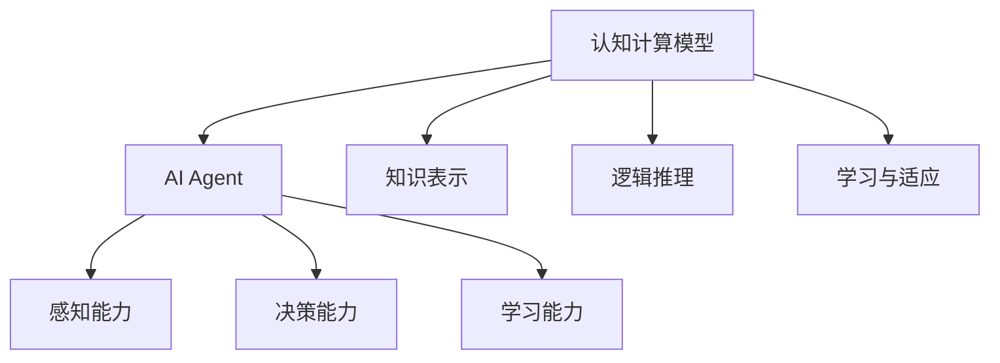
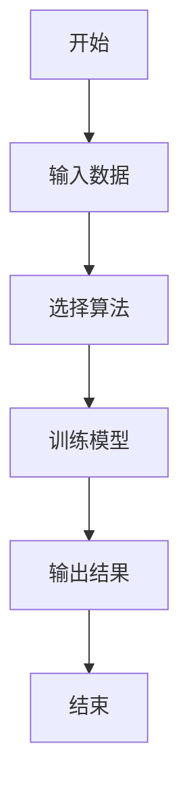
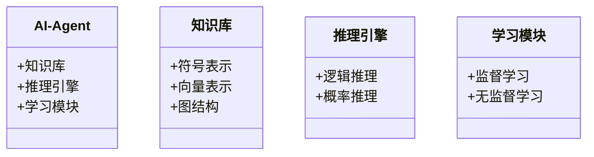
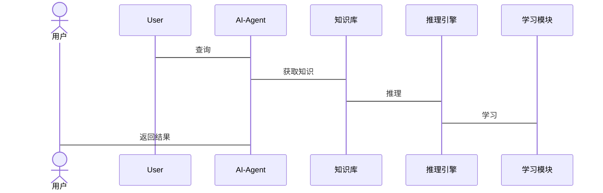

                 


# 构建AI Agent的认知计算模型

> **关键词**：认知计算模型、AI Agent、知识表示、逻辑推理、机器学习、系统架构  
> **摘要**：认知计算模型是构建AI Agent的核心，通过知识表示、逻辑推理和学习能力，实现智能决策。本文从基础概念到算法实现，详细讲解认知计算模型的构建过程，并通过实际案例展示其应用。

---

## 第1章 认知计算模型与AI Agent概述

### 1.1 认知计算模型的定义与特点

认知计算模型是一种模拟人类认知过程的计算模型，通过模拟感知、推理、学习等能力，使系统能够理解并处理复杂问题。其特点包括：

1. **知识表示**：通过符号或向量表示知识。
2. **逻辑推理**：基于知识进行推理，得出结论。
3. **学习能力**：通过数据不断优化模型。

### 1.2 AI Agent的基本概念与分类

AI Agent是一种智能体，能够感知环境并采取行动以实现目标。分类包括：

1. **简单反射型**：基于规则直接行动。
2. **基于模型型**：利用内部模型进行决策。
3. **实用推理型**：基于效用函数优化决策。
4. **学习型**：通过机器学习提升能力。

### 1.3 认知计算模型在AI Agent中的作用

认知计算模型为AI Agent提供核心能力：

- **知识表示**：构建 Agent 的知识库。
- **逻辑推理**：支持 Agent 的决策能力。
- **学习能力**：优化 Agent 的性能。

---

## 第2章 认知计算模型的核心概念与联系

### 2.1 认知计算模型的核心原理

认知计算模型包括知识表示、逻辑推理和学习三个核心部分：

1. **知识表示**：通过符号或向量表示知识。
2. **逻辑推理**：利用逻辑规则进行推理。
3. **学习能力**：通过数据更新知识库。

### 2.2 AI Agent的认知能力分析

AI Agent的认知能力包括：

- **感知能力**：获取环境信息。
- **决策能力**：基于知识进行决策。
- **学习能力**：通过反馈优化模型。

### 2.3 认知计算模型与AI Agent的关系图



### 2.4 本章小结

认知计算模型为AI Agent提供知识表示、逻辑推理和学习能力，是构建智能 Agent 的基础。

---

## 第3章 认知计算模型的算法原理

### 3.1 知识表示算法

知识表示方法包括符号表示、向量表示和图结构表示：

1. **符号表示**：用符号表示概念。
2. **向量表示**：用向量表示语义。
3. **图结构表示**：用图表示知识关系。

### 3.2 逻辑推理算法

逻辑推理算法包括命题逻辑、一阶逻辑和概率推理：

1. **命题逻辑**：处理简单逻辑命题。
2. **一阶逻辑**：处理复杂逻辑关系。
3. **概率推理**：处理不确定推理。

### 3.3 学习算法

学习算法包括监督学习、无监督学习和强化学习：

1. **监督学习**：基于标记数据学习。
2. **无监督学习**：从无标记数据中发现模式。
3. **强化学习**：通过奖励优化决策。

### 3.4 算法实现流程图



---

## 第4章 认知计算模型的数学模型与公式

### 4.1 知识表示的数学模型

知识表示可以使用向量表示，例如：

$$
v_i = [v_{i1}, v_{i2}, ..., v_{in}]
$$

### 4.2 逻辑推理的数学模型

命题逻辑推理公式：

$$
P \land Q \rightarrow R
$$

### 4.3 学习算法的数学模型

监督学习的损失函数：

$$
L = \frac{1}{n}\sum_{i=1}^n (y_i - \hat{y}_i)^2
$$

---

## 第5章 系统分析与架构设计

### 5.1 系统架构设计

系统架构包括知识库、推理引擎和学习模块：



### 5.2 系统交互设计

系统交互流程图：



---

## 第6章 项目实战：构建认知计算模型

### 6.1 环境安装

安装必要的库：

```bash
pip install numpy matplotlib scikit-learn
```

### 6.2 核心代码实现

实现一个简单的逻辑推理模型：

```python
import numpy as np

class KnowledgeBase:
    def __init__(self):
        self.knowledge = {}

    def add_fact(self, fact):
        self.knowledge[fact] = True

class ReasoningEngine:
    def __init__(self, knowledge_base):
        self.knowledge_base = knowledge_base

    def infer(self, hypothesis):
        return self.knowledge_base.knowledge.get(hypothesis, False)
```

### 6.3 案例分析

通过推理引擎验证推理结果：

```python
kb = KnowledgeBase()
kb.add_fact("A")
kb.add_fact("B")
reasoning = ReasoningEngine(kb)
print(reasoning.infer("C"))  # 输出：False
```

---

## 第7章 总结与展望

### 7.1 小结

认知计算模型为AI Agent提供核心能力，涵盖知识表示、逻辑推理和学习能力。

### 7.2 注意事项

在构建认知计算模型时，需注意数据质量和模型的可解释性。

### 7.3 未来展望

未来研究可关注动态知识更新和多模态推理能力。

---

通过本文的详细讲解，读者可以全面理解认知计算模型在AI Agent中的构建过程，并通过实际案例掌握其应用方法。

