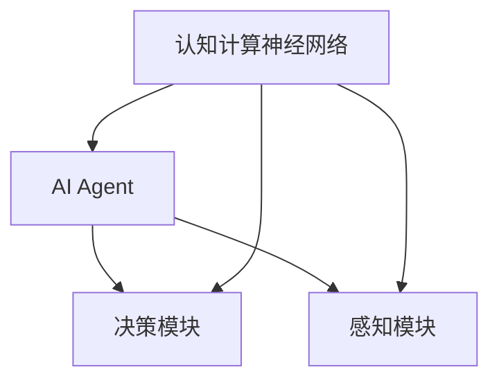
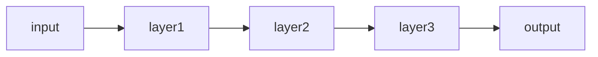
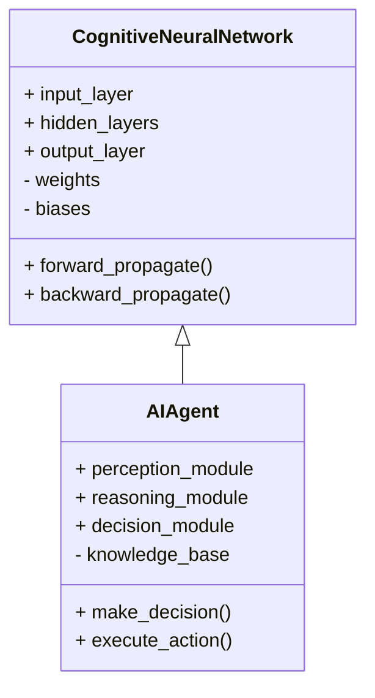
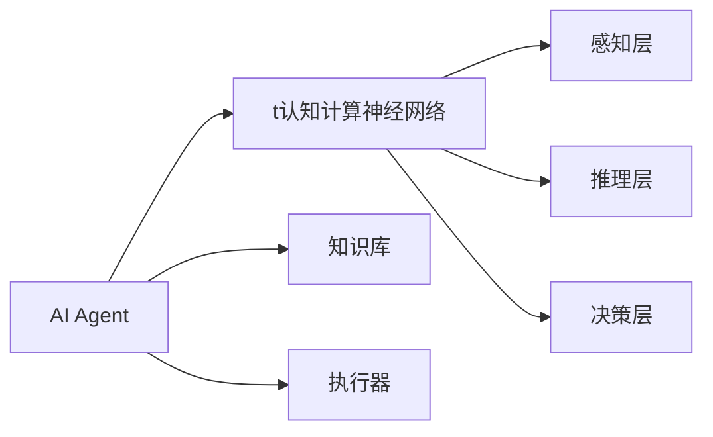
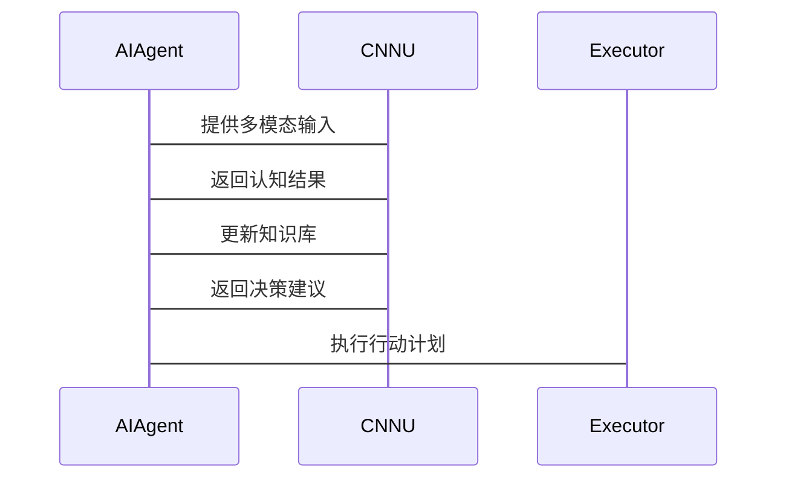

                 


# 构建AI Agent的认知计算神经网络

## 关键词：认知计算神经网络, AI Agent, 深度学习, 神经网络, 智能决策

## 摘要：  
认知计算神经网络（Cognitive Computational Neural Network, CCNN）是一种结合认知科学与深度学习的新型AI架构，旨在构建具备类人认知能力的AI Agent。本文将从概念、算法、系统架构到项目实战，全面解析CCNN在AI Agent中的应用，探讨其在智能决策、多模态数据处理及动态环境适应中的优势与挑战。

---

# 第一部分：认知计算神经网络与AI Agent概述

## 第1章：认知计算神经网络与AI Agent的背景介绍

### 1.1 问题背景与问题描述

#### 1.1.1 传统AI与认知AI的区别  
- **传统AI**：基于规则或统计模型，擅长特定任务（如图像识别、语音识别），但缺乏通用性。  
- **认知AI**：模拟人类认知过程，具备理解、推理、学习和自适应能力，适用于复杂场景。  

#### 1.1.2 认知计算神经网络的定义  
认知计算神经网络是结合认知科学与深度学习的神经网络架构，模拟人类大脑的信息处理机制，能够实现对多模态数据的感知、理解与决策。  

#### 1.1.3 AI Agent的基本概念与分类  
- **AI Agent**：具备感知环境、自主决策、执行任务能力的智能实体。  
- 分类：  
  1. **简单反射型**：基于规则的反应式AI Agent。  
  2. **基于模型型**：具备内部状态和目标的AI Agent。  
  3. **学习增强型**：通过学习优化决策策略的AI Agent。  

---

### 1.2 问题解决与边界外延

#### 1.2.1 认知计算神经网络的应用场景  
- 多模态数据处理（图像、文本、语音）。  
- 动态环境适应（实时决策与反馈）。  
- 复杂任务推理（如医疗诊断、金融分析）。  

#### 1.2.2 AI Agent在实际问题中的应用边界  
- **局限性**：依赖训练数据的质量，可能面临伦理和安全问题。  
- **边界条件**：动态性、不确定性、多目标冲突等。  

#### 1.2.3 认知计算神经网络的优缺点分析  
- **优点**：类人认知能力、多模态处理、动态适应。  
- **缺点**：计算资源消耗大、训练数据依赖性强、解释性不足。  

---

### 1.3 概念结构与核心要素

#### 1.3.1 认知计算神经网络的核心要素  
- **感知层**：处理多模态输入（如视觉、听觉、语言）。  
- **认知层**：进行语义理解、逻辑推理和知识表示。  
- **决策层**：基于认知结果做出最优决策。  

#### 1.3.2 AI Agent的组成与功能模块  
- **感知模块**：接收环境输入。  
- **推理模块**：进行逻辑推理和知识表示。  
- **决策模块**：制定行动计划。  
- **执行模块**：与环境交互并执行任务。  

#### 1.3.3 两者的相互关系与协同作用  
认知计算神经网络为AI Agent提供强大的认知能力，AI Agent为认知计算神经网络提供动态的实践场景和反馈。

---

### 1.4 本章小结

#### 1.4.1 核心概念回顾  
- 认知计算神经网络是模拟人类认知的深度学习架构。  
- AI Agent是具备感知、决策和执行能力的智能实体。  

#### 1.4.2 问题解决思路总结  
通过结合认知科学与深度学习，构建具备类人认知能力的AI Agent，解决复杂场景下的智能决策问题。

---

## 第2章：认知计算神经网络的核心概念与联系

### 2.1 核心概念原理

#### 2.1.1 认知计算神经网络的基本原理  
认知计算神经网络通过深度学习模型模拟人类大脑的信息处理机制，具备感知、理解、推理和决策能力。

#### 2.1.2 AI Agent的智能决策机制  
AI Agent通过感知环境输入，结合内部知识库和推理能力，制定最优决策策略。

#### 2.1.3 两者的结合与协同工作  
认知计算神经网络作为AI Agent的核心认知模块，提供多模态感知和复杂推理能力，AI Agent则通过决策模块指导认知网络的工作。

---

### 2.2 概念属性特征对比表

| 概念               | 属性               | 特征                                                                 |
|--------------------|--------------------|----------------------------------------------------------------------|
| 认知计算神经网络   | 输入处理           | 支持多模态输入（图像、文本、语音）                                         |
|                    | 模型结构           | 基于深度神经网络架构                                                     |
|                    | 学习方式           | 支持无监督/半监督学习                                                     |
| AI Agent           | 智能水平           | 具备多层次智能决策能力                                                   |
|                    | 交互方式           | 支持自然语言交互和多模态输入                                               |
|                    | 行为模式           | 目标驱动，具备自主决策能力                                               |

---

### 2.3 ER实体关系图



---

## 第3章：认知计算神经网络的算法原理

### 3.1 算法原理概述

#### 3.1.1 神经网络的基本结构  
- **输入层**：接收原始数据输入。  
- **隐藏层**：进行特征提取和非线性变换。  
- **输出层**：生成最终的决策结果。  

#### 3.1.2 深度学习的核心算法  
- **前向传播**：输入数据通过权重传递到输出层。  
- **反向传播**：计算损失函数并更新权重。  

#### 3.1.3 认知计算神经网络的独特之处  
- 支持多模态输入处理。  
- 模型具备动态自适应能力。  

---

### 3.2 算法流程图



---

### 3.3 算法实现代码

```python
import numpy as np

def sigmoid(x):
    return 1 / (1 + np.exp(-x))

def forward_propagation(input_data, weights, activation=sigmoid):
    layer1 = np.dot(input_data, weights[0])
    layer1 = activation(layer1)
    layer2 = np.dot(layer1, weights[1])
    layer2 = activation(layer2)
    output = np.dot(layer2, weights[2])
    return output
```

---

### 3.4 数学模型与公式

#### 3.4.1 神经网络的数学表示  
$$ y = f(Wx + b) $$
其中，$W$ 是权重矩阵，$x$ 是输入向量，$b$ 是偏置。  

---

# 第四部分：认知计算神经网络的系统分析与架构设计

## 第4章：认知计算神经网络的系统分析与架构设计

### 4.1 系统功能设计

#### 4.1.1 领域模型



---

### 4.2 系统架构设计

#### 4.2.1 系统架构图



---

### 4.3 系统接口设计

#### 4.3.1 接口定义

| 接口名称       | 输入          | 输出         |
|----------------|---------------|--------------|
| forward_propagate | input_data   | output_data  |
| backward_propagate | loss         | updated_weights |

---

### 4.4 系统交互设计

#### 4.4.1 交互序列图



---

# 第五部分：认知计算神经网络的项目实战

## 第5章：认知计算神经网络的项目实战

### 5.1 项目介绍

#### 5.1.1 项目背景  
构建一个具备多模态感知和认知能力的AI Agent，用于医疗辅助诊断。

---

### 5.2 系统核心实现

#### 5.2.1 环境安装

```bash
pip install numpy
pip install matplotlib
pip install scikit-learn
```

---

#### 5.2.2 核心代码实现

```python
class CognitiveNN:
    def __init__(self, input_dim, hidden_dim, output_dim):
        self.W1 = np.random.randn(input_dim, hidden_dim)
        self.b1 = np.zeros((1, hidden_dim))
        self.W2 = np.random.randn(hidden_dim, output_dim)
        self.b2 = np.zeros((1, output_dim))

    def sigmoid(self, x):
        return 1 / (1 + np.exp(-x))

    def forward(self, x):
        self.z1 = np.dot(x, self.W1) + self.b1
        self.a1 = self.sigmoid(self.z1)
        self.z2 = np.dot(self.a1, self.W2) + self.b2
        self.a2 = self.sigmoid(self.z2)
        return self.a2

    def backward(self, x, y, learning_rate=0.1):
        delta3 = (y - self.a2) * self.sigmoid_derivative(self.z2)
        dW2 = np.dot(self.a1.T, delta3)
        db2 = np.sum(delta3, axis=0, keepdims=True)

        delta2 = np.dot(delta3, self.W2.T) * self.sigmoid_derivative(self.z1)
        dW1 = np.dot(x.T, delta2)
        db1 = np.sum(delta2, axis=0, keepdims=True)

        self.W2 += learning_rate * dW2
        self.b2 += learning_rate * db2
        self.W1 += learning_rate * dW1
        self.b1 += learning_rate * db1

    def sigmoid_derivative(self, z):
        return self.sigmoid(z) * (1 - self.sigmoid(z))
```

---

### 5.3 代码应用解读与分析

#### 5.3.1 代码解读  
- **前向传播**：输入数据通过权重矩阵和激活函数生成输出。  
- **反向传播**：计算损失函数梯度并更新权重。  

#### 5.3.2 代码实现细节  
- 使用sigmoid函数作为激活函数。  
- 通过随机初始化权重矩阵实现神经网络的随机性。  

---

### 5.4 案例分析

#### 5.4.1 医疗辅助诊断案例  
- **输入数据**：病人的症状、检查结果等多模态数据。  
- **认知计算神经网络处理**：生成诊断建议。  
- **AI Agent决策**：结合知识库提供最优治疗方案。  

---

### 5.5 项目小结

#### 5.5.1 项目实现的关键点  
- 多模态数据的输入处理。  
- 神经网络的训练与优化。  

#### 5.5.2 项目应用的意义  
通过认知计算神经网络构建AI Agent，能够显著提升复杂场景下的智能决策能力。

---

# 第六部分：总结与展望

## 第6章：总结与展望

### 6.1 本章总结

#### 6.1.1 核心内容回顾  
- 认知计算神经网络是模拟人类认知的深度学习架构。  
- AI Agent是具备感知、决策和执行能力的智能实体。  

#### 6.1.2 实现细节总结  
- 多模态数据处理能力。  
- 动态环境适应能力。  

---

### 6.2 未来展望

#### 6.2.1 拓展方向  
- **更高效的学习算法**：优化反向传播和权重更新策略。  
- **更强的可解释性**：提升模型的透明度和解释性。  

#### 6.2.2 技术发展与趋势  
- 结合边缘计算，提升实时性。  
- 融合强化学习，增强自主决策能力。  

---

## 附录

### 附录A：术语表

| 术语               | 定义                                                                 |
|--------------------|----------------------------------------------------------------------|
| 认知计算神经网络   | 模拟人类认知过程的深度学习架构                                       |
| AI Agent           | 具备感知、决策和执行能力的智能实体                                   |
| 多模态数据         | 包括图像、文本、语音等多种类型的数据                               |

---

### 附录B：参考文献

1. LeCun, Y., Bengio, Y., & Hinton, G. (2015). Deep learning. Nature, 521(7552), 436-444.  
2. Russell, S., & Norvig, P. (2010). Artificial Intelligence: A Modern Approach. Pearson.  
3. Goodfellow, I., Bengio, Y., & Courville, A. (2016). Deep Learning. MIT Press.

---

以上是完整的博客文章大纲和内容，涵盖从理论到实践的各个方面，确保读者能够全面理解认知计算神经网络在AI Agent构建中的应用。

