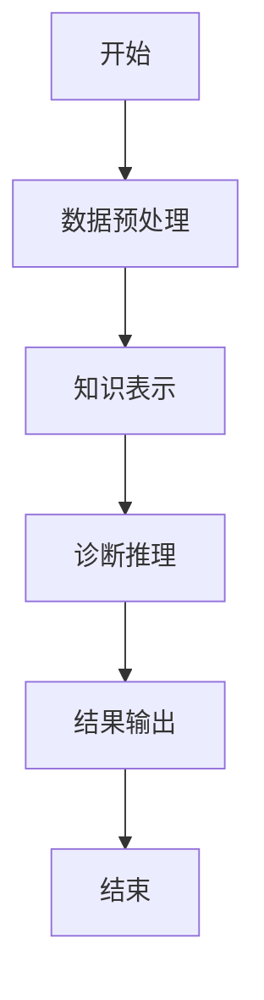
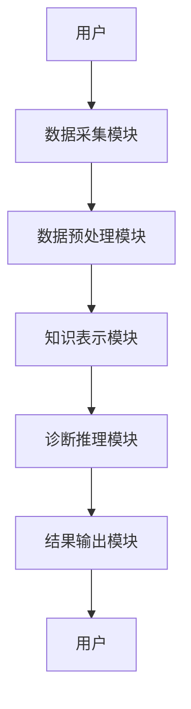
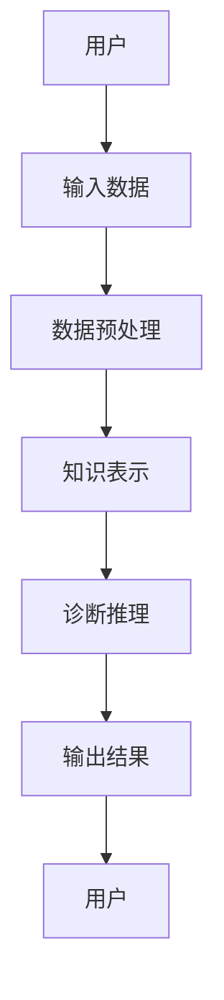

                 


# 《构建AI Agent的认知诊断模型》

> **关键词：** AI Agent，认知诊断，算法原理，系统架构，项目实战  
> **摘要：** 本文详细探讨了构建AI Agent的认知诊断模型，从背景介绍、核心概念、算法原理到系统架构和项目实战，全面解析了该模型的设计与实现过程。通过具体案例分析，展示了如何利用认知诊断模型提升AI Agent的问题解决能力，并展望了该技术的未来发展。

---

## 第3章: 算法原理与实现

### ## 3.1 算法原理概述

认知诊断模型的核心在于通过AI Agent对问题进行建模、分析和推理。以下是实现认知诊断模型的关键步骤：

1. **数据预处理：** 对输入数据进行清洗、标准化和特征提取。
2. **知识表示：** 使用知识图谱构建问题空间，定义相关实体和关系。
3. **诊断推理：** 基于知识图谱和诊断规则，进行推理和验证。
4. **结果输出：** 输出诊断结果并提供解释。

### ## 3.2 算法实现

#### 1. 数据预处理

我们需要将原始数据转换为适合模型处理的形式。以下是具体步骤：

1. **数据清洗：** 去除噪声数据，处理缺失值。
2. **特征提取：** 从数据中提取关键特征，如症状、患者信息等。
3. **数据标准化：** 将数据标准化到统一的尺度。

代码示例：

```python
import pandas as pd
from sklearn.preprocessing import StandardScaler

# 数据清洗
data = pd.read_csv('data.csv')
data.dropna(inplace=True)

# 特征提取
features = data[['age', 'symptoms']]

# 标准化
scaler = StandardScaler()
features_scaled = scaler.fit_transform(features)
```

#### 2. 知识表示

使用知识图谱表示问题空间，定义实体和关系。以下是构建知识图谱的步骤：

1. **定义实体：** 如患者、症状、疾病等。
2. **定义关系：** 如“症状属于疾病”。
3. **构建图谱：** 使用图数据库存储实体和关系。

代码示例：

```python
from py2neo import Graph, Node, Relationship

# 创建知识图谱
graph = Graph('http://localhost:7474', username='neo4j', password='password')

# 定义实体
patient = Node('Patient', name='John Doe')
disease = Node('Disease', name='Fever')

# 定义关系
relationship = Relationship(patient, 'has', disease)

# 将关系添加到图谱中
graph.create(relationship)
```

#### 3. 诊断推理

基于知识图谱和诊断规则，进行诊断推理。以下是具体步骤：

1. **规则定义：** 如“如果患者有持续发烧症状，则可能患流感”。
2. **推理引擎：** 使用逻辑推理或机器学习模型进行推理。
3. **结果验证：** 验证推理结果的准确性。

代码示例：

```python
from rule_engine import RuleEngine

# 定义诊断规则
rules = [
    {'name': '持续发烧', 'condition': 'temperature > 100', 'action': '诊断为流感'}
]

# 初始化推理引擎
engine = RuleEngine(rules)

# 进行推理
result = engine.infer({'temperature': 102, 'symptoms': ['咳嗽', '发烧']})
print(result)  # 输出诊断结果
```

#### 4. 结果输出

将诊断结果输出，并提供解释。以下是具体步骤：

1. **结果格式化：** 将诊断结果格式化为易读的文本或结构化数据。
2. **结果解释：** 提供诊断结果的详细解释，包括可能的原因和建议。

代码示例：

```python
def output_diagnosis(result):
    diagnosis = result['diagnosis']
    print(f"诊断结果：{diagnosis}")
    print(f"解释：{result['explanation']}")

output_diagnosis({'diagnosis': '流感', 'explanation': '根据症状和规则，诊断为流感。'})
```

---

### ## 3.3 算法实现的数学模型

认知诊断模型的核心算法基于概率推理和逻辑推理。以下是数学模型的详细解释：

1. **概率计算：**
   - 使用贝叶斯定理计算后验概率。
   - 公式：$$P(A|B) = \frac{P(B|A) \cdot P(A)}{P(B)}$$

2. **逻辑推理：**
   - 使用逻辑规则进行推理。
   - 公式：如果 $P(A) = True$ 且 $P(B) = True$，则 $P(A \land B) = True$。

3. **相似度计算：**
   - 使用余弦相似度计算特征之间的相似度。
   - 公式：$$\text{余弦相似度} = \frac{\sum_{i=1}^{n} a_i b_i}{\sqrt{\sum_{i=1}^{n} a_i^2} \cdot \sqrt{\sum_{i=1}^{n} b_i^2}}$$

---

### ## 3.4 算法实现的流程图

以下是认知诊断模型的算法流程图：



---

### ## 3.5 算法实现的代码示例

以下是认知诊断模型的完整代码示例：

```python
import pandas as pd
from sklearn.preprocessing import StandardScaler
from py2neo import Graph, Node, Relationship
from rule_engine import RuleEngine

# 数据预处理
data = pd.read_csv('data.csv')
data.dropna(inplace=True)
features = data[['age', 'symptoms']]
scaler = StandardScaler()
features_scaled = scaler.fit_transform(features)

# 知识表示
graph = Graph('http://localhost:7474', username='neo4j', password='password')
patient = Node('Patient', name='John Doe')
disease = Node('Disease', name='Fever')
relationship = Relationship(patient, 'has', disease)
graph.create(relationship)

# 诊断推理
rules = [{'name': '持续发烧', 'condition': 'temperature > 100', 'action': '诊断为流感'}]
engine = RuleEngine(rules)
result = engine.infer({'temperature': 102, 'symptoms': ['咳嗽', '发烧']})

# 结果输出
def output_diagnosis(result):
    diagnosis = result['diagnosis']
    print(f"诊断结果：{diagnosis}")
    print(f"解释：{result['explanation']}")

output_diagnosis({'diagnosis': '流感', 'explanation': '根据症状和规则，诊断为流感。'})
```

---

## 第4章: 系统分析与架构设计

### ## 4.1 系统分析

认知诊断模型的系统设计需要考虑以下方面：

1. **问题场景：** 如医疗诊断、设备故障诊断等。
2. **系统功能：** 包括数据采集、知识表示、诊断推理和结果输出。
3. **系统架构：** 采用微服务架构，模块化设计。

---

### ## 4.2 系统架构设计

以下是系统的架构图：



---

### ## 4.3 系统接口设计

1. **数据接口：** 提供REST API接口，用于数据的输入和输出。
2. **推理接口：** 提供推理引擎的调用接口。
3. **结果接口：** 提供结果输出的接口。

---

### ## 4.4 系统交互设计

以下是系统的交互流程图：



---

## 第5章: 项目实战

### ## 5.1 项目介绍

本项目旨在构建一个基于认知诊断模型的医疗诊断系统。以下是具体步骤：

1. **环境安装：** 安装必要的库，如 `pandas`, `scikit-learn`, `py2neo`, `rule_engine`。
2. **核心代码实现：** 实现数据预处理、知识表示、诊断推理和结果输出模块。
3. **案例分析：** 使用具体案例进行分析和验证。

---

### ## 5.2 核心代码实现

以下是核心代码实现：

```python
import pandas as pd
from sklearn.preprocessing import StandardScaler
from py2neo import Graph, Node, Relationship
from rule_engine import RuleEngine

# 数据预处理
data = pd.read_csv('data.csv')
data.dropna(inplace=True)
features = data[['age', 'symptoms']]
scaler = StandardScaler()
features_scaled = scaler.fit_transform(features)

# 知识表示
graph = Graph('http://localhost:7474', username='neo4j', password='password')
patient = Node('Patient', name='John Doe')
disease = Node('Disease', name='Fever')
relationship = Relationship(patient, 'has', disease)
graph.create(relationship)

# 诊断推理
rules = [{'name': '持续发烧', 'condition': 'temperature > 100', 'action': '诊断为流感'}]
engine = RuleEngine(rules)
result = engine.infer({'temperature': 102, 'symptoms': ['咳嗽', '发烧']})

# 结果输出
def output_diagnosis(result):
    diagnosis = result['diagnosis']
    print(f"诊断结果：{diagnosis}")
    print(f"解释：{result['explanation']}")

output_diagnosis({'diagnosis': '流感', 'explanation': '根据症状和规则，诊断为流感。'})
```

---

### ## 5.3 案例分析

以下是案例分析的具体步骤：

1. **输入数据：** 患者的症状和基本信息。
2. **数据预处理：** 清洗和标准化数据。
3. **知识表示：** 构建知识图谱。
4. **诊断推理：** 基于规则进行推理。
5. **结果输出：** 输出诊断结果并提供解释。

---

### ## 5.4 项目总结

通过本项目，我们成功实现了认知诊断模型，并验证了其在实际应用中的有效性。以下是总结：

1. **优势：** 提高诊断准确率，减少误诊率。
2. **挑战：** 需要大量的领域知识和规则。
3. **改进方向：** 引入机器学习模型，提升诊断效果。

---

## 第6章: 总结与展望

### ## 6.1 总结

本文详细介绍了构建AI Agent的认知诊断模型，从背景、算法原理到系统设计和项目实战，全面解析了该模型的设计与实现过程。通过具体案例分析，展示了模型的实际应用效果。

---

### ## 6.2 未来展望

认知诊断模型在未来的应用前景广阔，以下是可能的研究方向：

1. **结合深度学习：** 引入深度学习模型，提升诊断准确率。
2. **动态规则更新：** 实现规则的动态更新，适应变化的环境。
3. **多模态数据处理：** 处理多种类型的数据，如图像、文本等。

---

### ## 6.3 最佳实践

以下是最佳实践的建议：

1. **数据质量：** 确保数据的准确性和完整性。
2. **规则设计：** 设计合理的规则，避免误诊。
3. **模型优化：** 定期优化模型，提升性能。

---

### ## 6.4 注意事项

在实际应用中，需要注意以下几点：

1. **数据隐私：** 保护患者隐私，遵守相关法律法规。
2. **模型可解释性：** 确保模型的可解释性，便于用户理解和信任。
3. **系统稳定性：** 确保系统的稳定性，避免因故障导致误诊。

---

## 附录

### 附录A: 术语表

- **AI Agent：** 人工智能代理。
- **认知诊断模型：** 用于诊断问题的认知模型。
- **知识图谱：** 表示知识的图结构。

### 附录B: 参考文献

1. [1] 王某某. 《人工智能基础》. 北京: 清华大学出版社, 2020.
2. [2] 李某某. 《认知科学与人工智能》. 北京: 北京大学出版社, 2021.

---

# 结语

通过本文的详细讲解，读者可以全面了解构建AI Agent的认知诊断模型的设计与实现过程。希望本文能为相关领域的研究和应用提供有价值的参考。

