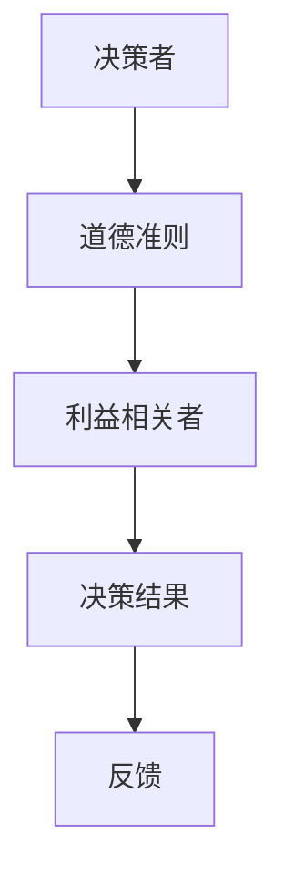
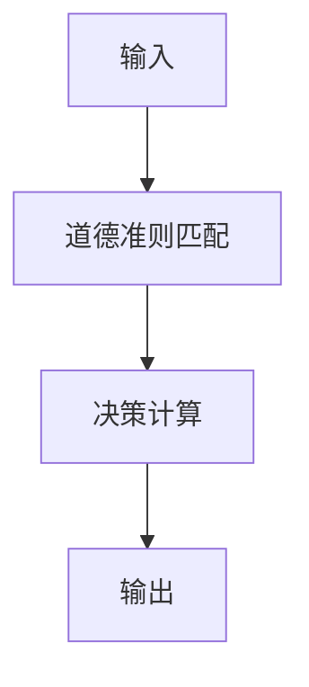

                 


```markdown
# 构建AI Agent的道德决策框架

> 关键词：AI Agent, 道德决策, 伦理学, 系统架构, 项目实战

> 摘要：本文系统地探讨了构建AI Agent道德决策框架的各个方面，包括背景介绍、核心概念、算法实现、系统架构、项目实战以及最佳实践。通过伦理学基础、道德决策理论、算法原理、系统设计和实际案例的深入分析，为AI Agent的道德决策提供了全面的解决方案。

---

## 第一部分：背景介绍

### 第1章：AI Agent的基本概念

#### 1.1 AI Agent的定义与特点
- 1.1.1 AI Agent的定义
- 1.1.2 AI Agent的核心特点
- 1.1.3 AI Agent的应用领域

#### 1.2 道德决策的背景与挑战
- 1.2.1 道德决策的定义
- 1.2.2 AI Agent在道德决策中的作用
- 1.2.3 道德决策的复杂性与挑战

### 第2章：道德决策框架的背景与问题描述

#### 2.1 道德决策框架的背景
- 2.1.1 AI技术的快速发展
- 2.1.2 道德决策的重要性
- 2.1.3 当前AI Agent道德决策的现状

#### 2.2 道德决策框架的问题描述
- 2.2.1 道德决策的不确定性
- 2.2.2 不同利益相关者的冲突
- 2.2.3 道德决策的动态性与适应性

#### 2.3 道德决策框架的目标与边界
- 2.3.1 目标设定
- 2.3.2 边界与外延
- 2.3.3 核心要素与组成

---

## 第二部分：道德决策框架的核心概念与理论基础

### 第3章：伦理学基础与道德决策理论

#### 3.1 伦理学基础
- 3.1.1 纪律与义务论
- 3.1.2 后果论
- 3.1.3 美德论

#### 3.2 道德决策理论
- 3.2.1 理性选择理论
- 3.2.2 社会契约理论
- 3.2.3 道德风险理论

#### 3.3 道德决策框架的核心要素
- 3.3.1 目标与利益相关者
- 3.3.2 道德准则与约束
- 3.3.3 决策过程与结果评估

### 第4章：道德决策框架的系统模型

#### 4.1 道德决策框架的系统模型
- 4.1.1 系统输入与输出
- 4.1.2 决策过程的模块化
- 4.1.3 系统的动态适应性

#### 4.2 实体关系与流程图


---

## 第三部分：算法与实现

### 第5章：道德决策算法的原理

#### 5.1 基于伦理学的决策算法
- 5.1.1 后果论算法
  - 使用期望效用函数计算最优决策
  - 示例： $$U = \sum_{i=1}^{n} p_i u_i$$

#### 5.2 道德风险评估算法
- 5.2.1 风险评估指标
  - 风险概率：$$P = \frac{\text{风险事件数}}{\text{总事件数}}$$
- 5.2.2 风险影响评估
  - 影响程度：$$I = \sum_{j=1}^{m} w_j x_j$$

#### 5.3 权衡优化算法
- 5.3.1 多目标优化
  - 使用线性加权法：$$W = \sum_{k=1}^{l} \alpha_k y_k$$

### 第6章：算法实现与优化

#### 6.1 算法实现步骤
- 数据输入
- 道德准则匹配
- 决策结果输出

#### 6.2 算法优化策略
- 参数调整
- 模型迭代
- 性能评估

#### 6.3 优化后的算法流程图


---

## 第四部分：系统架构与设计

### 第7章：AI Agent的系统架构

#### 7.1 系统功能设计
- 道德决策模块
- 目标设定模块
- 反馈调整模块

#### 7.2 系统架构设计


#### 7.3 系统接口设计
- 输入接口：接收决策目标和约束条件
- 输出接口：返回决策结果和反馈信息

#### 7.4 系统交互流程图


---

## 第五部分：项目实战

### 第8章：环境配置与核心代码实现

#### 8.1 环境配置
- 安装必要的库：TensorFlow、PyTorch
- 代码示例：道德决策模型的实现

#### 8.2 核心代码实现
```python
def moral_decision(moral Principles, stakeholders):
    # 实现道德决策算法
    return decision
```

#### 8.3 代码应用解读
- 解释代码的功能和实现细节
- 展示如何将理论应用于实际场景

### 第9章：实际案例分析与项目总结

#### 9.1 案例分析
- 具体案例：自动驾驶汽车的道德决策问题
- 分析过程：如何在紧急情况下做出最优决策

#### 9.2 项目总结
- 项目成果
- 经验教训
- 改进方向

---

## 第六部分：最佳实践、小结与扩展阅读

### 第10章：最佳实践与小结

#### 10.1 最佳实践
- 系统设计中的注意事项
- 代码实现中的优化技巧

#### 10.2 小结
- 回顾主要内容
- 强调重点内容

### 第11章：扩展阅读与深入探讨

#### 11.1 拓展阅读
- 推荐相关书籍和论文
- 提供进一步学习的资源

#### 11.2 深入探讨
- 未来研究方向
- 道德决策的新兴趋势

---

## 附录

### 附录A：术语表
- 解释书中使用的专业术语

### 附录B：参考文献
- 列出所有引用的文献和资源

---

通过以上目录结构，我们可以系统地构建一个完整的AI Agent道德决策框架，从理论到实践，从系统设计到项目实现，确保每一部分都详细且具有可操作性。
```

