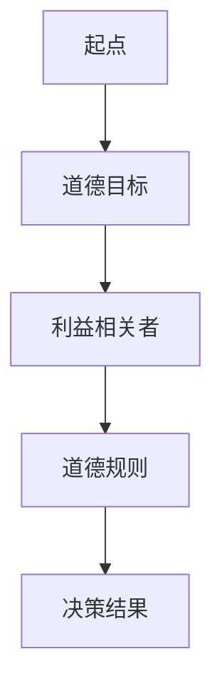
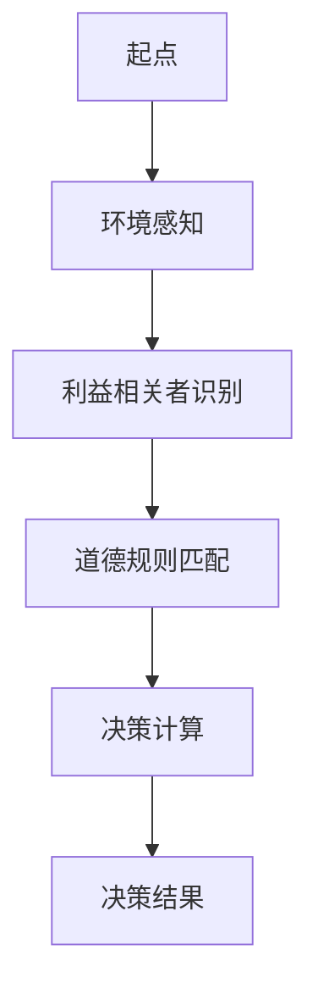
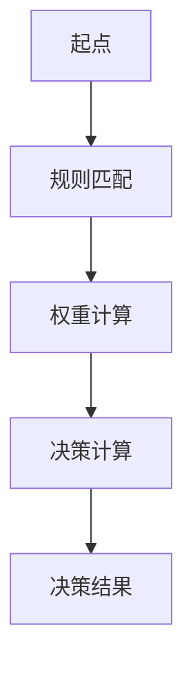
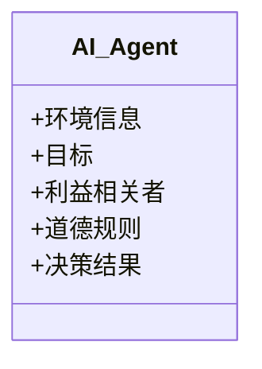

                 


```markdown
# 构建AI Agent的道德推理框架

## 关键词
AI Agent, 道德推理, 伦理决策, 模糊逻辑, 系统架构, 项目实战

## 摘要
本文旨在构建一个AI Agent的道德推理框架，探讨其核心概念、算法原理、系统架构及项目实现。通过详细分析道德推理的必要性、核心原理和系统设计，结合实际案例，展示如何在AI Agent中实现可解释且动态的道德决策机制，确保在复杂场景下做出符合伦理的决策。

---

# 第一部分: AI Agent与道德推理框架的背景介绍

## 第1章: AI Agent的基本概念与问题背景

### 1.1 什么是AI Agent
#### 1.1.1 AI Agent的定义
AI Agent是一种智能体，能够感知环境、自主决策并采取行动，以实现特定目标。

#### 1.1.2 AI Agent的核心特征
- **自主性**：无需外部干预，自主决策。
- **反应性**：能实时感知环境变化并调整行为。
- **目标导向**：所有行动均以实现目标为导向。

#### 1.1.3 AI Agent的应用场景
- 智能助手（如Siri、Alexa）。
- 自动驾驶汽车。
- 医疗诊断辅助系统。

### 1.2 道德推理的必要性
#### 1.2.1 道德推理的定义
道德推理是AI Agent在复杂场景中，基于伦理准则进行决策的过程。

#### 1.2.2 为什么AI Agent需要道德推理
- 避免伤害人类。
- 遵守法律法规。
- 建立用户信任。

#### 1.2.3 道德推理的挑战与复杂性
- **利益冲突**：不同利益相关者的道德准则可能相互矛盾。
- **动态变化**：道德准则随文化、社会变化而调整。
- **不确定性**：复杂场景中存在信息不全或模糊性。

## 第2章: AI Agent道德推理的问题描述

### 2.1 道德推理的核心问题
#### 2.1.1 道德决策的复杂性
- 需要考虑多个因素，如后果、意图、规则等。
- 需要平衡短期利益与长期目标。

#### 2.1.2 不同利益相关者的冲突
- 如自动驾驶中的乘客与行人利益的权衡。

#### 2.1.3 道德规则的动态变化
- 社会道德标准随时间推移而变化。

### 2.2 道德推理框架的目标
#### 2.2.1 建立统一的道德推理标准
- 确保不同场景下决策的一致性。

#### 2.2.2 实现可解释的道德决策
- 用户能够理解AI的决策过程。

#### 2.2.3 确保道德决策的可操作性
- 框架能够在实际应用中有效实施。

### 2.3 道德推理框架的边界与外延
#### 2.3.1 道德推理的适用范围
- 仅限于AI Agent的决策过程，不涵盖所有行为。

#### 2.3.2 道德推理与其他决策机制的关系
- 道德推理是决策过程中的一个环节，需与其他机制（如目标优化）协同工作。

#### 2.3.3 道德推理的局限性
- 无法解决所有道德困境，需结合具体场景进行调整。

---

# 第二部分: AI Agent道德推理框架的核心概念与联系

## 第3章: 道德推理框架的核心原理

### 3.1 道德推理的基本原理
#### 3.1.1 道德推理的逻辑结构
- **输入**：环境信息、目标、利益相关者。
- **处理**：分析、推理、权衡。
- **输出**：决策。

#### 3.1.2 道德推理的规则体系
- **义务论**：基于行为的义务和责任。
- **功利主义**：以最大化整体利益为目标。
- **义务与功利的结合**：综合考虑义务和利益。

#### 3.1.3 道德推理的动态调整机制
- 根据反馈不断优化决策规则。

### 3.2 道德推理框架的属性特征对比
| 特性         | 基于规则 | 基于案例 | 基于学习 |
|--------------|----------|----------|----------|
| **确定性**    | 高       | 低       | 中       |
| **可解释性**  | 高       | 中       | 低       |
| **适应性**    | 低       | 中       | 高       |

## 第4章: 道德推理框架的ER实体关系图

### 4.1 实体关系图的构建


### 4.2 道德推理框架的Mermaid流程图


---

## 第4章: 道德推理框架的ER实体关系图

### 4.1 实体关系图的构建


### 4.2 道德推理框架的Mermaid流程图


---

## 第5章: 道德推理算法的数学模型

### 5.1 模糊逻辑的数学表达
$$ \text{模糊度} = \sum_{i=1}^{n} w_i \cdot x_i $$
其中，$w_i$是权重，$x_i$是输入特征。

### 5.2 基于规则的算法流程


---

## 第6章: 系统分析与架构设计方案

### 6.1 项目介绍
**项目名称**：AI Agent道德推理框架开发。

### 6.2 系统功能设计
#### 6.2.1 领域模型


#### 6.2.2 系统架构


---

## 第7章: 项目实战

### 7.1 环境安装
安装Python、依赖库（如numpy、scipy）。

### 7.2 核心实现
```python
def道德推理(环境信息, 目标, 利益相关者):
    匹配规则 = 匹配道德规则(环境信息, 目标, 利益相关者)
    决策 = 计算决策(匹配规则)
    return 决策
```

### 7.3 案例分析
自动驾驶在紧急情况下的决策。

### 7.4 代码实现
```python
def计算决策(规则):
    权重 = [0.5, 0.3, 0.2]
    总和 = sum(权重[i] * rule[i] for i in range(len(rule)))
    return 总和 > 0.6
```

---

## 第8章: 最佳实践与小结

### 8.1 小结
构建AI Agent道德推理框架涉及复杂的技术和伦理问题，需结合具体场景进行动态调整。

### 8.2 注意事项
- 确保决策的可解释性。
- 定期更新道德规则以适应变化。
- 考虑多利益相关者的平衡。

### 8.3 拓展阅读
- 《伦理与人工智能》
- 《模糊逻辑在AI中的应用》

---

# 结语

通过本文的详细讲解，读者可以系统地了解AI Agent道德推理框架的构建方法，并能够将其应用到实际项目中。未来的研究可以进一步探讨动态道德规则的自适应机制，以应对更复杂的场景挑战。
```

