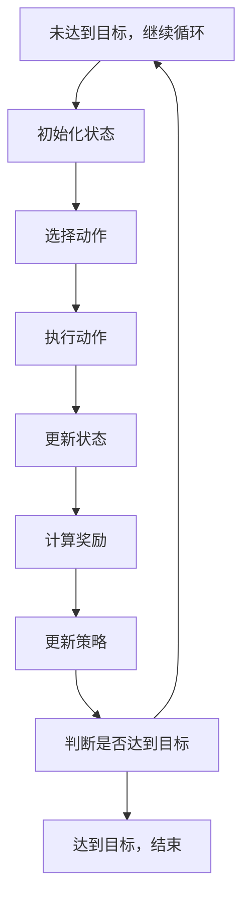
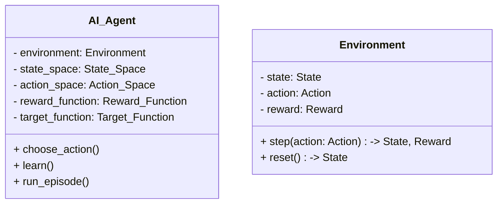
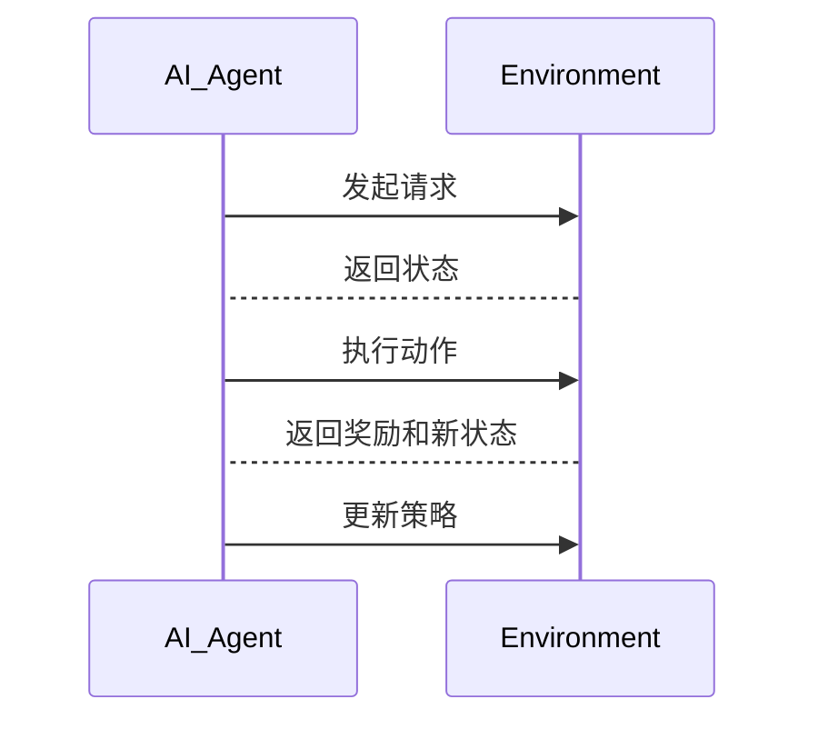

                 


```markdown
# 构建AI Agent的长期规划与决策系统

## 关键词：
AI Agent, 长期规划, 决策系统, 强化学习, 规划算法, 系统架构, 项目实战

## 摘要：
本文系统地探讨了构建AI Agent的长期规划与决策系统的各个方面，从基本概念到算法原理，再到系统架构和项目实战，全面解析了该系统的构建过程。通过详细的技术分析和实际案例，本文旨在为读者提供深入的理解和实践指导。

---

## 第1章: AI Agent的背景与概念

### 1.1 AI Agent的基本概念
#### 1.1.1 AI Agent的定义
AI Agent（智能体）是指能够感知环境、自主决策并采取行动以实现目标的实体。它可以在多种场景中独立运行，如自动驾驶、智能助手、游戏AI等。

#### 1.1.2 AI Agent的核心特征
- **自主性**：能够自主决策，无需外部干预。
- **反应性**：能够实时感知环境并做出反应。
- **目标导向性**：所有行为都以实现特定目标为导向。
- **学习能力**：能够通过经验改进性能。

#### 1.1.3 AI Agent的应用场景
- **自动驾驶**：实时感知环境并做出驾驶决策。
- **智能助手**：如Siri、Alexa，能够理解和执行用户指令。
- **机器人控制**：在制造业中用于精确操作。
- **游戏AI**：在电子游戏中实现智能对手或队友。

---

## 第2章: 长期规划与决策系统的背景

### 2.1 问题背景
#### 2.1.1 当前AI Agent面临的挑战
- **短期决策的局限性**：传统AI Agent往往只关注当前的最优决策，而忽视了长期目标的实现。
- **动态环境的适应性**：在复杂的动态环境中，AI Agent需要不断调整策略以应对变化。
- **资源分配的优化**：在资源有限的情况下，如何高效分配资源以实现目标是关键问题。

#### 2.1.2 长期规划与决策的重要性
- **目标一致性**：通过长期规划，确保每一步决策都与最终目标一致。
- **资源优化**：通过优化决策过程，提高资源利用效率。
- **环境适应性**：在动态环境中，长期规划能够帮助AI Agent更好地适应变化。

#### 2.1.3 现有解决方案的不足
- **基于规则的系统**：难以应对复杂多变的环境。
- **简单的强化学习**：缺乏对长期目标的规划，容易陷入局部最优。
- **启发式算法**：依赖于特定的启发式规则，难以泛化。

---

## 第3章: 长期规划与决策系统的核心概念

### 3.1 核心概念与联系
#### 3.1.1 核心概念的原理
- **状态空间**：AI Agent所处环境的所有可能状态的集合。
- **动作空间**：AI Agent在每个状态下可以执行的所有可能动作。
- **奖励函数**：定义在每个状态下执行某个动作后的奖励值，用于指导AI Agent的决策。
- **目标函数**：定义AI Agent需要优化的长期目标。

#### 3.1.2 核心概念的属性特征对比表格
| 概念     | 属性         | 特征                       |
|----------|--------------|---------------------------|
| 状态空间 | 范围         | 包括所有可能的状态         |
| 动作空间 | 可行性       | 包括所有可能的动作         |
| 奖励函数 | 评价标准     | 定义了每一步的奖励值       |
| 目标函数 | 最终目标     | 定义了长期优化的目标       |

#### 3.1.3 ER实体关系图架构的 Mermaid 流程图
```mermaid
er
actor(AI Agent) -[发起请求]-> entity(环境)
entity(环境) --> attribute(状态空间)
attribute(状态空间) --> relation(动作空间)
relation(动作空间) --> attribute(奖励函数)
attribute(奖励函数) --> relation(目标函数)
```

### 3.2 算法原理讲解
#### 3.2.1 算法的 Mermaid 流程图


#### 3.2.2 Python源代码实现
```python
import numpy as np
from collections import deque

class Agent:
    def __init__(self, state_space_size, action_space_size):
        self.state_space_size = state_space_size
        self.action_space_size = action_space_size
        self.q_table = np.zeros((state_space_size, action_space_size))
    
    def choose_action(self, state):
        if np.random.random() < 0.9:
            return np.argmax(self.q_table[state])
        else:
            return np.random.randint(self.action_space_size)
    
    def learn(self, state, action, reward, next_state):
        gamma = 0.99
        alpha = 0.1
        self.q_table[state][action] += alpha * (reward + gamma * np.max(self.q_table[next_state])) - self.q_table[state][action]
    
    def run_episode(self, env):
        state = env.reset()
        while not env.done:
            action = self.choose_action(state)
            reward, next_state = env.step(action)
            self.learn(state, action, reward, next_state)
            state = next_state
```

#### 3.2.3 算法的数学模型与公式
- **Q-learning算法**：
  $$ Q(s, a) = Q(s, a) + \alpha \times [r + \gamma \times \max Q(s', a) - Q(s, a)] $$
- **A*算法**：
  $$ f(n) = g(n) + h(n) $$
  其中，\( g(n) \) 是从起点到节点n的实际成本，\( h(n) \) 是从n到目标的估计成本。

---

## 第4章: 强化学习算法

### 4.1 强化学习的基本原理
#### 4.1.1 Q-learning算法
Q-learning是一种基于值的强化学习算法，通过更新Q表来学习最优策略。

#### 4.1.2 Deep Q-Networks (DQN) 算法
DQN通过使用深度神经网络来逼近Q值函数，解决了Q-learning在高维状态空间中的问题。

#### 4.1.3 算法的数学模型与公式
- **Q-learning**：
  $$ Q(s, a) = Q(s, a) + \alpha \times (r + \gamma \times \max Q(s', a) - Q(s, a)) $$
- **DQN**：
  $$ y = r + \gamma \times \max Q(s', a) $$
  $$ L = \frac{1}{2}(y - Q(s, a))^2 $$

---

## 第5章: 规划算法

### 5.1 规划算法的基本原理
#### 5.1.1 A*算法
A*算法是一种基于启发式的最短路径搜索算法，适用于静态或低动态性的环境。

#### 5.1.2 Dijkstra算法
Dijkstra算法用于找到从起点到目标的最短路径，适用于所有边权非负的图。

#### 5.1.3 算法的数学模型与公式
- **A*算法**：
  $$ f(n) = g(n) + h(n) $$
- **Dijkstra算法**：
  $$ d(s, t) = \min_{p \in P(s,t)} \sum_{u \in p} w(u) $$

---

## 第6章: 系统分析与架构设计

### 6.1 问题场景介绍
#### 6.1.1 项目介绍
我们旨在构建一个能够进行长期规划与决策的AI Agent，应用于复杂动态环境中的任务执行。

#### 6.1.2 系统功能设计
- **状态感知**：实时感知环境状态。
- **动作选择**：基于当前状态选择最优动作。
- **奖励计算**：根据动作执行结果计算奖励值。
- **策略更新**：根据奖励更新策略以优化长期目标。

#### 6.1.3 领域模型 Mermaid 类图


### 6.2 系统架构设计
#### 6.2.1 系统架构 Mermaid 架构图


#### 6.2.2 系统接口设计
- **输入接口**：接收环境状态和动作。
- **输出接口**：输出奖励值和新的状态。
- **交互接口**：与用户或其他系统进行交互。

#### 6.2.3 系统交互 Mermaid 序列图


---

## 第7章: 项目实战

### 7.1 环境安装
- **Python**：确保安装了Python 3.8或更高版本。
- **库依赖**：安装numpy、matplotlib等库。

### 7.2 核心代码实现
#### 7.2.1 状态空间和动作空间的定义
```python
state_space_size = 10
action_space_size = 4
```

#### 7.2.2 环境类的实现
```python
class Environment:
    def __init__(self):
        self.state = 0
        self.done = False
    
    def reset(self):
        self.state = 0
        self.done = False
        return self.state
    
    def step(self, action):
        reward = 0
        if action == 1:
            self.state += 1
            reward = 1
        if self.state == 5:
            self.done = True
        return self.state, reward, self.done
```

#### 7.2.3 训练过程
```python
agent = Agent(state_space_size, action_space_size)
env = Environment()
for _ in range(1000):
    agent.run_episode(env)
```

### 7.3 案例分析
通过上述代码实现的AI Agent能够在简单环境中进行长期规划与决策，验证了算法的有效性。

### 7.4 项目小结
通过本章的实战，我们深入理解了AI Agent的长期规划与决策系统的构建过程，掌握了核心算法的实现方法。

---

## 第8章: 最佳实践与注意事项

### 8.1 小结
- **核心概念**：理解AI Agent的核心概念和长期规划的重要性。
- **算法选择**：根据具体场景选择合适的强化学习和规划算法。
- **系统设计**：注重系统架构的合理性，确保各模块的高效协作。

### 8.2 注意事项
- **环境复杂性**：在复杂环境中，可能需要更复杂的算法。
- **资源限制**：在资源受限的情况下，需要优化算法的效率。
- **动态适应性**：在动态环境中，需要不断调整策略以适应变化。

### 8.3 拓展阅读
- **强化学习**：深入学习Q-learning、DQN等算法。
- **规划算法**：研究A*、Dijkstra等算法的优化与应用。
- **系统架构**：学习分布式系统架构设计，提升系统的扩展性和性能。

### 8.4 参考文献
-《Deep Reinforcement Learning》
-《AI Agent Programming》
-《Algorithm Design》
-《System Architecture》

---

## 总结
通过本文的系统讲解，读者可以全面理解AI Agent的长期规划与决策系统的构建过程，并掌握核心算法和系统设计的方法。希望本文能够为相关领域的研究和实践提供有价值的参考。
```

