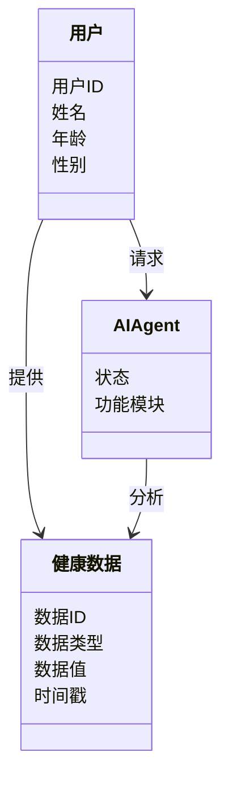
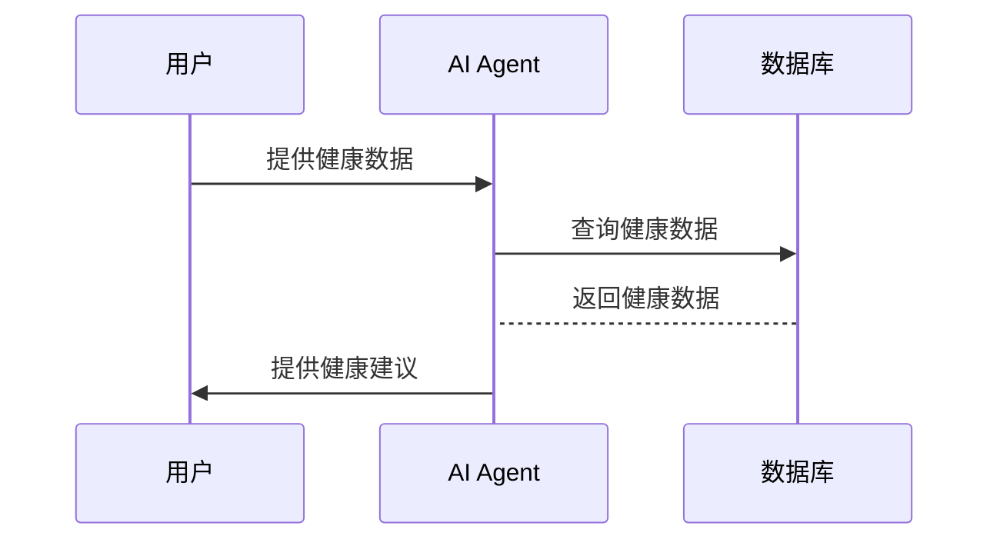

                 


# 构建AI Agent驱动的智能健康管理系统

## 关键词：AI Agent，智能健康管理系统，健康管理，人工智能，系统架构，算法原理

## 摘要：  
AI Agent驱动的智能健康管理系统是一种结合人工智能技术与健康管理系统的创新解决方案。通过AI Agent的智能决策和自主学习能力，该系统能够为用户提供个性化的健康评估、疾病预测和健康建议，从而实现精准的健康管理。本文从AI Agent的核心概念出发，详细分析其在智能健康管理系统中的应用，涵盖算法原理、系统架构设计以及实际项目实现等内容，为读者提供全面的技术解读。

---

# 第1章: AI Agent与智能健康管理概述

## 1.1 AI Agent的基本概念

### 1.1.1 什么是AI Agent  
AI Agent（人工智能代理）是一种能够感知环境、自主决策并执行任务的智能实体。它可以是一个软件程序，也可以是一个硬件设备，其核心目标是通过智能化的交互和操作，帮助用户完成特定任务或解决问题。

### 1.1.2 AI Agent的核心特征  
- **自主性**：AI Agent能够在没有外部干预的情况下自主运行。  
- **反应性**：能够实时感知环境变化并做出响应。  
- **学习能力**：通过数据和经验不断优化自身的决策能力。  
- **协作性**：能够与其他AI Agent或系统进行协作，共同完成复杂任务。  

### 1.1.3 AI Agent与传统软件的区别  
传统软件依赖于固定的程序逻辑和规则，而AI Agent具备学习和适应能力，能够根据输入数据动态调整行为策略。这种差异使得AI Agent在智能健康管理等复杂场景中更具优势。

---

## 1.2 智能健康管理系统的定义与特点

### 1.2.1 智能健康管理系统的定义  
智能健康管理系统是一种利用人工智能、大数据和物联网等技术，为用户提供个性化健康评估、疾病预测和健康建议的系统。它能够通过收集和分析用户的健康数据，提供精准的健康管理和干预方案。

### 1.2.2 智能健康管理系统的功能模块  
- **用户管理模块**：负责用户信息的录入、管理和身份验证。  
- **数据采集模块**：通过智能设备或传感器采集用户的健康数据（如心率、血压、运动数据等）。  
- **健康评估模块**：基于采集的数据，对用户的健康状况进行评估和分析。  
- **健康建议模块**：根据评估结果，为用户提供个性化的健康建议。  
- **疾病预测模块**：通过机器学习算法预测用户可能发生的健康问题。  

### 1.2.3 智能健康管理系统与传统健康管理的区别  
传统健康管理主要依赖人工操作和固定的规则，而智能健康管理系统通过AI技术实现了自动化、个性化和精准化的健康管理。

---

## 1.3 AI Agent在智能健康管理中的应用背景

### 1.3.1 当前健康管理的痛点  
- **数据孤岛**：用户的健康数据分散在不同的设备和系统中，难以实现统一管理。  
- **个性化不足**：传统健康管理方法缺乏个性化的健康评估和建议。  
- **效率低下**：人工操作效率低，难以满足大规模用户的需求。  

### 1.3.2 AI Agent如何解决这些痛点  
AI Agent可以通过以下方式解决上述问题：  
- **数据整合**：AI Agent能够整合来自不同设备的健康数据，实现统一管理。  
- **智能决策**：通过机器学习算法，AI Agent可以为用户提供个性化的健康评估和建议。  
- **高效执行**：AI Agent能够快速响应用户需求，提高健康管理的效率。  

### 1.3.3 AI Agent在智能健康管理系统中的优势  
- **智能化**：AI Agent能够自主学习和优化，提升系统的智能化水平。  
- **实时性**：通过实时感知和响应，AI Agent能够快速应对用户的健康问题。  
- **扩展性**：AI Agent可以通过模块化设计，轻松扩展系统功能。  

---

# 第2章: AI Agent的核心概念与联系

## 2.1 AI Agent的核心原理

### 2.1.1 AI Agent的任务分解  
AI Agent的任务分解是实现智能健康管理的基础。例如，一个健康管理任务可以分解为以下步骤：  
1. **数据采集**：收集用户的健康数据。  
2. **数据处理**：对采集到的数据进行清洗和预处理。  
3. **健康评估**：基于数据对用户的健康状况进行评估。  
4. **健康建议**：根据评估结果生成个性化的健康建议。  

### 2.1.2 AI Agent的状态表示  
AI Agent的状态表示是其感知环境的基础。例如，可以通过以下方式表示AI Agent的状态：  
- **健康指标**：如心率、血压等。  
- **用户行为**：如运动量、作息时间等。  
- **环境信息**：如天气、地理位置等。  

### 2.1.3 AI Agent的动作选择  
AI Agent的动作选择是其实现智能决策的关键。例如，当用户的健康数据异常时，AI Agent可以选择以下动作：  
- **发送警报**：通知用户或医生。  
- **调整健康计划**：根据数据变化优化健康建议。  
- **执行健康干预**：如提醒用户服药或运动。  

---

## 2.2 AI Agent与智能健康管理系统的实体关系

### 2.2.1 实体关系图  
以下是AI Agent与智能健康管理系统的实体关系图：

```mermaid
er
    entity 用户 {
        id: 用户ID
        name: 用户姓名
        age: 年龄
        gender: 性别
        health_data: 健康数据
    }
    entity 健康数据 {
        id: 数据ID
        type: 数据类型
        value: 数据值
        timestamp: 时间戳
    }
    entity AI Agent {
        id: Agent ID
        function: 功能模块
        status: 当前状态
    }
    用户 --> 健康数据: 提供
    用户 --> AI Agent: 请求
    AI Agent --> 健康数据: 分析
```

### 2.2.2 实体关系的描述  
- **用户**：系统的核心用户，提供健康数据并接收健康建议。  
- **健康数据**：用户的健康数据，包括心率、血压等。  
- **AI Agent**：智能健康管理系统的主体，负责分析健康数据并提供健康建议。  

---

## 2.3 AI Agent与智能健康管理系统的概念属性对比

| 概念       | 属性               | 描述                                                                 |
|------------|--------------------|----------------------------------------------------------------------|
| AI Agent    | 自主性             | 能够自主运行和决策                                                 |
| 智能健康管理系统 | 个性化         | 提供个性化的健康评估和建议                                         |
| 健康数据    | 实时性             | 数据能够实时采集和更新                                             |
| 用户        | 反应性             | 用户可以根据系统的建议调整健康行为                                   |

---

# 第3章: AI Agent驱动的智能健康管理系统的核心算法

## 3.1 强化学习算法

### 3.1.1 强化学习的基本原理  
强化学习是一种通过试错机制来优化决策的算法。AI Agent通过与环境的交互，不断学习和优化自己的行为策略。

### 3.1.2 强化学习的应用场景  
在智能健康管理系统中，强化学习可以应用于健康计划的优化。例如，AI Agent可以根据用户的健康数据调整运动计划和饮食建议。

### 3.1.3 强化学习算法的实现  

```python
class AI-Agent:
    def __init__(self):
        self.state = 'init'
        self.reward = 0

    def perceive(self, environment):
        # 采集环境数据
        self.state = environment.get_state()

    def act(self):
        # 根据当前状态选择动作
        if self.state == 'health':
            return 'provide suggestion'
        else:
            return 'send alert'

    def update(self, reward):
        # 更新奖励函数
        self.reward += reward
```

---

## 3.2 监督学习算法

### 3.2.1 监督学习的基本原理  
监督学习是一种基于标记数据的训练方法。AI Agent通过学习大量的标注数据，识别健康数据中的模式和特征。

### 3.2.2 监督学习的应用场景  
在智能健康管理系统中，监督学习可以应用于疾病预测。例如，AI Agent可以通过学习大量的病例数据，预测用户是否患有某种疾病。

### 3.2.3 监督学习算法的实现  

```python
import numpy as np
from sklearn import tree

# 数据准备
X = np.array([[40, 120, 80],
              [50, 130, 85],
              [60, 140, 90]])
y = np.array(['健康', '健康', '异常'])

# 训练决策树模型
model = tree.DecisionTreeClassifier()
model.fit(X, y)

# 预测新数据
new_data = np.array([[55, 135, 88]])
prediction = model.predict(new_data)
print(prediction)  # 输出：['异常']
```

---

## 3.3 算法原理的数学模型

### 3.3.1 强化学习的数学模型  
强化学习的核心是通过优化目标函数来选择最优动作。数学表达式如下：  
$$ Q(s, a) = Q(s, a) + \alpha (r + \gamma Q(s', a') - Q(s, a)) $$  
其中，$Q(s, a)$ 表示状态 $s$ 下动作 $a$ 的价值，$\alpha$ 是学习率，$\gamma$ 是折扣因子，$r$ 是奖励。

### 3.3.2 监督学习的数学模型  
监督学习的核心是通过训练数据学习函数 $f(x)$，使得预测值 $\hat{y}$ 尽可能接近真实值 $y$。数学表达式如下：  
$$ \hat{y} = f(x) $$  
$$ \text{损失函数} = \frac{1}{n} \sum_{i=1}^{n} (y_i - \hat{y}_i)^2 $$  

---

# 第4章: AI Agent驱动的智能健康管理系统架构设计

## 4.1 系统功能设计

### 4.1.1 领域模型设计  
以下是智能健康管理系统的领域模型图：



### 4.1.2 功能模块描述  
- **用户管理模块**：负责用户信息的录入和管理。  
- **数据采集模块**：通过智能设备采集用户的健康数据。  
- **健康评估模块**：基于健康数据对用户的健康状况进行评估。  
- **健康建议模块**：根据评估结果生成个性化的健康建议。  
- **疾病预测模块**：通过机器学习算法预测用户的健康风险。  

---

## 4.2 系统架构设计

### 4.2.1 系统架构图  
以下是智能健康管理系统的架构图：


### 4.2.2 系统架构的描述  
- **前端**：负责用户与系统的交互，如显示健康数据和健康建议。  
- **后端**：负责处理用户的请求和调用AI Agent进行分析。  
- **数据库**：存储用户的健康数据和系统配置。  
- **AI Agent**：负责分析健康数据并提供健康建议。  
- **智能设备**：采集用户的健康数据并发送到系统。  

---

## 4.3 系统接口设计

### 4.3.1 API接口设计  
以下是智能健康管理系统的API接口设计：  

| 接口名称       | 接口功能             | 输入参数           | 输出参数           |
|----------------|--------------------|--------------------|--------------------|
| 获取健康数据   | 获取用户的健康数据   | 用户ID             | 健康数据列表       |
| 提交健康数据   | 提交用户的健康数据   | 用户ID, 健康数据   | 状态码            |
| 获取健康建议   | 获取用户的健康建议   | 用户ID             | 健康建议列表       |
| 提交健康计划   | 提交用户的健康计划   | 用户ID, 健康计划   | 状态码            |

---

## 4.4 系统交互设计

### 4.4.1 交互流程图  
以下是智能健康管理系统的交互流程图：



---

# 第5章: AI Agent驱动的智能健康管理系统项目实战

## 5.1 环境搭建

### 5.1.1 技术选型  
- **前端**：React.js 或 Vue.js  
- **后端**：Python（Django 或 Flask）  
- **AI Agent**：Python（使用机器学习库如scikit-learn）  
- **数据库**：MySQL 或 MongoDB  

### 5.1.2 环境安装  
安装Python、pip、Django、Flask、scikit-learn等工具。

---

## 5.2 系统核心实现

### 5.2.1 AI Agent的核心代码  

```python
import numpy as np
from sklearn import tree

# 数据准备
X = np.array([[40, 120, 80],
              [50, 130, 85],
              [60, 140, 90]])
y = np.array(['健康', '健康', '异常'])

# 训练决策树模型
model = tree.DecisionTreeClassifier()
model.fit(X, y)

# 预测新数据
new_data = np.array([[55, 135, 88]])
prediction = model.predict(new_data)
print(prediction)  # 输出：['异常']
```

### 5.2.2 健康评估模块的代码  

```python
def calculate_health_score(age, weight, height):
    # 计算BMI
    bmi = weight / (height ** 2) * 10000
    # 计算健康评分
    if bmi < 18.5:
        return '过轻'
    elif 18.5 <= bmi < 24:
        return '正常'
    elif 24 <= bmi < 30:
        return '过重'
    else:
        return '肥胖'
```

---

## 5.3 项目小结

### 5.3.1 项目实现的关键点  
- **AI Agent的实现**：通过机器学习算法实现健康评估和疾病预测。  
- **系统架构设计**：采用分层架构，实现系统的可扩展性和可维护性。  
- **用户交互设计**：通过友好的界面设计，提升用户体验。  

### 5.3.2 项目实现的价值  
- 提高健康管理的效率和精准度。  
- 为用户提供个性化的健康评估和建议。  
- 通过AI技术实现健康数据的智能分析和管理。  

---

# 第6章: 总结与展望

## 6.1 最佳实践 Tips

### 6.1.1 系统优化建议  
- 定期更新AI Agent的模型和算法，提升系统的准确性和效率。  
- 增加系统的可解释性，帮助用户更好地理解健康建议的依据。  
- 提供多语言支持，扩大系统的用户群体。  

### 6.1.2 注意事项  
- 确保用户的健康数据安全，防止数据泄露。  
- 定期维护系统，及时修复漏洞和优化性能。  
- 提供用户反馈机制，不断改进系统的功能和性能。  

### 6.1.3 拓展阅读  
- **《深度学习》**：李宏毅  
- **《机器学习实战》**：Aurélien Géron  
- **《人工智能：一种现代的方法》**：斯图尔特·Russell  

---

## 6.2 小结

通过本文的详细讲解，我们了解了AI Agent驱动的智能健康管理系统的构建过程，包括核心概念、算法原理、系统架构设计以及项目实战等内容。AI Agent的应用不仅提高了健康管理的效率，还为用户提供了个性化的健康服务，具有重要的现实意义。

---

## 6.3 展望

未来，随着人工智能技术的不断发展，AI Agent在智能健康管理系统中的应用将更加广泛和深入。我们期待通过技术的不断创新，为用户带来更加智能化、个性化的健康管理体验。

--- 

# 结语

AI Agent驱动的智能健康管理系统是人工智能技术与健康管理领域的结合，通过智能化的决策和自主学习能力，为用户提供了高效、精准的健康服务。希望本文能够为读者提供有价值的技术参考，帮助大家更好地理解和应用AI Agent技术。

