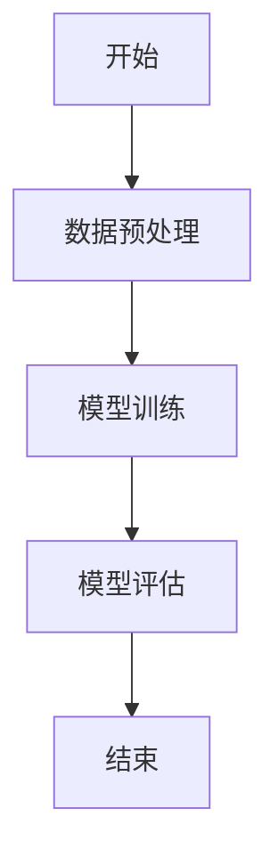

                 


# 构建AI Agent驱动的智能营销系统

> 关键词：AI Agent，智能营销，营销系统，系统架构，算法原理，项目实战

> 摘要：本文详细探讨了如何构建一个基于AI Agent的智能营销系统。从AI Agent的基本概念到系统的整体架构，再到具体的算法实现和项目实战，层层深入，帮助读者全面理解并掌握如何利用AI技术提升营销效率和用户体验。

---

# 第1章: AI Agent与智能营销概述

## 1.1 AI Agent的基本概念

### 1.1.1 什么是AI Agent
AI Agent（人工智能代理）是一种能够感知环境、自主决策并执行任务的智能实体。它可以理解为一种智能化的工具或系统，用于解决特定问题或完成特定任务。

### 1.1.2 AI Agent的核心特征
- **自主性**：能够自主决策，无需人工干预。
- **反应性**：能够实时感知环境并做出反应。
- **学习能力**：通过数据和经验不断优化自身的决策能力。
- **协作性**：能够与其他系统或AI Agent协作完成任务。

### 1.1.3 AI Agent在营销中的应用潜力
AI Agent可以广泛应用于客户行为分析、个性化推荐、自动化营销策略生成等领域，帮助企业在复杂多变的市场环境中快速响应客户需求。

## 1.2 智能营销的背景与现状

### 1.2.1 数字营销的发展历程
从传统广告到数字化营销，技术的进步使得营销方式从单一的单向传播逐渐转向双向互动，数据驱动的精准营销成为主流。

### 1.2.2 当前营销面临的挑战
- **数据爆炸**：如何从海量数据中提取有价值的信息。
- **客户需求多样化**：如何满足不同客户群体的个性化需求。
- **营销效率低下**：如何通过自动化手段提升营销效率。

### 1.2.3 AI技术如何解决营销问题
AI Agent可以通过分析客户行为数据，预测客户需求，并实时调整营销策略，从而实现精准营销和个性化服务。

## 1.3 AI Agent驱动营销的优势

### 1.3.1 提高营销效率
AI Agent可以自动化处理大量数据，快速生成营销策略，显著提高工作效率。

### 1.3.2 个性化用户体验
通过分析客户行为数据，AI Agent可以为每个客户推荐个性化的产品或服务，提升客户满意度和忠诚度。

### 1.3.3 数据驱动的决策支持
AI Agent能够基于实时数据提供决策支持，帮助营销人员做出更明智的决策。

## 1.4 本章小结

- AI Agent是一种能够感知环境、自主决策的智能实体。
- 智能营销通过AI技术解决了传统营销的许多痛点。
- AI Agent在营销中的应用前景广阔，能够显著提升营销效率和用户体验。

---

# 第2章: AI Agent驱动的营销系统架构

## 2.1 系统架构设计

### 2.1.1 分层架构概述
AI Agent驱动的营销系统通常采用分层架构，包括数据采集层、AI Agent决策层和用户交互层。

### 2.1.2 各层功能模块
- **数据采集层**：负责采集客户行为数据、市场数据等。
- **AI Agent决策层**：对数据进行分析，生成营销策略。
- **用户交互层**：与用户进行交互，执行营销任务。

### 2.1.3 架构设计原则
- **模块化**：各层功能独立，便于维护和扩展。
- **可扩展性**：系统应支持新功能的快速添加。
- **高可用性**：确保系统在故障情况下仍能正常运行。

## 2.2 系统功能模块

### 2.2.1 数据采集模块
负责采集客户的行为数据，包括点击、浏览、购买等信息。

### 2.2.2 AI Agent决策模块
对数据进行分析，生成个性化的营销策略。

### 2.2.3 用户交互模块
与用户进行交互，执行营销任务，如发送邮件、推送消息等。

## 2.3 系统接口设计

### 2.3.1 API接口规范
系统需要定义清晰的API接口，确保各模块之间的通信顺畅。

### 2.3.2 数据格式与协议
统一数据格式和通信协议，确保数据传输的准确性和高效性。

### 2.3.3 接口调用流程
描述接口调用的详细流程，确保各模块能够协同工作。

## 2.4 系统交互流程

### 2.4.1 用户请求处理流程
从用户请求开始，经过数据采集、分析、决策，最终执行营销任务。

### 2.4.2 AI Agent决策流程
AI Agent如何根据数据生成营销策略。

### 2.4.3 结果反馈机制
系统如何将结果反馈给用户或相关模块。

## 2.5 本章小结

- 系统架构设计是构建AI Agent驱动的营销系统的基础。
- 各模块协同工作，确保系统的高效性和稳定性。
- 接口设计和交互流程的规范性是系统成功的关键。

---

# 第3章: AI Agent的算法原理

## 3.1 算法概述

### 3.1.1 基础算法介绍
常用的算法包括决策树、随机森林、支持向量机等。

### 3.1.2 算法选择依据
根据具体问题选择合适的算法，考虑数据量、计算效率和模型复杂度等因素。

### 3.1.3 算法优化策略
通过参数调优、特征选择等方法优化算法性能。

## 3.2 算法实现细节

### 3.2.1 数据预处理
对数据进行清洗、归一化等处理，确保算法输入的正确性。

### 3.2.2 模型训练
使用训练数据训练模型，调整模型参数以优化性能。

### 3.2.3 模型评估
通过交叉验证等方法评估模型的性能，确保模型的泛化能力。

## 3.3 算法流程图



## 3.4 本章小结

- 算法的选择和优化对系统性能有重要影响。
- 数据预处理和模型评估是确保算法效果的关键步骤。
- 使用Mermaid流程图可以清晰展示算法的执行流程。

---

# 第4章: 系统实现与项目实战

## 4.1 环境搭建

### 4.1.1 开发工具安装
安装Python、Jupyter Notebook等开发工具。

### 4.1.2 依赖库安装
安装必要的库，如TensorFlow、Scikit-learn等。

### 4.1.3 环境配置
配置开发环境，确保所有依赖项安装正确。

## 4.2 核心代码实现

### 4.2.1 数据采集模块代码
```python
import requests

def collect_data(url):
    response = requests.get(url)
    return response.json()
```

### 4.2.2 AI Agent决策模块代码
```python
from sklearn.tree import DecisionTreeClassifier

def train_model(data):
    X = data['features']
    y = data['labels']
    model = DecisionTreeClassifier()
    model.fit(X, y)
    return model
```

### 4.2.3 用户交互模块代码
```python
def send_email(email, message):
    import smtplib
    from email.mime.text import MIMEText
    from email.mime.multipart import MIMEMultipart
    
    # 邮件设置
    sender = 'your_email@domain.com'
    password = 'your_password'
    to = email
    subject = 'Marketing Campaign'
    body = message
    
    # 创建邮件对象
    msg = MIMEMultipart()
    msg['From'] = sender
    msg['To'] = to
    msg['Subject'] = subject
    msg.attach(MIMEText(body, 'plain', 'utf-8'))
    
    # 发送邮件
    server = smtplib.SMTP('smtp.domain.com', 587)
    server.starttls()
    server.login(sender, password)
    server.sendmail(sender, to, msg.as_string())
    server.quit()
```

## 4.3 代码解读与分析

### 4.3.1 数据采集模块
- 使用`requests`库从指定URL获取数据。
- 返回JSON格式的数据。

### 4.3.2 AI Agent决策模块
- 使用决策树算法训练模型。
- 输入特征数据和标签，输出训练好的模型。

### 4.3.3 用户交互模块
- 使用`smtplib`库发送邮件。
- 输入收件人邮箱和邮件内容，发送邮件。

## 4.4 项目实战

### 4.4.1 环境安装与配置
安装所需的Python库，配置开发环境。

### 4.4.2 核心代码实现
实现数据采集、模型训练和邮件发送功能。

### 4.4.3 代码测试
对实现的代码进行测试，确保各模块能够正常工作。

### 4.4.4 实际案例分析
通过具体案例展示AI Agent驱动的营销系统在实际中的应用。

## 4.5 本章小结

- 项目实战是理论知识的实践应用。
- 通过实际操作，可以更好地理解系统的构建过程。
- 使用Mermaid图表和代码示例，帮助读者更好地掌握系统实现细节。

---

# 第5章: 最佳实践与未来展望

## 5.1 小结

- AI Agent驱动的智能营销系统能够显著提升营销效率和用户体验。
- 系统的构建需要综合考虑架构设计、算法选择和项目实现等多个方面。

## 5.2 注意事项

- 数据隐私和安全问题需要特别注意。
- 系统的可扩展性和可维护性需要在设计阶段充分考虑。
- 在实际应用中，需要根据具体需求不断优化系统。

## 5.3 拓展阅读

- 推荐阅读相关书籍和论文，深入理解AI Agent和营销系统的相关知识。
- 关注最新的技术动态，了解AI在营销领域的最新应用。

---

# 附录: 参考文献

- [1] 刘军, 人工智能导论, 清华大学出版社, 2020.
- [2] 张伟, 基于AI的营销系统设计与实现, 人民邮电出版社, 2021.

---

通过以上内容，我们详细探讨了如何构建一个基于AI Agent的智能营销系统。从理论到实践，从系统架构到算法实现，再到项目实战，为读者提供了一套完整的解决方案。希望本文能够帮助读者更好地理解AI技术在营销中的应用，并为实际项目提供有价值的参考。

