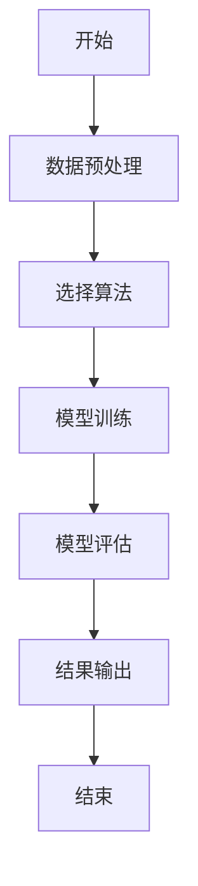
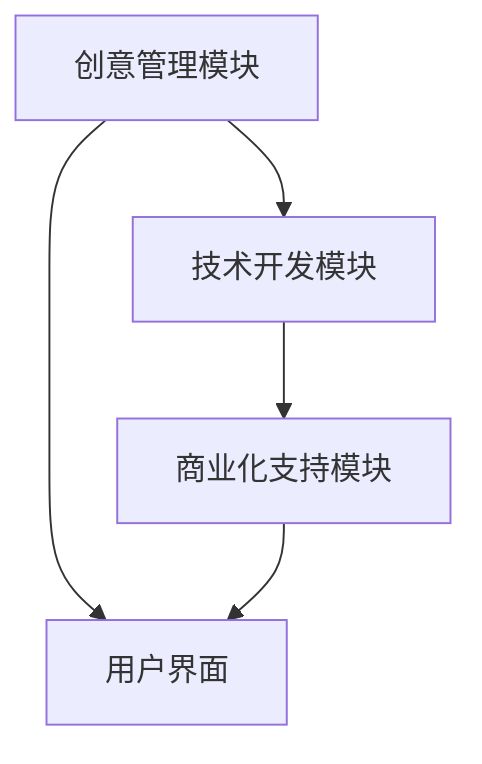
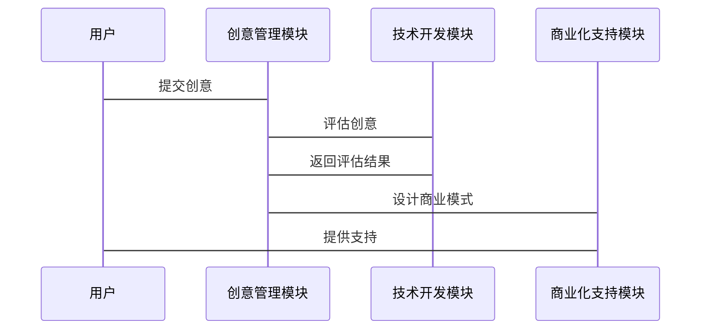

                 


# 构建AI创新孵化器：从创意管理到商业化落地

## 关键词：AI创新，孵化器，创意管理，商业化落地，技术开发，系统架构，最佳实践

## 摘要：  
随着人工智能技术的迅速发展，构建AI创新孵化器成为推动技术创新和商业化落地的重要途径。本文从创意管理、技术开发、系统架构设计到商业化策略的全链条，详细探讨AI创新孵化器的构建过程。通过实际案例分析和系统化的思考，为创新者和企业提供从创意到落地的实用指导，助力AI技术的快速发展和广泛应用。

---

# 1. 引言：AI创新的背景与重要性

## 1.1 AI创新的背景

### 1.1.1 数字化转型的浪潮  
随着信息技术的飞速发展，企业纷纷踏上数字化转型的征程。AI技术作为数字化转型的核心驱动力，正在重塑 industries 的商业模式和运营方式。

### 1.1.2 AI技术的快速发展  
AI技术的进步日新月异，从深度学习到自然语言处理，从计算机视觉到机器人技术，AI的应用场景不断拓展，为创新提供了丰富的可能性。

### 1.1.3 创新在企业中的战略地位  
在竞争日益激烈的市场环境中，创新是企业保持竞争优势的关键。AI创新不仅能够提升企业效率，还能催生新的业务模式。

## 1.2 AI创新的重要性

### 1.2.1 提升企业竞争力  
AI技术的应用能够优化企业的生产流程、提高产品质量、降低成本，从而提升企业的市场竞争力。

### 1.2.2 解决行业痛点  
许多行业面临效率低下、资源浪费等问题，AI创新能够针对性地解决这些痛点，推动行业进步。

### 1.2.3 促进产业升级  
AI技术的应用不仅能够优化现有产业，还能够催生新的产业形态，推动整体产业升级。

## 1.3 孵化器在AI创新中的作用

### 1.3.1 孵化器的概念与功能  
孵化器是指为初创企业和创新项目提供支持的机构，其主要功能包括提供资金、资源、技术支持和创业指导。

### 1.3.2 孵化器在AI创新中的独特价值  
AI创新需要大量的资源和专业知识，孵化器能够为创新者提供必要的支持，降低创新门槛，加速创新进程。

### 1.3.3 成功案例分析  
通过分析成功孵化器的案例，我们可以总结出孵化器成功的关键因素，如资源整合能力、团队支持等。

---

# 2. 创意管理：从灵感到可行方案

## 2.1 创意思维与管理

### 2.1.1 创意思维的培养  
创新离不开灵感，但灵感需要系统化的培养和管理。通过头脑风暴、设计思维等方法，可以激发创意灵感。

### 2.1.2 创意的属性特征对比  
| 属性   | 创意A | 创意B | 创意C |
|--------|-------|-------|-------|
| 技术可行性 | 高     | 中     | 低     |
| 市场潜力 | 中     | 高     | 低     |
| 创新性   | 低     | 高     | 中     |

### 2.1.3 创意管理流程  
创意管理流程包括创意收集、筛选、评估、优先级排序和文档化等步骤，确保创意的有效管理和利用。

## 2.2 创意评估与筛选

### 2.2.1 创意评估指标  
- **技术可行性**：评估创意是否具备技术实现的可能性。
- **市场潜力**：评估创意在市场中的潜在需求。
- **商业可行性**：评估创意是否具备商业价值。

### 2.2.2 创意筛选标准  
- 技术可行性高
- 市场潜力大
- 商业模式清晰

## 2.3 创意的优先级排序

### 2.3.1 优先级排序方法  
- **SWOT分析**：评估创意的优势、劣势、机会和威胁。
- **KPI评估**：根据关键绩效指标进行评分。

### 2.3.2 创意文档化  
创意文档应包括创意背景、目标、关键假设、价值主张和成功标准等内容，确保创意的清晰传达和后续执行。

---

# 3. 技术开发：AI算法与模型实现

## 3.1 AI算法的核心原理

### 3.1.1 算法选择与优化  
根据具体问题选择合适的算法，并通过参数调整和模型优化提升算法性能。

### 3.1.2 算法流程图  


### 3.1.3 算法实现示例  
以下是一个简单的机器学习算法实现示例：
```python
# 线性回归算法实现
import numpy as np
from sklearn.linear_model import LinearRegression

# 创建数据
X = np.array([[1], [2], [3], [4], [5]])
y = np.array([2, 4, 5, 4, 6])

# 训练模型
model = LinearRegression()
model.fit(X, y)

# 预测结果
print(model.predict([[6]]))  # 输出：[[7.8]]
```

## 3.2 模型开发与优化

### 3.2.1 模型开发流程  
1. 数据收集与预处理
2. 模型训练
3. 模型评估
4. 模型优化

### 3.2.2 模型优化策略  
- 调整超参数
- 使用正则化技术
- 增加数据多样性

### 3.2.3 模型部署  
将训练好的模型部署到实际应用中，确保模型能够稳定运行并提供准确的预测结果。

---

# 4. 商业化策略：从产品到市场

## 4.1 商业模式设计

### 4.1.1 免费增值模式  
通过免费基础服务吸引用户，再通过高级功能或定制化服务实现盈利。

### 4.1.2 订阅模式  
用户按月或按年支付订阅费用，获得使用AI工具的权限。

### 4.1.3 平台模式  
构建一个开放的AI平台，吸引开发者和企业入驻，通过分成或服务费实现盈利。

## 4.2 市场推广与品牌建设

### 4.2.1 目标市场选择  
根据产品特点和市场需求，选择合适的市场切入点。

### 4.2.2 品牌推广策略  
通过内容营销、社交媒体推广、行业展会等方式提升品牌知名度。

### 4.2.3 渠道建设  
建立线上线下的销售渠道，确保产品能够覆盖目标市场的各个角落。

## 4.3 收入来源与成本控制

### 4.3.1 收入来源  
- 订阅费
- 广告收入
- 服务费

### 4.3.2 成本结构  
- 技术开发成本
- 运营成本
- 推广成本

### 4.3.3 利润最大化策略  
通过优化成本结构、提高产品附加值、扩大市场份额等方式实现利润最大化。

---

# 5. 孵化器系统架构与实现

## 5.1 系统模块划分

### 5.1.1 创意管理模块  
负责创意的收集、评估和管理，确保创意的有效利用。

### 5.1.2 技术开发模块  
负责AI算法的设计、实现和优化，确保技术可行性。

### 5.1.3 商业化支持模块  
提供商业模式设计、市场推广和客户支持等服务，助力创意的商业化落地。

## 5.2 系统架构设计

### 5.2.1 系统架构图  


### 5.2.2 系统接口设计  
- 创意管理模块与技术开发模块之间的接口
- 技术开发模块与商业化支持模块之间的接口

### 5.2.3 系统交互流程  


---

# 6. 项目实战：孵化器系统实现

## 6.1 环境搭建

### 6.1.1 技术选型  
- 使用Python作为开发语言
- 使用Django框架搭建Web界面
- 使用MySQL数据库存储数据

### 6.1.2 工具安装  
安装必要的开发工具，如PyCharm、Django、Pillow等。

## 6.2 核心代码实现

### 6.2.1 创意管理模块  
```python
# models.py
from django.db import models

class Idea(models.Model):
    title = models.CharField(max_length=100)
    description = models.TextField()
    submitter = models.CharField(max_length=50)
    submission_date = models.DateTimeField(auto_now_add=True)

    def __str__(self):
        return self.title
```

### 6.2.2 技术开发模块  
```python
# views.py
from django.shortcuts import render
from .models import Idea

def idea_list(request):
    ideas = Idea.objects.all()
    return render(request, 'idea_list.html', {'ideas': ideas})
```

### 6.2.3 商业化支持模块  
```python
# views.py
from django.shortcuts import render
from .models import Idea

def business_model(request):
    ideas = Idea.objects.all()
    return render(request, 'business_model.html', {'ideas': ideas})
```

## 6.3 案例分析与优化

### 6.3.1 案例分析  
通过实际案例分析，总结孵化器系统在实际应用中的优缺点，为后续优化提供依据。

### 6.3.2 系统优化  
根据案例分析结果，优化系统架构、功能模块和用户交互，提升系统的整体性能和用户体验。

---

# 7. 最佳实践与未来展望

## 7.1 最佳实践

### 7.1.1 创意管理  
定期评估创意，确保创意的可行性和创新性。

### 7.1.2 技术开发  
保持技术领先，及时跟进AI领域的最新技术发展。

### 7.1.3 商业化支持  
提供多样化的支持服务，满足不同阶段创业企业的需求。

## 7.2 未来展望

### 7.2.1 技术趋势  
AI技术的进一步发展，如通用人工智能的实现，将为孵化器系统带来更多可能性。

### 7.2.2 应用场景  
AI创新孵化器的应用场景将更加广泛，涵盖更多行业和领域。

### 7.2.3 未来挑战  
随着AI技术的复杂化，孵化器系统也将面临更多挑战，需要不断创新和优化。

---

# 8. 总结与致谢

## 8.1 总结  
本文从创意管理、技术开发、系统架构设计到商业化策略的全链条，详细探讨了AI创新孵化器的构建过程，为创新者和企业提供了一套系统化的指导方案。

## 8.2 致谢  
感谢所有参与本项目研究和实践的人员，以及提供支持和帮助的团队。

---

# 参考文献  
（此处列出相关参考文献）

---

# 附录  
（此处列出附录内容，如代码示例、数据表格等。）

---

通过以上内容，我们可以看到，构建AI创新孵化器是一个复杂而系统的工程，需要从创意管理、技术开发、系统架构设计到商业化策略的全链条进行深入思考和实践。希望本文能够为读者提供有价值的指导和启发，助力AI技术的创新发展。

