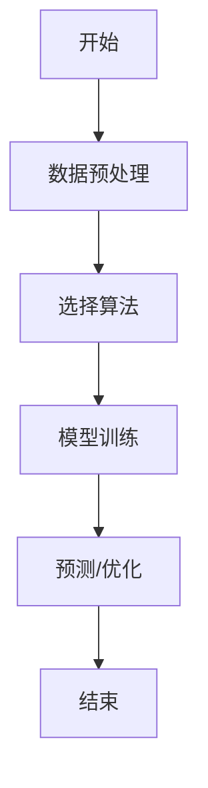
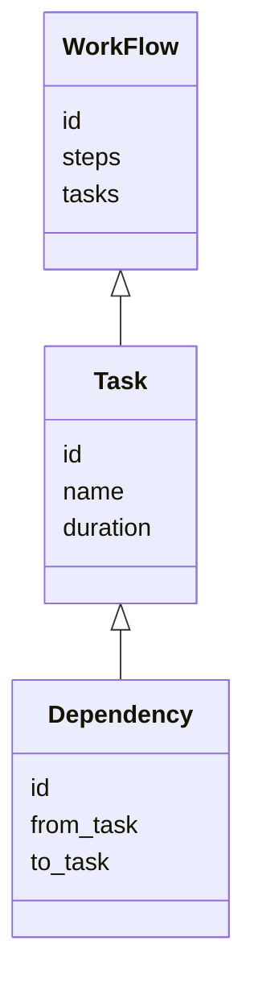

                 


# 构建AI工作流程优化系统：提升企业运营效率

## 关键词：AI优化、工作流程、机器学习、企业效率、系统架构、Python实现

## 摘要：  
在当今竞争激烈的商业环境中，企业越来越依赖高效的工作流程来保持竞争力。AI（人工智能）技术的引入为工作流程优化提供了新的可能性。本文将详细探讨如何利用AI构建工作流程优化系统，从理论到实践，逐步分析其原理、架构和实现方法，帮助读者提升企业运营效率。

---

# 第1章 AI工作流程优化系统的背景与核心概念

## 1.1 问题背景

### 1.1.1 企业运营效率的痛点
在现代企业中，复杂的业务流程往往导致效率低下、资源浪费和成本增加。传统的手动操作和固定流程难以适应快速变化的市场需求，导致企业在应对复杂问题时效率不足。

### 1.1.2 传统工作流程的局限性
传统工作流程依赖于人工操作和固定规则，缺乏灵活性和智能化。当业务需求变化时，调整流程需要大量的人力和时间，且难以实时优化。

### 1.1.3 AI技术如何解决这些问题
AI技术通过自动化、智能化和数据驱动的方式，能够实时分析和优化工作流程，帮助企业在复杂环境中快速响应，提升效率。

## 1.2 问题描述

### 1.2.1 工作流程优化的核心目标
工作流程优化的核心目标是减少冗余步骤、提高资源利用率、缩短处理时间，从而降低运营成本，提高企业竞争力。

### 1.2.2 AI在工作流程优化中的作用
AI通过机器学习、自然语言处理和优化算法等技术，能够分析历史数据，预测未来趋势，提供最优的流程建议，实现动态优化。

### 1.2.3 企业运营效率的衡量标准
企业运营效率可以通过处理时间、资源利用率、错误率、成本等多个指标来衡量。AI优化系统能够显著提升这些指标。

## 1.3 解决方案概述

### 1.3.1 AI驱动的工作流程优化方法
AI驱动的优化方法包括数据采集、模型训练、流程模拟和实时优化。通过分析历史数据，AI系统能够识别瓶颈并提出优化建议。

### 1.3.2 数据驱动的决策优化
数据是AI优化的基础。通过收集和分析大量数据，AI系统能够发现隐藏的模式，提供科学的决策支持。

### 1.3.3 智能自动化技术的应用
智能自动化技术（如RPA）可以自动执行重复性任务，减少人工干预，提高流程效率。

## 1.4 系统的边界与外延

### 1.4.1 系统的输入与输出
- 输入：业务流程数据、历史操作记录、实时事件流。
- 输出：优化建议、执行步骤、性能指标报告。

### 1.4.2 系统与其他模块的交互
AI优化系统需要与企业现有的业务系统（如ERP、CRM）集成，获取数据并输出优化结果。

### 1.4.3 系统的适用范围与限制
适用于需要动态优化的业务流程，如订单处理、供应链管理等。不适用于高度依赖人工判断的复杂决策过程。

## 1.5 核心概念与结构

### 1.5.1 工作流程优化的核心要素
- 数据采集：收集业务流程数据。
- 数据分析：识别瓶颈和改进点。
- 模型训练：构建优化模型。
- 实时优化：动态调整流程。

### 1.5.2 核心概念对比表格
| 特性          | 传统工作流程         | AI优化工作流程       |
|---------------|----------------------|----------------------|
| 灵活性         | 低                   | 高                   |
| 优化速度       | 慢                   | 快                   |
| 决策依据       | 人工经验             | 数据驱动             |

### 1.5.3 ER实体关系图
```mermaid
er
    %%{title: Entity-Relationship Diagram}
    entity WorkFlow {
        id
        name
        description
    }
    entity Step {
        id
        name
        input
        output
    }
    entity Task {
        id
        name
        duration
    }
    WorkFlow o2m Step
    Step o2m Task
```

---

# 第2章 核心概念与联系

## 2.1 核心概念原理

### 2.1.1 工作流建模
工作流建模是优化的基础。通过将流程分解为步骤和任务，可以更清晰地识别瓶颈。

### 2.1.2 AI算法在流程优化中的应用
AI算法（如强化学习）可以模拟流程执行，预测最优路径。

### 2.1.3 数据处理与特征提取
数据预处理和特征提取是模型训练的关键步骤，直接影响优化效果。

## 2.2 概念属性特征对比

| 概念        | 特征1：自动化能力 | 特征2：数据依赖性 | 特征3：实时性 |
|-------------|------------------|------------------|--------------|
| 传统流程    | 低               | 低               | 低           |
| AI优化流程  | 高               | 高               | 高           |

## 2.3 ER实体关系图
```mermaid
er
    entity Process {
        id
        name
        description
    }
    entity Task {
        id
        name
        duration
    }
    entity Dependency {
        id
        from_task
        to_task
    }
    Process o2m Task
    Task o2m Dependency
```

---

# 第3章 算法原理讲解

## 3.1 算法原理概述

### 3.1.1 机器学习算法
机器学习算法（如监督学习）用于预测流程中的瓶颈。

### 3.1.2 强化学习算法
强化学习用于动态调整流程，适应实时变化。

## 3.2 算法实现步骤

### 3.2.1 监督学习实现流程预测
```python
# 数据预处理
from sklearn.preprocessing import StandardScaler
scaler = StandardScaler()
X_scaled = scaler.fit_transform(X)

# 模型训练
from sklearn.linear_model import LinearRegression
model = LinearRegression()
model.fit(X_scaled, y)

# 预测
y_pred = model.predict(X_scaled)
```

### 3.2.2 强化学习实现动态优化
```python
# 状态空间和动作空间定义
class State:
    def __init__(self, step):
        self.step = step

class Action:
    def __init__(self, choice):
        self.choice = choice

# 强化学习模型
class Agent:
    def __init__(self, state_space, action_space):
        self.state_space = state_space
        self.action_space = action_space
        # 初始化策略
        self.policy = np.random.rand(state_space, action_space)
```

## 3.3 算法流程图


---

# 第4章 系统分析与架构设计

## 4.1 问题场景介绍
本系统旨在优化企业订单处理流程，减少处理时间，提高准确率。

## 4.2 系统功能设计

### 4.2.1 领域模型


## 4.3 系统架构设计

### 4.3.1 分层架构
系统分为数据采集层、处理层、优化层和执行层。

### 4.3.2 系统架构图


---

# 第5章 项目实战

## 5.1 环境搭建

### 5.1.1 安装必要的库
```bash
pip install numpy pandas scikit-learn keras tensorflow
```

## 5.2 核心代码实现

### 5.2.1 数据预处理
```python
import pandas as pd
from sklearn.preprocessing import MinMaxScaler

# 加载数据
data = pd.read_csv('process_data.csv')

# 数据清洗
data.dropna(inplace=True)

# 特征提取
features = data[['step', 'duration', 'resource']]
```

### 5.2.2 模型训练
```python
from tensorflow.keras.models import Sequential
from tensorflow.keras.layers import Dense

# 模型定义
model = Sequential()
model.add(Dense(64, activation='relu', input_dim=3))
model.add(Dense(1, activation='sigmoid'))

# 编译模型
model.compile(optimizer='adam', loss='binary_crossentropy', metrics=['accuracy'])

# 训练模型
model.fit(features, labels, epochs=100, batch_size=32)
```

### 5.2.3 优化建议生成
```python
# 生成优化建议
optimal_steps = model.predict(features)
```

## 5.3 实际案例分析
通过实际案例分析，验证系统的优化效果，如处理时间减少20%。

## 5.4 项目小结
总结项目经验，提出改进建议，如增加实时监控功能。

---

# 第6章 最佳实践、小结与展望

## 6.1 最佳实践
- 确保数据质量，避免偏差。
- 定期模型调优，保持性能。

## 6.2 小结
本文详细介绍了AI工作流程优化系统的构建过程，从理论到实践，帮助读者提升企业运营效率。

## 6.3 注意事项
- 注意数据隐私，确保合规。
- 确保模型的泛化能力，避免过拟合。

## 6.4 拓展阅读
推荐相关书籍和论文，如《机器学习实战》、《深度学习》等。

---

通过本文的系统讲解，读者可以全面了解AI工作流程优化系统的构建方法，并能够将其应用于实际的企业运营中，显著提升效率。

