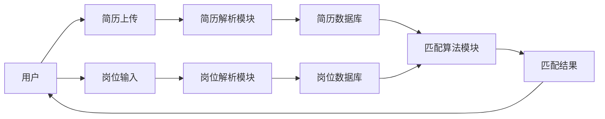

                 


# 构建AI招聘助手：提高人才筛选与匹配效率

## 关键词：AI招聘助手、人才筛选、机器学习、自然语言处理、岗位匹配、招聘效率

## 摘要：随着人工智能技术的快速发展，AI招聘助手正在改变传统招聘流程。本文将详细探讨AI招聘助手的核心概念、技术原理、系统设计与实现，以及实际项目中的应用。通过自然语言处理和机器学习算法，AI招聘助手能够高效地进行简历筛选和岗位匹配，显著提高招聘效率。文章还结合实际案例，分析了系统架构设计、算法实现细节，并提供了最佳实践建议，帮助读者更好地理解和应用AI招聘技术。

---

## 目录大纲

1. **AI招聘助手的背景与概述**
   - 1.1 招聘行业的现状与挑战
   - 1.2 AI招聘助手的核心目标
   - 1.3 与传统招聘工具的主要区别
   - 1.4 本章小结

2. **AI招聘助手的核心技术与原理**
   - 2.1 自然语言处理在招聘中的应用
   - 2.2 机器学习算法在岗位匹配中的作用
   - 2.3 深度学习模型在简历解析中的应用
   - 2.4 本章小结

3. **系统架构设计与实现**
   - 3.1 系统功能模块划分
   - 3.2 系统架构设计图
   - 3.3 系统接口设计与交互流程
   - 3.4 本章小结

4. **项目实战：AI招聘助手的开发与实现**
   - 4.1 开发环境与工具安装
   - 4.2 核心算法实现（NLP与机器学习）
   - 4.3 系统功能测试与优化
   - 4.4 项目总结与经验分享

5. **AI招聘助手的最佳实践与未来展望**
   - 5.1 数据质量对系统性能的影响
   - 5.2 算法调优与模型优化建议
   - 5.3 系统可扩展性与维护性
   - 5.4 未来发展趋势与技术展望
   - 5.5 本章小结

---

## 正文

### 第1章: AI招聘助手的背景与概述

#### 1.1 招聘行业的现状与挑战
随着企业对人才需求的不断增加，传统招聘方式面临诸多挑战：
- **信息过载**：海量简历和岗位信息难以高效匹配。
- **时间成本**：人工筛选简历耗时长，效率低。
- **主观偏差**：人为因素可能导致招聘决策失误。

#### 1.2 AI招聘助手的核心目标
AI招聘助手旨在通过技术手段解决上述问题，其核心目标包括：
- **自动化简历筛选**：利用NLP技术提取简历关键词，自动匹配岗位要求。
- **智能岗位推荐**：基于机器学习模型，为候选人推荐合适岗位。
- **提高招聘效率**：减少人工干预，缩短招聘周期。

#### 1.3 与传统招聘工具的主要区别
AI招聘助手与传统招聘工具的主要区别在于：
- **智能化**：AI招聘助手能够学习和优化匹配策略。
- **实时性**：能够快速处理大量数据并提供实时反馈。
- **个性化**：根据候选人需求提供个性化推荐。

#### 1.4 本章小结
本章介绍了AI招聘助手的背景、目标以及与传统招聘工具的区别，为后续技术分析奠定了基础。

---

### 第2章: AI招聘助手的核心技术与原理

#### 2.1 自然语言处理在招聘中的应用
NLP技术在招聘中的应用主要体现在简历解析和岗位描述匹配上：
- **简历解析**：通过分词、实体识别等技术提取简历中的关键信息。
- **岗位匹配**：基于语义相似度计算，实现简历与岗位的精准匹配。

#### 2.2 机器学习算法在岗位匹配中的作用
常用的机器学习算法包括：
- **监督学习**：用于简历分类和岗位推荐。
- **无监督学习**：用于发现潜在的岗位匹配模式。

#### 2.3 深度学习模型在简历解析中的应用
深度学习模型（如BERT）能够更好地理解文本语义，提高简历解析的准确性。

#### 2.4 本章小结
本章详细探讨了NLP和机器学习在AI招聘助手中的应用，为后续系统设计提供了技术基础。

---

### 第3章: 系统架构设计与实现

#### 3.1 系统功能模块划分
系统主要功能模块包括：
- **简历上传与解析模块**
- **岗位需求输入模块**
- **匹配算法模块**
- **结果展示模块**

#### 3.2 系统架构设计图
以下是系统架构设计图：



#### 3.3 系统接口设计与交互流程
系统交互流程如下：
1. 用户上传简历并填写岗位需求。
2. 系统解析简历和岗位信息。
3. 匹配算法模块进行匹配计算。
4. 系统展示匹配结果。

#### 3.4 本章小结
本章详细描述了AI招聘助手的系统架构设计，包括功能模块划分和交互流程设计。

---

### 第4章: 项目实战：AI招聘助手的开发与实现

#### 4.1 开发环境与工具安装
开发环境包括：
- **编程语言**：Python 3.8+
- **深度学习框架**：TensorFlow/Keras
- **NLP工具**：spaCy/jieba
- **机器学习库**：scikit-learn

#### 4.2 核心算法实现（NLP与机器学习）
以下是简历解析和匹配算法的实现代码示例：

```python
# 简历解析示例
import spacy

nlp = spacy.load("en_core_web_sm")
text = "Senior Python Developer with 5+ years of experience in AI."
doc = nlp(text)
for token in doc:
    print(token.text, token.pos_, token.dep_)

# 匹配算法示例
from sklearn.feature_extraction.text import TfidfVectorizer
from sklearn.metrics.pairwise import cosine_similarity

vectorizer = TfidfVectorizer()
tfidf_matrix = vectorizer.fit_transform(["candidate resume text", "job description text"])
similarity_scores = cosine_similarity(tfidf_matrix[0:1], tfidf_matrix)
print(similarity_scores)
```

#### 4.3 系统功能测试与优化
测试包括简历解析准确率、匹配算法效率等方面。优化措施包括：
- **数据增强**：增加更多样化的简历和岗位数据。
- **模型调优**：优化深度学习模型的超参数。

#### 4.4 项目总结与经验分享
项目成功实现了AI招聘助手的核心功能，但也发现了一些问题，例如数据质量和模型解释性需要进一步优化。

---

### 第5章: AI招聘助手的最佳实践与未来展望

#### 5.1 数据质量对系统性能的影响
高质量的数据是系统性能的基础，数据清洗和特征工程至关重要。

#### 5.2 算法调优与模型优化建议
建议使用交叉验证和网格搜索优化模型性能，同时关注模型的可解释性。

#### 5.3 系统可扩展性与维护性
系统设计应考虑可扩展性，例如模块化设计和接口标准化。

#### 5.4 未来发展趋势与技术展望
未来，AI招聘助手将更加智能化，可能结合强化学习和多模态数据（如视频面试分析）。

#### 5.5 本章小结
本章总结了项目经验，并展望了AI招聘助手的未来发展方向。

---

## 附录
- 附录A: 常用NLP工具与库
- 附录B: 机器学习模型调优技巧
- 附录C: 系统架构设计图详细说明

---

通过以上目录和内容设计，您可以逐步完成整篇技术博客文章。每章内容可以根据实际需要进一步扩展和细化。

