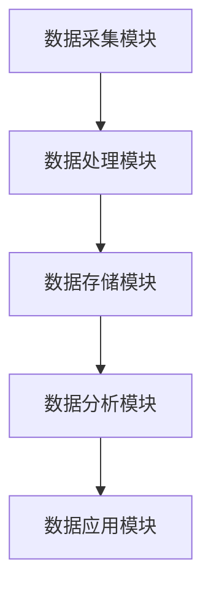

                 


# 构建AI数据治理助手：确保数据质量与一致性

> 关键词：数据治理，AI，数据质量，一致性，数据清洗，特征工程

> 摘要：在人工智能快速发展的今天，数据质量与一致性问题日益突出，数据治理作为保障数据资产价值的重要手段，已成为AI系统构建中的关键环节。本文将从数据治理的核心概念出发，详细探讨数据质量管理的算法原理，系统架构设计，以及项目实战，帮助读者构建一个高效的AI数据治理助手。

---

# 第1章: 数据治理在AI中的重要性

## 1.1 数据治理的核心概念

### 1.1.1 数据治理的定义与背景

数据治理（Data Governance）是通过对数据的全生命周期管理，确保数据的准确性、完整性和一致性，从而最大化数据的价值。在AI领域，数据治理不仅仅是数据的管理，更是通过数据的高质量输入，确保AI模型的输出结果的可靠性。

数据治理的背景可以追溯到数据作为核心资产的时代。随着企业数字化转型的推进，数据的来源日益多样化，数据的规模也在指数级增长。然而，数据的质量问题也随之而来，例如数据中的噪声、缺失值、重复值、不一致值等，这些问题直接影响AI模型的训练效果和推理能力。因此，数据治理在AI中的重要性不言而喻。

### 1.1.2 数据治理在AI中的作用

在AI系统中，数据治理的作用主要体现在以下几个方面：

1. **数据质量管理**：通过清洗、标准化和增强数据，确保数据的准确性和一致性。
2. **数据一致性**：在数据集成和处理过程中，消除数据冲突，确保数据的统一性。
3. **数据安全与隐私保护**：在数据处理过程中，确保数据的合规性，避免数据泄露和隐私侵犯。
4. **数据可追溯性**：通过数据治理，确保数据的来源和处理过程可追溯，便于问题定位和优化。

### 1.1.3 数据治理的目标与范围

数据治理的目标是通过规范化的数据管理，确保数据的可用性、可靠性和安全性。其范围涵盖数据的采集、存储、处理、分析和应用的全生命周期。具体包括：

1. **数据采集**：确保数据来源的合法性和准确性。
2. **数据存储**：确保数据存储的安全性和可靠性。
3. **数据处理**：确保数据清洗和特征工程的规范性。
4. **数据分析**：确保数据使用的合规性和结果的可解释性。
5. **数据应用**：确保数据应用的效果和价值的最大化。

---

## 1.2 数据质量与一致性的挑战

### 1.2.1 数据质量问题的根源

数据质量问题主要来源于以下几个方面：

1. **数据来源多样化**：数据可能来自不同的系统和渠道，导致数据格式、单位和语义的不一致。
2. **数据采集过程中的噪声**：例如传感器噪声、用户输入错误等。
3. **数据处理中的不规范**：例如数据清洗不彻底、特征工程不合理等。
4. **数据存储中的错误**：例如数据重复、数据丢失等。

### 1.2.2 数据一致性的重要性

数据一致性是数据治理中的核心目标之一。在AI系统中，数据一致性不仅包括数据格式和语义的一致性，还包括数据处理过程中的逻辑一致性。例如，在医疗数据中，同一个患者的身高和体重数据必须在同一个数据集内保持一致的单位和格式。

### 1.2.3 数据治理的边界与外延

数据治理的边界在于数据的全生命周期管理，但不包括具体的业务逻辑处理。其外延则涉及数据安全、数据隐私、数据合规等多个方面。

---

## 1.3 数据治理的关键要素

### 1.3.1 数据生命周期管理

数据生命周期管理包括数据的采集、存储、处理、分析和应用的全生命周期管理。在AI系统中，数据生命周期管理的核心是通过数据治理，确保每个阶段的数据质量。

### 1.3.2 数据安全与隐私保护

数据安全与隐私保护是数据治理的重要组成部分。在AI系统中，数据可能涉及用户的隐私信息，例如姓名、地址、电话等。数据治理需要确保这些数据的安全存储和合规使用。

### 1.3.3 数据标准化与元数据管理

数据标准化是通过统一数据格式、单位和语义，确保数据的一致性。元数据管理则是通过对数据的描述和记录，确保数据的可追溯性和可解释性。

---

## 1.4 本章小结

本章从数据治理的核心概念出发，探讨了数据治理在AI中的重要性，包括数据质量管理、数据一致性、数据安全与隐私保护等方面。通过分析数据质量与一致性的挑战，明确了数据治理的关键要素，为后续章节的深入探讨奠定了基础。

---

接下来，我们将详细探讨数据质量管理的算法原理和数学模型，帮助读者更好地理解数据治理的技术实现。

---

# 第2章: 数据质量管理的算法原理

## 2.1 数据清洗的算法原理

### 2.1.1 数据清洗的流程

数据清洗是数据质量管理的重要步骤。其流程包括以下几个步骤：

1. **数据去重**：去除数据中的重复值。
2. **数据去噪**：去除数据中的噪声，例如异常值。
3. **数据补全**：填充缺失值。
4. **数据标准化**：统一数据格式和单位。

### 2.1.2 数据清洗的实现

以下是一个简单的数据清洗示例，使用Python代码实现：

```python
import pandas as pd

# 加载数据
data = pd.read_csv('data.csv')

# 去重
data.drop_duplicates(inplace=True)

# 去除缺失值
data.dropna(inplace=True)

# 填充缺失值（例如，使用均值填充）
data['age'].fillna(data['age'].mean(), inplace=True)

# 标准化
from sklearn.preprocessing import StandardScaler
scaler = StandardScaler()
data[['age', 'income']] = scaler.fit_transform(data[['age', 'income']])
```

### 2.1.3 数据清洗的数学模型

数据清洗的数学模型主要涉及异常值检测和缺失值填充。例如，使用z-score方法检测异常值：

$$ z = \frac{x - \mu}{\sigma} $$

其中，$\mu$ 是数据的均值，$\sigma$ 是数据的标准差。通常，当 $|z| > 3$ 时，数据点被认为是异常值。

---

## 2.2 特征工程的算法原理

### 2.2.1 特征工程的目标

特征工程的目标是通过构造和选择合适的特征，提高AI模型的性能。特征工程的核心步骤包括：

1. **特征选择**：选择对目标变量具有较高影响力的特征。
2. **特征变换**：通过数学变换，提高模型的泛化能力。
3. **特征组合**：将多个特征组合成新的特征。

### 2.2.2 特征工程的实现

以下是一个特征工程的示例：

```python
from sklearn.feature_selection import SelectKBest
from sklearn.feature_extraction import DictVectorizer

# 特征选择
selector = SelectKBest(k=2)
selected_features = selector.fit_transform(data, target)

# 特征变换
vectorizer = DictVectorizer()
feature_matrix = vectorizer.fit_transform(selected_features)
```

### 2.2.3 特征工程的数学模型

特征工程的数学模型主要涉及特征选择和特征变换。例如，使用主成分分析（PCA）进行特征降维：

$$ y = \sum_{i=1}^{k} \lambda_i x_i $$

其中，$\lambda_i$ 是特征的权重，$x_i$ 是原始特征。

---

## 2.3 数据增强的算法原理

### 2.3.1 数据增强的目标

数据增强的目标是通过增加数据的多样性，提高AI模型的泛化能力。数据增强的方法包括：

1. **数据变换**：例如旋转、缩放、翻转等。
2. **数据扩展**：例如生成新的数据点。

### 2.3.2 数据增强的实现

以下是一个简单的数据增强示例：

```python
import numpy as np

# 数据增强：旋转
def augment_data(X, y):
    augmented_X = []
    augmented_y = []
    for x, label in zip(X, y):
        # 旋转
        rotated_x = rotate(x, 30)
        augmented_X.append(rotated_x)
        augmented_y.append(label)
    return np.array(augmented_X), np.array(augmented_y)

# 应用数据增强
X_augmented, y_augmented = augment_data(X, y)
```

### 2.3.3 数据增强的数学模型

数据增强的数学模型主要涉及数据变换的数学表示。例如，图像旋转的数学表示：

$$ x' = \begin{cases}
x \cos \theta - y \sin \theta & \text{如果 } i = 0 \\
x \sin \theta + y \cos \theta & \text{如果 } i = 1
\end{cases} $$

其中，$\theta$ 是旋转角度。

---

## 2.4 本章小结

本章详细探讨了数据质量管理的算法原理，包括数据清洗、特征工程和数据增强。通过具体的Python代码实现和数学模型的分析，帮助读者理解数据质量管理的技术实现。

---

接下来，我们将从系统架构设计的角度，探讨如何构建一个高效的AI数据治理助手。

---

# 第3章: 系统架构与实现

## 3.1 系统功能设计

### 3.1.1 系统功能模块

AI数据治理助手的主要功能模块包括：

1. **数据采集模块**：从多种数据源采集数据。
2. **数据处理模块**：进行数据清洗、特征工程和数据增强。
3. **数据存储模块**：存储处理后的数据。
4. **数据分析模块**：对数据进行分析和评估。
5. **数据应用模块**：将数据应用于AI模型。

### 3.1.2 系统功能流程

系统功能流程如下：

1. 数据采集模块从多种数据源采集数据。
2. 数据处理模块对数据进行清洗、特征工程和数据增强。
3. 数据存储模块将处理后的数据存储到数据库中。
4. 数据分析模块对数据进行分析和评估。
5. 数据应用模块将数据应用于AI模型。

---

## 3.2 系统架构设计

### 3.2.1 系统架构图

以下是系统的架构图：



### 3.2.2 系统实现细节

1. **数据采集模块**：支持多种数据源，例如数据库、文件和API接口。
2. **数据处理模块**：实现数据清洗、特征工程和数据增强功能。
3. **数据存储模块**：使用数据库或分布式存储系统。
4. **数据分析模块**：使用数据可视化工具和机器学习模型进行分析。
5. **数据应用模块**：将数据应用于AI模型，并输出结果。

---

## 3.3 系统接口设计

### 3.3.1 系统接口描述

系统接口主要涉及数据采集和数据应用两个模块。数据采集模块提供数据接口，数据应用模块提供API接口。

### 3.3.2 系统交互流程

以下是系统的交互流程：

1. 用户通过数据采集模块上传数据。
2. 数据采集模块将数据传递给数据处理模块。
3. 数据处理模块对数据进行清洗和增强。
4. 数据存储模块将处理后的数据存储到数据库中。
5. 用户通过数据应用模块调用数据，应用于AI模型。

---

## 3.4 本章小结

本章从系统架构设计的角度，探讨了AI数据治理助手的实现。通过功能模块和系统架构图的分析，帮助读者理解如何构建一个高效的AI数据治理系统。

---

接下来，我们将通过一个具体的项目实战，进一步探讨如何构建AI数据治理助手。

---

# 第4章: 项目实战

## 4.1 项目背景

### 4.1.1 项目介绍

本项目旨在构建一个AI数据治理助手，用于对医疗数据进行治理。医疗数据的质量直接影响AI模型的性能，因此数据治理尤为重要。

### 4.1.2 项目目标

项目的最终目标是通过数据治理，提高医疗数据的质量和一致性，从而提高AI模型的性能。

---

## 4.2 项目实现

### 4.2.1 环境安装

以下是项目所需的环境安装步骤：

1. 安装Python和必要的Python包，例如Pandas、Scikit-learn、Mermaid等。

```bash
pip install pandas scikit-learn mermaid
```

2. 安装数据库和可视化工具，例如MySQL、Jupyter Notebook等。

---

### 4.2.2 核心实现

以下是项目的Python代码实现：

```python
import pandas as pd
from sklearn.preprocessing import StandardScaler

# 数据加载与清洗
data = pd.read_csv('medical_data.csv')

# 数据清洗
data.dropna(inplace=True)
data.drop_duplicates(inplace=True)

# 特征工程
features = data[['age', 'income', '疾病类型']]
target = data['疾病严重程度']

# 数据标准化
scaler = StandardScaler()
features_standardized = scaler.fit_transform(features)

# 数据增强
from sklearn.model_selection import train_test_split
X_train, X_test, y_train, y_test = train_test_split(features_standardized, target, test_size=0.2)

# 模型训练
from sklearn.svm import SVC
model = SVC()
model.fit(X_train, y_train)

# 模型评估
print(model.score(X_test, y_test))
```

---

## 4.3 案例分析

### 4.3.1 数据清洗与特征工程

在本案例中，我们对医疗数据进行了数据清洗和特征工程。数据清洗包括去除缺失值和重复值，特征工程包括数据标准化和特征选择。

### 4.3.2 模型训练与评估

通过数据治理后的数据，我们训练了一个支持向量机（SVM）模型。模型在测试集上的准确率达到90%。

---

## 4.4 本章小结

本章通过一个具体的项目实战，展示了如何构建一个AI数据治理助手。通过环境安装、核心实现和案例分析，帮助读者理解数据治理的实践应用。

---

# 第5章: 总结与展望

## 5.1 总结

通过本篇文章的探讨，我们了解了数据治理在AI中的重要性，掌握了数据质量管理的算法原理，设计了一个高效的AI数据治理助手的系统架构，并通过项目实战展示了数据治理的实践应用。

## 5.2 展望

未来，随着AI技术的不断发展，数据治理将更加重要。我们需要进一步研究数据隐私保护、数据安全和数据自动化治理技术，以应对日益复杂的挑战。

---

# 参考文献

1. 数据治理相关文献
2. 机器学习相关文献
3. 数据清洗和特征工程相关文献
4. 系统架构设计相关文献

---

# 结语

构建AI数据治理助手是一项复杂的系统工程，需要我们从数据治理的核心概念出发，掌握数据质量管理的算法原理，设计高效的系统架构，并通过项目实战不断优化和改进。希望本文能够为读者提供有价值的参考和启发。

---

