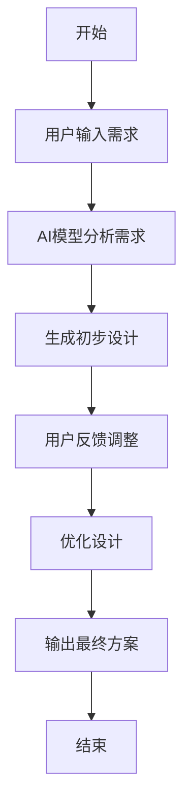
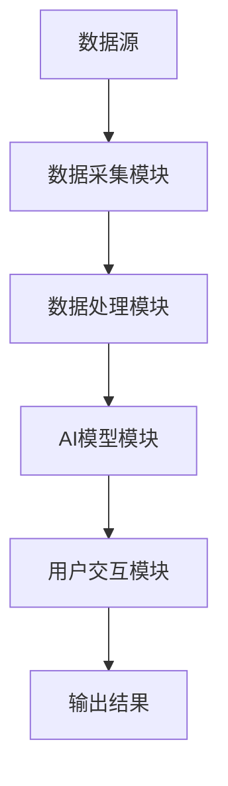
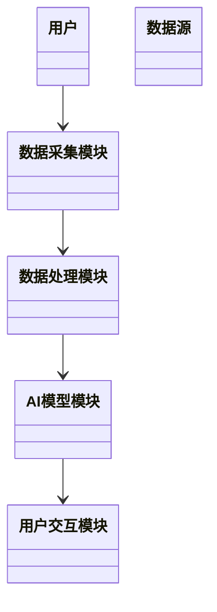
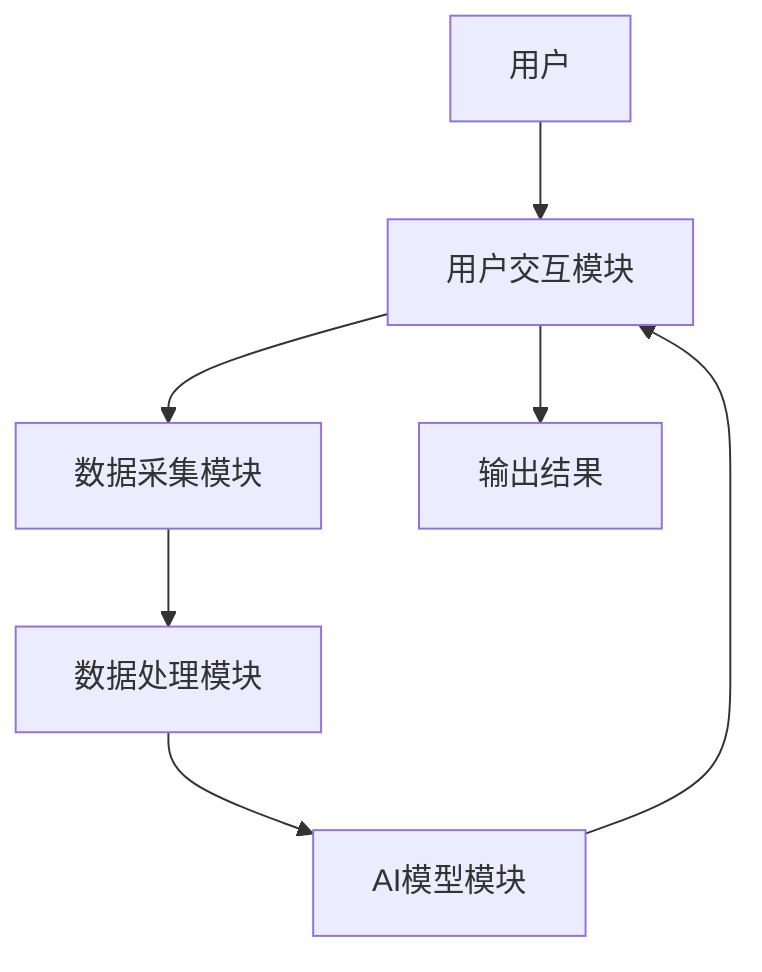

                 


# 构建AI辅助的金融产品设计系统

## 关键词：AI辅助，金融产品设计，系统构建，算法原理，项目实战

## 摘要：本文详细探讨了如何构建一个基于AI辅助的金融产品设计系统。从背景介绍、核心概念到算法原理，再到系统架构设计、项目实战和最佳实践，系统地分析了构建该系统的关键步骤和实现细节。通过本文，读者可以全面了解AI如何在金融产品设计中发挥重要作用，并掌握实际构建此类系统的方法和技巧。

---

# 第一章: 问题背景与核心概念

## 1.1 问题背景介绍

### 1.1.1 传统金融产品设计的挑战
传统金融产品设计过程复杂且耗时，涉及多个环节，包括市场分析、需求识别、产品定义、风险评估等。设计者需要依赖大量的市场数据和专业知识，同时需要不断与团队成员和其他部门沟通协调。这种模式不仅效率低下，还容易受到主观因素的影响。

### 1.1.2 AI技术在金融领域的应用潜力
AI技术，特别是大语言模型（LLM）在金融领域的应用潜力巨大。这些模型可以处理大量非结构化数据，生成结构化的分析结果，帮助设计者快速识别市场趋势、客户需求和潜在风险。AI还可以通过自动化生成设计文档、预测产品性能和优化设计方案，显著提高设计效率。

### 1.1.3 构建AI辅助设计系统的必要性
随着金融市场的日益复杂化，传统设计方法已经难以满足快速变化的需求。构建一个基于AI辅助的金融产品设计系统，可以显著提高设计效率和准确性，同时降低人为错误和时间成本。这种系统能够帮助设计者更专注于创新和策略制定，而不是繁琐的重复性工作。

## 1.2 问题描述与目标

### 1.2.1 金融产品设计的主要环节
金融产品设计通常包括以下几个主要环节：
1. 市场分析与需求识别
2. 产品定义与功能设计
3. 风险评估与合规检查
4. 产品文档编写与原型设计
5. 测试与优化

### 1.2.2 当前设计过程中的痛点
- 数据处理复杂：需要整合大量异构数据，包括市场数据、客户反馈、竞争分析等。
- 时间成本高：传统设计流程耗时长，尤其是在需求变更频繁的情况下。
- 个性化需求难以满足：难以快速响应不同客户群体的个性化需求。
- 风险评估不准确：依赖人工经验，容易出现疏漏。

### 1.2.3 系统设计的目标与边界
系统设计的目标是通过AI技术辅助完成金融产品的设计流程，提高效率、准确性和个性化。系统的边界包括从需求输入到最终产品方案输出的整个过程，但不包括实际的产品上线和运营。

## 1.3 问题解决思路

### 1.3.1 AI技术如何辅助金融产品设计
AI技术可以通过以下方式辅助金融产品设计：
1. **数据整合与分析**：利用自然语言处理（NLP）技术整合市场报告、客户需求等非结构化数据。
2. **需求识别与生成**：基于历史数据和市场趋势，生成潜在的产品需求。
3. **设计优化**：通过生成对抗网络（GAN）优化产品设计方案。
4. **风险评估**：利用机器学习模型预测产品可能面临的风险。

### 1.3.2 系统设计的核心要素
系统设计的核心要素包括：
1. **数据采集与处理模块**：负责整合和处理各种数据源。
2. **AI模型训练与部署模块**：负责训练和部署AI模型。
3. **用户交互界面**：方便用户输入需求和查看设计结果。
4. **设计优化模块**：根据AI生成的结果进行优化。

### 1.3.3 系统与传统设计流程的结合方式
系统通过嵌入传统设计流程中的关键环节，提供自动化支持。例如，在需求识别阶段，系统可以快速生成市场分析报告；在设计优化阶段，系统可以提供多个设计方案供设计者选择。

## 1.4 核心概念结构与组成

### 1.4.1 系统架构的核心要素
系统架构的核心要素包括：
1. **数据层**：存储和管理各种数据，包括市场数据、客户数据等。
2. **算法层**：包括AI模型和相关算法，用于数据处理和分析。
3. **用户层**：提供友好的用户交互界面，方便用户操作。

### 1.4.2 各模块之间的关系
- 数据层为算法层提供输入数据。
- 算法层处理数据并生成结果，反馈给用户层。
- 用户层根据结果进行操作，可能进一步调整输入或查看详细信息。

### 1.4.3 系统的输入输出与边界
- **输入**：市场数据、客户反馈、竞争分析等。
- **输出**：优化后的金融产品设计方案。
- **边界**：不包括产品上线后的运营和维护。

## 1.5 本章小结
本章从问题背景、核心概念、系统目标等方面介绍了构建AI辅助金融产品设计系统的必要性和基本框架。后续章节将详细探讨系统的核心算法和架构设计。

---

# 第二章: AI辅助设计系统的核心概念与联系

## 2.1 核心概念原理

### 2.1.1 大语言模型的基本原理
大语言模型（LLM）通过大量数据训练，可以理解上下文并生成相关文本。其核心在于Transformer架构，包括编码器和解码器两部分。

### 2.1.2 生成式AI在金融产品设计中的应用
生成式AI可以用于：
1. 自动生成市场分析报告。
2. 建议产品功能和特性。
3. 优化产品设计方案。

### 2.1.3 系统设计的核心算法
系统设计的核心算法包括：
1. **文本生成算法**：如GPT系列模型。
2. **文本分类算法**：用于识别市场趋势和客户反馈。
3. **聚类算法**：用于客户分群和需求分析。

## 2.2 核心概念对比分析

### 2.2.1 不同AI模型的特点对比
| 模型类型 | 参数量 | 应用场景 | 优势 |
|---------|--------|----------|------|
| GPT-3 | 175B | 文本生成 | 高精度 |
| BERT | 330M | 文本分类 | 高准确性 |
| GAN | - | 数据生成 | 创新性 |

### 2.2.2 传统设计方法与AI辅助方法的对比
| 评估指标 | 传统方法 | AI辅助方法 |
|----------|----------|------------|
| 效率 | 低 | 高 |
| 准确性 | 中等 | 高 |
| 可扩展性 | 低 | 高 |

### 2.2.3 系统性能与传统工具的对比
| 评估指标 | 系统性能 | 传统工具 |
|----------|----------|-----------|
| 处理速度 | 快 | 慢 |
| 可定制性 | 高 | 低 |
| 成本 | 中等 | 高 |

## 2.3 系统架构的ER实体关系图

```mermaid
er
    顾客: id, name, email
    产品: id, name, description
    设计流程: id, step, description
    AI模型: id, name, description
    关系: 顾客 --> 设计流程: 参与
    关系: 产品 --> 设计流程: 生成
    关系: 设计流程 --> AI模型: 使用
```

## 2.4 系统功能的流程图



## 2.5 本章小结
本章通过对比分析和图示，详细介绍了AI辅助设计系统的核心概念及其在金融产品设计中的应用。后续章节将深入探讨系统的算法原理和架构设计。

---

# 第三章: 大语言模型在金融产品设计中的算法原理

## 3.1 大语言模型的算法原理

### 3.1.1 模型的基本架构
大语言模型通常基于Transformer架构，包括编码器和解码器。编码器负责将输入文本转换为向量表示，解码器根据向量生成输出文本。

### 3.1.2 注意力机制的实现
注意力机制通过计算输入序列中每个位置的重要性，生成位置权重。公式如下：

$$
\alpha_{i,j} = \frac{\exp(s_{i,j})}{\sum_{k=1}^{n} \exp(s_{i,k})}
$$

其中，$s_{i,j}$是第$i$个查询和第$j$个键的相似度得分。

### 3.1.3 模型训练的核心算法
模型训练使用自监督学习，通过预测下一个单词的概率来优化模型参数。损失函数通常采用交叉熵损失：

$$
L = -\sum_{i=1}^{n} \log p(y_i|x_{1:i})
$$

## 3.2 算法的数学模型与公式

### 3.2.1 概率分布的计算公式
文本生成模型通过计算每个词的概率分布来生成文本：

$$
P(x) = \frac{1}{Z} \sum_{i=1}^{n} e^{x_i}
$$

其中，$Z$是归一化常数。

### 3.2.2 注意力机制的计算公式
注意力机制的计算公式如下：

$$
\text{Attention}(Q, K, V) = \text{softmax}\left(\frac{QK^T}{\sqrt{d_k}}\right)V
$$

其中，$Q$、$K$、$V$分别是查询、键和值矩阵，$d_k$是键的维度。

## 3.3 生成式AI的实现代码

```python
import torch
import torch.nn as nn

class Generator(nn.Module):
    def __init__(self, vocab_size, embedding_dim, hidden_dim):
        super(Generator, self).__init__()
        self.embedding = nn.Embedding(vocab_size, embedding_dim)
        self.rnn = nn.LSTM(embedding_dim, hidden_dim, 1)
        self.fc = nn.Linear(hidden_dim, vocab_size)
    
    def forward(self, input, hidden):
        embedded = self.embedding(input)
        output, hidden = self.rnn(embedded, hidden)
        output = self.fc(output)
        return output, hidden
```

### 代码解释
1. **嵌入层**：将输入的词索引转换为词向量。
2. **RNN层**：处理序列数据，生成隐藏状态。
3. **全连接层**：将隐藏状态映射到词汇表大小，输出概率分布。

## 3.4 本章小结
本章详细介绍了大语言模型的算法原理和数学模型，并通过代码示例展示了生成式AI的实现。后续章节将探讨系统的架构设计和项目实战。

---

# 第四章: 系统分析与架构设计

## 4.1 系统分析

### 4.1.1 项目背景
随着金融市场对个性化产品需求的增加，构建一个高效的AI辅助设计系统变得尤为重要。

### 4.1.2 系统功能设计
系统功能模块包括：
1. 数据采集模块
2. 数据处理模块
3. AI模型模块
4. 用户交互模块

### 4.1.3 系统架构图



## 4.2 系统架构设计

### 4.2.1 领域模型类图



### 4.2.2 系统架构图



## 4.3 系统接口设计

### 4.3.1 API接口
系统提供以下API接口：
1. `post /api/v1/data`：上传数据
2. `get /api/v1/design`：获取设计结果
3. `post /api/v1/preferences`：设置用户偏好

## 4.4 系统交互流程图


## 4.5 本章小结
本章通过系统分析和架构设计，详细介绍了AI辅助设计系统的实现方案。后续章节将通过项目实战进一步验证系统的可行性。

---

# 第五章: 项目实战

## 5.1 项目背景与目标

### 5.1.1 项目背景
本项目旨在开发一个基于AI的金融产品设计系统，帮助设计者快速生成和优化设计方案。

### 5.1.2 项目目标
1. 实现数据采集与处理功能
2. 集成AI模型，提供设计建议
3. 提供用户友好的交互界面

## 5.2 系统核心实现

### 5.2.1 数据采集模块实现

```python
import requests

def fetch_data(api_key):
    response = requests.get(f'https://api.example.com/data?api_key={api_key}')
    return response.json()
```

### 5.2.2 数据处理模块实现

```python
import pandas as pd

def process_data(data):
    df = pd.DataFrame(data)
    df['timestamp'] = pd.to_datetime(df['timestamp'])
    return df
```

### 5.2.3 AI模型模块实现

```python
import torch
import torch.nn as nn

class AIModel(nn.Module):
    def __init__(self):
        super(AIModel, self).__init__()
        self.lstm = nn.LSTM(input_size=100, hidden_size=50, batch_first=True)
        self.fc = nn.Linear(50, 1)
    
    def forward(self, x):
        out, _ = self.lstm(x)
        out = self.fc(out[:, -1, :])
        return out
```

### 5.2.4 用户交互模块实现

```python
def main():
    import tkinter as tk
    root = tk.Tk()
    root.title("AI辅助金融产品设计系统")
    # 其他界面代码
    root.mainloop()
```

## 5.3 代码应用解读与分析
1. **数据采集模块**：通过API接口获取市场数据。
2. **数据处理模块**：将数据转换为结构化的格式，便于后续分析。
3. **AI模型模块**：使用LSTM模型对数据进行分析，生成设计建议。
4. **用户交互模块**：提供图形界面，方便用户与系统交互。

## 5.4 实际案例分析

### 5.4.1 案例背景
假设我们设计一个理财产品，目标客户是高净值客户，投资期限为3年。

### 5.4.2 数据分析
通过对市场数据的分析，AI系统建议采用债券型产品，结合股票和黄金配置。

### 5.4.3 设计优化
系统生成多个设计方案，最终选择风险最低、收益最高的方案。

## 5.5 项目小结
本章通过具体代码实现和案例分析，展示了AI辅助设计系统的实际应用。系统能够高效地完成数据处理和设计优化，显著提高设计效率。

---

# 第六章: 最佳实践与总结

## 6.1 小结

### 6.1.1 核心知识点回顾
- AI模型的基本原理
- 系统架构设计方法
- 项目实战中的关键实现

## 6.2 注意事项

### 6.2.1 数据隐私与安全
在实际应用中，必须注意数据隐私和安全问题，确保用户数据不被泄露。

### 6.2.2 模型可解释性
金融产品设计需要高透明度，因此模型的可解释性非常重要。

### 6.2.3 系统可扩展性
系统设计应具备良好的可扩展性，以便未来功能的增加和优化。

## 6.3 未来展望

### 6.3.1 技术发展
随着AI技术的不断进步，系统将更加智能化和自动化。

### 6.3.2 应用领域拓展
AI辅助设计系统不仅仅局限于金融领域，还可以扩展到其他行业。

## 6.4 本章小结
本章总结了构建AI辅助设计系统的关键点，并对未来的发展进行了展望。通过本文的介绍，读者可以全面掌握构建此类系统的方法和技巧。

---

# 附录: 工具与资源推荐

## 附录A: 参考文献
1. Brown et al. (2020). "Language Models are Few-Shot Learners."
2. Vaswani et al. (2017). "Attention Is All You Need."

## 附录B: 开源工具推荐
1. Hugging Face: 提供多种预训练模型和工具。
2. PyTorch: 深度学习框架，支持快速模型开发。
3. Mermaid: 绘制图表的利器。

---

通过以上详细的内容，您可以系统地构建一个AI辅助的金融产品设计系统，从理论到实践，全面掌握相关技术和方法。

