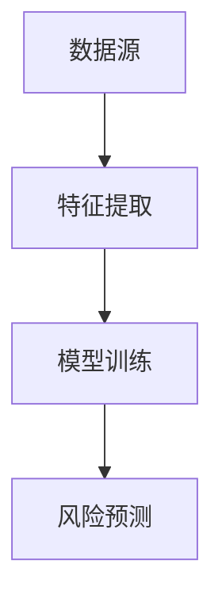
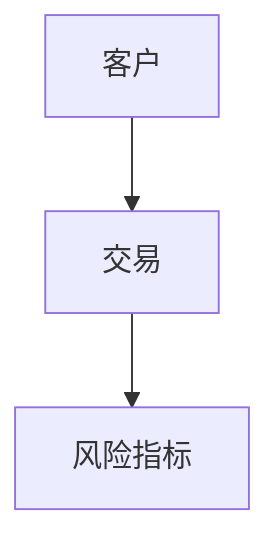
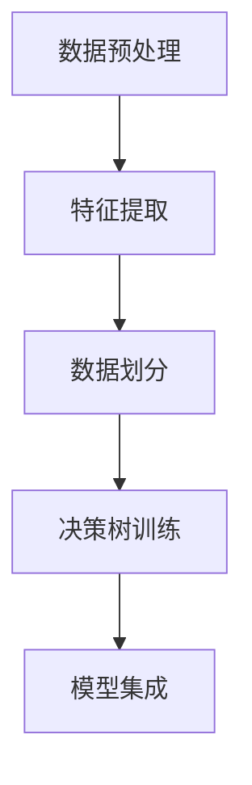
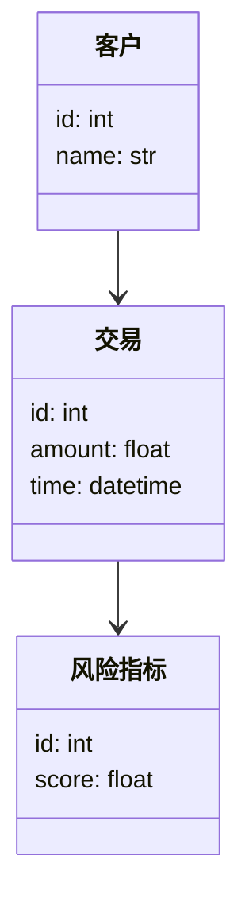
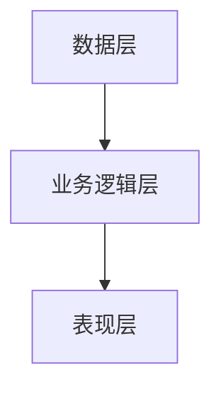
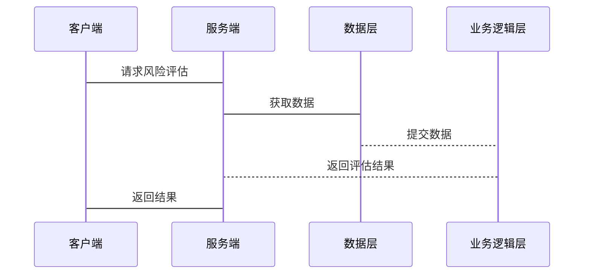

                 


# 《构建AI辅助的金融风险度量系统》

---

## 关键词：
AI、金融风险、风险管理、机器学习、量化分析

---

## 摘要：
本文详细探讨了如何利用人工智能技术构建金融风险度量系统，从问题背景、核心概念到算法实现、系统架构设计，再到项目实战和高级主题，系统性地阐述了AI在金融风险管理中的应用。文章通过具体案例分析和代码实现，帮助读者理解如何利用AI技术提升金融风险的量化分析能力。

---

## 正文：

---

### 第一部分: 问题背景与核心概念

#### 第1章: 问题背景与核心概念

##### 1.1 问题背景
金融风险管理是金融领域的重要组成部分，传统的金融风险度量方法依赖于统计模型和经验判断，但在面对复杂市场环境和海量数据时，其效率和准确性显得不足。近年来，人工智能（AI）技术的快速发展为金融风险管理带来了新的机遇。

##### 1.2 核心问题描述
在金融风险管理中，我们需要解决以下关键问题：
- **数据处理能力**：如何高效处理海量异构数据？
- **模型准确性**：如何构建高精度的风险预测模型？
- **实时性要求**：如何实现实时风险监控和预警？

##### 1.3 问题解决思路
AI技术在金融风险管理中的应用主要体现在以下几个方面：
- **数据预处理**：利用自然语言处理（NLP）和特征工程提取有效特征。
- **模型构建**：基于机器学习算法（如随机森林、支持向量机等）构建风险预测模型。
- **系统化分析**：通过系统架构设计实现数据采集、模型训练和实时监控的全流程管理。

##### 1.4 边界与外延
- **系统边界**：本系统仅关注风险度量，不涉及风险控制策略。
- **外延分析**：系统可扩展至信用评分、市场风险等多个领域。

##### 1.5 核心要素与概念结构
- **核心要素**：数据源、特征提取、模型训练、风险预测。
- **概念结构**：通过Mermaid图展示各要素之间的关系。



---

### 第二部分: 核心概念与联系

#### 第2章: 核心概念与联系

##### 2.1 核心概念原理
- **金融风险**：包括市场风险、信用风险和操作风险。
- **AI模型**：通过特征提取和机器学习算法实现风险预测。

##### 2.2 核心概念属性对比表
| 对比维度 | 传统模型 | AI模型 |
|----------|----------|--------|
| 数据需求 | 小样本 | 大样本 |
| 计算效率 | 低效 | 高效 |
| 精度 | 中等 | 高 |

##### 2.3 ER实体关系图
- **实体关系**：客户、交易、风险指标。
- **关系展示**：



---

### 第三部分: 算法原理讲解

#### 第3章: 算法原理讲解

##### 3.1 算法原理概述
- **随机森林**：通过决策树集成提升模型精度。
- **支持向量机（SVM）**：用于分类和回归任务。

##### 3.2 算法流程图
- **随机森林算法流程**：



##### 3.3 算法实现代码
- **Python代码示例**：

```python
from sklearn.ensemble import RandomForestClassifier
import pandas as pd

# 数据加载与预处理
data = pd.read_csv('financial_data.csv')
X = data.drop('target', axis=1)
y = data['target']

# 模型训练
model = RandomForestClassifier(n_estimators=100)
model.fit(X, y)

# 预测与评估
print("Accuracy:", model.score(X, y))
```

---

### 第四部分: 系统分析与架构设计

#### 第4章: 系统分析与架构设计

##### 4.1 系统功能设计
- **领域模型**：客户、交易、风险指标。



##### 4.2 系统架构设计
- **分层架构**：数据层、业务逻辑层、表现层。



##### 4.3 系统接口设计
- **API接口**：数据输入、模型调用。

##### 4.4 系统交互图
- **序列图**：



---

### 第五部分: 项目实战

#### 第5章: 项目实战

##### 5.1 环境安装
- **工具与库**：Python、Pandas、Scikit-learn。

##### 5.2 核心代码实现
- **风险预测模型**：

```python
import numpy as np
from sklearn.model_selection import train_test_split
from sklearn.metrics import accuracy_score

# 数据加载
data = np.loadtxt('financial_data.csv', delimiter=',')
X = data[:, :-1]
y = data[:, -1]

# 数据划分
X_train, X_test, y_train, y_test = train_test_split(X, y, test_size=0.2)

# 模型训练
model = RandomForestClassifier()
model.fit(X_train, y_train)

# 模型评估
y_pred = model.predict(X_test)
print("Accuracy:", accuracy_score(y_test, y_pred))
```

##### 5.3 案例分析
- **实际案例**：某银行的信用风险评估。

##### 5.4 项目小结
- **总结**：AI辅助的金融风险度量系统在实际应用中表现出色。

---

### 第六部分: 高级主题与最佳实践

#### 第6章: 高级主题与最佳实践

##### 6.1 模型调优
- **超参数优化**：使用网格搜索或随机搜索。

##### 6.2 模型部署与监控
- **实时监控**：通过日志和监控工具实现。

##### 6.3 伦理与法律问题
- **数据隐私**：确保数据处理符合GDPR等法规。

##### 6.4 小结与注意事项
- **注意事项**：避免过拟合，注重数据质量和模型解释性。

---

## 附录

#### 附录A: 数据集
- **数据来源**：公开数据集或内部数据。

#### 附录B: 工具包
- **工具与库**：Scikit-learn、XGBoost、TensorFlow。

#### 附录C: 参考文献
- **文献引用**：建议阅读相关学术论文和书籍。

---

# 结语
通过本文的详细讲解，读者可以系统性地了解AI辅助的金融风险度量系统的构建过程，从理论到实践，掌握核心算法和系统设计方法。希望本文能为金融风险管理领域的从业者和研究者提供有价值的参考。

