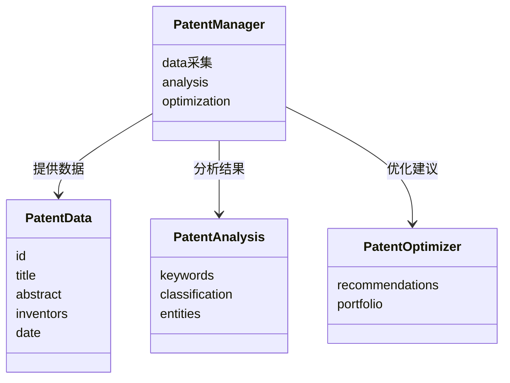
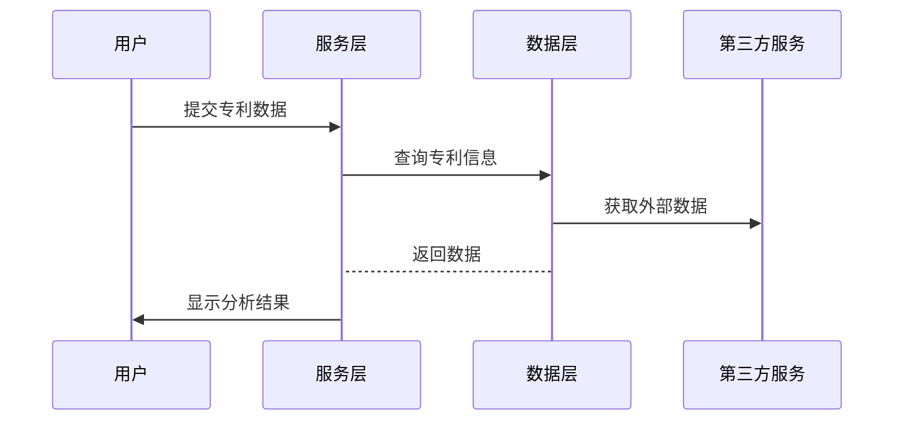

                 


# 构建AI驱动的企业专利组合管理系统

## 关键词：
- AI驱动
- 企业专利组合
- 知识图谱
- 自然语言处理
- 机器学习

## 摘要：
本文详细探讨了如何利用AI技术构建企业专利组合管理系统，通过自然语言处理和机器学习等技术实现专利数据的智能化管理。文章从背景介绍、核心概念、算法原理、系统架构到项目实战，全面解析了AI驱动专利组合管理的实现过程，为企业的知识产权管理提供了新的思路。

---

## 第一部分: 背景介绍

### 第1章: 问题背景与企业专利管理的重要性

#### 1.1 问题背景
- 1.1.1 传统专利管理的痛点：人工处理效率低、数据分散、难以量化评估
- 1.1.2 企业专利管理的重要性：保护知识产权、提升竞争力、支撑企业战略
- 1.1.3 AI驱动专利管理的必要性：数据爆炸、技术复杂度高、需要智能化工具

#### 1.2 企业专利组合管理的核心目标
- 1.2.1 专利组合的定义与特点：覆盖范围广、技术领域多样、法律状态复杂
- 1.2.2 专利组合管理的关键维度：技术布局、法律状态、经济价值
- 1.2.3 AI在专利组合管理中的价值：自动化处理、智能分析、决策支持

### 第2章: AI驱动专利组合管理的变革

#### 2.1 AI技术对企业专利管理的影响
- 2.1.1 自然语言处理在专利文本分析中的应用：文本抽取、语义理解、实体识别
- 2.1.2 机器学习在专利分类与检索中的作用：模式识别、分类器构建、相似度计算
- 2.1.3 深度学习在专利价值评估中的潜力：复杂模型、非线性关系、多维度特征

#### 2.2 专利组合管理的新范式
- 2.2.1 数据驱动的专利组合优化：基于数据分析的动态调整
- 2.2.2 AI辅助的专利布局策略：智能化建议、风险预测
- 2.2.3 智能化的专利风险预警系统：实时监控、风险评估、预警提示

---

## 第二部分: 核心概念与联系

### 第3章: 核心概念与原理

#### 3.1 核心概念
- 3.1.1 专利组合管理的定义与属性：系统性、动态性、目的性
- 3.1.2 AI驱动的专利组合管理框架：数据采集、分析、优化、反馈
- 3.1.3 系统的核心要素与组成：数据源、分析模块、优化模块、用户界面

#### 3.2 核心概念的对比分析
- 3.2.1 传统专利管理 vs AI驱动专利管理：效率、准确度、成本对比
- 3.2.2 不同AI技术在专利管理中的应用对比：NLP、ML、DL的优缺点
- 3.2.3 专利组合管理与企业战略目标的关联：战略支持、资源分配、风险控制

### 第4章: 系统架构与功能模块

#### 4.1 系统架构设计
- 4.1.1 系统整体架构图：模块化设计，数据流展示
- 4.1.2 各功能模块的交互关系：协同工作流程
- 4.1.3 系统的核心数据流：数据输入、处理、输出

#### 4.2 功能模块分析
- 4.2.1 专利数据采集模块：数据源整合、数据清洗
- 4.2.2 专利文本分析模块：关键词提取、分类、实体识别
- 4.2.3 专利组合优化模块：算法实现、优化策略
- 4.2.4 专利风险预警模块：实时监控、风险评估

---

## 第三部分: 算法原理与实现

### 第5章: 自然语言处理在专利文本分析中的应用

#### 5.1 算法原理
- 5.1.1 基于BERT的专利文本表示方法：预训练模型的应用
- 5.1.2 文本相似度计算的算法流程：余弦相似度、聚类分析
- 5.1.3 专利分类的机器学习模型：监督学习、特征工程

#### 5.2 算法实现
- 5.2.1 使用Python实现的专利文本预处理代码：文本清洗、分词
- 5.2.2 基于TF-IDF的关键词提取代码：特征向量计算
- 5.2.3 基于BERT的专利分类代码：模型训练、预测

### 第6章: 机器学习在专利组合优化中的应用

#### 6.1 算法原理
- 6.1.1 专利组合优化的数学模型：线性规划、目标函数
- 6.1.2 基于遗传算法的组合优化方法：种群进化、交叉变异
- 6.1.3 基于深度学习的强化学习模型：状态空间、动作策略

#### 6.2 算法实现
- 6.2.1 使用Python实现的遗传算法代码：种群初始化、适应度计算
- 6.2.2 基于深度学习的强化学习代码：神经网络构建、训练过程
- 6.2.3 算法优化与调参：超参数选择、性能评估

---

## 第四部分: 系统分析与架构设计

### 第7章: 问题场景介绍

#### 7.1 问题场景
- 专利数据分散、管理复杂
- 专利分析需要大量人工干预
- 缺乏智能化的专利组合优化工具

### 第8章: 项目介绍

#### 8.1 项目介绍
- 项目目标：构建AI驱动的专利组合管理系统
- 项目范围：企业内部专利管理、外部专利情报分析
- 项目约束：数据隐私、处理效率、系统稳定性

### 第9章: 系统功能设计

#### 9.1 领域模型mermaid类图


### 第10章: 系统架构设计

#### 10.1 系统架构mermaid架构图


### 第11章: 系统接口设计

#### 11.1 接口设计
- API接口定义：RESTful API
- 接口功能：数据采集、分析请求、优化建议
- 接口安全：认证、授权、加密

### 第12章: 系统交互设计

#### 12.1 系统交互mermaid序列图


---

## 第五部分: 项目实战

### 第13章: 环境安装

#### 13.1 环境安装
- 安装Python：3.8+
- 安装依赖：pandas、numpy、transformers、scikit-learn
- 安装工具：Jupyter Notebook、IDE

### 第14章: 核心实现

#### 14.1 核心代码实现
```python
from transformers import BertTokenizer, BertModel
import torch

# 初始化BERT模型和tokenizer
tokenizer = BertTokenizer.from_pretrained('bert-base-uncased')
model = BertModel.from_pretrained('bert-base-uncased')

# 定义文本处理函数
def process_text(text):
    inputs = tokenizer(text, return_tensors='pt', padding=True, truncation=True)
    outputs = model(**inputs)
    return outputs.last_hidden_state.squeeze()

# 示例文本分析
text = "一种基于AI的专利管理系统"
vector = process_text(text)
print(vector)
```

### 第15章: 案例分析

#### 15.1 案例分析
- 某科技公司专利组合优化：通过AI分析优化专利布局，降低风险
- 某企业的专利风险预警：实时监控竞争对手专利动态

### 第16章: 项目小结

#### 16.1 项目小结
- 项目目标达成情况：系统功能实现、性能评估
- 项目经验总结：技术选型、团队协作、项目管理
- 项目改进建议：优化算法、扩展功能、提升用户体验

---

## 第六部分: 最佳实践与总结

### 第17章: 最佳实践 tips

#### 17.1 小结
- AI驱动专利管理的优势：效率提升、决策支持
- 系统设计的关键点：模块化设计、数据安全、用户体验

#### 17.2 注意事项
- 数据隐私保护：合规性、安全性
- 系统可扩展性：模块化设计、接口标准化
- 持续优化：算法迭代、功能扩展

### 第18章: 拓展阅读

#### 18.1 拓展阅读
- 推荐书籍：《专利管理与战略》、《人工智能技术》
- 推荐论文：NLP与专利分析、机器学习在专利组合管理中的应用
- 推荐工具：Python机器学习库、NLP处理工具

---

## 总结
通过构建AI驱动的企业专利组合管理系统，企业可以显著提升专利管理效率，优化专利布局，降低风险，增强竞争力。本文详细介绍了系统构建的各个方面，为企业的专利管理提供了切实可行的解决方案。

