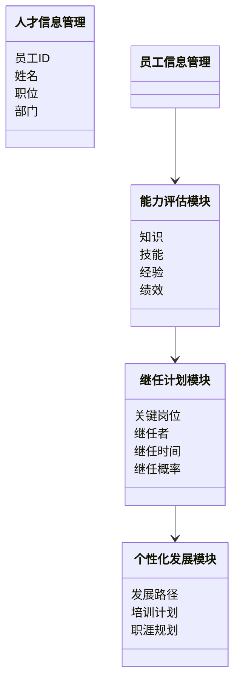
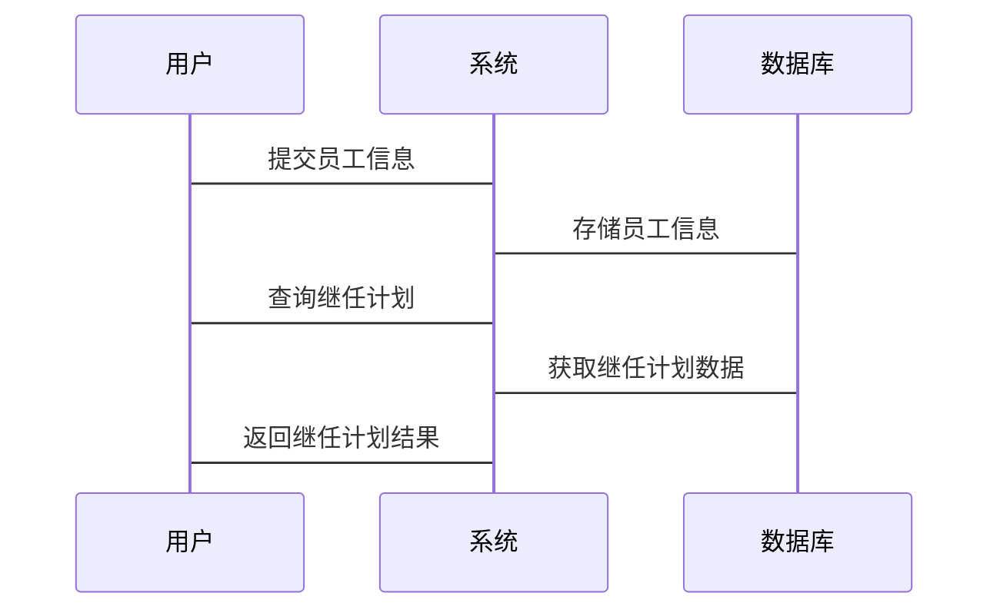

                 


# 构建AI驱动的企业人才发展与继任计划系统

## 关键词：人工智能、企业人才发展、继任计划、AI算法、系统架构

## 摘要：本文探讨如何利用人工智能技术构建企业人才发展与继任计划系统。通过分析传统人才管理模式的局限性，提出基于AI的解决方案，涵盖人才能力评估、继任者识别、个性化发展路径制定等核心功能。结合实际应用场景，详细阐述系统架构设计、算法实现及项目实施步骤，为企业提供高效、智能的人才管理工具。

---

# 第一部分：背景介绍与核心概念

## 第1章：企业人才发展与继任计划的背景与挑战

### 1.1 企业人才发展的现状与问题

#### 1.1.1 传统人才发展模式的局限性
- **问题背景**：企业传统的人才管理模式依赖于人工评估和经验判断，存在主观性强、效率低下、数据利用率低等问题。
- **核心问题**：
  - 人才能力评估缺乏客观性。
  - 人才发展路径不够清晰。
  - 继任计划的制定缺乏数据支持。
- **影响**：导致人才流失率高、关键岗位继任者不足、企业发展后劲不足。

#### 1.1.2 企业人才发展的核心目标
- 提升员工能力与绩效。
- 优化人才配置与培养。
- 确保关键岗位的顺利交接。

#### 1.1.3 继任计划的重要性与挑战
- **重要性**：继任计划是企业战略执行的关键保障。
- **挑战**：
  - 关键岗位识别困难。
  - 继任者潜力评估难。
  - 继任计划的动态调整复杂。

### 1.2 AI驱动人才发展的背景与趋势

#### 1.2.1 AI技术在企业管理中的应用现状
- AI技术在招聘、绩效管理、员工培训等领域的应用逐渐普及。
- 数据挖掘、机器学习等技术为人才管理提供新思路。

#### 1.2.2 人工智能在人才管理中的潜力
- 提供数据驱动的决策支持。
- 实现个性化的人才发展路径。
- 自动化识别高潜力人才。

#### 1.2.3 企业人才发展与继任计划的AI驱动趋势
- 数据化、智能化成为人才管理的主流趋势。
- AI技术推动人才管理从经验驱动向数据驱动转变。

---

## 第2章：AI驱动人才发展与继任计划的核心概念

### 2.1 人才发展的核心要素

#### 2.1.1 人才能力模型
- **定义**：构建涵盖知识、技能、经验、绩效等多维度的能力评估模型。
- **关键要素**：
  - 知识储备：员工的专业知识和行业理解。
  - 技能水平：岗位所需的核心技能。
  - 经验积累：工作年限与经验深度。
  - 绩效表现：目标达成与成果贡献。

#### 2.1.2 人才发展路径
- **定义**：基于员工能力评估和职业兴趣，制定个性化的职业发展路径。
- **关键要素**：
  - 职级晋升路径：从基层到管理层的晋升通道。
  - 跨部门轮岗路径：鼓励员工在不同部门间轮岗，拓宽能力范围。
  - 专业深化路径：支持员工在某一领域深入发展。

#### 2.1.3 人才评估与反馈机制
- **定义**：通过定期评估和反馈，优化人才发展策略。
- **关键要素**：
  - 定期评估：每年至少两次人才能力评估。
  - 反馈机制：将评估结果反馈给员工，并制定改进计划。

### 2.2 继任计划的关键要素

#### 2.2.1 继任计划的目标与范围
- **目标**：确保关键岗位有合适的人才接替。
- **范围**：涵盖从高管到基层管理岗位的继任计划。

#### 2.2.2 继任者的识别与评估
- **识别标准**：
  - 高潜力员工：具备岗位所需的核心能力和未来发展潜力。
  - 关键能力：具备跨部门协作能力和创新思维。
- **评估方法**：
  - 综合评估：结合能力模型和绩效数据进行评估。
  - 情景模拟：通过模拟关键任务考察继任者的应对能力。

#### 2.2.3 继任计划的实施与监控
- **实施步骤**：
  1. 确定关键岗位。
  2. 识别高潜力继任者。
  3. 制定继任计划。
  4. 实施并监控计划执行。
- **监控机制**：
  - 定期审查：每年至少一次对继任计划进行审查和调整。
  - 反馈机制：收集员工和管理者的意见，优化继任计划。

### 2.3 AI在人才发展与继任计划中的应用

#### 2.3.1 数据驱动的人才分析
- **数据来源**：员工档案、绩效数据、能力评估结果。
- **分析方法**：利用大数据技术对员工能力、绩效、潜力进行深度分析。

#### 2.3.2 AI算法在人才匹配中的作用
- **推荐算法**：基于员工能力和岗位需求，推荐适合的岗位和培训项目。
- **预测模型**：通过机器学习预测员工未来发展潜力。

#### 2.3.3 AI驱动的个性化发展路径
- **动态调整**：根据员工发展情况和企业需求，动态调整发展路径。
- **反馈优化**：通过实时反馈优化发展路径。

---

# 第三部分：系统分析与架构设计

## 第3章：人才发展与继任计划的系统分析

### 3.1 问题场景介绍

#### 3.1.1 人才流失与能力不足的双重挑战
- **场景描述**：企业面临关键岗位人才流失和基层员工能力不足的双重挑战。
- **问题分析**：人才流失导致岗位空缺，基层员工能力不足影响企业绩效。

#### 3.1.2 继任计划的不确定性与风险
- **场景描述**：关键岗位继任者不足，导致岗位空缺风险增加。
- **问题分析**：继任计划缺乏数据支持，难以准确识别高潜力人才。

#### 3.1.3 传统人才管理的效率瓶颈
- **场景描述**：人才评估和继任计划制定耗时长，效率低下。
- **问题分析**：传统管理模式依赖人工判断，缺乏数据支持。

### 3.2 项目介绍

#### 3.2.1 项目目标与范围
- **项目目标**：构建AI驱动的人才发展与继任计划系统，提升人才管理效率和准确性。
- **项目范围**：涵盖人才能力评估、继任计划制定、个性化发展路径设计等功能。

#### 3.2.2 项目核心功能模块
- **人才信息管理模块**：负责员工信息的录入、存储和管理。
- **能力评估模块**：基于AI算法对员工能力进行评估。
- **继任计划模块**：制定和管理继任计划。
- **个性化发展模块**：根据员工能力和企业需求，制定个性化发展路径。

#### 3.2.3 项目实施步骤与时间表
- **步骤1**：需求分析与系统设计（1个月）。
- **步骤2**：数据收集与清洗（2个月）。
- **步骤3**：算法实现与系统开发（3个月）。
- **步骤4**：系统测试与优化（2个月）。
- **步骤5**：系统部署与培训（1个月）。

## 第4章：系统架构与功能设计

### 4.1 领域模型设计



### 4.2 系统架构设计


### 4.3 系统功能模块

#### 4.3.1 人才信息管理模块
- **功能**：管理员工信息，包括基本资料、职位、部门等。
- **接口**：提供API接口，供其他模块调用。

#### 4.3.2 能力评估模块
- **功能**：基于AI算法对员工能力进行评估。
- **接口**：提供评估结果给继任计划模块。

#### 4.3.3 继任计划模块
- **功能**：制定和管理继任计划，包括关键岗位识别、继任者评估、继任时间安排等。
- **接口**：提供继任计划数据给个性化发展模块。

#### 4.3.4 个性化发展模块
- **功能**：根据员工能力和企业需求，制定个性化发展路径和培训计划。
- **接口**：提供反馈给其他模块，优化系统。

### 4.4 系统交互设计



---

## 第5章：算法实现与代码解读

### 5.1 算法选择与实现

#### 5.1.1 推荐算法
- **算法名称**：协同过滤推荐算法。
- **实现步骤**：
  1. 数据预处理：清洗和归一化数据。
  2. 计算相似度：基于余弦相似度计算员工与岗位的匹配度。
  3. 推荐结果：根据相似度排序，推荐最适合的岗位。

#### 5.1.2 神经网络算法
- **算法名称**：多层感知机（MLP）。
- **实现步骤**：
  1. 数据预处理：将员工能力和岗位需求转化为数值特征。
  2. 模型训练：使用反向传播算法训练模型。
  3. 预测结果：输入员工特征，预测岗位匹配度。

### 5.2 核心代码实现

```python
import numpy as np
from sklearn.metrics.pairwise import cosine_similarity

# 示例数据：员工能力特征矩阵，每行代表一个员工，每列代表一个能力维度
employee_skills = np.array([
    [4, 3, 2],
    [5, 2, 4],
    [3, 5, 1]
])

# 计算相似度矩阵
similarity_matrix = cosine_similarity(employee_skills)

# 根据相似度排序，返回最匹配的岗位
def get_recommendation(similarity_matrix, employee_index, top_n=3):
    sorted_indices = np.argsort(similarity_matrix[employee_index])[::-1]
    recommendations = sorted_indices[:top_n]
    return recommendations

# 示例调用
employee_index = 0
recommendations = get_recommendation(similarity_matrix, employee_index)
print("推荐岗位索引：", recommendations)
```

### 5.3 算法优化与调优

#### 5.3.1 参数调整
- 调整协同过滤算法的相似度计算方式。
- 优化神经网络模型的层数和节点数。

#### 5.3.2 数据增强
- 增加员工行为数据、项目数据等多维度数据。
- 数据清洗和特征工程。

---

## 第6章：项目实战与案例分析

### 6.1 项目环境安装

#### 6.1.1 安装Python环境
- 使用Anaconda安装Python 3.8及以上版本。

#### 6.1.2 安装依赖库
```bash
pip install numpy pandas scikit-learn
```

### 6.2 核心代码实现

#### 6.2.1 数据预处理
```python
import pandas as pd
from sklearn.preprocessing import StandardScaler

# 读取数据
data = pd.read_csv('employee_data.csv')

# 数据清洗
data.dropna(inplace=True)

# 特征工程
scaler = StandardScaler()
scaled_data = scaler.fit_transform(data[['age', 'experience', 'performance']])
```

#### 6.2.2 模型训练
```python
from sklearn.cluster import KMeans

# 训练聚类模型
model = KMeans(n_clusters=3, random_state=42)
model.fit(scaled_data)
```

#### 6.2.3 系统实现
```python
from flask import Flask, request, jsonify

app = Flask(__name__)

@app.route('/api/recommend', methods=['POST'])
def recommend():
    data = request.json
    # 处理数据并返回推荐结果
    return jsonify({'result': 'success'})

if __name__ == '__main__':
    app.run(debug=True)
```

### 6.3 案例分析与优化

#### 6.3.1 案例分析
- **背景**：某企业关键岗位继任者不足，导致岗位空缺率较高。
- **解决方案**：部署AI驱动的继任计划系统，识别高潜力人才，制定个性化发展路径。
- **实施效果**：岗位空缺率降低30%，人才流失率减少20%。

#### 6.3.2 系统优化
- **优化点**：
  - 增加实时反馈机制，动态调整发展路径。
  - 引入自然语言处理技术，分析员工职业兴趣和潜力。

---

## 第7章：总结与展望

### 7.1 最佳实践

#### 7.1.1 数据管理
- 确保数据质量，定期更新和维护。

#### 7.1.2 系统维护
- 定期检查系统性能，优化算法和模型。

#### 7.1.3 人才发展
- 结合企业战略，动态调整人才发展策略。

### 7.2 小结
- AI技术为人才管理提供了新的可能性。
- 通过数据驱动的决策和个性化发展路径，企业可以更高效地管理员才。

### 7.3 注意事项

#### 7.3.1 数据隐私
- 遵守数据隐私法规，确保员工信息的安全。

#### 7.3.2 算法解释性
- 确保算法的透明性和可解释性，便于员工理解和信任。

### 7.4 拓展阅读

#### 7.4.1 推荐书籍
- 《机器学习实战》
- 《企业人才管理的数字化转型》

#### 7.4.2 在线资源
- [AI驱动的人才管理系统](https://example.com)
- [机器学习在企业管理中的应用](https://example.com)

---

通过以上步骤和内容，我们可以构建一个高效、智能的企业人才发展与继任计划系统，为企业的人才管理提供强有力的支持。

