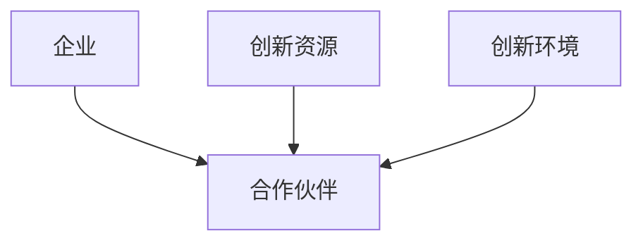
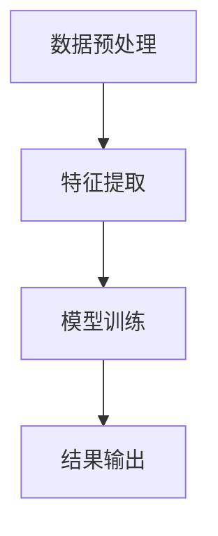
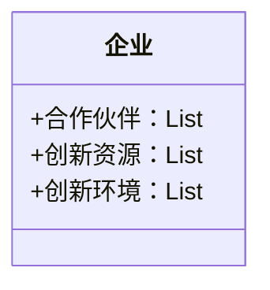
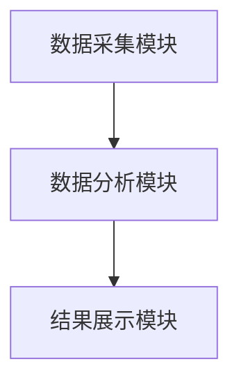
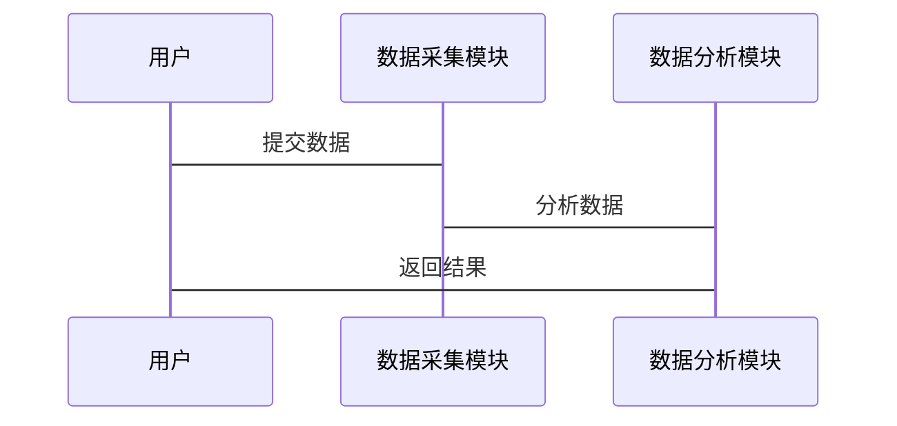

                 


# 构建AI驱动的企业创新生态系统分析平台

> 关键词：AI、企业创新、生态系统分析、数据挖掘、机器学习、系统架构

> 摘要：本文详细探讨了如何利用人工智能技术构建企业创新生态系统分析平台。通过分析核心概念、算法原理、系统架构及项目实战，本文为企业提供了一套完整的解决方案，帮助其在数字化转型中实现创新突破。

---

## 第一章: AI驱动的企业创新生态系统概述

### 1.1 问题背景与目标
#### 1.1.1 企业创新生态系统的核心问题
企业创新生态系统是指由企业与其合作伙伴、供应商、客户等组成的协同创新网络。然而，传统的企业创新模式存在以下问题：
- 数据分散，难以整合和分析
- 创新资源浪费，协同效率低下
- 创新方向不清，难以快速响应市场变化

#### 1.1.2 AI技术在企业创新中的应用目标
通过AI技术，企业可以实现：
- 数据的自动采集、分析与预测
- 创新资源的智能匹配与协同
- 创新路径的优化与推荐

#### 1.1.3 平台构建的必要性与价值
构建AI驱动的分析平台，可以：
- 提高企业创新效率
- 降低创新成本
- 增强企业的市场竞争力

### 1.2 核心概念与边界
#### 1.2.1 企业创新生态系统的核心要素
企业创新生态系统由以下要素组成：
- 企业主体：包括企业内部员工、管理层等
- 合作伙伴：包括供应商、客户、合作伙伴等
- 创新资源：包括技术、资金、人才等
- 创新环境：包括政策、市场、文化等

#### 1.2.2 AI驱动的分析平台的边界与外延
- 边界：平台专注于数据分析与预测，不涉及企业的实际运营
- 外延：平台可以与其他企业系统（如CRM、ERP）集成

#### 1.2.3 平台与企业创新生态的关系
平台是企业创新生态系统的核心工具，通过数据驱动的方式，优化企业的创新过程。

### 1.3 系统结构与功能
#### 1.3.1 平台的整体架构
平台由数据采集模块、数据分析模块、结果展示模块组成。

#### 1.3.2 核心功能模块
- 数据采集：从企业内外部数据源获取数据
- 数据分析：利用AI算法对数据进行分析与预测
- 结果展示：以可视化的方式呈现分析结果

#### 1.3.3 系统的输入与输出
- 输入：企业内外部数据
- 输出：创新方向、协同策略、风险预警

### 1.4 本章小结
本章介绍了企业创新生态系统的核心问题、AI技术的应用目标，以及平台的构建价值。同时，明确了平台的核心概念与边界，为后续章节的分析奠定了基础。

---

## 第二章: AI驱动的企业创新生态系统核心概念分析

### 2.1 企业创新生态系统的核心概念
#### 2.1.1 创新生态系统的定义
创新生态系统是一个由多方参与者共同参与、协同创新的网络。

#### 2.1.2 AI驱动的分析平台的核心属性
- 数据驱动：基于海量数据进行分析与预测
- 智能化：利用AI技术实现自动化分析
- 可扩展性：支持不同规模的企业

#### 2.1.3 系统模型的构建与分析
通过构建系统模型，可以更好地理解企业创新生态系统的运行机制。

### 2.2 核心概念的对比分析
#### 2.2.1 不同创新模式的对比
- 传统创新模式：依赖企业内部资源，创新效率低
- 开放式创新模式：借助外部资源，创新效率高

#### 2.2.2 AI驱动与传统分析方法的对比
- 传统分析方法：依赖人工经验，分析效率低
- AI驱动方法：自动化、智能化，分析效率高

#### 2.2.3 平台功能的对比分析
- 功能对比：传统平台 vs AI驱动平台
- 性能对比：数据处理能力、分析精度等

### 2.3 实体关系与系统模型
#### 2.3.1 实体关系图（ER图）
以下是企业创新生态系统的核心实体关系图：



#### 2.3.2 系统模型的构建
通过系统模型，可以清晰地展示各模块之间的关系。

#### 2.3.3 系统模型的验证与优化
通过实际数据验证系统模型的准确性，并进行优化。

### 2.4 本章小结
本章通过对比分析，明确了AI驱动的分析平台在企业创新生态系统中的优势，并通过实体关系图展示了系统的构建过程。

---

## 第三章: AI驱动的企业创新生态系统分析算法原理

### 3.1 算法概述
#### 3.1.1 算法的核心思想
利用机器学习算法对数据进行分析与预测。

#### 3.1.2 算法的输入与输出
- 输入：企业内外部数据
- 输出：创新方向、协同策略、风险预警

#### 3.1.3 算法的适用场景
适用于企业创新方向预测、合作伙伴选择等场景。

### 3.2 算法实现步骤
#### 3.2.1 数据预处理
- 数据清洗：去除重复数据、处理缺失值
- 数据标准化：将数据标准化到统一范围

#### 3.2.2 特征提取与选择
- 特征提取：从数据中提取关键特征
- 特征选择：选择对目标变量影响最大的特征

#### 3.2.3 模型训练
- 选择合适的算法（如随机森林、支持向量机等）
- 对模型进行训练并评估性能

### 3.3 算法流程图
以下是算法实现的流程图：



### 3.4 数学公式
以下是算法中常用的数学公式：

$$
y = \sum_{i=1}^{n} w_i x_i + b
$$

其中，$y$ 是输出，$w_i$ 是权重，$x_i$ 是输入，$b$ 是偏置。

### 3.5 本章小结
本章详细讲解了AI驱动的分析算法，包括实现步骤、流程图及数学公式，为后续的系统设计奠定了基础。

---

## 第四章: AI驱动的企业创新生态系统分析算法实现

### 4.1 问题场景介绍
企业需要通过分析合作伙伴数据，优化创新策略。

### 4.2 项目介绍
构建一个AI驱动的企业创新生态系统分析平台。

### 4.3 系统功能设计
#### 4.3.1 领域模型
以下是领域模型的类图：



#### 4.3.2 系统架构设计
以下是系统架构图：



#### 4.3.3 系统接口设计
系统接口包括数据接口、分析接口和展示接口。

#### 4.3.4 系统交互设计
以下是系统交互序列图：



### 4.4 本章小结
本章通过系统设计，明确了平台的功能模块及交互流程。

---

## 第五章: AI驱动的企业创新生态系统分析算法实现

### 5.1 环境安装
需要安装Python、TensorFlow、Pandas等工具。

### 5.2 核心代码实现
以下是核心代码：

```python
import pandas as pd
import numpy as np
from sklearn import model_selection
from sklearn.linear_model import LinearRegression

# 数据预处理
data = pd.read_csv('data.csv')
X = data.drop('target', axis=1)
y = data['target']

# 特征选择
feature_importance = pd.Series(X.corrwith(y)).sort_values(ascending=False)
selected_features = feature_importance[feature_importance > 0.5].index

# 模型训练
X_train, X_test, y_train, y_test = model_selection.train_test_split(X[selected_features], y, test_size=0.2)
model = LinearRegression()
model.fit(X_train, y_train)
```

### 5.3 代码解读
代码实现了数据预处理、特征选择和模型训练。

### 5.4 案例分析
以合作伙伴选择为例，通过模型预测最佳合作伙伴。

### 5.5 项目小结
本章通过代码实现，展示了AI驱动的分析平台的实际应用。

---

## 第六章: 总结与展望

### 6.1 总结
本文详细介绍了AI驱动的企业创新生态系统分析平台的构建过程，包括核心概念、算法原理、系统设计及项目实战。

### 6.2 最佳实践
- 数据质量是关键
- 模型选择要根据实际场景
- 系统设计要注重可扩展性

### 6.3 未来展望
未来，可以通过引入更多数据源，优化算法，提升平台的分析能力。

---

以上是《构建AI驱动的企业创新生态系统分析平台》的完整目录大纲和内容概要，后续可以按照上述结构进行详细写作。

