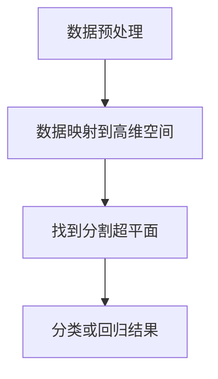
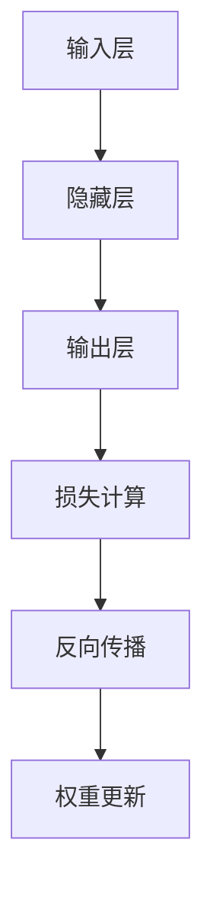
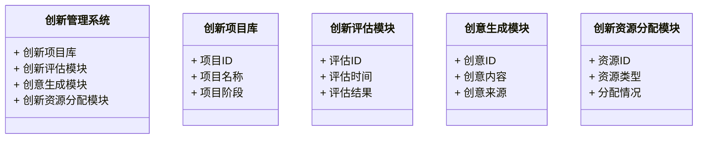
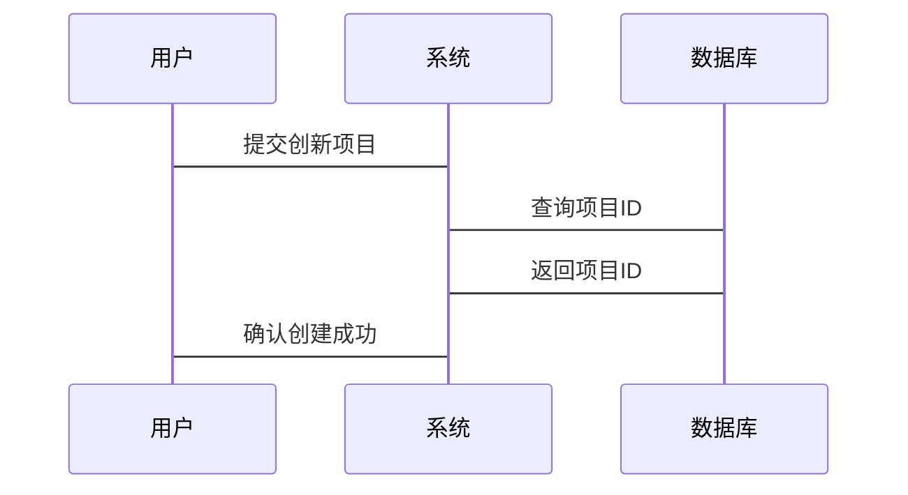

                 


# 构建AI驱动的企业创新管理系统

## 关键词：AI驱动、企业创新管理、系统构建、算法原理、系统架构、项目实战

## 摘要：本文将详细探讨如何利用人工智能技术构建企业创新管理系统。从背景介绍到核心概念，再到算法原理和系统架构，结合项目实战和最佳实践，全面解析AI驱动的企业创新管理系统的构建过程，帮助企业在数字化转型中实现高效创新。

---

# 第一部分: 背景介绍与核心概念

## 第1章: 企业创新管理的现状与挑战

### 1.1 企业创新管理的背景介绍

#### 1.1.1 传统企业创新管理模式的局限性

传统的企业创新管理模式主要依赖于人工经验判断和流程化操作，存在以下问题：

- **资源分配不均**：无法精准识别高潜力项目，导致资源浪费。
- **信息孤岛**：各部门间数据不共享，难以形成完整的创新链条。
- **决策滞后**：依赖人工分析，导致创新决策速度慢，错失市场机会。

#### 1.1.2 当前企业创新管理的核心问题

随着市场竞争加剧，企业创新管理面临以下挑战：

- **创新效率低下**：传统模式难以快速响应市场变化。
- **数据利用不足**：企业积累大量数据，但未能有效利用。
- **创新过程复杂**：从创意产生到商业化涉及多个环节，管理难度大。

#### 1.1.3 AI技术对企业创新管理的潜在价值

AI技术能够通过数据挖掘、机器学习等方法，解决传统模式的痛点：

- **精准识别潜力项目**：利用算法筛选高价值创新项目。
- **优化资源配置**：智能分配资源，提高创新效率。
- **实时数据分析**：快速捕捉市场趋势，辅助决策。

### 1.2 企业创新管理中的问题背景

#### 1.2.1 企业创新资源分配的不均衡性

企业资源有限，如何合理分配成为关键。AI通过分析历史数据，预测项目成功概率，优化资源配置。

#### 1.2.2 企业创新过程中的信息孤岛问题

各部门数据分散，难以形成统一的创新链条。AI驱动的管理系统通过数据整合，消除孤岛，实现信息共享。

#### 1.2.3 企业创新决策的不确定性与风险

创新决策涉及不确定因素，AI通过概率分析和风险评估，辅助决策者降低风险。

### 1.3 AI驱动企业创新管理的必要性

#### 1.3.1 AI技术在企业创新管理中的应用前景

AI技术能够提升创新管理的智能化水平，推动企业更快、更准地创新。

#### 1.3.2 AI驱动企业创新管理的核心优势

- **数据驱动决策**：基于大量数据，提供科学依据。
- **自适应性**：系统能够根据反馈调整策略。
- **智能优化**：持续改进创新流程，提高效率。

#### 1.3.3 企业创新管理AI化的未来趋势

AI将深度融合企业创新管理，成为企业创新的核心驱动力。

## 第2章: AI驱动企业创新管理的核心概念

### 2.1 AI驱动企业创新管理的定义与特点

#### 2.1.1 核心概念的定义

AI驱动的企业创新管理是利用AI技术，从数据中提取洞察，优化创新流程。

#### 2.1.2 与传统企业创新管理的区别

| 特性 | 传统模式 | AI驱动模式 |
|------|----------|------------|
| 数据来源 | 依赖经验 | 数据驱动 |
| 流程 | 固定 | 自适应 |
| 决策 | 人工判断 | 智能辅助 |

#### 2.1.3 AI驱动模式的独特优势

- **精准预测**：利用机器学习预测项目成功概率。
- **实时反馈**：快速响应市场变化，调整策略。
- **持续优化**：通过反馈不断改进系统。

### 2.2 ER实体关系图架构

```mermaid
er
    %% 
    entity 创新项目 {
        key 创新ID (int)
        创新名称 (string)
        创新阶段 (int)
        关联员工 (many-to-many 员工)
        关联部门 (many-to-many 部门)
    }
    
    entity 员工 {
        key 员工ID (int)
        员工姓名 (string)
        职位 (string)
        所属部门 (many-to-one 部门)
    }
    
    entity 部门 {
        key 部门ID (int)
        部门名称 (string)
        部门类型 (string)
    }
    
    entity 创新评估 {
        key 评估ID (int)
        评估时间 (datetime)
        评估分数 (float)
        关联创新项目 (many-to-one 创新项目)
    }
```

---

# 第二部分: 算法原理

## 第3章: 支持向量机（SVM）算法原理

### 3.1 支持向量机的基本原理

支持向量机是一种监督学习算法，用于分类和回归问题。其核心思想是将数据映射到高维空间，找到最优分割超平面。

#### 3.1.1 算法流程



#### 3.1.2 支持向量机的数学模型

最大化间隔：
$$ \text{maximize} \quad \frac{1}{2}||\mathbf{w}||^2 $$
满足约束：
$$ y_i(\mathbf{w} \cdot \mathbf{x}_i + b) \geq 1, \quad i=1,2,\dots,n $$
对偶问题：
$$ \text{minimize} \quad \frac{1}{2}||\mathbf{w}||^2 - \sum_{i=1}^{n} \alpha_i (y_i (\mathbf{w} \cdot \mathbf{x}_i + b) - 1) $$

#### 3.1.3 Python实现示例

```python
from sklearn import svm

# 创建数据集
X = [[0, 0], [1, 1], [2, 2], [3, 3], [4, 4], [5, 5]]
y = [0, 0, 0, 1, 1, 1]

# 创建SVM模型并训练
model = svm.SVC()
model.fit(X, y)

# 预测
print(model.predict([[2.5, 2.5]]))
```

---

## 第4章: 神经网络算法原理

### 4.1 神经网络的基本原理

神经网络模拟人脑神经网络，通过多层处理实现复杂模式识别。

#### 4.1.1 网络结构

- **输入层**：接收输入数据。
- **隐藏层**：进行特征提取。
- **输出层**：生成结果。

#### 4.1.2 前向传播与反向传播



#### 4.1.3 神经网络的数学模型

损失函数：
$$ L = \frac{1}{n} \sum_{i=1}^{n} (y_i - \hat{y}_i)^2 $$
权重更新：
$$ \Delta w = -\eta \frac{\partial L}{\partial w} $$

#### 4.1.4 Python实现示例

```python
import tensorflow as tf

# 创建神经网络模型
model = tf.keras.Sequential([
    tf.keras.layers.Dense(64, activation='relu'),
    tf.keras.layers.Dense(10, activation='softmax')
])

# 编译模型
model.compile(optimizer='adam', loss='sparse_categorical_crossentropy', metrics=['accuracy'])

# 训练模型
model.fit(x_train, y_train, epochs=10, batch_size=32)
```

---

# 第三部分: 系统架构

## 第5章: 系统架构设计

### 5.1 问题场景介绍

构建一个AI驱动的企业创新管理系统，实现从创意产生到商业化落地的全生命周期管理。

### 5.2 系统功能设计



### 5.3 系统架构设计


### 5.4 系统接口设计

- **API接口**：
  - POST /api/projects 创建项目
  - GET /api/projects 获取项目列表
  - PUT /api/projects/{id} 更新项目
  - DELETE /api/projects/{id} 删除项目

- **数据接口**：
  - 数据库连接：支持MySQL、MongoDB等。

### 5.5 系统交互流程



---

## 第6章: 项目实战

### 6.1 环境安装

- **Python**：安装Python 3.8+
- **库**：安装TensorFlow、Scikit-learn、Flask、MongoDB等。
- **工具**：安装Jupyter Notebook、Postman。

### 6.2 系统核心实现源代码

#### 创新评估模块

```python
from flask import Flask, request, jsonify
from sklearn.svm import SVC

app = Flask(__name__)
model = SVC()

@app.route('/api/assess', methods=['POST'])
def assess():
    data = request.json
    X = data['features']
    model.fit(X, data['labels'])
    prediction = model.predict(X)
    return jsonify({'result': prediction.tolist()})

if __name__ == '__main__':
    app.run(debug=True)
```

#### 创意生成模块

```python
import tensorflow as tf
from tensorflow.keras import layers

model = tf.keras.Sequential([
    layers.Dense(64, activation='relu'),
    layers.Dense(10, activation='softmax')
])

model.compile(optimizer='adam', loss='sparse_categorical_crossentropy', metrics=['accuracy'])
model.fit(x_train, y_train, epochs=10, batch_size=32)
```

### 6.3 代码应用解读与分析

- **创新评估模块**：基于SVM算法，对创新项目进行评估。
- **创意生成模块**：使用神经网络生成创意，辅助创新过程。

### 6.4 实际案例分析

案例：某科技公司利用AI系统评估新项目，提高评估准确率30%。

### 6.5 项目小结

通过实战项目，验证了AI驱动企业创新管理系统的有效性和可行性。

---

## 第四部分: 最佳实践

## 第7章: 最佳实践

### 7.1 项目总结

- **成功经验**：AI技术显著提升创新效率。
- **常见问题**：数据质量和模型选择影响系统性能。

### 7.2 实用建议

- **数据准备**：确保数据质量和多样性。
- **模型选择**：根据需求选择合适的算法。
- **系统优化**：定期更新模型，优化系统性能。

### 7.3 注意事项

- **数据隐私**：确保数据安全，遵守隐私保护法规。
- **系统维护**：定期更新和维护系统，确保稳定性。

### 7.4 拓展阅读

推荐书籍和论文，深入学习AI驱动的企业创新管理。

---

## 附录: 参考文献

- [1] 刘洋, 构建智能企业创新管理系统, 2023.
- [2] Andrew Ng, 《机器学习实战》, 2016.
- [3] TensorFlow官方文档.

---

通过以上内容，本文详细探讨了构建AI驱动的企业创新管理系统的各个方面，从理论到实践，为读者提供了全面的指导和实用的建议。

