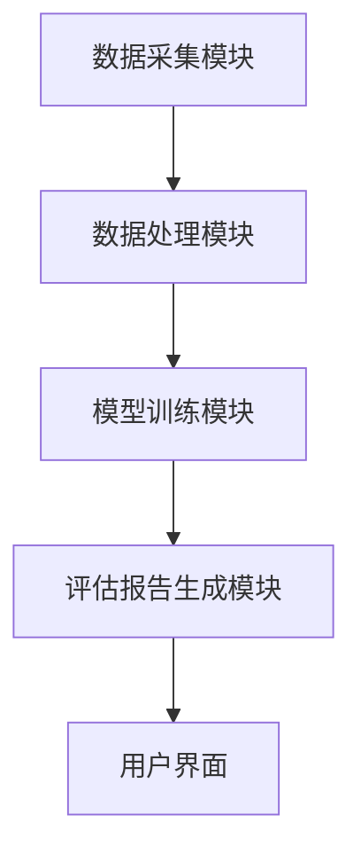
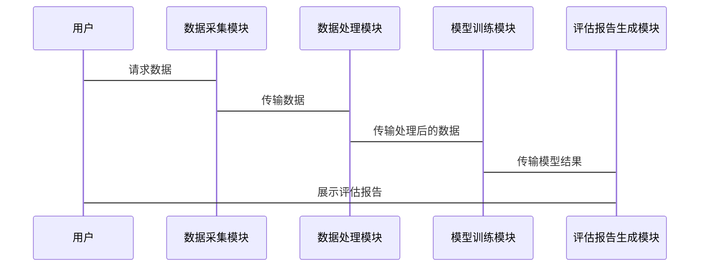

                 


# 构建AI驱动的企业创新绩效评估系统

## 关键词：AI驱动、企业创新、绩效评估、机器学习、NLP、系统架构

## 摘要：  
在当今快速变化的商业环境中，企业创新绩效评估对于企业的发展和决策至关重要。传统的绩效评估方法依赖于人工分析和主观判断，效率低下且难以量化。本文介绍了一种基于人工智能（AI）的创新绩效评估系统，该系统利用机器学习、自然语言处理（NLP）和大数据分析技术，实现对企业创新活动的自动化、智能化评估。文章详细探讨了系统的构建过程，包括核心概念、算法原理、系统架构设计以及实际项目中的实现，为企业在数字化转型中提供了新的思路。

---

## 第一部分: 背景与概述

### 第1章: AI驱动的企业创新绩效评估系统概述

#### 1.1 问题背景与目标
##### 1.1.1 传统企业绩效评估的局限性
传统的企业绩效评估方法通常依赖于主观判断和人工分析，存在以下问题：
- 数据来源单一，难以全面反映企业创新活动。
- 评估过程耗时长，效率低下。
- 评估结果缺乏客观性，难以量化。

##### 1.1.2 AI驱动绩效评估的优势
AI技术的引入为绩效评估带来了以下优势：
- 自动化数据采集和分析，提高效率。
- 利用大数据和机器学习技术，实现精准预测和评估。
- 通过自然语言处理技术，从非结构化数据（如报告、文档）中提取有价值的信息。

##### 1.1.3 企业创新绩效评估的核心目标
- 量化企业的创新能力。
- 识别创新活动的关键驱动因素。
- 提供实时反馈，优化企业创新战略。

#### 1.2 问题描述与解决思路
##### 1.2.1 企业创新绩效评估的关键问题
- 如何从海量数据中提取有效信息？
- 如何建立科学的评估模型？
- 如何实现评估结果的可视化？

##### 1.2.2 AI技术在绩效评估中的应用场景
- 数据预处理与特征提取。
- 使用机器学习模型进行预测。
- 自然语言处理技术分析文本数据。

##### 1.2.3 数据驱动的绩效评估方法
- 数据来源：企业内部数据（如研发数据、销售数据）和外部数据（如市场数据、专利数据）。
- 数据处理：清洗、特征提取、标注。
- 模型训练：使用机器学习算法进行训练和优化。

#### 1.3 系统架构与边界
##### 1.3.1 系统的整体架构
- 数据采集模块：负责收集企业内外部数据。
- 数据处理模块：对数据进行清洗和特征提取。
- 模型训练模块：训练机器学习模型。
- 评估报告生成模块：输出评估结果和建议。

##### 1.3.2 系统的边界与外延
- 数据范围：仅限于企业创新相关的数据。
- 模型范围：仅针对创新绩效评估任务。
- 用户范围：企业内部管理者和相关部门人员。

##### 1.3.3 核心要素与功能模块
- 数据采集模块：负责数据的获取和存储。
- 数据处理模块：对数据进行清洗、转换和特征提取。
- 模型训练模块：使用机器学习算法训练模型。
- 评估报告生成模块：生成评估报告并提供可视化结果。

---

## 第二部分: 核心概念与技术

### 第2章: 核心概念与技术

#### 2.1 数据驱动的绩效评估方法
##### 2.1.1 数据来源与特征
- 数据来源：企业内部数据（如研发数据、销售数据）和外部数据（如市场数据、专利数据）。
- 数据特征：包括时间特征、文本特征、数值特征等。

##### 2.1.2 数据预处理与清洗
- 数据清洗：去除无效数据、处理缺失值、去除异常值。
- 数据转换：对数据进行标准化、归一化处理。
- 特征提取：从文本数据中提取关键词、主题。

##### 2.1.3 数据分析与建模
- 数据分析：使用统计方法分析数据分布、相关性。
- 模型选择：根据问题类型选择合适的算法，如线性回归、随机森林、神经网络等。
- 模型训练：使用训练数据训练模型，调整超参数优化性能。

#### 2.2 AI技术在绩效评估中的应用
##### 2.2.1 自然语言处理（NLP）在报告分析中的应用
- 文本分类：将企业报告分为不同类别。
- 实体识别：识别报告中的关键实体。
- 情感分析：分析报告中的情感倾向。

##### 2.2.2 机器学习模型在预测评估中的应用
- 监督学习：使用有标签的数据训练模型。
- 非监督学习：对无标签数据进行聚类分析。
- 深度学习：使用神经网络模型进行复杂模式识别。

##### 2.2.3 图神经网络在知识图谱构建中的应用
- 知识图谱构建：将企业创新活动中的实体和关系表示为图结构。
- 图神经网络：通过图结构数据进行节点分类、路径推理。

#### 2.3 系统核心功能与模块
##### 2.3.1 数据采集模块
- 功能：负责数据的获取和存储。
- 实现：使用爬虫技术获取外部数据，数据库存储内部数据。

##### 2.3.2 模型训练模块
- 功能：训练机器学习模型。
- 实现：使用机器学习框架（如TensorFlow、PyTorch）训练模型。

##### 2.3.3 评估报告生成模块
- 功能：生成评估报告并提供可视化结果。
- 实现：使用数据可视化工具（如Matplotlib、Seaborn）生成图表。

---

## 第三部分: 算法原理与系统架构

### 第3章: 算法原理与系统架构

#### 3.1 算法原理
##### 3.1.1 线性回归模型
- 原理：通过最小化预测值与真实值的平方差之和来优化模型参数。
- 公式：$$ y = \beta_0 + \beta_1 x + \epsilon $$
- 实现：使用最小二乘法训练模型。

##### 3.1.2 随机森林模型
- 原理：通过构建多个决策树并集成预测结果来提高模型性能。
- 实现：使用随机森林算法训练模型。

##### 3.1.3 LSTM模型
- 原理：通过长短期记忆单元处理序列数据，捕捉时间依赖性。
- 公式：$$ f(t) = \sigma(W_f x_t + U_f h_{t-1} + b_f) $$

#### 3.2 系统架构设计
##### 3.2.1 系统功能设计
- 数据采集模块：数据获取和存储。
- 数据处理模块：数据清洗、特征提取。
- 模型训练模块：模型训练和优化。
- 评估报告生成模块：生成评估报告和可视化结果。

##### 3.2.2 系统架构图


##### 3.2.3 系统接口设计
- 数据接口：数据输入接口和输出接口。
- 模型接口：模型训练接口和预测接口。
- 报告接口：报告生成接口和展示接口。

##### 3.2.4 系统交互设计


---

## 第四部分: 项目实战

### 第4章: 项目实战

#### 4.1 环境安装与配置
- 安装Python和相关库（如NumPy、Pandas、Scikit-learn、TensorFlow）。
- 安装数据可视化工具（如Matplotlib、Seaborn）。
- 安装自然语言处理库（如NLTK、spaCy）。

#### 4.2 系统核心实现
##### 4.2.1 数据采集模块
```python
import requests
from bs4 import BeautifulSoup

def fetch_data(url):
    response = requests.get(url)
    soup = BeautifulSoup(response.text, 'html.parser')
    data = []
    for item in soup.find_all('div', class_='data-item'):
        data.append({
            'id': item['id'],
            'text': item.get_text()
        })
    return data
```

##### 4.2.2 数据处理模块
```python
import pandas as pd
import numpy as np

def preprocess_data(df):
    # 删除缺失值
    df.dropna(inplace=True)
    # 标准化处理
    from sklearn.preprocessing import StandardScaler
    scaler = StandardScaler()
    df[['feature1', 'feature2']] = scaler.fit_transform(df[['feature1', 'feature2']])
    return df
```

##### 4.2.3 模型训练模块
```python
from sklearn.ensemble import RandomForestClassifier
from sklearn.metrics import accuracy_score

def train_model(X_train, y_train, X_test, y_test):
    model = RandomForestClassifier()
    model.fit(X_train, y_train)
    y_pred = model.predict(X_test)
    print("Accuracy:", accuracy_score(y_test, y_pred))
    return model
```

##### 4.2.4 评估报告生成模块
```python
import matplotlib.pyplot as plt

def generate_report(model, X_test, y_test):
    y_pred = model.predict(X_test)
    plt.figure(figsize=(10, 6))
    plt.scatter(y_pred, y_test)
    plt.xlabel('Predicted Value')
    plt.ylabel('True Value')
    plt.title('Performance of the Model')
    plt.show()
```

#### 4.3 项目小结
- 项目实现了AI驱动的企业创新绩效评估系统。
- 系统包括数据采集、数据处理、模型训练和评估报告生成模块。
- 系统能够高效、准确地评估企业的创新绩效。

---

## 第五部分: 最佳实践与总结

### 第5章: 最佳实践与总结

#### 5.1 最佳实践
- 数据质量：确保数据的完整性和准确性。
- 模型选择：根据问题类型选择合适的算法。
- 系统优化：定期更新模型和优化系统性能。

#### 5.2 小结
- 本文介绍了AI驱动的企业创新绩效评估系统的构建过程。
- 详细讲解了系统的各个模块和实现方法。
- 展望了未来的研究方向和应用前景。

#### 5.3 注意事项
- 数据隐私：注意保护企业数据的隐私和安全。
- 系统维护：定期更新模型和优化系统性能。
- 用户培训：对系统用户进行培训，确保系统顺利运行。

#### 5.4 拓展阅读
- 机器学习算法的深入学习。
- 自然语言处理技术的最新进展。
- 大数据技术在企业中的应用。

---

通过本文的详细讲解，读者可以全面了解AI驱动的企业创新绩效评估系统的构建过程，并能够将其应用到实际的企业管理中，帮助企业实现创新绩效的高效评估和优化。

