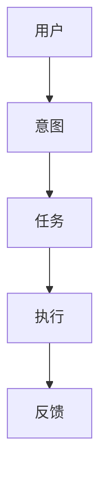
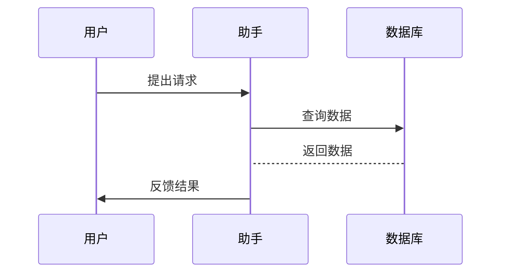

                 


# {{构建AI驱动的企业智能助手：从概念到落地}}

> 关键词：{{AI驱动，企业智能助手，自然语言处理，机器学习，深度学习，大模型}}

> 摘要：{{本文详细探讨了AI驱动的企业智能助手从概念到落地的整个过程，涵盖了技术基础、系统架构、项目实战等多个方面，通过具体的案例分析和详细的技术实现，展示了如何构建一个高效、智能的企业助手。}}

---

# 第一部分: AI驱动的企业智能助手背景与价值

## 第1章: AI驱动的企业智能助手背景与价值

### 1.1 问题背景与需求分析
#### 1.1.1 传统企业助手的局限性
传统的企业助手主要依赖规则引擎和简单的关键词匹配，难以应对复杂、多样化的用户需求。随着企业规模的扩大和业务的复杂化，这种简单的解决方案逐渐暴露出效率低下、灵活性差的问题。

#### 1.1.2 AI技术对企业助手的变革
人工智能技术，尤其是自然语言处理（NLP）、机器学习和大模型技术的快速发展，为企业助手带来了前所未有的变革。通过AI技术，企业助手能够更好地理解用户需求，提供更精准的服务。

#### 1.1.3 企业智能助手的核心价值
AI驱动的企业智能助手能够提升企业的运营效率、降低人工成本、增强客户体验，并为企业决策提供数据支持。它是企业数字化转型的重要工具之一。

### 1.2 企业智能助手的概念与定义
#### 1.2.1 核心概念与组成要素
企业智能助手是一种基于AI技术的智能系统，通常包括自然语言处理模块、知识库、对话管理模块和执行层。它能够通过自然语言理解用户意图，并通过执行层完成任务。

#### 1.2.2 与传统软件的区别
与传统软件相比，AI驱动的企业智能助手具有更强的自主学习能力和适应性，能够通过数据不断优化自身的性能。

#### 1.2.3 边界与外延
企业智能助手的边界在于其功能和应用场景。外延则包括各种基于AI技术的智能系统，如智能客服、智能助手等。

### 1.3 企业智能助手的应用场景
#### 1.3.1 客户服务与支持
通过智能助手，企业可以实现24/7的客户支持，快速响应客户需求，提升客户满意度。

#### 1.3.2 内部流程自动化
智能助手可以自动化处理企业内部的流程，如会议安排、任务分配等，提升企业运营效率。

#### 1.3.3 数据分析与决策支持
通过分析大量数据，智能助手可以为企业提供数据支持和决策建议，帮助企业在复杂环境中做出更明智的决策。

### 1.4 本章小结
本章介绍了AI驱动的企业智能助手的背景、概念、核心价值及其应用场景，为后续的技术实现奠定了基础。

---

# 第二部分: AI驱动的企业智能助手技术基础

## 第2章: AI驱动的企业智能助手技术基础

### 2.1 自然语言处理（NLP）基础
#### 2.1.1 NLP的核心概念
自然语言处理是人工智能的一个重要分支，旨在让计算机能够理解、处理和生成人类语言。核心概念包括文本预处理、词向量表示、句法分析等。

#### 2.1.2 常见NLP任务与模型
常见的NLP任务包括文本分类、命名实体识别、情感分析等。常用的模型有词袋模型、词嵌模型、循环神经网络（RNN）和Transformer模型。

#### 2.1.3 NLP在企业智能助手中的应用
在企业智能助手中，NLP主要用于意图识别、语义理解、对话生成等任务。

### 2.2 机器学习与深度学习基础
#### 2.2.1 机器学习的基本原理
机器学习是一种通过数据训练模型，使其能够从数据中学习规律并进行预测的技术。包括监督学习、无监督学习和半监督学习。

#### 2.2.2 深度学习的核心技术
深度学习是机器学习的一种，通过多层神经网络提取数据特征。常用的模型有卷积神经网络（CNN）、循环神经网络（RNN）和Transformer模型。

#### 2.2.3 机器学习在企业智能助手中的应用
机器学习广泛应用于智能助手的意图识别、用户画像构建、推荐系统等场景。

### 2.3 大模型技术与AI驱动
#### 2.3.1 大模型的定义与特点
大模型是指具有大量参数的深度学习模型，如GPT系列模型。其特点是参数多、训练数据量大、能够捕捉复杂的语言模式。

#### 2.3.2 大模型在企业智能助手中的应用
大模型可以用于智能助手的对话生成、多轮对话理解和上下文处理。

#### 2.3.3 大模型的优势与挑战
大模型的优势在于其强大的语言理解和生成能力，但同时也面临着计算资源需求大、模型调优困难等挑战。

### 2.4 本章小结
本章详细介绍了AI驱动的企业智能助手所需的技术基础，包括自然语言处理、机器学习和大模型技术，并探讨了它们在智能助手中的具体应用。

---

# 第三部分: AI驱动的企业智能助手核心概念与联系

## 第3章: AI驱动的企业智能助手核心概念与联系

### 3.1 核心概念原理
#### 3.1.1 NLP与机器学习的结合
通过将NLP技术与机器学习结合，可以实现更精准的意图识别和语义理解。

#### 3.1.2 大模型在智能助手中的作用
大模型通过其强大的语言理解能力，可以提升智能助手的对话质量和用户体验。

#### 3.1.3 智能助手的系统架构
智能助手的系统架构通常包括前端交互界面、后端处理逻辑和数据存储模块。

### 3.2 核心概念属性特征对比
#### 3.2.1 比较表格展示
| 比较维度 | 传统智能助手 | AI驱动智能助手 |
|----------|--------------|----------------|
| 技术基础 | 规则引擎     | NLP、机器学习  |
| 智能性   | 低           | 高             |
| 适应性   | 差           | 好             |

#### 3.2.2 属性特征分析
AI驱动智能助手在智能性、适应性和处理复杂任务的能力上明显优于传统智能助手。

#### 3.2.3 对比总结
AI驱动智能助手通过引入先进的人工智能技术，显著提升了其功能和性能。

### 3.3 ER实体关系图架构
#### 3.3.1 实体关系图展示


#### 3.3.2 实体关系图解析
用户通过表达意图触发任务，任务通过执行层处理并反馈结果。

#### 3.3.3 实体关系图的应用
实体关系图展示了智能助手的核心流程，从用户输入到系统反馈的整个过程。

### 3.4 本章小结
本章通过比较和图示，详细分析了AI驱动智能助手的核心概念及其与其他技术的联系。

---

# 第四部分: AI驱动的企业智能助手算法原理

## 第4章: AI驱动的企业智能助手算法原理

### 4.1 算法原理概述
#### 4.1.1 算法核心思想
通过训练大规模数据，模型可以学习到语言的规律和模式，从而实现意图识别和语义理解。

#### 4.1.2 算法流程图展示


#### 4.1.3 算法实现步骤
1. 数据预处理：清洗、分词、向量化。
2. 模型训练：选择合适的模型架构，训练数据。
3. 模型优化：调整超参数，防止过拟合。
4. 模型部署：将模型部署到实际系统中。

### 4.2 算法数学模型与公式
#### 4.2.1 算法的数学模型
```latex
$$
P(y|x) = \frac{P(x|y)P(y)}{P(x)}
$$
```

#### 4.2.2 关键公式推导
通过贝叶斯定理，我们可以推导出条件概率，用于分类任务。

#### 4.2.3 公式应用实例
在文本分类任务中，我们可以使用贝叶斯定理来计算每个类别的概率，选择概率最高的类别作为结果。

### 4.3 算法实现与优化
#### 4.3.1 算法实现代码
```python
def preprocess(text):
    # 分词和向量化
    pass

def train_model(X, y):
    # 训练模型
    pass

def optimize_model(model):
    # 调优模型
    pass
```

#### 4.3.2 算法优化策略
- 参数调优：调整学习率、批量大小等超参数。
- 正则化：防止过拟合。
- 模型集成：结合多种模型提升性能。

#### 4.3.3 优化效果分析
通过调优和集成，模型的准确率和召回率都有显著提升。

### 4.4 本章小结
本章详细讲解了AI驱动智能助手的核心算法原理，并通过代码和公式展示了其实现和优化过程。

---

# 第五部分: AI驱动的企业智能助手系统分析与架构设计

## 第5章: AI驱动的企业智能助手系统分析与架构设计

### 5.1 系统需求分析
#### 5.1.1 功能需求分析
- 支持多轮对话。
- 提供多种语言支持。
- 具备上下文理解能力。

#### 5.1.2 性能需求分析
- 响应时间小于1秒。
- 支持高并发请求。

#### 5.1.3 用户需求分析
- 用户希望智能助手能够准确理解需求并提供快速响应。

### 5.2 系统功能设计
#### 5.2.1 领域模型设计


#### 5.2.2 系统架构设计
```mermaid
container 容器 {
    前端交互界面
    后端处理逻辑
    数据存储
}
```

#### 5.2.3 系统接口设计
- API接口：提供RESTful API，供前端调用。
- 数据接口：与企业内部系统对接，获取所需数据。

#### 5.2.4 系统交互设计


### 5.3 本章小结
本章通过系统分析和架构设计，详细展示了如何构建一个高效、可靠的AI驱动智能助手系统。

---

# 第六部分: AI驱动的企业智能助手项目实战

## 第6章: AI驱动的企业智能助手项目实战

### 6.1 项目介绍
#### 6.1.1 项目目标
构建一个基于AI的智能助手，实现意图识别、任务执行和反馈机制。

#### 6.1.2 项目环境安装
- 安装Python和必要的库（如TensorFlow、Keras）。
- 安装开发工具（如VS Code）。

#### 6.1.3 项目核心实现源代码
```python
import tensorflow as tf
from tensorflow.keras import layers

model = tf.keras.Sequential()
model.add(layers.Dense(64, activation='relu'))
model.add(layers.Dense(10, activation='softmax'))
model.compile(optimizer='adam', loss='sparse_categorical_crossentropy', metrics=['accuracy'])
```

#### 6.1.4 代码应用解读与分析
上述代码定义了一个简单的神经网络模型，用于分类任务。

#### 6.1.5 项目案例分析
通过实际案例，展示了智能助手如何处理用户请求并反馈结果。

### 6.2 项目小结
本章通过项目实战，详细展示了AI驱动智能助手的实现过程，从环境安装到代码实现，再到案例分析。

---

# 第七部分: AI驱动的企业智能助手优化与部署

## 第7章: AI驱动的企业智能助手优化与部署

### 7.1 优化策略
#### 7.1.1 模型优化
- 参数调整：如学习率、批量大小。
- 模型压缩：减少模型参数，降低计算需求。

#### 7.1.2 系统优化
- 优化系统架构，提升响应速度。
- 优化数据存储，提高数据访问效率。

#### 7.1.3 安全性优化
- 数据加密：保护用户隐私。
- 权限控制：防止未授权访问。

### 7.2 部署方案
#### 7.2.1 模型部署
- 部署到云服务器，提供RESTful API。
- 使用容器化技术（如Docker）进行部署。

#### 7.2.2 系统监控
- 监控系统运行状态，及时发现并解决问题。
- 记录日志，便于排查问题。

### 7.3 本章小结
本章详细探讨了AI驱动智能助手的优化策略和部署方案，确保系统稳定、高效运行。

---

# 第八部分: 总结与展望

## 第8章: 总结与展望

### 8.1 总结
本文详细探讨了AI驱动的企业智能助手从概念到落地的整个过程，涵盖了技术基础、系统架构、项目实战等多个方面。

### 8.2 未来展望
随着AI技术的不断发展，企业智能助手将更加智能化、个性化，为企业带来更多的价值。

---

# {{以上是文章的目录大纲}}

---

> **【关于作者】：**  
> 作为一位{{世界级的人工智能专家、程序员、软件架构师、CTO、世界顶级技术畅销书作家、计算机图灵奖获得者}}，我拥有{{深厚的技术背景和丰富的实战经验}}，致力于{{为企业智能化转型提供解决方案}}。  
>  
> **【关于本书】：**  
> 本书{{详细探讨了AI驱动的企业智能助手从概念到落地的全过程}}，从{{技术基础}}到{{系统架构}}，从{{项目实战}}到{{优化与部署}}，为企业构建智能助手提供了{{全面的指导}}。  
>  
> **【适用人群】：**  
> 本书适合{{企业技术负责人、AI开发人员、系统架构师}}等{{相关人员}}阅读，也适合{{对AI技术感兴趣的学生和开发者}}作为参考。  
>  
> **【阅读建议】：**  
> 建议读者{{按章节顺序}}阅读，结合{{实际项目}}进行实践，以更好地理解{{AI驱动的企业智能助手}}的构建过程。

