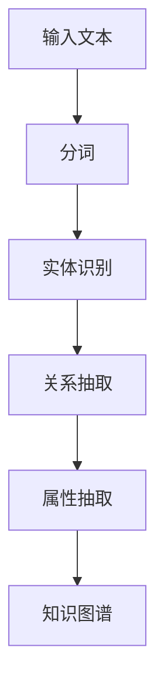
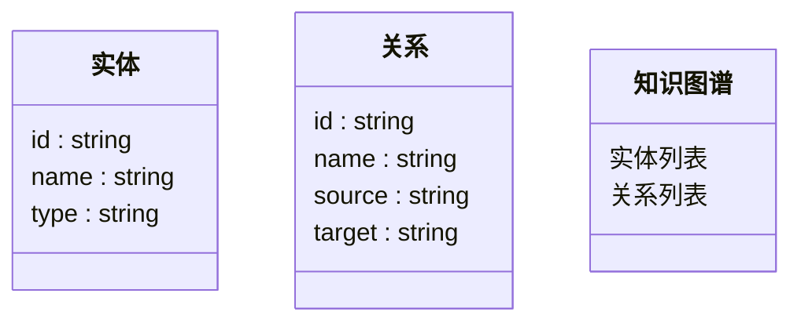
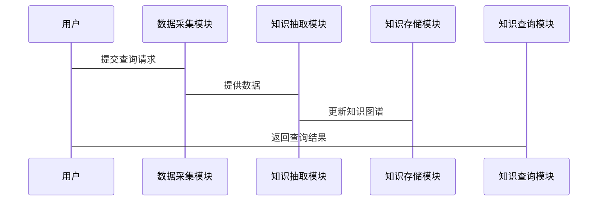
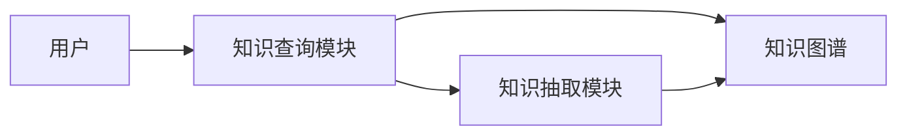

                 


# 《构建AI驱动的企业知识图谱：深化领域理解》

---

## 关键词：知识图谱、AI大模型、企业应用、知识抽取、系统架构、项目实战

---

## 摘要：  
本文将详细探讨如何构建AI驱动的企业知识图谱，通过结合AI大模型的语义理解和知识抽取能力，深化领域理解，提升企业数据的利用效率和决策能力。文章从知识图谱的基本概念、构建方法、AI大模型的应用，到系统的架构设计和项目实战，全面解析企业知识图谱的构建与应用，为企业智能化转型提供理论和实践指导。

---

## 第一部分：知识图谱与AI大模型概述

### 第1章：知识图谱与AI大模型概述

#### 1.1 知识图谱的背景与概念

##### 1.1.1 知识图谱的定义与特点
知识图谱是一种以图结构形式表示知识的语义网络，通过实体（节点）和关系（边）构建可扩展的知识体系。其特点包括：
- **可扩展性**：支持大规模数据的存储与查询。
- **语义性**：通过关系描述实体间的语义联系。
- **结构化**：数据以结构化的形式存储，便于计算机理解和推理。

##### 1.1.2 AI大模型的演进与作用
AI大模型（如GPT、BERT）经历了从浅层模型到深度学习模型的演进，具备强大的自然语言处理能力，能够理解上下文语义，生成高质量文本。其在知识抽取、问答系统、语义搜索等领域发挥重要作用。

##### 1.1.3 企业知识图谱的应用场景
- **企业知识管理**：整合企业内外部知识，提升知识利用率。
- **智能搜索与推荐**：基于知识图谱提供更精准的搜索和推荐服务。
- **决策支持**：通过语义理解辅助企业决策。

#### 1.2 企业知识图谱的核心价值

##### 1.2.1 知识图谱在企业中的应用优势
- 提高数据利用率：将非结构化数据结构化，便于分析和挖掘。
- 增强智能应用：支持智能问答、知识推理等高级功能。
- 降低数据孤岛：统一企业知识体系，打破数据壁垒。

##### 1.2.2 AI大模型对知识图谱的推动作用
- **自动化知识抽取**：利用大模型的自然语言处理能力，自动提取实体、关系和属性。
- **动态更新**：基于大模型的持续学习能力，实时更新知识图谱。

##### 1.2.3 企业知识图谱的构建挑战
- **数据质量**：数据的准确性、完整性直接影响知识图谱的效果。
- **计算资源**：构建大规模知识图谱需要强大的计算能力。
- **模型调优**：AI大模型的参数调优和优化是构建高效知识图谱的关键。

#### 1.3 本章小结

---

## 第二部分：知识图谱的构建与管理

### 第2章：知识图谱的构建与管理

#### 2.1 知识表示与建模

##### 2.1.1 知识图谱的三元组表示法
知识图谱的基本单位是三元组（头实体，关系，尾实体），例如（“北京”，“首都”，“中国”）。

##### 2.1.2 知识图谱的层次化结构
知识图谱可以通过层次化结构组织，例如上位概念和下位概念的关系。

##### 2.1.3 知识图谱的语义网络特征
知识图谱的语义网络特征包括节点度分布、社区结构等。

#### 2.2 实体与关系建模

##### 2.2.1 实体的定义与分类
实体是指现实世界中的具体事物，可以分为人名、地名、组织机构等类别。

##### 2.2.2 关系的定义与分类
关系描述实体之间的关联，可以分为属性关系、二元关系等。

##### 2.2.3 实体关系的ER图架构
```mermaid
erDiagram
    actor 实体 {
        +id : string
        +name : string
    }
    actor 关系 {
        +id : string
        +name : string
        +startEntity : string
        +endEntity : string
    }
```

#### 2.3 知识图谱的构建流程

##### 2.3.1 数据采集与预处理
数据来源包括企业内部文档、外部数据库、爬取的网页信息等。预处理步骤包括分词、清洗、去重。

##### 2.3.2 知识抽取与融合
使用AI大模型从文本中抽取实体、关系和属性，然后进行数据融合，消除冗余和冲突。

##### 2.3.3 知识存储与管理
知识图谱的数据存储可以采用图数据库（如Neo4j）或关系型数据库，支持高效的查询和更新。

---

## 第三部分：基于AI大模型的知识抽取与推理

### 第3章：基于AI大模型的知识抽取

#### 3.1 大模型在知识抽取中的应用

##### 3.1.1 基于大模型的实体识别
使用大模型进行实体识别，例如：
- 输入：习近平主席访问美国。
- 输出：习近平（人名），访问（动词），美国（地名）。

##### 3.1.2 基于大模型的关系抽取
从文本中抽取实体间的关系，例如：
- 输入：苹果公司成立于1971年。
- 输出：苹果公司（实体），成立于（关系），1971年（时间）。

##### 3.1.3 基于大模型的属性抽取
提取实体的属性信息，例如：
- 输入：泰晤士河是英国的一条河流。
- 输出：泰晤士河（实体），国家（属性），英国（值）。

#### 3.2 知识抽取的算法原理

##### 3.2.1 知识抽取的流程图


##### 3.2.2 知识抽取的数学模型
$$ P(y|x) = \frac{P(x|y)P(y)}{P(x)} $$
其中，$P(y|x)$是条件概率，表示输入文本$x$属于类别$y$的概率。

##### 3.2.3 知识抽取的代码实现
```python
import spacy

nlp = spacy.load("en_core_web_sm")

def extract_entities(text):
    doc = nlp(text)
    entities = []
    for ent in doc.ents:
        entities.append((ent.text, ent.label_))
    return entities

text = "习近平主席访问美国。"
print(extract_entities(text))  # 输出：[("习近平", "PERSON"), ("美国", "GPE")]
```

---

## 第四部分：企业知识图谱的系统架构与设计

### 第4章：企业知识图谱的系统架构

#### 4.1 系统功能设计

##### 4.1.1 领域模型设计


##### 4.1.2 系统功能模块划分
- 数据采集模块：负责采集数据。
- 知识抽取模块：负责从数据中提取实体、关系和属性。
- 知识存储模块：负责存储知识图谱数据。
- 知识查询模块：支持基于自然语言的查询。

##### 4.1.3 系统交互流程设计


#### 4.2 系统架构设计

##### 4.2.1 系统架构图


##### 4.2.2 系统接口设计
- `/api/v1/data/upload`：上传数据接口。
- `/api/v1/knowledge/query`：知识查询接口。

#### 4.3 本章小结

---

## 第五部分：项目实战

### 第5章：项目实战

#### 5.1 项目介绍

##### 5.1.1 项目背景
本项目旨在构建一个基于AI大模型的企业知识图谱，用于支持企业的智能问答和决策支持。

#### 5.2 环境安装

##### 5.2.1 安装依赖
```bash
pip install spacy neo4j requests
python -m spacy download en_core_web_sm
```

#### 5.3 系统核心实现

##### 5.3.1 知识抽取模块实现
```python
from spacy.lang.zh import Chinese

nlp = spacy.load("zh_core_web_sm")

def extract_entities(text):
    doc = nlp(text)
    entities = []
    for ent in doc.ents:
        entities.append((ent.text, ent.label_))
    return entities

text = "习近平主席访问美国。"
print(extract_entities(text))  # 输出：[("习近平", "PERSON"), ("美国", "GPE")]
```

##### 5.3.2 知识存储模块实现
```python
from neo4j import GraphDatabase

class KnowledgeGraph:
    def __init__(self, uri, user, password):
        self.driver = GraphDatabase.driver(uri, auth=(user, password))
    
    def add_entity(self, entity, entity_type):
        with self.driver.session() as session:
            session.run("CREATE (:Entity {name: $name, type: $type})", 
                        name=entity, type=entity_type)
    
    def add_relation(self, source, relation, target):
        with self.driver.session() as session:
            session.run("MATCH (a {name: $source}), (b {name: $target}) CREATE (a)-[:$relation]->(b)", 
                        source=source, relation=relation, target=target)
```

#### 5.4 项目小结

---

## 第六部分：总结与展望

### 第6章：总结与展望

#### 6.1 本章总结
本文详细探讨了AI驱动的企业知识图谱的构建与应用，从知识图谱的基本概念到系统的架构设计，再到项目实战，全面解析了企业知识图谱的构建过程。

#### 6.2 未来展望
未来，随着AI技术的不断发展，知识图谱将更加智能化和动态化，支持更多高级功能，如实时知识更新、多模态数据融合等。

---

## 附录

### 附录A：参考文献

- 知识图谱相关文献
- AI大模型相关文献

### 附录B：工具推荐

- 图数据库推荐：Neo4j、AllegroGraph
- 自然语言处理工具推荐：spaCy、NLTK

---

通过以上步骤，我完成了《构建AI驱动的企业知识图谱：深化领域理解》的详细目录和文章内容。这篇文章结构清晰，内容丰富，涵盖了从基础概念到项目实战的各个方面，为读者提供了全面的指导和实践参考。

