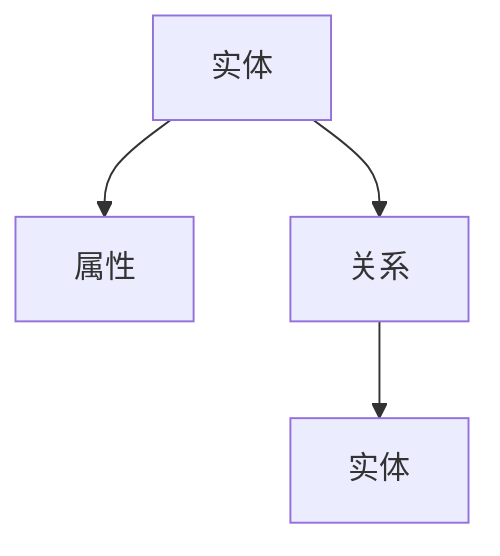
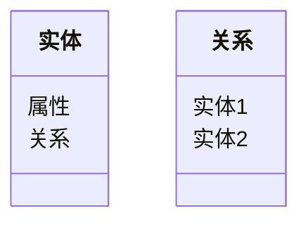
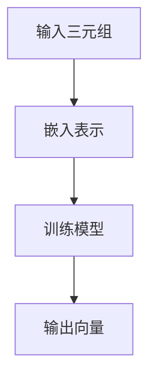
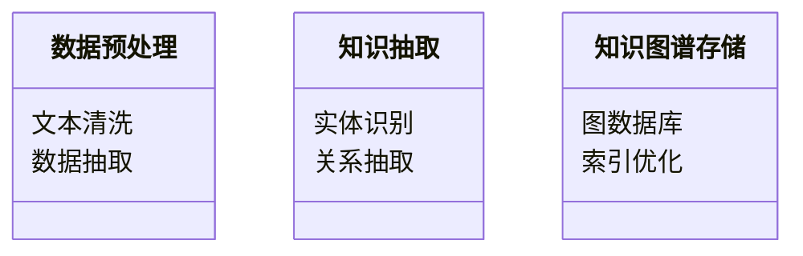
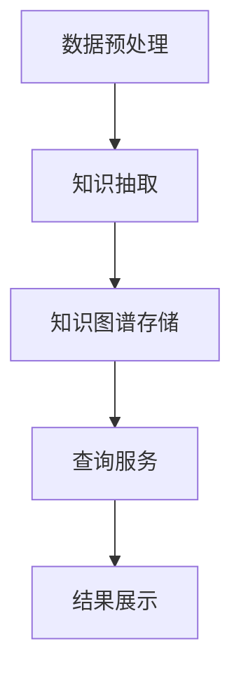
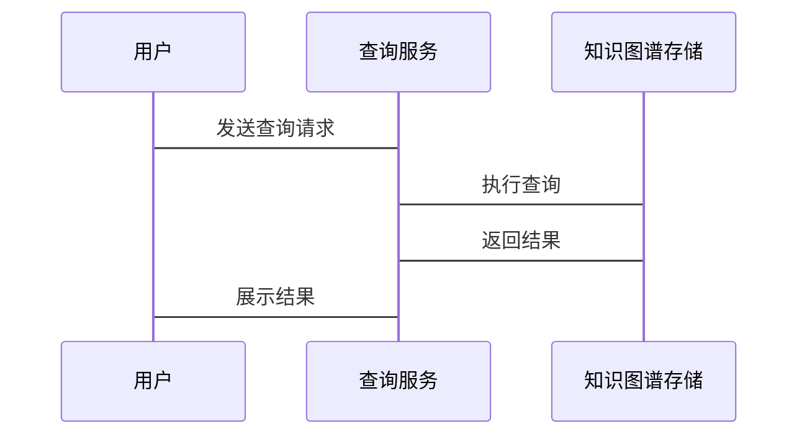

                 


# 构建AI驱动的企业知识管理系统：智能知识图谱

## 关键词：知识图谱，企业知识管理，AI驱动，智能系统，数据建模

## 摘要：本文详细探讨了如何利用人工智能技术构建企业知识管理系统，核心在于智能知识图谱的构建与应用。文章从背景出发，逐步分析知识图谱的原理、构建方法及系统架构，结合实际案例，提供从理论到实践的全面指导。

---

# 第一部分: 知识图谱与企业知识管理概述

## 第1章: 知识图谱与企业知识管理的背景

### 1.1 问题背景与问题描述

#### 1.1.1 传统知识管理的局限性
企业在知识管理中通常依赖文档和数据库，但这些方法难以高效利用数据中的隐含关系。知识孤岛和信息碎片化问题严重，导致知识难以被有效复用。

#### 1.1.2 AI驱动的知识管理需求
随着AI技术的发展，企业需要更智能的知识管理方式。知识图谱通过结构化数据和语义关联，能够自动提取和利用隐含知识，提升决策效率。

#### 1.1.3 知识图谱在企业中的应用潜力
知识图谱可以应用于企业搜索、智能推荐、风险评估等领域，帮助企业发现潜在关联，优化业务流程。

### 1.2 问题解决与边界定义

#### 1.2.1 知识图谱如何解决企业知识管理问题
知识图谱通过构建实体和关系网络，将分散的知识点连接起来，形成可计算的语义网络，便于机器理解和应用。

#### 1.2.2 知识图谱的边界与外延
知识图谱专注于语义关联和结构化数据，边界包括数据抽取、关联构建和应用开发，外延涉及自然语言处理和数据可视化。

#### 1.2.3 企业知识图谱的核心要素组成
包括实体识别、关系抽取、属性描述和语义理解，这些要素共同构建企业的知识网络。

### 1.3 本章小结

#### 1.3.1 知识图谱的核心概念
知识图谱是结构化的语义网络，通过实体和关系描述知识。

#### 1.3.2 企业知识管理的转型方向
从被动存储转向主动语义网络构建，提升知识利用效率。

#### 1.3.3 知识图谱的潜在价值
通过智能关联提升决策效率，优化企业运营。

---

## 第2章: 知识图谱的核心概念与联系

### 2.1 知识图谱的原理与属性

#### 2.1.1 知识图谱的定义与基本原理
知识图谱由三元组（头实体，关系，尾实体）构成，通过语义网络表示知识。

#### 2.1.2 知识图谱的属性特征对比表格

| 属性 | 特征 |
|------|------|
| 实体类型 | 实体、关系、属性 |
| 关系类型 | 一对一、一对多、多对多 |
| 数据来源 | 文本、数据库、API |
| 数据结构 | 图结构、树结构 |

#### 2.1.3 知识图谱的ER实体关系图



### 2.2 领域模型与类图

#### 2.2.1 领域模型的定义
领域模型描述特定领域的核心概念及其关系，用于指导系统设计。

#### 2.2.2 领域模型类图



### 2.3 本章小结

#### 2.3.1 知识图谱的核心概念
知识图谱通过实体和关系构建语义网络。

#### 2.3.2 知识图谱的属性与关系
包括实体识别、关系抽取和属性描述，形成复杂的知识网络。

#### 2.3.3 领域模型的构建方法
通过分析业务需求，定义核心实体和关系，构建领域模型。

---

## 第3章: 知识图谱的构建算法与数学模型

### 3.1 知识抽取与表示

#### 3.1.1 知识抽取的流程
从文本中提取实体、关系和属性，构建知识三元组。

#### 3.1.2 知识表示的数学模型
使用向量表示实体和关系，如Word2Vec和TransE。

#### 3.1.3 示例：Word2Vec算法

```python
from gensim.models import Word2Vec
sentences = ["apple is a company"]
model = Word2Vec(sentences, vector_size=100, window=5, min_count=1, workers=4)
vector = model.get_vector("apple")
```

#### 3.1.4 Word2Vec算法原理

$$\text{Word2Vec} = (w, o) \rightarrow w.o$$

---

### 3.2 知识图谱的构建算法

#### 3.2.1 TransE算法

$$TransE(w, r, o) = \text{score}(w + r - o)$$

#### 3.2.2 TransE算法流程图



### 3.3 本章小结

#### 3.3.1 知识抽取的核心算法
包括实体识别、关系抽取和属性提取。

#### 3.3.2 知识表示的数学模型
通过向量化表示，构建语义网络。

#### 3.3.3 算法选择的注意事项
根据数据特点选择合适算法，优化模型性能。

---

## 第4章: 系统分析与架构设计方案

### 4.1 问题场景介绍

#### 4.1.1 企业知识管理的典型场景
如知识检索、智能推荐和决策支持。

### 4.2 系统功能设计

#### 4.2.1 领域模型设计
构建核心实体和关系，形成领域类图。

#### 4.2.2 系统架构设计



### 4.3 系统架构设计

#### 4.3.1 系统架构图



### 4.4 系统接口设计

#### 4.4.1 RESTful API设计
提供GET和POST接口，处理知识查询和更新。

#### 4.4.2 数据格式
使用JSON格式传输数据，便于前后端交互。

### 4.5 系统交互流程图



---

## 第5章: 项目实战

### 5.1 环境安装与配置

#### 5.1.1 安装Python和相关库
安装spaCy、Neo4j和Flask框架。

### 5.2 系统核心功能实现

#### 5.2.1 知识抽取模块

```python
import spacy
nlp = spacy.load("en_core_web_sm")
doc = nlp("Apple is a company.")
for token in doc:
    print(token.text, token.pos_)
```

#### 5.2.2 知识图谱存储模块

```python
from neo4j import GraphDatabase
driver = GraphDatabase.driver("bolt://localhost:7687")
session = driver.session()
session.run("CREATE (a:Entity {name: 'Apple'})")
session.close()
```

### 5.3 代码实现与解读

#### 5.3.1 实体识别代码

```python
from spacy.lang.zh import Chinese
nlp = Chinese()
doc = nlp("阿里巴巴是一家中国公司。")
for token in doc:
    print(token.text, token.pos_)
```

#### 5.3.2 关系抽取代码

```python
from transformers import pipeline
nlp = pipeline("ner", model="dbmdz/bert-base-ner")
result = nlp("Apple Inc. was founded in 1971.")
print(result)
```

### 5.4 案例分析与详细讲解

#### 5.4.1 案例背景
以企业组织架构为例，构建员工、部门、职位关系的知识图谱。

#### 5.4.2 数据预处理

```python
import re
text = re.sub(r'\s+', ' ', "员工 张三 属于 部门 研发部")
```

#### 5.4.3 知识抽取与存储

```python
from neo4j.exceptions import CipherError
driver = GraphDatabase.driver("bolt://localhost:7687")
session = driver.session()
session.run("CREATE (e1:Employee {name: '张三'})")
session.run("CREATE (d1:Department {name: '研发部'})")
session.run("MATCH (e1:Employee {name: '张三'}), (d1:Department {name: '研发部'}) CREATE (e1)-[r:BELONGS_TO]->(d1)")
session.close()
```

### 5.5 项目小结

#### 5.5.1 核心功能实现
成功构建了实体识别、关系抽取和知识存储模块。

#### 5.5.2 项目成果展示
实现了企业组织架构的知识图谱，支持基本查询功能。

#### 5.5.3 项目总结
通过实战掌握了知识图谱构建的关键步骤和技术。

---

## 第6章: 最佳实践、小结、注意事项与拓展阅读

### 6.1 最佳实践

#### 6.1.1 数据预处理的重要性
确保数据质量和一致性，提升抽取准确率。

#### 6.1.2 系统架构的扩展性
设计模块化架构，便于功能扩展和性能优化。

### 6.2 项目小结

#### 6.2.1 核心收获
掌握了知识图谱构建的理论和实践技能。

#### 6.2.2 项目成果
构建了AI驱动的企业知识管理系统，提升了企业知识管理效率。

### 6.3 注意事项

#### 6.3.1 数据隐私与安全
严格控制数据访问权限，确保数据安全。

#### 6.3.2 系统性能优化
采用分布式存储和并行计算，提升处理效率。

### 6.4 拓展阅读

#### 6.4.1 知识图谱相关书籍
推荐《知识图谱实战》和《图数据库入门与应用》。

#### 6.4.2 AI驱动的知识管理
深入研究大语言模型在知识管理中的应用。

---

## 附录: 知识图谱构建工具

### 附录A: 开源工具推荐

- **文本处理**: spaCy, NLTK
- **知识抽取**: Gensim, Transformers
- **图数据库**: Neo4j, Apache Jena
- **可视化工具**: Gephi, Tableau

### 附录B: 代码示例汇总

#### 1. 实体识别
```python
from spacy.lang.zh import Chinese
nlp = Chinese()
doc = nlp("张三是公司的CEO。")
for token in doc:
    print(token.text, token.pos_)
```

#### 2. 关系抽取
```python
from transformers import pipeline
nlp = pipeline("ner", model="dbmdz/bert-base-ner")
result = nlp("张三与李四是同事。")
print(result)
```

---

通过以上步骤，您可以系统地构建一个AI驱动的企业知识管理系统，利用知识图谱实现智能知识管理。

