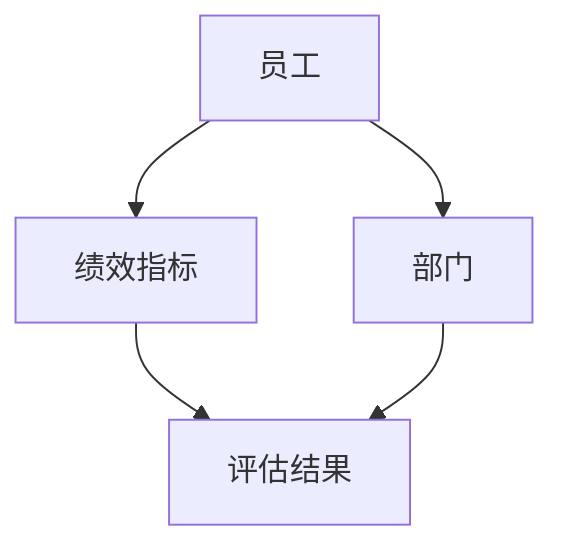
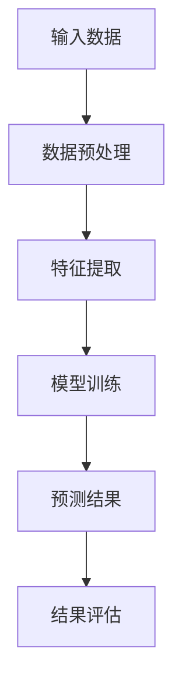
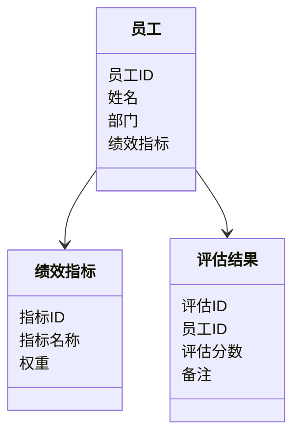
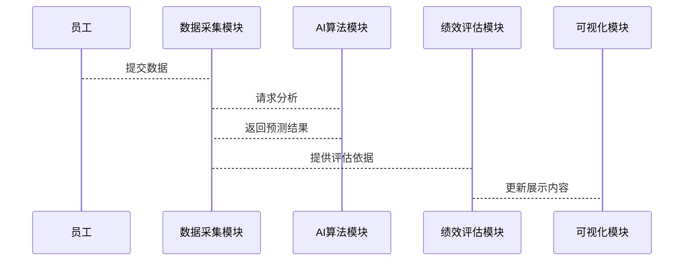

                 


# 构建AI驱动的企业绩效管理系统

## 关键词：AI驱动，企业绩效管理，算法原理，系统架构，项目实战

## 摘要：本文系统地探讨了如何利用人工智能技术构建企业绩效管理系统，分析了其核心概念、算法原理、系统架构，并通过具体案例展示了如何实现AI驱动的绩效管理。文章从背景介绍、核心概念、算法实现、系统架构到项目实战，层层递进，深入剖析了AI在企业绩效管理中的应用与价值。

---

## 第1章 企业绩效管理的背景与概述

### 1.1 传统企业绩效管理的局限性

#### 1.1.1 绩效管理的核心概念与目标
绩效管理是指通过设定目标、监控执行、评估结果和反馈改进，来提升组织和个人绩效的过程。其核心目标是优化企业运营效率、提升员工能力、实现组织战略目标。

#### 1.1.2 传统绩效管理的痛点与不足
- 数据孤岛：传统绩效管理依赖手工记录，数据分散，难以整合。
- 主观性高：评估结果容易受到主观因素影响，缺乏客观依据。
- 反馈滞后：传统评估周期长，反馈不及时，难以快速调整策略。

#### 1.1.3 数字化转型对企业绩效管理的新要求
随着数字化转型的推进，企业需要更高效、精准的绩效管理方式，AI技术的应用成为必然选择。

### 1.2 AI驱动的绩效管理的必要性

#### 1.2.1 数据驱动决策的时代背景
大数据时代，企业需要通过数据驱动决策，AI技术提供了强大的数据分析能力。

#### 1.2.2 AI技术在企业管理中的应用潜力
AI可以通过自动化数据处理、智能分析和预测，提升绩效管理的效率和准确性。

#### 1.2.3 绩效管理智能化的未来趋势
AI驱动的绩效管理将更加智能化、个性化，能够实时反馈、动态调整，帮助企业和员工实现共赢。

---

## 第2章 AI驱动的企业绩效管理系统概述

### 2.1 系统的核心概念与目标

#### 2.1.1 系统的定义与组成
AI驱动的绩效管理系统由数据采集模块、AI算法模块、绩效评估模块和可视化模块组成，通过AI技术实现智能化的绩效管理。

#### 2.1.2 系统的目标与价值
- 提升绩效管理的效率和准确性。
- 实现数据驱动的决策支持。
- 优化员工绩效，提升企业整体表现。

#### 2.1.3 系统的边界与外延
系统专注于绩效管理的核心业务，与其他企业管理模块如HR、财务等无缝对接。

### 2.2 系统的核心要素与功能模块

#### 2.2.1 数据采集与处理模块
- 数据来源：员工绩效数据、部门数据、业务数据等。
- 数据类型：结构化数据（如KPI）和非结构化数据（如文本反馈）。

#### 2.2.2 AI算法分析模块
- 算法选择：回归分析、聚类分析、自然语言处理等。
- 数据预处理：清洗、转换、特征提取。

#### 2.2.3 绩效评估与反馈模块
- 评估标准：KPI、目标完成度、员工反馈。
- 反馈机制：实时反馈、个性化建议、目标调整。

#### 2.2.4 可视化展示模块
- 数据可视化：图表展示、仪表盘。
- 用户界面：简洁直观，便于用户操作。

### 2.3 系统与传统绩效管理的对比

#### 2.3.1 核心功能对比分析
| 功能模块        | 传统绩效管理            | AI驱动的绩效管理            |
|-----------------|-------------------------|-----------------------------|
| 数据采集        | 手工录入                | 自动采集与处理              |
| 分析方式        | 人工分析                | AI自动分析                  |
| 评估反馈        | 定期评估                | 实时反馈                    |
| 可视化展示       | 简单报表                | 多维度动态图表               |

#### 2.3.2 优劣势对比
- **优势**：AI驱动的绩效管理更高效、精准，能够处理大量数据。
- **劣势**：初期投入较高，需要专业团队支持。

#### 2.3.3 适用场景分析
- **适用场景**：数据量大、业务复杂的企业。
- **不适用场景**：数据 scarce的小型企业。

---

## 第3章 AI驱动的绩效管理系统原理

### 3.1 系统的核心原理

#### 3.1.1 数据驱动的决策逻辑
通过收集和分析大量数据，AI算法能够发现数据中的规律，为绩效管理提供科学依据。

#### 3.1.2 AI算法的实现机制
AI算法通过学习历史数据，预测未来绩效，提供个性化建议。

#### 3.1.3 系统的整体架构
- 数据层：存储原始数据。
- 业务层：处理数据，执行算法。
- 表现层：展示结果，提供反馈。

### 3.2 核心概念对比分析

#### 3.2.1 数据源与数据类型对比
| 数据源         | 数据类型                 |
|----------------|--------------------------|
| 员工绩效数据   | 结构化数据               |
| 部门数据       | 结构化数据               |
| 员工反馈       | 非结构化数据             |

#### 3.2.2 算法模型的特征对比
| 特征           | 传统算法                 | AI算法                     |
|----------------|--------------------------|-----------------------------|
| 复杂度         | 较低                     | 较高                       |
| 精度           | 一般                     | 更高                       |
| 可扩展性       | 有限                     | 较高                       |

#### 3.2.3 绩效评估指标的对比
| 指标           | 传统指标                 | AI优化指标                 |
|----------------|--------------------------|-----------------------------|
| KPI            | 基于单一指标             | 综合多个指标               |
| 目标完成度     | 简单计算                 | 结合权重系数               |

### 3.3 ER实体关系图架构



---

## 第4章 绩效预测算法原理

### 4.1 算法概述

#### 4.1.1 算法的目标与输入
- **目标**：预测员工绩效。
- **输入**：历史绩效数据、员工特征数据。

#### 4.1.2 算法的输出与结果
- **输出**：绩效预测值、影响因素分析。

#### 4.1.3 算法的实现流程
1. 数据预处理：清洗、转换。
2. 特征提取：选择关键特征。
3. 模型训练：训练AI算法。
4. 预测与评估：验证模型准确性。

### 4.2 算法流程图



### 4.3 算法数学模型

#### 4.3.1 线性回归模型
$$ y = \beta_0 + \beta_1x_1 + \beta_2x_2 + \dots + \beta_nx_n $$

#### 4.3.2 聚类分析模型
$$ d(x, y) = \sqrt{(x_1 - y_1)^2 + (x_2 - y_2)^2 + \dots + (x_n - y_n)^2} $$

---

## 第5章 系统分析与架构设计方案

### 5.1 问题场景介绍
企业需要实时监控员工绩效，通过AI技术实现自动化评估和反馈。

### 5.2 系统功能设计

#### 5.2.1 领域模型设计


### 5.3 系统架构设计

#### 5.3.1 模块化架构
- 数据采集模块：负责数据的收集和处理。
- AI算法模块：负责模型的训练和预测。
- 绩效评估模块：负责评估结果的生成和反馈。
- 可视化模块：负责结果的展示。

#### 5.3.2 交互流程


---

## 第6章 项目实战

### 6.1 环境安装

#### 6.1.1 安装Python
```bash
python --version
pip install --upgrade pip
```

#### 6.1.2 安装依赖库
```bash
pip install numpy pandas scikit-learn matplotlib
```

### 6.2 系统核心实现

#### 6.2.1 数据预处理代码
```python
import pandas as pd
from sklearn.preprocessing import StandardScaler

# 加载数据
data = pd.read_csv('performance.csv')

# 数据清洗
data.dropna(inplace=True)

# 特征提取
features = data[['sales', 'attendance', 'training']]
```

#### 6.2.2 模型训练代码
```python
from sklearn.linear_model import LinearRegression

# 初始化模型
model = LinearRegression()

# 训练模型
model.fit(features, data['performance_score'])
```

### 6.3 案例分析

#### 6.3.1 案例背景
某企业希望通过AI驱动的绩效管理提升销售团队的业绩。

#### 6.3.2 数据分析
- 销售数据：销售额、客户满意度。
- 评估结果：预测销售目标完成情况。

#### 6.3.3 结果展示


### 6.4 项目总结

#### 6.4.1 经验总结
- 数据质量直接影响模型准确性。
- 模型需要定期更新以保持有效性。

#### 6.4.2 注意事项
- 确保数据隐私和安全。
- 选择合适的算法以适应业务需求。

---

## 第7章 最佳实践与总结

### 7.1 最佳实践 tips

#### 7.1.1 数据管理
- 定期清理和更新数据。
- 确保数据来源的多样性。

#### 7.1.2 模型优化
- 根据业务需求调整模型参数。
- 定期验证模型准确性。

### 7.2 小结

AI驱动的绩效管理通过智能化的分析和反馈，显著提升了企业管理效率和员工绩效。然而，实施过程中需要关注数据安全和模型维护。

### 7.3 注意事项

- 数据隐私保护：遵守相关法律法规。
- 模型解释性：确保模型结果可解释。
- 用户体验：界面简洁易用。

### 7.4 拓展阅读

- 《机器学习实战》
- 《企业绩效管理：AI驱动的新模式》

---

## 总结

通过本文的详细讲解，我们了解了如何构建AI驱动的企业绩效管理系统，从理论到实践，从算法到架构，为企业的数字化转型提供了有力支持。未来，随着AI技术的不断发展，绩效管理将更加智能化、个性化，为企业创造更大的价值。

