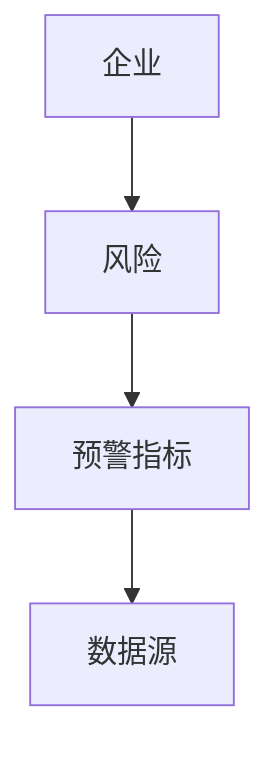
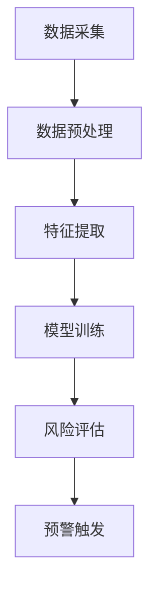
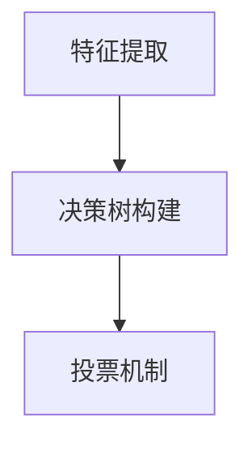
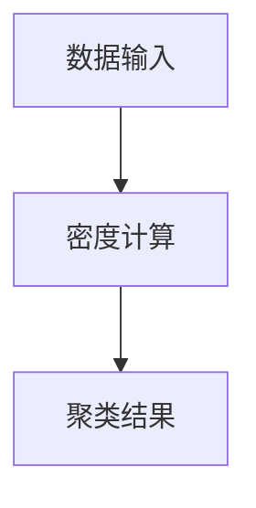
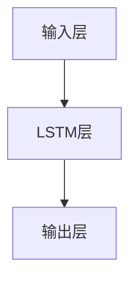
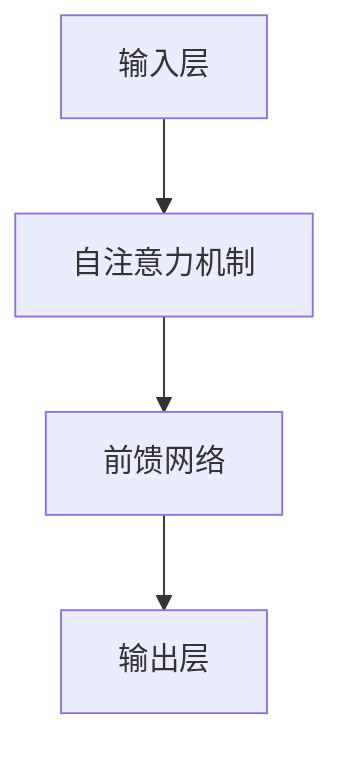
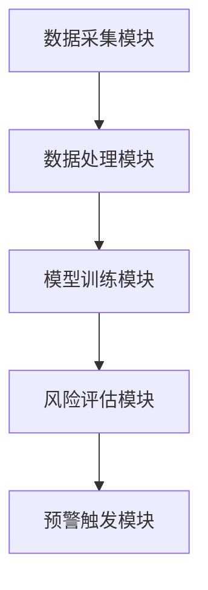
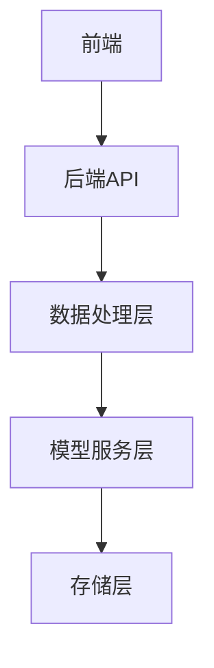
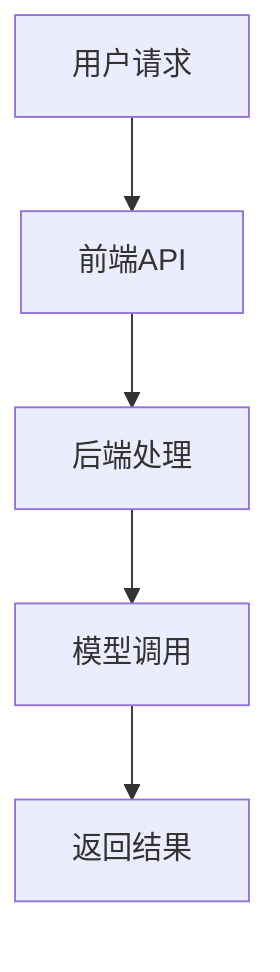

                 


# 构建AI驱动的企业风险预警系统

> 关键词：AI驱动、企业风险预警、风险管理、机器学习、深度学习、系统架构

> 摘要：本文详细探讨了如何利用人工智能技术构建企业风险预警系统，从系统背景、核心概念、算法原理到系统架构设计，再到项目实战，全面解析了AI在企业风险管理中的应用。通过实际案例分析和代码实现，深入浅出地展示了如何利用AI技术提升企业风险预警能力，为企业风险管理提供新的思路和解决方案。

---

# 第一部分: 企业风险预警系统概述

## 第1章: 企业风险预警系统背景与概念

### 1.1 企业风险预警的定义与背景

#### 1.1.1 企业风险的定义与分类
企业风险是指企业在经营过程中可能面临的各种不确定性，这些不确定性可能对企业财务状况、市场地位、声誉等产生负面影响。风险可以分为财务风险、市场风险、操作风险、信用风险等。

#### 1.1.2 风险预警的重要性与价值
风险预警是通过实时监控和分析企业内外部数据，识别潜在风险，并提前发出预警信号，从而帮助企业采取措施降低风险损失。AI技术的应用使得风险预警更加智能化和高效化。

#### 1.1.3 AI技术在风险预警中的应用前景
随着AI技术的快速发展，企业风险预警系统逐渐从传统的规则-based系统向AI驱动的智能系统转变。AI技术可以通过大数据分析、机器学习模型等手段，实时捕捉和分析潜在风险，显著提升风险预警的准确性和效率。

### 1.2 企业风险预警系统的核心要素

#### 1.2.1 数据来源与特征
企业风险预警系统的主要数据来源包括：
- **财务数据**：如收入、利润、负债等。
- **市场数据**：如行业趋势、竞争对手信息等。
- **舆情数据**：如社交媒体、新闻媒体中的相关信息。
- **操作数据**：如生产流程、供应链中的异常数据。

数据特征包括：时间性、关联性、波动性等。

#### 1.2.2 风险评估模型
风险评估模型是企业风险预警系统的核心，常用的模型包括：
- **概率模型**：如logistic回归、随机森林等。
- **时间序列模型**：如ARIMA、LSTM等。
- **聚类模型**：如K-means、DBSCAN等。

#### 1.2.3 预警触发机制
预警触发机制是根据模型预测结果和预设阈值，决定是否触发预警信号。常见的触发机制包括：
- **静态阈值**：根据历史数据设定固定阈值。
- **动态阈值**：根据实时数据波动情况动态调整阈值。
- **组合触发**：结合多个模型的预测结果进行综合判断。

### 1.3 本章小结
本章从企业风险的定义与分类出发，分析了风险预警的重要性及其在AI技术驱动下的应用前景。同时，详细阐述了企业风险预警系统的核心要素，包括数据来源、模型选择和预警触发机制。

---

# 第二部分: AI驱动的风险预警系统核心概念

## 第2章: AI在企业风险预警中的核心原理

### 2.1 数据驱动的预警模型

#### 2.1.1 数据采集与预处理
数据采集是企业风险预警系统的第一步，主要包括数据清洗、特征提取、数据标注等过程。以下是数据预处理的关键步骤：
1. **数据清洗**：去除噪声数据、填补缺失值、处理异常值。
2. **特征提取**：从原始数据中提取对风险评估有影响的关键特征。
3. **数据标注**：根据历史数据对风险事件进行标注，为模型训练提供标签。

#### 2.1.2 数据特征选择与提取
特征选择是提高模型准确性的关键步骤。常用的特征选择方法包括：
- **基于统计的方法**：如卡方检验、相关系数分析。
- **基于模型的方法**：如Lasso回归、随机森林特征重要性分析。
- **基于领域知识的方法**：结合业务需求选择关键特征。

#### 2.1.3 数据标注与清洗
数据标注是根据企业的历史数据，将风险事件标注为正常、低风险、中风险、高风险等类别。数据清洗则是确保数据的完整性和一致性，为后续模型训练提供高质量的数据。

### 2.2 风险评估模型的构建

#### 2.2.1 监督学习与无监督学习的对比
- **监督学习**：需要标注数据，适合分类和回归任务。
- **无监督学习**：无需标注数据，适合聚类和异常检测任务。

#### 2.2.2 基于机器学习的风险评估模型
- **logistic回归**：适用于二分类问题，如正常风险和高风险。
- **随机森林**：适用于多分类问题，具有较高的准确性和鲁棒性。
- **梯度提升树（如XGBoost、LightGBM）**：适合处理非线性关系，性能优于传统树模型。

#### 2.2.3 深度学习在风险预警中的应用
- **神经网络**：适用于非线性特征提取。
- **LSTM**：适合处理时间序列数据，捕捉长期依赖关系。
- **Transformer**：适用于大规模并行计算，适合处理高维特征。

### 2.3 预警触发与反馈机制

#### 2.3.1 预警阈值的设定
- 根据历史数据和业务需求，设定不同级别的预警阈值。
- 动态调整阈值，以适应数据分布的变化。

#### 2.3.2 预警触发规则
- 单一指标触发：当某个指标超过阈值时，触发预警。
- 组合指标触发：当多个指标同时超过阈值时，触发预警。
- 权重触发：根据指标的重要性和权重，综合判断是否触发预警。

#### 2.3.3 预警反馈与优化
- 根据预警结果和实际风险事件，优化模型参数和触发规则。
- 定期更新模型，确保系统的准确性和实时性。

## 第3章: AI驱动的风险预警系统核心概念

### 3.1 实体关系图（ER图）



### 3.2 系统流程图



### 3.3 核心概念对比表

| 概念         | 描述                                                         | 示例                       |
|--------------|--------------------------------------------------------------|----------------------------|
| 数据源       | 输入数据的来源                                             | 财务数据、市场数据、舆情数据 |
| 风险指标     | 衡量风险的关键指标                                         | 利润率、违约率、风险敞口   |
| 模型类型     | 风险评估所用算法                                           | logistic回归、随机森林、LSTM |

---

# 第三部分: AI驱动的风险预警系统算法原理

## 第4章: 基于机器学习的风险评估算法

### 4.1 监督学习模型

#### 4.1.1 logistic回归模型
$$ P(y=1|x) = \frac{e^{\beta_0 + \beta_1x_1}}{1 + e^{\beta_0 + \beta_1x_1}} $$

#### 4.1.2 随机森林模型


### 4.2 无监督学习模型

#### 4.2.1 K-means聚类算法
$$ \text{目标函数} = \sum_{i=1}^{n} \sum_{j=1}^{k} \min(d(x_i, c_j)) $$

#### 4.2.2 DBSCAN算法


---

## 第5章: 基于深度学习的风险评估算法

### 5.1 LSTM网络

#### 5.1.1 LSTM结构
$$ f(t) = \text{LSTM}(t-1, t) $$



### 5.2 Transformer模型

#### 5.2.1 Transformer结构
$$ \text{Attention}(Q, K, V) = \text{softmax}\left(\frac{QK^T}{\sqrt{d_k}}\right)V $$



---

## 第6章: 系统分析与架构设计方案

### 6.1 项目介绍

#### 6.1.1 项目背景
企业风险预警系统旨在通过实时监控企业内外部数据，识别潜在风险，并提前发出预警信号。

#### 6.1.2 项目目标
- 实现企业风险的实时监测。
- 提供精准的风险评估和预警。
- 提供可扩展的系统架构，支持数据的实时更新和模型的动态优化。

### 6.2 系统功能设计

#### 6.2.1 领域模型


#### 6.2.2 系统架构设计


### 6.3 系统接口设计

#### 6.3.1 API接口
- **数据接口**：用于数据的采集和传输。
- **模型接口**：用于模型的调用和预测。
- **预警接口**：用于预警信号的触发和通知。

### 6.4 系统交互流程

#### 6.4.1 序列图


---

## 第7章: 项目实战

### 7.1 环境安装

#### 7.1.1 安装Python
```bash
python --version
```

#### 7.1.2 安装依赖库
```bash
pip install numpy pandas scikit-learn tensorflow
```

### 7.2 系统核心实现

#### 7.2.1 数据采集与处理
```python
import pandas as pd
import numpy as np

# 数据采集
data = pd.read_csv('risk_data.csv')

# 数据处理
data.dropna(inplace=True)
data = pd.get_dummies(data)
```

#### 7.2.2 模型训练与预测
```python
from sklearn.ensemble import RandomForestClassifier
from sklearn.metrics import accuracy_score

# 模型训练
model = RandomForestClassifier()
model.fit(X_train, y_train)

# 模型预测
y_pred = model.predict(X_test)
print('准确率:', accuracy_score(y_test, y_pred))
```

### 7.3 案例分析与结果解读

#### 7.3.1 案例分析
假设我们有一个企业，其财务数据、市场数据和舆情数据如下：
- **财务数据**：收入下降，利润减少。
- **市场数据**：行业竞争加剧，市场需求下降。
- **舆情数据**：媒体报道负面信息增多。

模型预测结果显示该企业存在较高的风险，触发预警信号。

#### 7.3.2 结果解读
根据模型预测结果，企业应采取以下措施：
1. 优化财务结构，降低负债率。
2. 提高市场竞争力，拓展新的市场。
3. 加强舆情管理，降低负面信息的影响。

### 7.4 项目小结

---

## 第8章: 最佳实践与注意事项

### 8.1 最佳实践
1. **数据质量管理**：确保数据的准确性和完整性。
2. **模型优化**：定期更新模型，避免过时。
3. **系统维护**：定期检查系统运行状态，及时修复问题。

### 8.2 小结
本文详细介绍了如何构建AI驱动的企业风险预警系统，从理论到实践，全面解析了系统的核心概念、算法原理和架构设计。通过实际案例分析，展示了系统的应用价值和实际效果。

### 8.3 注意事项
- 数据隐私和安全问题需要高度重视。
- 模型的可解释性需要在实际应用中不断优化。
- 系统的实时性和稳定性是确保预警效果的关键。

### 8.4 拓展阅读
- 《机器学习实战》
- 《深度学习》
- 《企业风险管理》

---

# 结语

通过本文的详细讲解，读者可以全面掌握AI驱动的企业风险预警系统的构建方法，从数据处理、模型训练到系统设计，逐步实现一个高效、智能的风险预警系统。希望本文的内容能够为企业风险管理提供新的思路和解决方案。

