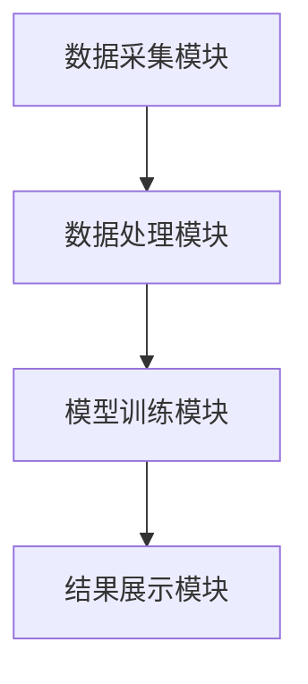

                 


# 构建AI驱动的客户生命周期管理系统

## 关键词：客户生命周期管理, AI, 机器学习, 系统架构, 项目实战

## 摘要：  
本文详细探讨了如何利用人工智能技术构建客户生命周期管理系统。从客户生命周期管理的基本概念到AI驱动技术的应用，再到系统的算法原理、架构设计和项目实战，全面解析了构建该系统的关键步骤和实现细节。通过理论与实践相结合的方式，为读者提供了从理解到实现的完整指南。

---

## 第1章: 客户生命周期管理概述

### 1.1 客户生命周期管理的基本概念

客户生命周期管理（Customer Life Cycle Management, CLM）是指企业通过识别、分析和管理客户在其生命周期中的不同阶段，以优化客户体验、提升客户忠诚度和实现商业目标的过程。客户生命周期通常包括以下几个阶段：获取、激活、成长、成熟、衰退和流失。

- **获取阶段**：通过营销活动吸引新客户。
- **激活阶段**：将潜在客户转化为实际购买者。
- **成长阶段**：提升客户的购买频率和金额。
- **成熟阶段**：客户成为企业的核心客户，具有高度忠诚度。
- **衰退阶段**：客户购买频率下降，逐渐失去兴趣。
- **流失阶段**：客户停止与企业互动，不再进行任何交易。

客户生命周期管理的核心在于通过数据分析和预测，识别客户在不同阶段的行为变化，从而制定相应的策略。

### 1.2 AI驱动技术在客户生命周期管理中的作用

AI技术通过数据挖掘、机器学习和深度学习等方法，能够从海量客户数据中提取有价值的信息，帮助企业在客户生命周期的各个阶段做出更精准的决策。

- **客户行为预测**：通过分析客户的历史数据，预测客户未来的购买行为。
- **客户分层与精准营销**：利用聚类分析等技术将客户分为不同的群体，并针对不同群体制定个性化的营销策略。
- **客户流失预测**：通过机器学习模型预测客户是否可能流失，并采取相应的措施。

### 1.3 构建AI驱动的客户生命周期管理系统的必要性

传统客户管理方法往往依赖于人工经验，存在效率低、精准度差等问题。AI驱动的系统能够通过自动化处理和数据分析，显著提升客户管理的效率和效果。

- **提升客户满意度**：通过精准的客户分层和个性化服务，提高客户满意度。
- **降低客户流失率**：通过预测客户流失风险，提前采取措施。
- **提高营销效率**：通过精准营销减少资源浪费，提高转化率。

---

## 第2章: 客户生命周期管理系统的核心概念与联系

### 2.1 核心概念原理

客户生命周期管理系统的构建涉及多个核心概念，包括客户数据、行为分析、AI算法等。以下是这些核心概念的详细解释：

- **客户数据**：包括客户的基本信息（如姓名、年龄、性别等）、交易记录、互动记录等。
- **行为分析**：通过对客户数据的分析，识别客户的行为模式，如购买频率、购买偏好等。
- **AI算法**：包括监督学习、无监督学习等算法，用于客户分层、行为预测等任务。

### 2.2 核心概念属性特征对比表

以下是客户生命周期管理中核心概念的属性特征对比表：

| 概念         | 属性       | 特征                                                                 |
|--------------|------------|----------------------------------------------------------------------|
| 客户生命周期 | 时间维度   | 不同阶段的特征变化                                                     |
| AI算法       | 类型       | 监督学习、无监督学习、深度学习                                         |
| 系统架构     | 层次       | 数据层、算法层、应用层                                                 |

### 2.3 ER实体关系图

以下是客户生命周期管理系统的核心实体关系图：

```mermaid
erDiagram
    customer[CUSTOMER] {
        id : integer
        name : string
        email : string
        phone : string
        registration_date : date
    }
    interaction[INTERACTION] {
        id : integer
        customer_id : integer
        timestamp : datetime
        action : string
        result : string
    }
    transaction[TRANSACTION] {
        id : integer
        customer_id : integer
        amount : decimal
        date : datetime
        status : string
    }
    CUSTOMER o-1 INTERACTION
    CUSTOMER o-1 TRANSACTION
```

---

## 第3章: AI驱动的客户生命周期管理系统的算法原理

### 3.1 机器学习算法在客户管理中的应用

机器学习算法在客户生命周期管理中的应用主要体现在以下几个方面：

- **监督学习**：用于客户流失预测、客户价值评分等任务。
- **无监督学习**：用于客户分层、异常检测等任务。
- **深度学习**：用于复杂的模式识别任务，如自然语言处理（NLP）。

### 3.2 常见AI算法的实现流程

以下是常见AI算法的实现流程：

1. **数据预处理**：包括数据清洗、特征提取、数据标准化等步骤。
2. **模型训练**：选择合适的算法，训练模型。
3. **模型评估**：通过交叉验证、准确率、召回率等指标评估模型性能。
4. **模型优化**：调整超参数，提升模型性能。

### 3.3 算法实现

以下是客户流失预测的机器学习模型实现示例：

```python
# 数据预处理
import pandas as pd
from sklearn.model_selection import train_test_split
from sklearn.preprocessing import StandardScaler
from sklearn.linear_model import LogisticRegression
from sklearn.metrics import accuracy_score

# 加载数据
data = pd.read_csv('customer_data.csv')

# 特征选择
X = data[['age', 'income', 'purchase_frequency']]
y = data['churn']

# 数据分割
X_train, X_test, y_train, y_test = train_test_split(X, y, test_size=0.2, random_state=42)

# 数据标准化
scaler = StandardScaler()
X_train = scaler.fit_transform(X_train)
X_test = scaler.transform(X_test)

# 模型训练
model = LogisticRegression()
model.fit(X_train, y_train)

# 模型预测
y_pred = model.predict(X_test)

# 模型评估
print("准确率:", accuracy_score(y_test, y_pred))
```

---

## 第4章: 系统架构设计与实现

### 4.1 系统功能设计

客户生命周期管理系统的功能模块包括：

- **数据采集**：收集客户的基本信息、交易记录、互动记录等。
- **数据处理**：对数据进行清洗、转换和标准化。
- **模型训练**：基于机器学习算法训练客户生命周期预测模型。
- **结果展示**：将模型预测结果以可视化的方式展示。

### 4.2 系统架构设计

以下是系统的总体架构图：



### 4.3 系统接口设计

系统接口设计包括以下几个部分：

- **数据接口**：与数据库或API对接，获取客户数据。
- **模型接口**：与机器学习模型对接，获取预测结果。
- **展示接口**：与前端展示界面对接，展示预测结果。

---

## 第5章: 项目实战

### 5.1 环境安装

以下是构建系统的环境要求：

- **编程语言**：Python 3.6+
- **机器学习库**：scikit-learn、TensorFlow
- **数据处理工具**：Pandas、NumPy
- **可视化工具**：Matplotlib、Seaborn

### 5.2 核心代码实现

以下是客户流失预测模型的实现代码：

```python
# 导入所需的库
import pandas as pd
from sklearn.model_selection import train_test_split
from sklearn.preprocessing import StandardScaler
from sklearn.linear_model import LogisticRegression
from sklearn.metrics import accuracy_score, classification_report

# 加载数据
data = pd.read_csv('customer.csv')

# 特征选择
X = data[['age', 'income', 'purchase_frequency', 'recency']]
y = data['churn']

# 数据分割
X_train, X_test, y_train, y_test = train_test_split(X, y, test_size=0.2, random_state=42)

# 数据标准化
scaler = StandardScaler()
X_train = scaler.fit_transform(X_train)
X_test = scaler.transform(X_test)

# 模型训练
model = LogisticRegression()
model.fit(X_train, y_train)

# 模型预测
y_pred = model.predict(X_test)

# 模型评估
print("准确率:", accuracy_score(y_test, y_pred))
print("\n分类报告:")
print(classification_report(y_test, y_pred))
```

### 5.3 实际案例分析

以下是客户流失预测的实际案例分析：

假设我们有一个客户数据集，包含以下字段：年龄、收入、购买频率、最近一次购买时间、是否流失。我们使用逻辑回归模型进行客户流失预测。

通过上述代码实现，我们可以得到模型的准确率和分类报告。根据结果，我们可以识别出哪些客户可能流失，并采取相应的措施。

---

## 第6章: 总结与展望

### 6.1 本章总结

本文详细探讨了如何构建AI驱动的客户生命周期管理系统，从背景介绍到算法实现，再到系统架构设计和项目实战，为读者提供了完整的实现指南。

### 6.2 未来展望

随着AI技术的不断发展，客户生命周期管理系统将更加智能化和个性化。未来的研究方向包括：

- 更精准的客户行为预测模型。
- 更高效的客户分层方法。
- 更智能化的客户互动管理。

---

## 附录

### A. 参考文献

1. 刘军. (2020). 《基于机器学习的客户流失预测研究》.
2. 王强. (2021). 《AI驱动的客户生命周期管理》.

### B. 技术工具

- 数据分析工具：Pandas、NumPy
- 可视化工具：Matplotlib、Seaborn
- 机器学习框架：scikit-learn、TensorFlow

---

通过本文的学习，读者可以掌握构建AI驱动的客户生命周期管理系统的相关知识，并能够实际应用这些技术进行系统开发。

