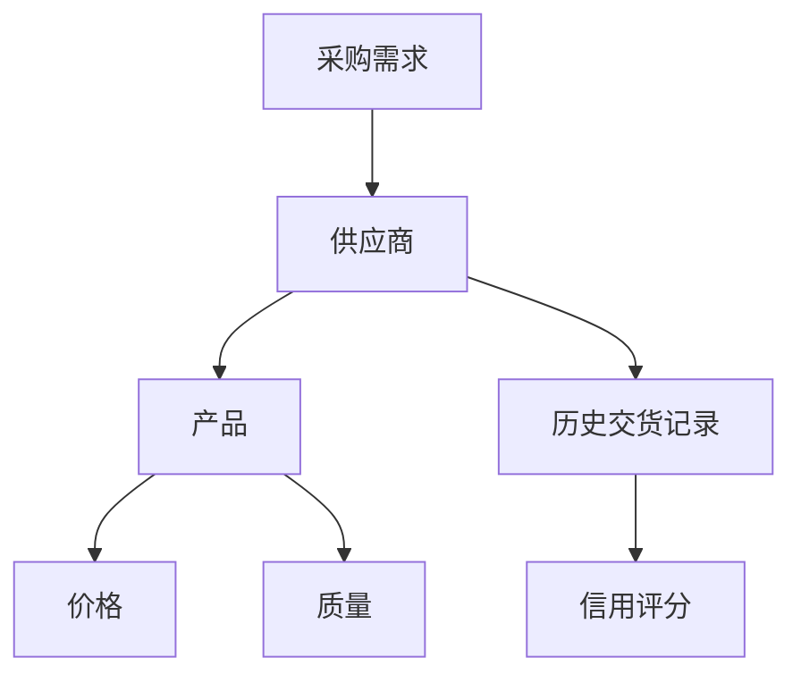
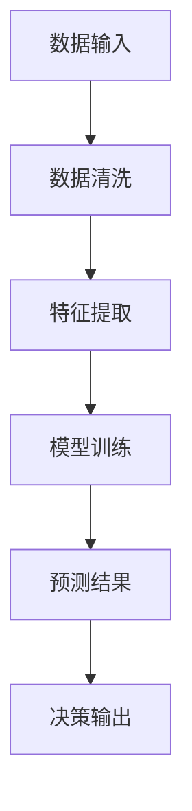
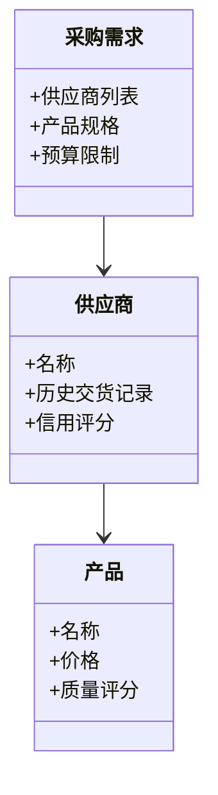
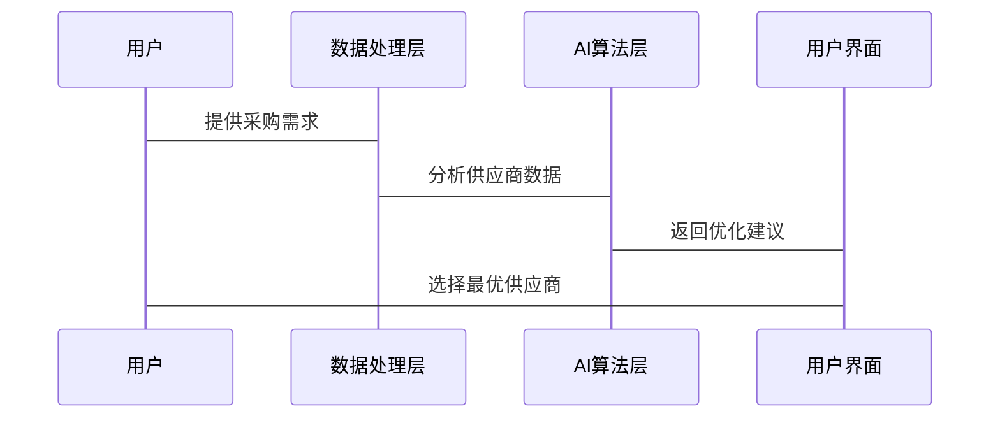

                 


# 构建AI驱动的采购助手：优化供应商选择与谈判

## 关键词：
- AI驱动采购
- 供应商选择
- 谈判优化
- 数据分析
- 自动化采购

## 摘要：
随着企业对高效采购流程的需求不断增长，AI技术的应用正在改变传统的采购方式。本文将详细探讨如何利用AI构建采购助手，通过优化供应商选择和谈判过程，提高采购效率和降低成本。从问题背景到系统架构设计，从算法原理到项目实战，本文提供全面的分析与解决方案，帮助读者掌握AI驱动采购的核心技术与应用。

---

# 目录大纲

## 第一部分：AI驱动的采购助手背景介绍

### 第1章：问题背景与描述

#### 1.1 问题背景
- 1.1.1 传统采购流程的挑战
- 1.1.2 供应商选择的复杂性
- 1.1.3 谈判过程中的信息不对称

#### 1.2 问题描述
- 1.2.1 供应商评估的关键因素
- 1.2.2 谈判中的痛点
- 1.2.3 数据驱动采购的必要性

#### 1.3 问题解决
- 1.3.1 AI在采购中的应用潜力
- 1.3.2 数据分析如何优化供应商选择
- 1.3.3 自动化谈判工具的优势

#### 1.4 边界与外延
- 1.4.1 采购助手的适用范围
- 1.4.2 与其他系统的集成
- 1.4.3 业务流程的灵活性

#### 1.5 核心概念组成
- 1.5.1 数据驱动的决策模型
- 1.5.2 自动化谈判策略
- 1.5.3 多目标优化算法

---

## 第二部分：核心概念与联系

### 第2章：核心概念原理

#### 2.1 AI驱动的采购助手原理
- 2.1.1 数据收集与处理
- 2.1.2 智能分析与决策
- 2.1.3 自动化执行与反馈

#### 2.2 核心概念特征对比
- 2.2.1 数据驱动 vs. 传统采购
- 2.2.2 AI算法 vs. 专家经验
- 2.2.3 自动化 vs. 手动操作

#### 2.3 ER实体关系图


#### 2.4 算法流程图


### 第3章：算法原理与数学模型

#### 3.1 算法原理
- 3.1.1 多目标优化算法
- 3.1.2 聚类分析
- 3.1.3 回归分析

#### 3.2 数学模型
- 3.2.1 供应商评分模型
$$ \text{评分} = \alpha \times \text{价格} + \beta \times \text{质量} + \gamma \times \text{交货时间} $$

- 3.2.2 谈判策略优化
$$ \text{最优价格} = \min_{p} \left( p + \text{谈判成本} \right) $$

#### 3.3 举例说明
- 3.3.1 供应商A与供应商B的对比分析

---

## 第三部分：系统分析与架构设计方案

### 第4章：系统架构设计

#### 4.1 问题场景介绍
- 4.1.1 供应商选择与谈判的具体场景
- 4.1.2 系统需要解决的主要问题

#### 4.2 项目介绍
- 4.2.1 项目目标
- 4.2.2 项目范围
- 4.2.3 项目技术选型

#### 4.3 系统功能设计
- 4.3.1 领域模型（Mermaid类图）


#### 4.4 系统架构设计（Mermaid架构图）


#### 4.5 系统接口设计
- 4.5.1 数据接口
- 4.5.2 用户接口
- 4.5.3 第三方服务接口

#### 4.6 系统交互（Mermaid序列图）


---

## 第四部分：项目实战

### 第5章：项目实战

#### 5.1 环境安装
- 5.1.1 安装Python
- 5.1.2 安装相关库（如numpy, pandas, scikit-learn）
- 5.1.3 安装Jupyter Notebook

#### 5.2 系统核心实现源代码
```python
# 示例代码：供应商评分模型
import numpy as np
import pandas as pd
from sklearn.metrics import mean_squared_error

# 数据加载
data = pd.read_csv('suppliers.csv')

# 特征提取
X = data[['price', 'quality', 'delivery_time']]
y = data['score']

# 模型训练
from sklearn.linear_model import LinearRegression
model = LinearRegression()
model.fit(X, y)

# 预测结果
predicted_scores = model.predict(X)
print('均方误差:', mean_squared_error(y, predicted_scores))
```

#### 5.3 代码应用解读与分析
- 5.3.1 数据加载与预处理
- 5.3.2 特征工程
- 5.3.3 模型训练与优化
- 5.3.4 结果分析与可视化

#### 5.4 实际案例分析
- 5.4.1 案例背景
- 5.4.2 数据分析与处理
- 5.4.3 模型应用与结果展示

#### 5.5 项目小结
- 5.5.1 项目成果
- 5.5.2 经验总结
- 5.5.3 改进建议

---

## 第五部分：最佳实践与总结

### 第6章：最佳实践

#### 6.1 最佳实践
- 6.1.1 数据质量管理
- 6.1.2 模型选择与调优
- 6.1.3 系统集成与维护

#### 6.2 小结
- 6.2.1 项目总结
- 6.2.2 未来展望

#### 6.3 注意事项
- 6.3.1 数据隐私与安全
- 6.3.2 模型解释性
- 6.3.3 系统可扩展性

#### 6.4 拓展阅读
- 6.4.1 推荐的技术书籍
- 6.4.2 相关研究论文
- 6.4.3 实践资源推荐

---

## 结语

通过本篇文章，我们详细探讨了构建AI驱动的采购助手的各个方面，从问题背景到系统架构设计，从算法原理到项目实战，为读者提供了全面的指导。希望这些内容能够帮助企业在采购流程中实现优化与创新，提升整体效率与竞争力。

