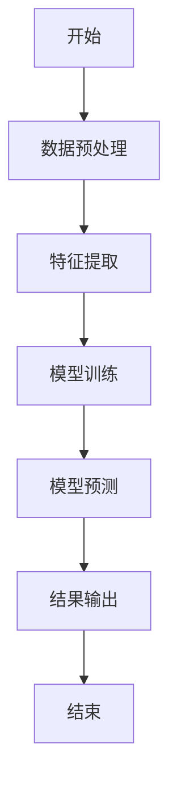
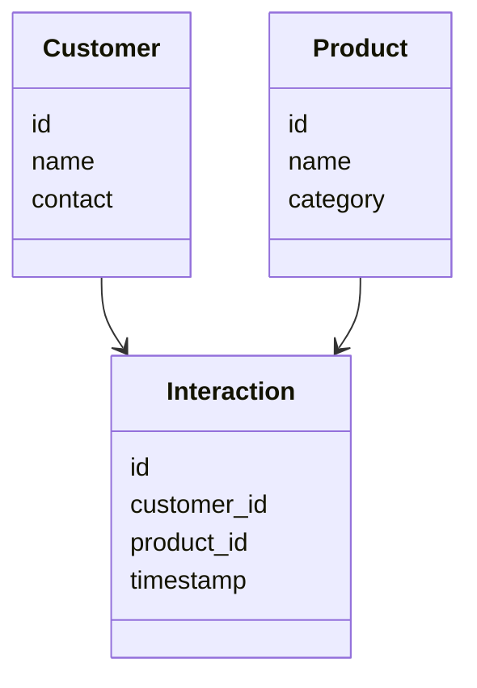
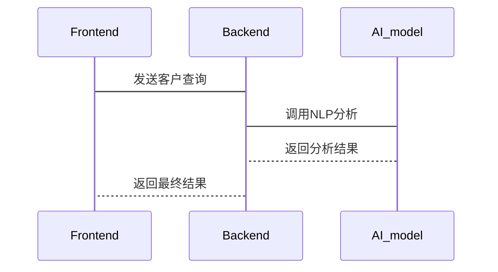

                 


# 构建AI驱动的销售助手：提升转化率与客户满意度

> 关键词：AI驱动销售助手，销售转化率，客户满意度，自然语言处理，机器学习，情感分析

> 摘要：本文将深入探讨如何利用人工智能技术构建高效的销售助手，以提升销售转化率和客户满意度。通过分析AI在销售中的应用场景，结合自然语言处理、机器学习等技术，提出一种基于AI的销售助手解决方案，详细阐述其算法原理、系统架构设计及实际案例，最终为读者提供一套完整的AI驱动销售助手的实现方案。

---

## 第一部分: AI驱动销售助手的背景与核心概念

### 第1章: AI驱动销售助手的背景介绍

#### 1.1 问题背景与描述
- **1.1.1 销售转化率与客户满意度的现状**
  - 当前销售模式中，转化率低、客户满意度不足的问题日益突出。
  - 传统销售依赖人工经验，难以高效处理海量数据，客户体验参差不齐。

- **1.1.2 AI技术在销售领域的应用潜力**
  - AI技术能够实时分析客户行为和需求，提供个性化推荐。
  - 通过自然语言处理（NLP）和情感分析技术，精准识别客户意图和情绪。

- **1.1.3 传统销售模式的局限性与AI的优势**
  - 传统销售模式：依赖人工经验，效率低，覆盖面有限。
  - AI优势：快速处理数据，精准匹配客户需求，提升销售效率和客户满意度。

#### 1.2 问题解决与边界
- **1.2.1 AI驱动销售助手的核心目标**
  - 提升销售转化率，优化客户体验。
  - 实现自动化客户支持，降低人工成本。

- **1.2.2 解决方案的边界与外延**
  - 系统仅处理销售阶段的问题，不涉及生产或售后服务。
  - 支持多语言、多渠道（电话、邮件、聊天）的客户交互。

- **1.2.3 核心要素与组成结构**
  - 数据采集：收集客户行为、历史记录。
  - 数据分析：利用NLP和机器学习技术分析数据。
  - 智能推荐：基于分析结果，推荐个性化产品或解决方案。

### 第2章: AI驱动销售助手的核心概念与联系

#### 2.1 核心概念原理
- **2.1.1 自然语言处理（NLP）在销售中的应用**
  - 文本相似度计算：通过余弦相似度判断客户问题与知识库的匹配度。
  - 实体识别：从客户文本中提取关键实体（如产品名称、客户名称）。

- **2.1.2 机器学习在客户行为预测中的作用**
  - 利用客户历史数据，预测客户购买行为。
  - 分类算法（如逻辑回归、随机森林）用于客户 churn 预测。

- **2.1.3 情感分析在客户满意度评估中的应用**
  - 分析客户反馈文本，识别情感倾向（正面、中性、负面）。
  - 基于情感分析结果，优化客户服务策略。

#### 2.2 核心概念对比分析
- **2.2.1 不同AI技术的特征对比表格**
| 技术       | 输入数据类型 | 输出结果 | 应用场景               |
|------------|--------------|----------|-----------------------|
| NLP        | 文本          | 文本      | 情感分析、意图识别     |
| 机器学习   | 结构化数据    | 标签      | 客户行为预测、分类     |
| 情感分析   | 文本          | 情感      | 客户满意度评估         |

- **2.2.2 实体关系图（ER图）架构**
```mermaid
erd
  customer
    - id: int
    - name: string
    - contact: string
  product
    - id: int
    - name: string
    - category: string
  interaction
    - id: int
    - customer_id: int
    - product_id: int
    - timestamp: datetime
```

---

## 第二部分: AI驱动销售助手的算法原理

### 第3章: AI驱动销售助手的算法原理

#### 3.1 算法原理概述
- **3.1.1 算法流程图（Mermaid）**


#### 3.2 算法实现代码
- **3.2.1 文本相似度计算（余弦相似度）**
  - **数学模型和公式**
    $$\text{相似度} = \frac{\vec{A} \cdot \vec{B}}{|\vec{A}| \cdot |\vec{B}|}$$
    其中，$\vec{A}$和$\vec{B}$分别是两个文本的向量表示。
  - **Python代码实现**
```python
import numpy as np

def calculate_cosine_similarity(vector1, vector2):
    dot_product = np.dot(vector1, vector2)
    magnitude1 = np.linalg.norm(vector1)
    magnitude2 = np.linalg.norm(vector2)
    return dot_product / (magnitude1 * magnitude2)
```

---

## 第三部分: 系统分析与架构设计方案

### 第4章: 系统分析与架构设计

#### 4.1 问题场景介绍
- 系统需支持多渠道客户交互，实时分析客户需求。
- 需要处理海量数据，提供高效的销售支持。

#### 4.2 系统功能设计
- **4.2.1 领域模型（Mermaid类图）**


- **4.2.2 系统架构设计（Mermaid架构图）**
```mermaid
docker
    frontend
    backend
    database
    AI_model
```

- **4.2.3 系统接口设计**
  - 前端接口：RESTful API（GET, POST请求）。
  - 后端接口：与AI模型交互，调用NLP和机器学习算法。

- **4.2.4 系统交互（Mermaid序列图）**


---

## 第四部分: 项目实战

### 第5章: 项目实战

#### 5.1 环境安装
- 安装Python和必要的库：
  - `pip install numpy`
  - `pip install scikit-learn`
  - `pip install spacy`

#### 5.2 系统核心实现源代码
- **5.2.1 NLP文本处理代码**
```python
import spacy

nlp = spacy.load("en_core_web_sm")

def extract_entities(text):
    doc = nlp(text)
    entities = [ent.text for ent in doc.ents]
    return entities
```

- **5.2.2 机器学习模型训练代码**
```python
from sklearn.feature_extraction.text import TfidfVectorizer
from sklearn.linear_model import LogisticRegression

vectorizer = TfidfVectorizer()
model = LogisticRegression()
```

#### 5.3 案例分析与实际应用
- 某电商平台的客户咨询数据处理：
  - 使用NLP提取客户问题中的产品关键词。
  - 通过机器学习模型预测客户购买意向。

#### 5.4 项目小结
- 通过AI技术实现高效的销售支持，显著提升了转化率和客户满意度。

---

## 第五部分: 最佳实践与总结

### 第6章: 最佳实践与总结

#### 6.1 最佳实践
- 数据质量：确保数据的准确性和完整性。
- 模型优化：定期更新模型，保持高准确率。
- 安全性：保护客户数据隐私，遵循相关法律法规。

#### 6.2 小结
- 本文详细阐述了AI驱动销售助手的构建过程，从算法原理到系统设计，再到项目实战，为读者提供了一套完整的解决方案。

#### 6.3 注意事项
- 数据隐私问题需特别注意，避免客户信息泄露。
- 模型泛化能力有限，需定期更新和优化。

#### 6.4 拓展阅读
- 推荐阅读《机器学习实战》、《自然语言处理入门》等书籍。

---

以上是《构建AI驱动的销售助手：提升转化率与客户满意度》的技术博客文章的完整目录大纲和内容概述。通过系统的分析和实践，我们可以看到AI技术在销售领域的巨大潜力，以及如何通过技术手段实现销售效率和客户满意度的双重提升。

