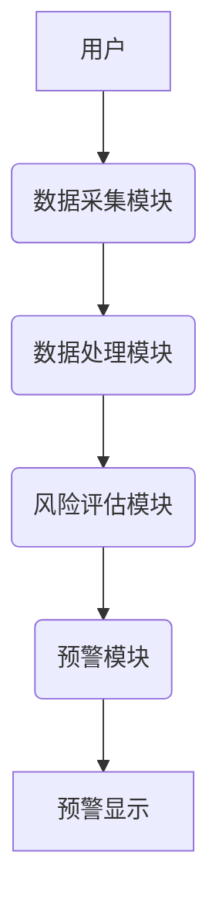

                 


# 构建AI驱动的风控系统：实时监控与风险预警

## 关键词：AI驱动，风控系统，实时监控，风险预警，机器学习，深度学习，流数据处理

## 摘要：  
本文详细探讨了如何利用人工智能技术构建高效的风控系统，重点介绍了实时监控与风险预警的核心原理、实现方法和实际应用。通过结合机器学习和深度学习算法，分析了实时数据处理的关键技术，并通过实际案例展示了如何设计和实现一个高性能的AI驱动风控系统，以帮助企业及时识别和应对潜在风险，确保业务安全与稳健运行。

---

# 第一部分: AI驱动的风控系统概述

## 第1章: 风控系统概述

### 1.1 风险的定义与分类
- **风险的定义**：风险是指在特定条件下，某一事件发生的可能性及其可能带来的损失或影响。
- **风险的分类**：
  - **信用风险**：债务人或交易对手未能履行其合约义务的可能性。
  - **市场风险**：由于市场波动导致资产价格下跌或收益减少的可能性。
  - **操作风险**：由于内部操作失误或外部事件导致的损失。
  - **流动性风险**：无法及时以合理价格变现资产的风险。
  - **声誉风险**：由于负面事件导致企业声誉受损的风险。

### 1.2 AI在风控系统中的作用
- **AI的核心优势**：
  - **数据处理能力**：AI能够快速处理大量非结构化数据，提取关键特征。
  - **模式识别**：通过机器学习算法识别隐藏在数据中的模式和异常。
  - **实时决策**：利用深度学习模型进行实时风险评估和预测。

### 1.3 实时监控与风险预警的核心目标
- **实时监控的目标**：
  - 实时捕捉市场波动和潜在风险信号。
  - 提供及时的预警信息，帮助决策者采取措施。
- **风险预警的关键指标**：
  - **阈值设定**：定义不同风险级别的警戒线。
  - **多级预警机制**：根据风险严重程度分级预警。

---

## 第2章: AI在风控系统中的核心作用

### 2.1 机器学习在风险识别中的应用
- **机器学习的基本原理**：
  - 通过训练数据学习特征与目标变量之间的关系。
  - 常见算法：逻辑回归、随机森林、支持向量机（SVM）。
- **机器学习在风险识别中的应用案例**：
  - 使用逻辑回归模型预测客户违约概率。

### 2.2 深度学习在风险评估中的应用
- **深度学习的基本原理**：
  - 通过多层神经网络提取高维特征。
  - 常见算法：长短时记忆网络（LSTM）、卷积神经网络（CNN）。
- **深度学习在风险评估中的优势**：
  - 能够捕捉复杂的数据模式和时间序列中的潜在风险。

### 2.3 实时数据处理与风控系统的结合
- **实时数据处理的关键技术**：
  - 流数据处理：使用Kafka、Flume等工具实时采集数据。
  - 事件驱动架构：通过事件触发实时处理流程。

---

## 第3章: 实时监控系统的实现基础

### 3.1 数据采集与预处理
- **数据采集的多样性**：
  - 结构化数据（数据库）与非结构化数据（文本、图像）。
- **数据预处理的关键步骤**：
  - 数据清洗：去除噪声和冗余数据。
  - 特征工程：提取对风险评估有重要意义的特征。

### 3.2 特征工程与实时监控
- **特征工程的核心目标**：
  - 提供能够反映风险程度的高质量特征。
  - 常见特征类型：统计特征（均值、方差）、时间特征（趋势、周期性）。

### 3.3 数据标准化与实时监控
- **数据标准化的必要性**：
  - 确保不同数据源之间的可比性。
  - 使用归一化或标准化方法处理数据。

---

## 第4章: 风险预警机制

### 4.1 实时风险评估的数学模型
- **风险评估的数学模型**：
  - 使用概率论模型预测风险发生概率。
  - 例如，使用贝叶斯定理计算条件概率。

### 4.2 风险预警的阈值设定
- **阈值设定的方法**：
  - 基于历史数据统计设定阈值。
  - 使用机器学习模型动态调整阈值。

### 4.3 多级预警机制
- **多级预警的实现**：
  - 根据风险程度分级预警。
  - 例如，一级预警：极高风险，二级预警：高风险。

---

## 第5章: 系统架构设计

### 5.1 系统功能设计
- **功能模块划分**：
  - 数据采集模块：负责实时数据的采集与传输。
  - 数据处理模块：进行数据清洗和特征提取。
  - 风险评估模块：基于机器学习模型进行风险预测。
  - 预警模块：根据评估结果触发预警机制。

### 5.2 系统架构图


### 5.3 系统接口设计
- **接口设计原则**：
  - RESTful API：支持HTTP请求，便于不同模块之间的通信。
  - 消息队列：使用Kafka或RabbitMQ实现模块间的异步通信。

---

## 第6章: 项目实战

### 6.1 环境搭建
- **开发环境**：
  - Python 3.8+
  - 机器学习库：scikit-learn、TensorFlow
  - 数据处理工具：Pandas、NumPy
  - 实时数据流处理工具：Kafka、Flume

### 6.2 核心代码实现
```python
import pandas as pd
from sklearn.linear_model import LogisticRegression
from sklearn.metrics import accuracy_score

# 数据加载
data = pd.read_csv('risk_data.csv')

# 特征提取
X = data[['feature1', 'feature2', 'feature3']]
y = data['label']

# 模型训练
model = LogisticRegression()
model.fit(X, y)

# 预测与评估
y_pred = model.predict(X)
print("模型准确率：", accuracy_score(y, y_pred))
```

### 6.3 实际案例分析
- **案例分析**：
  - 使用训练好的模型实时预测客户违约风险。
  - 根据预测结果触发预警机制。

---

## 第7章: 优化与扩展

### 7.1 系统优化
- **优化策略**：
  - 模型优化：使用超参数调优提升预测准确率。
  - 性能优化：通过分布式计算提升处理效率。

### 7.2 系统扩展
- **扩展方向**：
  - 多源数据融合：整合更多数据源提升预测精度。
  - 智能化升级：引入自适应学习机制，实现动态调整阈值。

---

## 第8章: 总结与展望

### 8.1 总结
- **总结内容**：
  - AI驱动的风控系统通过实时监控和风险预警，显著提升了风险识别和应对能力。
  - 机器学习和深度学习算法在风险评估中发挥了重要作用。

### 8.2 展望
- **未来发展方向**：
  - 更加智能化：引入自适应学习和强化学习技术。
  - 更加实时化：优化数据处理流程，提升实时监控效率。
  - 更加个性化：根据不同业务场景定制化风险评估模型。

---

## 小结与注意事项

- **小结**：
  - 构建AI驱动的风控系统是一个复杂但 rewarding 的过程。
  - 需要结合实际业务需求，选择合适的算法和工具。
- **注意事项**：
  - 数据隐私与安全：确保数据处理过程中的合规性。
  - 模型解释性：选择易于解释的模型，便于业务人员理解和应用。
  - 系统稳定性：确保系统在高并发情况下的稳定运行。

---

## 扩展阅读

- **推荐书籍**：
  - 《机器学习实战》
  - 《深度学习》
- **推荐博客**：
  - 介绍实时数据处理技术的博客。
  - 分析风险评估算法的博客。

---

通过以上步骤，我们可以系统地构建一个高效、智能的AI驱动风控系统，实时监控潜在风险，并通过预警机制提前采取措施，确保业务的稳健运行。

