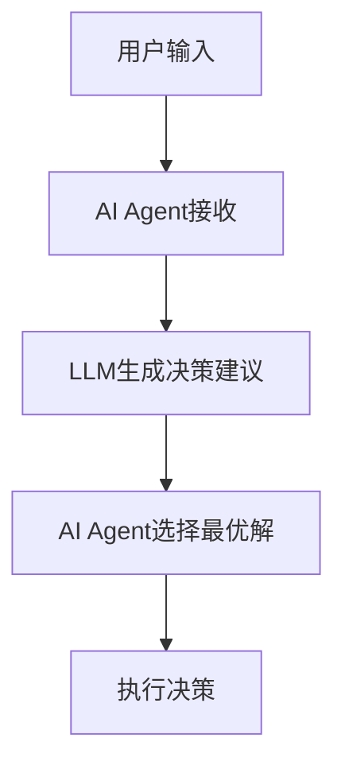
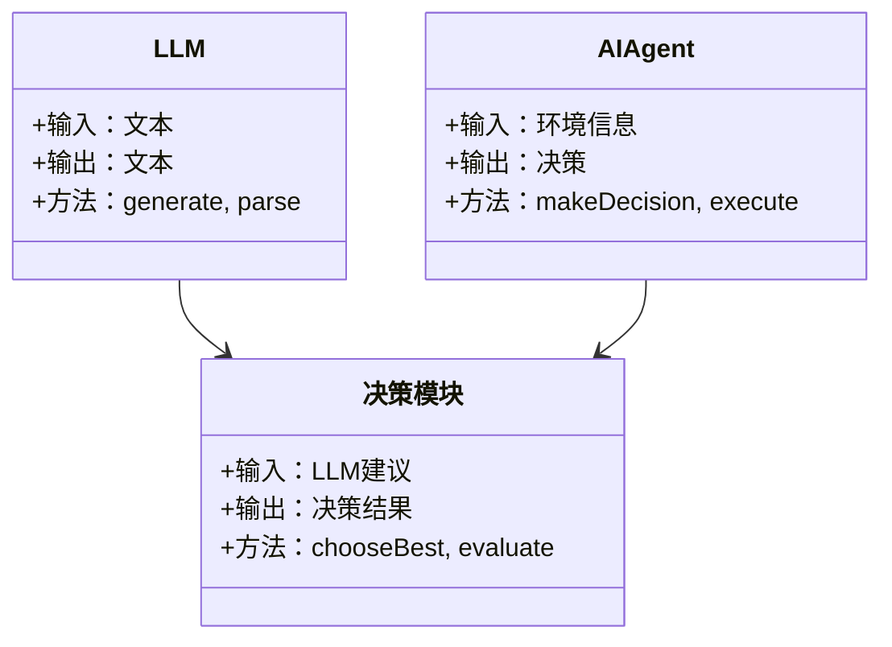
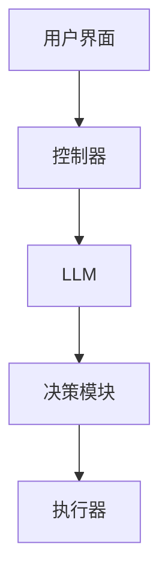
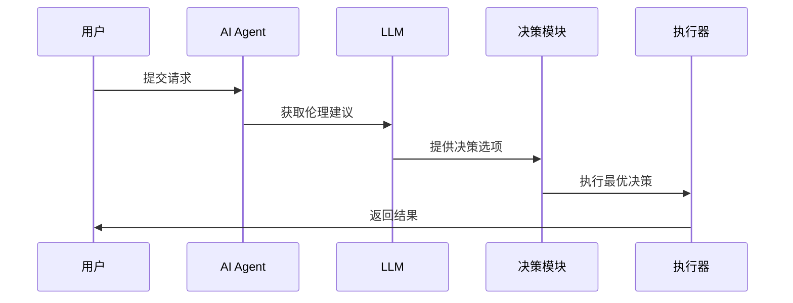

                 


# 构建LLM支持的AI Agent伦理决策系统

> 关键词：LLM, AI Agent, 伦理决策, 大语言模型, 人工智能, 系统架构

> 摘要：本文系统地探讨了如何构建基于大语言模型（LLM）的AI Agent伦理决策系统。文章从问题背景出发，详细分析了LLM与AI Agent的协同机制，构建了伦理决策的核心模型，设计了系统的架构，并通过实际案例展示了系统的实现过程。最后，文章总结了当前技术的局限性，并展望了未来的发展方向。

---

# 第一部分: LLM支持的AI Agent伦理决策系统概述

## # 第1章: 问题背景与核心概念

### ## 1.1 问题背景介绍

#### ### 1.1.1 LLM与AI Agent的基本概念

- **大语言模型（LLM）**：基于Transformer架构的大型神经网络模型，能够理解和生成人类语言，如GPT系列。
- **AI Agent**：智能代理，能够感知环境、执行任务并做出决策的实体。

#### ### 1.1.2 伦理决策的重要性

- AI Agent在医疗、金融、法律等领域需要做出符合伦理的决策。
- 传统决策系统可能忽视伦理因素，导致伦理风险。

#### ### 1.1.3 当前AI Agent决策系统的局限性

- 传统基于规则的系统缺乏灵活性。
- 数据驱动的系统可能忽视伦理约束。
- 缺乏对伦理问题的深度理解。

#### ### 1.1.4 LLM支持的伦理决策系统的潜在价值

- 提供灵活的伦理决策能力。
- 结合语言理解能力，提升决策的准确性。

### ## 1.2 核心概念与问题描述

#### ### 1.2.1 LLM在AI Agent中的角色

- 作为决策支持工具，提供伦理相关的知识和建议。
- 通过语言生成能力，帮助AI Agent表达决策 rationale。

#### ### 1.2.2 伦理决策的核心要素

- **目标**：最大化利益，最小化伤害。
- **约束**：遵守法律法规和伦理规范。
- **透明性**：决策过程可解释。
- **公平性**：确保决策的公平性。

#### ### 1.2.3 问题解决的目标与边界

- 目标：构建一个能够进行伦理决策的AI Agent系统。
- 边界：仅关注伦理相关的决策，不涉及技术实现细节。

#### ### 1.2.4 系统的结构与功能模块

- **输入模块**：接收环境信息和用户指令。
- **决策模块**：基于LLM生成决策。
- **输出模块**：执行决策并返回结果。

---

## # 第2章: 核心概念与联系

### ## 2.1 LLM与AI Agent的协同机制

#### ### 2.1.1 LLM的特征与优势

- **大规模数据训练**：能够处理复杂场景。
- **语言理解能力**：理解上下文和情感。
- **生成能力**：生成符合伦理的决策建议。

#### ### 2.1.2 AI Agent的决策逻辑

- **感知环境**：收集相关信息。
- **分析问题**：识别关键决策点。
- **生成决策**：基于LLM生成决策方案。

#### ### 2.1.3 伦理决策的实现路径

- **LLM提供伦理建议**：基于模型生成符合伦理的决策方案。
- **AI Agent选择最优解**：结合上下文选择最佳方案。

### ## 2.2 核心概念对比分析

#### ### 2.2.1 LLM与传统AI算法的对比

| 特性        | LLM                         | 传统AI算法               |
|-------------|------------------------------|--------------------------|
| 数据需求    | 需要大量标注数据             | 数据需求较低             |
| 处理能力    | 能处理复杂语言任务           | 通常处理简单任务         |
| 可解释性    | 可能较低                     | 更高                     |

#### ### 2.2.2 伦理决策与传统决策的对比

| 特性        | 伦理决策                     | 传统决策                 |
|-------------|------------------------------|--------------------------|
| 决策依据    | 考虑伦理因素                 | 通常不考虑               |
| 复杂性      | 更复杂                      | 较简单                  |

#### ### 2.2.3 系统架构的对比分析

- **传统决策系统**：基于规则或统计模型。
- **LLM支持的系统**：结合语言理解和生成能力。

### ## 2.3 实体关系图与决策流程

#### ### 2.3.1 ER实体关系图

```mermaid
erd
    actor: 用户
    agent: AI Agent
    llm: 大语言模型
    decision: 决策
    constraint: 伦理约束
    action: 行动
    relationship: 1对多
```

#### ### 2.3.2 决策流程图



---

## # 第3章: LLM的算法原理

### ## 3.1 大语言模型的训练与优化

#### ### 3.1.1 Transformer模型的结构

- **编码层**：将输入序列转换为向量表示。
- **解码层**：生成输出序列。

#### ### 3.1.2 注意力机制的原理

- **自注意力机制**：计算输入序列中每个词的重要性。
- **公式**：
  $$
  \text{Attention}(Q, K, V) = \text{softmax}\left(\frac{QK^T}{\sqrt{d_k}}\right)V
  $$

#### ### 3.1.3 强化学习的应用

- **策略梯度法**：优化模型参数。
- **强化信号**：基于决策的伦理评分调整奖励。

### ## 3.2 伦理评分模型的构建

#### ### 3.2.1 伦理评分的数学模型

- **评分公式**：
  $$
  \text{伦理评分} = \alpha \cdot \text{利益最大化} + \beta \cdot \text{伤害最小化}
  $$

#### ### 3.2.2 概率论在伦理决策中的应用

- **贝叶斯决策**：基于概率计算最优决策。
- **公式**：
  $$
  P(\text{决策} | \text{证据}) = \frac{P(\text{证据} | \text{决策}) \cdot P(\text{决策})}{P(\text{证据})}
  $$

---

## # 第4章: 系统分析与架构设计

### ## 4.1 系统功能设计

#### ### 4.1.1 领域模型设计



#### ### 4.1.2 系统架构设计



### ## 4.2 系统接口设计

- **API接口**：
  - 输入：用户请求
  - 输出：决策结果

### ## 4.3 系统交互流程



---

## # 第5章: 项目实战

### ## 5.1 环境配置

- **工具安装**：
  - 安装Python 3.8+
  - 安装相关库（如Hugging Face Transformers）

### ## 5.2 系统核心实现

#### ### 5.2.1 核心代码

```python
class EthicalDecisionSystem:
    def __init__(self, llm):
        self.llm = llm
    
    def make_decision(self, input_context):
        # 获取LLM建议
        suggestions = self.llm.generate(input_context)
        # 选择最优解
        best_suggestion = self._choose_best(suggestions)
        return best_suggestion
    
    def _choose_best(self, suggestions):
        # 基于伦理评分选择最优建议
        return max(suggestions, key=lambda x: self._calculate_ethical_score(x))
    
    def _calculate_ethical_score(self, suggestion):
        # 简单实现：基于关键词评分
        score = 0
        for word in suggestion.split():
            if word in ETHICAL_KEYWORDS:
                score += 1
        return score
```

### ## 5.3 代码应用解读与分析

- **LLM集成**：使用Hugging Face的GPT模型。
- **决策逻辑**：基于伦理评分选择最优建议。

### ## 5.4 实际案例分析

- **案例1**：医疗辅助决策系统。
- **案例2**：金融投资决策支持。

---

## # 第6章: 未来展望与最佳实践

### ## 6.1 技术局限性与改进方向

- **当前局限**：伦理评分模型简单，缺乏深度。
- **改进方向**：引入更复杂的伦理评分模型，结合领域知识。

### ## 6.2 最佳实践 tips

- **数据质量**：确保训练数据的多样性和代表性。
- **模型透明性**：提高决策过程的可解释性。
- **持续优化**：定期更新模型和伦理规则。

### ## 6.3 小结

- LLM支持的AI Agent伦理决策系统具有广阔的应用前景。
- 需要持续优化算法和系统架构，以应对复杂场景。

---

# 总结

通过本文的系统介绍，读者可以全面理解如何构建基于LLM的AI Agent伦理决策系统。从算法原理到系统实现，从理论分析到实际案例，本文为读者提供了丰富的知识和实践指导。

