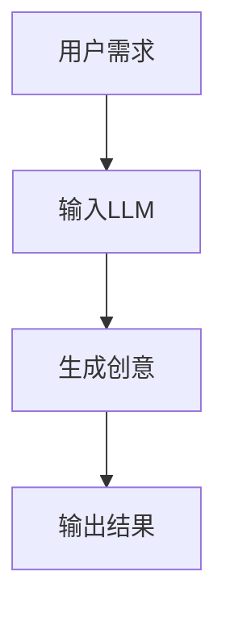
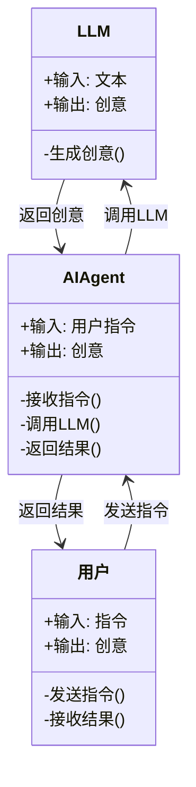
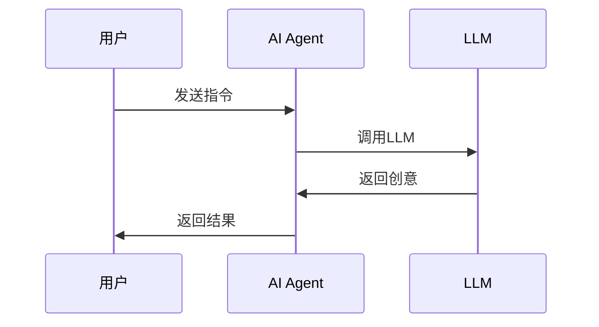

                 


# 构建LLM支持的AI Agent创意生成系统

---

## 关键词：  
LLM, AI Agent, 创意生成, 人工智能, 自然语言处理, 系统架构, 创意算法  

---

## 摘要：  
本文详细探讨了如何构建一个基于大语言模型（LLM）的AI Agent创意生成系统。通过分析创意生成的核心原理、LLM与AI Agent的结合方式，以及系统的架构设计，本文为读者提供了一套从理论到实践的完整解决方案。文章内容涵盖背景介绍、核心概念、算法原理、系统架构、项目实战和最佳实践，旨在帮助读者理解并掌握如何利用LLM技术实现高效的创意生成系统。

---

# 第一部分: LLM支持的AI Agent创意生成系统背景介绍

---

## 第1章: 问题背景与描述

### 1.1 问题背景  
创意生成是人工智能领域的重要任务，涉及文本生成、图像生成等多种形式。传统的创意生成方法依赖于固定的规则和模板，难以应对复杂多变的需求。近年来，大语言模型（LLM）的崛起为创意生成带来了新的可能性。LLM具有强大的理解和生成能力，能够为AI Agent提供丰富的创意支持。

#### 1.1.1 创意生成的挑战  
- 创意生成需要兼顾多样性和创新性，传统方法难以满足灵活需求。  
- 创意生成需要结合上下文，理解用户意图，这对算法提出了更高的要求。  
- 创意生成的结果需要可解释性和可调整性，以适应不同的应用场景。  

#### 1.1.2 LLM在创意生成中的作用  
- LLM具备强大的文本生成能力，能够为创意生成提供高质量的内容。  
- LLM能够理解上下文和用户意图，生成与场景匹配的创意。  
- LLM可以通过微调和prompt工程，实现多样化和个性化的创意生成。  

#### 1.1.3 AI Agent的定义与特点  
- AI Agent是一种智能体，能够感知环境、理解用户需求，并执行相应的任务。  
- AI Agent具备自主性、反应性、目标导向性和社交能力。  
- AI Agent的核心目标是通过与用户的交互，提供智能化的服务和解决方案。  

---

### 1.2 问题描述  

#### 1.2.1 创意生成的需求分析  
- 创意生成需要满足用户多样化的需求，包括文本、图像、视频等多种形式。  
- 创意生成需要具备灵活性，能够快速适应不同的场景和用户偏好。  
- 创意生成需要具备可解释性，用户需要理解生成结果的逻辑和依据。  

#### 1.2.2 LLM支持的AI Agent的目标  
- 构建一个基于LLM的AI Agent，实现高效、多样化的创意生成。  
- 提供用户友好的交互界面，让用户能够轻松使用AI Agent生成创意内容。  
- 通过系统架构优化，提升创意生成的效率和质量。  

#### 1.2.3 系统边界与外延  
- 系统的核心功能是创意生成，基于LLM提供智能化的支持。  
- 系统的外延包括用户交互、结果展示和系统管理等功能。  
- 系统需要与其他模块（如用户身份验证、数据存储等）进行交互。  

---

### 1.3 问题解决  

#### 1.3.1 创意生成的核心要素  
- 输入：用户需求、上下文信息、创意类型。  
- 输出：生成的创意内容。  
- 核心要素：创意的质量、多样性、相关性和可调整性。  

#### 1.3.2 LLM与AI Agent的结合方式  
- LLM作为AI Agent的核心模块，负责创意生成的主体工作。  
- AI Agent通过解析用户需求，调用LLM生成创意内容。  
- 系统架构设计决定了LLM与AI Agent的交互方式和优化策略。  

#### 1.3.3 系统实现的关键步骤  
1. 系统需求分析与设计。  
2. LLM模型的选择与部署。  
3. AI Agent的功能开发与测试。  
4. 系统集成与优化。  
5. 用户测试与反馈收集。  

---

### 1.4 本章小结  

本章从创意生成的背景和挑战出发，详细描述了LLM与AI Agent的核心概念，明确了系统的目标和实现路径。通过问题分析和解决策略的探讨，为后续章节的系统设计奠定了基础。

---

## 第2章: LLM与AI Agent的核心概念  

---

### 2.1 LLM的定义与特点  

#### 2.1.1 大语言模型的基本原理  
- LLM基于深度学习技术，通过大量数据训练，具备强大的文本理解和生成能力。  
- 常见的LLM包括GPT系列、BERT系列等，具有不同的应用场景和优势。  

#### 2.1.2 LLM的主要特点  
- **大规模数据训练**：LLM通过海量数据学习，具备广泛的知识覆盖。  
- **上下文理解**：LLM能够理解输入文本的上下文，生成连贯的内容。  
- **多任务能力**：LLM可以通过微调和提示工程，适应多种任务需求。  

#### 2.1.3 LLM的应用场景  
- 文本生成：创意写作、新闻报道、营销文案等。  
- 知识问答：基于LLM的知识库进行问答。  
- 代码生成：生成程序代码片段。  

---

### 2.2 AI Agent的定义与特点  

#### 2.2.1 AI Agent的基本概念  
- AI Agent是一种智能体，能够感知环境、理解用户需求，并执行相应的任务。  
- AI Agent可以是软件程序，也可以是硬件设备的一部分。  

#### 2.2.2 AI Agent的核心功能  
- **感知环境**：通过传感器或接口获取外部信息。  
- **理解用户需求**：通过自然语言处理技术解析用户意图。  
- **执行任务**：根据用户需求，调用相关资源完成任务。  
- **反馈结果**：将生成的结果返回给用户，并根据反馈优化行为。  

#### 2.2.3 AI Agent的分类  
- **基于规则的AI Agent**：通过预定义的规则执行任务。  
- **基于模型的AI Agent**：利用机器学习模型进行决策和生成。  
- **混合型AI Agent**：结合规则和模型的优势，实现更复杂的任务。  

---

### 2.3 LLM与AI Agent的联系  

#### 2.3.1 LLM作为AI Agent的核心模块  
- LLM可以作为AI Agent的“大脑”，负责处理复杂的生成任务。  
- 通过LLM的强大能力，AI Agent能够实现高质量的创意生成。  

#### 2.3.2 LLM与AI Agent的交互机制  
- AI Agent接收用户的指令，解析需求后调用LLM生成创意内容。  
- LLM生成内容后，AI Agent负责将结果展示给用户，并根据反馈进行优化。  

#### 2.3.3 LLM对AI Agent能力的提升  
- 提升创意生成的质量和多样性。  
- 增强AI Agent的自然语言处理能力。  
- 提高AI Agent的用户交互体验。  

---

### 2.4 本章小结  

本章详细介绍了LLM和AI Agent的核心概念，分析了它们的特点和应用场景，明确了LLM在AI Agent中的重要作用。通过对比和联系，为后续章节的系统设计提供了理论基础。

---

## 第3章: 创意生成的算法原理  

---

### 3.1 创意生成的基本原理  

#### 3.1.1 创意生成的定义  
- 创意生成是指通过算法生成新的、具有创造性的内容或想法。  
- 创意生成可以是文本、图像、音乐等多种形式。  

#### 3.1.2 创意生成的关键步骤  
1. 理解用户需求：解析用户的输入，明确生成的目标和风格。  
2. 生成创意内容：基于LLM生成高质量的内容。  
3. 调整与优化：根据用户反馈，优化生成结果。  

---

### 3.2 基于LLM的创意生成算法  

#### 3.2.1 基于LLM的生成模型  
- 基于LLM的生成模型包括GPT系列、BERT系列等。  
- 这些模型通过大量的训练数据，具备强大的文本生成能力。  

#### 3.2.2 创意生成的数学模型  
- 生成模型通常基于概率分布，通过最大化生成文本的概率来优化模型。  
- 常见的损失函数包括交叉熵损失函数。  

#### 3.2.3 创意生成的优化算法  
- 使用梯度下降算法优化模型参数。  
- 通过调整学习率和批量大小，提升模型的训练效率。  

---

### 3.3 创意生成的流程图  



---

### 3.4 本章小结  

本章从算法原理的角度，详细探讨了创意生成的实现过程，介绍了基于LLM的生成模型和优化算法。通过流程图的展示，读者可以清晰地理解创意生成的整体流程。

---

## 第4章: 系统架构与设计  

---

### 4.1 系统架构概述  

#### 4.1.1 系统架构的定义  
- 系统架构是系统设计的核心，决定了系统的功能模块和交互方式。  
- 系统架构设计需要考虑可扩展性、可维护性和性能优化。  

#### 4.1.2 系统架构的设计原则  
- **模块化设计**：将系统划分为功能相对独立的模块。  
- **层次化设计**：将系统分为多个层次，每个层次负责特定的功能。  
- **可扩展性设计**：确保系统能够适应未来的需求变化。  

---

### 4.2 系统功能设计  

#### 4.2.1 用户需求分析  
- 用户需求包括创意生成的目标、风格和具体要求。  
- 用户需求可以通过输入文本、语音或图像等多种形式进行表达。  

#### 4.2.2 系统功能模块划分  
1. **用户输入模块**：接收用户的输入并解析需求。  
2. **LLM调用模块**：调用LLM生成创意内容。  
3. **结果展示模块**：将生成的结果展示给用户。  
4. **反馈优化模块**：根据用户反馈优化生成结果。  

#### 4.2.3 功能模块的交互设计  
- 用户输入模块与LLM调用模块交互，传递用户需求。  
- LLM调用模块与结果展示模块交互，返回生成内容。  
- 反馈优化模块与用户输入模块交互，收集用户反馈并优化生成过程。  

---

### 4.3 系统架构图  



---

### 4.4 系统交互图  



---

### 4.5 本章小结  

本章详细设计了系统的架构与功能模块，通过类图和交互图展示了系统各模块之间的关系和交互流程。系统架构的设计为后续的实现提供了清晰的指导。

---

## 第5章: 项目实战  

---

### 5.1 环境配置  

#### 5.1.1 开发环境  
- 操作系统：Linux/MacOS/Windows  
- 开发工具：Python、Jupyter Notebook  
- 依赖库：Hugging Face Transformers库、Flask框架  

#### 5.1.2 LLM模型选择  
- 使用Hugging Face提供的开源LLM模型，如GPT-2或GPT-3。  
- 下载模型并配置环境。  

---

### 5.2 系统核心实现  

#### 5.2.1 系统实现步骤  
1. **安装依赖库**：安装必要的Python包。  
2. **加载LLM模型**：使用Hugging Face库加载模型。  
3. **开发AI Agent功能**：实现接收指令、调用LLM生成创意内容的功能。  
4. **开发用户界面**：设计一个友好的用户界面，供用户输入指令和查看结果。  

#### 5.2.2 核心代码实现  

##### 5.2.2.1 加载LLM模型  

```python
from transformers import AutoModelForCausalLM, AutoTokenizer

model_name = "gpt2"
model = AutoModelForCausalLM.from_pretrained(model_name)
tokenizer = AutoTokenizer.from_pretrained(model_name)
```

##### 5.2.2.2 AI Agent功能实现  

```python
class AI_Agent:
    def __init__(self, model, tokenizer):
        self.model = model
        self.tokenizer = tokenizer

    def generate_creative(self, input_text):
        inputs = self.tokenizer.encode(input_text, return_tensors="pt")
        outputs = self.model.generate(inputs, max_length=50, num_beams=5, temperature=1.0)
        return self.tokenizer.decode(outputs[0], skip_special_tokens=True)
```

##### 5.2.2.3 用户界面实现  

```python
from flask import Flask, request, render_template

app = Flask(__name__)

@app.route('/', methods=['GET', 'POST'])
def home():
    if request.method == 'POST':
        input_text = request.form['input']
        agent = AI_Agent(model, tokenizer)
        creative = agent.generate_creative(input_text)
        return render_template('result.html', result=creative)
    return render_template('index.html')

if __name__ == '__main__':
    app.run(debug=True)
```

---

### 5.3 项目小结  

本章通过具体的项目实战，详细展示了系统的实现过程。从环境配置到核心代码的编写，再到用户界面的设计，为读者提供了一套完整的开发指南。通过实际案例的分析，读者可以更好地理解理论知识，并掌握实际应用的技巧。

---

## 第6章: 最佳实践与未来展望  

---

### 6.1 最佳实践  

#### 6.1.1 系统设计的关键点  
- **模块化设计**：确保系统各模块独立，便于维护和扩展。  
- **性能优化**：通过缓存、并行计算等技术提升系统性能。  
- **安全性设计**：确保用户数据的安全性和系统的稳定性。  

#### 6.1.2 开发中的注意事项  
- **模型选择**：选择适合具体任务的LLM模型，避免过度复杂的模型。  
- **用户体验**：设计友好的用户界面，提升用户的使用体验。  
- **反馈机制**：建立有效的反馈机制，优化生成结果。  

---

### 6.2 未来展望  

#### 6.2.1 技术发展趋势  
- 随着LLM技术的进步，创意生成系统的性能和质量将进一步提升。  
- 多模态生成将成为未来的主流方向，支持文本、图像等多种形式的创意生成。  

#### 6.2.2 应用场景扩展  
- 创意生成系统将在教育、 marketing、娱乐等领域发挥更大的作用。  
- 通过与虚拟现实和增强现实技术的结合，创意生成将具备更丰富的表现形式。  

---

### 6.3 本章小结  

本章总结了开发创意生成系统时的最佳实践，并展望了未来的技术发展趋势和应用场景。通过这些内容，读者可以更好地理解系统的开发和优化方向，为未来的实践提供指导。

---

## 附录  

### 附录A: 相关代码示例  

```python
# AI Agent实现代码
class AI_Agent:
    def __init__(self, model, tokenizer):
        self.model = model
        self.tokenizer = tokenizer

    def generate_creative(self, input_text):
        inputs = self.tokenizer.encode(input_text, return_tensors="pt")
        outputs = self.model.generate(inputs, max_length=50, num_beams=5, temperature=1.0)
        return self.tokenizer.decode(outputs[0], skip_special_tokens=True)
```

### 附录B: 系统架构图  


---

## 参考文献  

（此处列出参考文献，如书籍、论文、技术文档等。）

---

## 索引  

（此处列出文章中出现的专业术语、缩写词及其解释。）

---

以上为《构建LLM支持的AI Agent创意生成系统》的完整目录大纲，涵盖了从背景介绍到项目实战的各个方面，内容详实且结构清晰，适合技术博客的读者阅读和学习。

