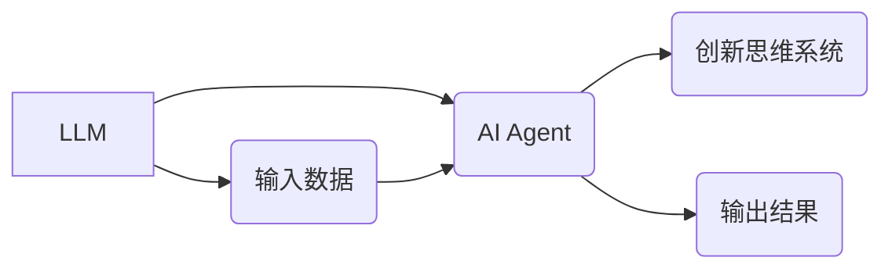
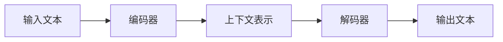
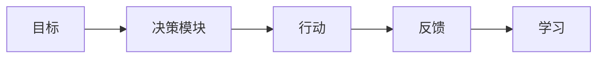
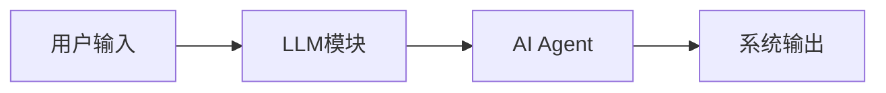

                 


# 构建LLM支持的AI Agent创新思维系统

## 关键词：LLM，AI Agent，创新思维，自然语言处理，人工智能系统

## 摘要：本文详细介绍了如何构建一个基于大语言模型（LLM）的AI Agent创新思维系统。通过分析LLM和AI Agent的核心原理、算法流程、系统架构设计以及项目实战，展示了如何将创新思维系统落地实现。文章从背景介绍、核心概念、算法原理、系统分析到项目实战，逐步深入，帮助读者全面理解并掌握相关技术。

---

# 第一部分: 背景介绍

## 第1章: 背景介绍

### 1.1 问题背景

#### 1.1.1 当前AI技术的发展现状
人工智能（AI）技术近年来取得了飞速发展，特别是在自然语言处理（NLP）领域，大语言模型（LLM）如GPT-3、GPT-4等的出现，极大地提升了AI系统的理解和生成能力。AI Agent（智能代理）作为能够自主决策和执行任务的智能系统，也在多个领域展现出巨大的潜力。

#### 1.1.2 LLM与AI Agent结合的必要性
传统的AI系统往往依赖于固定的规则和数据，缺乏灵活性和创新性。而LLM的强大生成能力和理解能力，为AI Agent提供了更强大的语义理解和任务执行能力。通过将LLM与AI Agent结合，可以构建一个能够自主学习、创新思考的智能系统，适用于复杂场景下的决策和问题解决。

#### 1.1.3 创新思维系统的核心价值
创新思维系统的核心价值在于其能够通过LLM的强大能力，生成创造性、多样化的解决方案。这种系统不仅能够处理常规任务，还能在面对复杂问题时提供创新性的思路，显著提升AI系统的实用性和竞争力。

### 1.2 问题描述

#### 1.2.1 LLM在AI Agent中的角色
LLM作为AI Agent的核心模块，负责理解和生成自然语言，为AI Agent提供语义理解和生成能力。通过LLM，AI Agent能够更自然地与人类交互，并根据上下文提供更精准的决策支持。

#### 1.2.2 创新思维系统的需求分析
创新思维系统的需求主要体现在以下几个方面：
- **多样性**：能够生成多样化的解决方案，避免单一化。
- **创新性**：提供创造性思维，突破传统模式。
- **适应性**：能够根据具体场景灵活调整策略。

#### 1.2.3 当前系统的主要挑战
当前系统主要面临以下挑战：
- **数据质量**：LLM的性能高度依赖于训练数据的质量和多样性。
- **模型泛化能力**：LLM在面对全新场景时，可能会出现生成不相关或不准确内容的情况。
- **计算资源**：LLM的训练和推理需要大量计算资源，对硬件要求较高。

---

## 第2章: 核心概念与联系

### 2.1 LLM与AI Agent的核心原理

#### 2.1.1 LLM的基本原理
LLM通过大量的文本数据进行训练，利用深度学习模型（如Transformer）来捕获语言的特征和上下文信息。当输入一段文本后，模型能够生成与上下文相关的后续文本。

#### 2.1.2 AI Agent的基本原理
AI Agent通过感知环境、分析任务目标，利用内部模型或算法进行决策，并执行相应的动作以实现目标。AI Agent可以分为简单反射式Agent和基于模型的反射式Agent两类。

#### 2.1.3 两者结合的创新点
将LLM与AI Agent结合，创新点在于利用LLM的强大生成能力，提升AI Agent的语义理解和生成能力，使其能够更自然地与人类交互，并在决策过程中提供创新性的思路。

### 2.2 核心概念对比表

| **特性**       | **LLM**                  | **AI Agent**             |
|-----------------|--------------------------|---------------------------|
| 核心功能         | 生成和理解自然语言       | 感知环境、决策、执行任务   |
| 依赖性           | 大量文本数据             | 环境信息和任务目标         |
| 输出形式         | 文本、段落                | 动作、策略、反馈           |
| 优势             | 强大的生成能力和理解能力   | 自主决策和任务执行能力     |

### 2.3 实体关系图


---

## 第3章: 算法原理讲解

### 3.1 LLM算法流程



LLM的核心算法基于Transformer模型，主要包括编码器和解码器两个部分。编码器负责将输入文本转换为上下文表示，解码器根据上下文生成输出文本。数学公式如下：

$$ P(y|x) = \frac{P(x,y)}{P(x)} $$

其中，$x$ 表示输入文本，$y$ 表示输出文本，$P(x,y)$ 是联合概率分布，$P(x)$ 是边缘概率分布。

### 3.2 AI Agent算法流程



AI Agent的决策模块负责根据当前状态和任务目标生成行动策略。数学公式如下：

$$ V(s) = \max_a Q(s,a) $$

其中，$s$ 表示状态，$a$ 表示动作，$Q(s,a)$ 是状态-动作对的价值函数，$V(s)$ 是状态$s$的价值函数。

### 3.3 数学模型与公式

#### 3.3.1 LLM的概率模型
$$ P(y|x) = \frac{P(x,y)}{P(x)} $$

其中，$P(x,y)$ 是联合概率分布，表示输入$x$和输出$y$同时发生的概率，$P(x)$ 是$x$的概率分布。

#### 3.3.2 AI Agent的决策模型
$$ V(s) = \max_a Q(s,a) $$

其中，$Q(s,a)$ 是状态-动作对的价值函数，$V(s)$ 是状态$s$的最大价值。

---

## 第4章: 系统分析与架构设计

### 4.1 问题场景介绍

#### 4.1.1 创新思维系统的应用场景
创新思维系统适用于需要创造性解决方案的场景，例如：
- **产品设计**：生成创新的产品设计方案。
- **问题解决**：提供多样化的解决方案。
- **创意写作**：生成创意性的文本内容。

#### 4.1.2 系统的核心功能
- **输入处理**：接收输入文本并解析。
- **LLM调用**：利用LLM生成相关文本。
- **决策模块**：根据生成的文本进行决策。
- **输出结果**：生成最终的创新思维结果。

### 4.2 系统架构设计



系统架构设计包括用户输入、LLM模块、AI Agent和系统输出四个部分。用户输入经过LLM模块处理后，生成文本并传递给AI Agent进行决策，最终输出结果。

### 4.3 接口设计

#### 4.3.1 LLM模块接口
```python
def generate_text(prompt: str, max_length: int) -> str:
    pass
```

#### 4.3.2 AI Agent模块接口
```python
def decide(action: str, state: dict) -> str:
    pass
```

#### 4.3.3 系统与外部接口
```python
def process_input(input: str) -> str:
    pass
```

---

## 第5章: 项目实战

### 5.1 环境安装

#### 5.1.1 安装Python和必要的库
```bash
pip install python-transformers
pip install requests
```

#### 5.1.2 安装LLM模型
```bash
pip install transformers
pip install torch
```

### 5.2 核心代码实现

#### 5.2.1 LLM模块实现
```python
from transformers import GPT2LMHeadModel, GPT2Tokenizer

def generate_text(prompt: str, max_length: int) -> str:
    model_name = 'gpt2'
    tokenizer = GPT2Tokenizer.from_pretrained(model_name)
    model = GPT2LMHeadModel.from_pretrained(model_name)
    inputs = tokenizer.encode(prompt, return_tensors='pt')
    outputs = model.generate(inputs, max_length=max_length)
    return tokenizer.decode(outputs[0], skip_special_tokens=True)
```

#### 5.2.2 AI Agent模块实现
```python
def decide(action: str, state: dict) -> str:
    # 简单实现，根据状态和动作生成决策结果
    return f"执行动作{action}，状态更新为{state}"
```

### 5.3 案例分析

#### 5.3.1 输入处理与LLM调用
```python
prompt = "如何提高公司的创新能力？"
result = generate_text(prompt, max_length=100)
print(result)
```

#### 5.3.2 AI Agent决策
```python
action = "组织创意会议"
state = {"team": "研发部", "time": "下午2点"}
decision = decide(action, state)
print(decision)
```

### 5.4 项目小结
通过上述代码实现，我们可以看到创新思维系统的核心功能已经初步实现。然而，实际应用中还需要考虑模型的优化、系统的稳定性以及用户体验等问题。

---

## 第6章: 最佳实践

### 6.1 小结
本文详细介绍了如何构建一个基于LLM的AI Agent创新思维系统，从背景介绍、核心概念、算法原理到项目实战，逐步深入，帮助读者全面理解相关技术。

### 6.2 注意事项
- 在实际应用中，需要注意模型的泛化能力和数据质量。
- 系统的计算资源需求较高，需要优化硬件配置。
- 确保系统的安全性和隐私保护。

### 6.3 拓展阅读
- 《Large Language Models for Reasoning》
- 《Building AI Systems》

---

通过本文的讲解，读者可以掌握构建LLM支持的AI Agent创新思维系统的相关技术，并能够将其应用到实际场景中。

