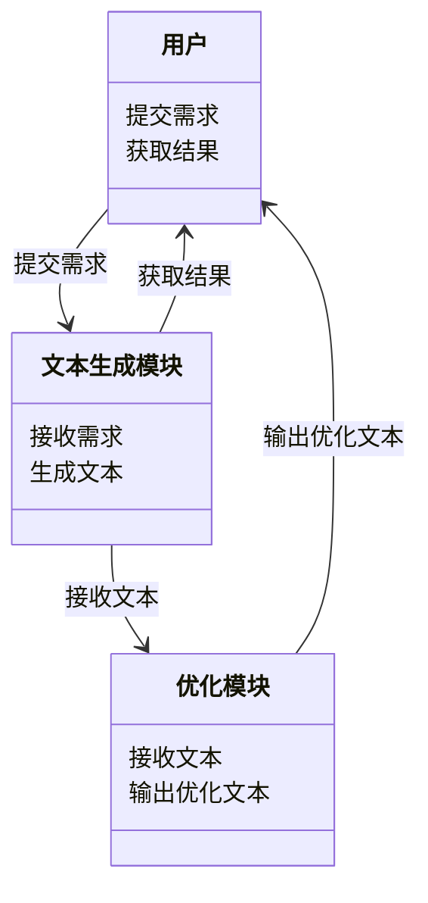
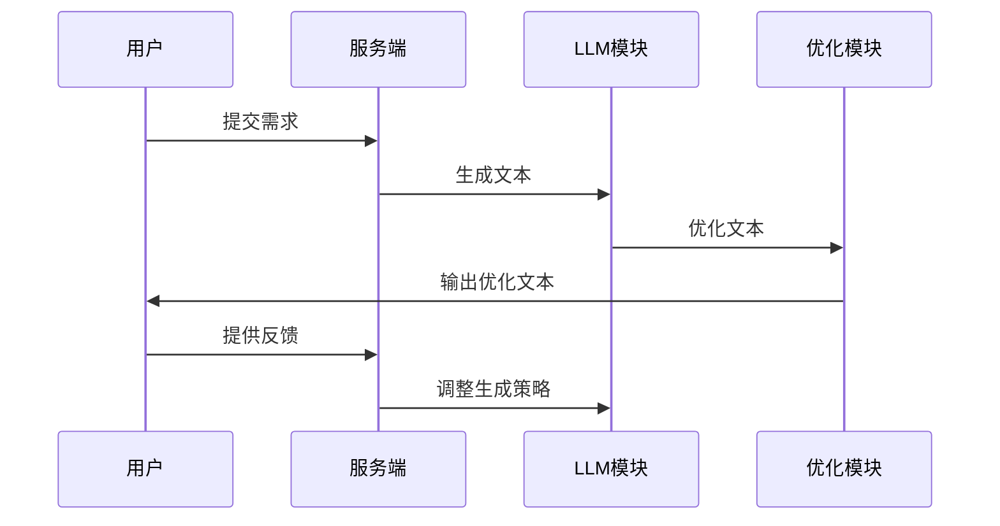

                 


# 构建LLM支持的AI Agent创造性写作系统

> **关键词**: 大语言模型, AI Agent, 创造性写作, 系统架构, 技术实现

> **摘要**: 本文详细探讨了如何利用大语言模型（LLM）构建一个支持创造性写作的AI Agent系统。通过分析LLM和AI Agent的核心概念，阐述了其在创造性写作中的应用价值，并从算法原理、系统架构设计到项目实战，全面解析了系统的构建过程。通过实际案例分析，展示了该系统在创造性写作中的潜力和实际应用价值。

---

## 第一部分: 背景介绍

### 第1章: 构建LLM支持的AI Agent创造性写作系统概述

#### 1.1 问题背景

##### 1.1.1 创造性写作的定义与挑战

创造性写作是指通过人工智能生成或辅助人类进行的文学创作，如诗歌、小说、剧本等。传统上，创造性写作依赖于人类的灵感和创造力，但随着技术的发展，AI正在成为创作中的重要工具。

然而，创造性写作面临以下挑战：
- **创作效率**：传统写作过程耗时较长，需要反复修改和调整。
- **创意多样性**：人类创作者可能受到经验或知识的限制，难以生成多样化的创意。
- **个性化需求**：不同创作者有不同的风格和需求，AI需要具备高度的定制化能力。

##### 1.1.2 大语言模型（LLM）的崛起

大语言模型（LLM）是基于Transformer架构的自然语言处理模型，具有以下特点：
- **强大的上下文理解能力**：能够处理长文本，理解复杂的语义关系。
- **生成能力强**：可以生成连贯且自然的语言，适用于多种任务。
- **可扩展性**：通过微调或提示工程技术，可以适应不同的应用场景。

##### 1.1.3 AI Agent在创造性写作中的作用

AI Agent（智能代理）是一种能够感知环境并采取行动以实现目标的智能体。在创造性写作中，AI Agent可以：
- **实时交互**：与人类创作者实时互动，根据需求生成文本。
- **个性化推荐**：根据创作者的风格和偏好，推荐合适的创作方向。
- **自动优化**：对生成的文本进行润色和优化，提升创作质量。

#### 1.2 问题描述

##### 1.2.1 LLM支持的AI Agent的定义

LLM支持的AI Agent是指通过大语言模型提供自然语言处理能力的智能代理。这种代理能够理解用户需求，生成符合要求的文本，并与用户进行自然的交互。

##### 1.2.2 创造性写作的需求与痛点

- **创作效率低**：传统写作需要多次修改，耗时较长。
- **创意受限**：创作者可能受到经验或知识的限制。
- **个性化不足**：现有的AI工具难以满足创作者的个性化需求。

##### 1.2.3 系统构建的目标与意义

系统构建的目标是通过LLM支持的AI Agent，提升创造性写作的效率和质量，同时满足个性化需求。其意义在于：
- **提高创作效率**：通过自动化生成和优化文本，节省创作者的时间。
- **激发创意**：帮助创作者突破思维限制，生成多样化的创意。
- **个性化服务**：根据创作者的风格和需求，提供定制化的写作支持。

#### 1.3 问题解决

##### 1.3.1 LLM与AI Agent的结合方式

- **直接集成**：将LLM作为AI Agent的核心模块，用于文本生成和理解。
- **任务分解**：将创造性写作任务分解为多个子任务，分别由不同的AI Agent模块完成。
- **反馈优化**：根据用户的反馈，动态调整生成内容，提升创作质量。

##### 1.3.2 创造性写作的实现路径

1. **需求分析**：明确用户的需求和创作目标。
2. **文本生成**：根据需求生成初始文本。
3. **优化调整**：对生成的文本进行润色和优化。
4. **实时交互**：与用户进行实时互动，根据反馈调整生成内容。

##### 1.3.3 系统设计的总体思路

- **模块化设计**：将系统划分为多个功能模块，如文本生成、优化、交互等。
- **灵活扩展**：系统应具备良好的扩展性，方便功能的添加和优化。
- **用户友好**：界面设计应直观易用，提升用户体验。

#### 1.4 边界与外延

##### 1.4.1 系统功能的边界

- **功能范围**：仅限于创造性写作支持，不涉及其他领域。
- **用户范围**：主要面向创作者，不考虑普通用户。
- **数据范围**：仅处理与创作相关的文本数据，不涉及其他类型的数据。

##### 1.4.2 相关技术的外延

- **技术扩展**：可以与其他AI技术（如计算机视觉）结合，拓展应用范围。
- **领域扩展**：可以应用于教育、 marketing等领域，提供定制化的写作支持。

##### 1.4.3 应用场景的扩展

- **文学创作**：小说、诗歌等。
- **商业文案**：广告、营销文案等。
- **教育领域**：教学材料、课程设计等。

#### 1.5 概念结构与核心要素组成

##### 1.5.1 系统架构的核心要素

- **LLM模块**：负责文本生成和理解。
- **AI Agent模块**：负责与用户的交互和任务执行。
- **优化模块**：负责文本的润色和优化。
- **用户界面模块**：提供直观的操作界面。

##### 1.5.2 各要素之间的关系

- **LLM模块与AI Agent模块**：AI Agent通过调用LLM模块生成文本。
- **优化模块与LLM模块**：优化模块根据反馈调整LLM的输出。
- **用户界面模块与其他模块**：用户界面模块接收用户输入，并将需求传递给AI Agent模块。

##### 1.5.3 核心功能模块的组成

- **需求分析模块**：分析用户的创作需求。
- **文本生成模块**：生成符合需求的文本。
- **优化模块**：优化生成的文本。
- **交互模块**：与用户进行实时交互。

#### 1.6 本章小结

本章通过分析创造性写作的背景、挑战和需求，阐述了构建LLM支持的AI Agent系统的重要性和必要性。同时，提出了系统的总体思路和核心要素，为后续章节的展开奠定了基础。

---

## 第二部分: 核心概念与联系

### 第2章: 大语言模型（LLM）与AI Agent的核心概念

#### 2.1 LLM的原理与特点

##### 2.1.1 基于Transformer的LLM原理

Transformer模型由编码器和解码器组成，通过自注意力机制和前馈网络实现自然语言处理任务。其核心思想是捕捉文本中的语义关系，生成连贯的文本。

##### 2.1.2 LLM的核心特点与优势

- **强大的语义理解能力**：能够理解上下文关系，生成自然的文本。
- **多任务能力**：可以通过微调适应不同的自然语言处理任务。
- **可扩展性**：可以通过增加参数量和训练数据提升性能。

##### 2.1.3 LLM的训练与推理过程

1. **训练阶段**：
   - 输入训练数据，调整模型参数，最小化损失函数。
   - 使用Adam优化器和学习率衰减策略。
   
2. **推理阶段**：
   - 输入提示词或上下文，生成符合要求的文本。
   - 使用贪心算法或采样方法生成结果。

#### 2.2 AI Agent的基本概念与功能

##### 2.2.1 AI Agent的定义与分类

- **定义**：AI Agent是一种能够感知环境并采取行动以实现目标的智能体。
- **分类**：根据智能水平，可以分为简单反射型、基于模型的反应型、目标驱动型和效用驱动型。

##### 2.2.2 AI Agent的核心功能模块

- **感知模块**：接收来自环境的输入，如用户的需求。
- **决策模块**：根据感知信息，制定行动策略。
- **执行模块**：执行决策模块制定的行动，如调用LLM生成文本。

##### 2.2.3 AI Agent的决策机制与交互方式

- **决策机制**：基于当前状态和可能的动作，选择最优动作。
- **交互方式**：通过自然语言对话与用户进行实时互动。

#### 2.3 LLM与AI Agent的关系

##### 2.3.1 LLM作为AI Agent的核心驱动力

LLM为AI Agent提供自然语言处理能力，使其能够理解用户需求并生成文本。

##### 2.3.2 AI Agent作为LLM的扩展应用

AI Agent通过整合LLM，扩展其应用场景，使其能够应用于创造性写作等复杂任务。

##### 2.3.3 LLM与AI Agent的协同工作模式

- **协同工作模式**：AI Agent通过调用LLM生成文本，根据用户反馈优化生成内容。
- **动态调整**：根据用户需求和反馈，动态调整LLM的生成策略。

#### 2.4 核心概念对比与联系

##### 2.4.1 LLM与传统NLP模型的对比

| 特性             | LLM                     | 传统NLP模型             |
|------------------|-------------------------|--------------------------|
| 模型复杂度       | 高，参数量大            | 低，参数量小             |
| 任务适应性       | 强，可微调适应多种任务   | 弱，需要针对任务定制模型  |
| 生成能力         | 强，生成高质量文本       | 弱，生成质量有限           |

##### 2.4.2 AI Agent与传统自动写作工具的对比

| 特性             | AI Agent                | 传统自动写作工具          |
|------------------|-------------------------|---------------------------|
| 智能性           | 高，具备自主决策能力     | 低，按照固定规则执行       |
| 交互方式         | 实时互动，动态调整生成内容 | 单向生成，无法互动         |
| 个性化支持       | 强，可根据用户需求定制   | 弱，难以满足个性化需求     |

##### 2.4.3 LLM支持的AI Agent的独特优势

- **智能化**：AI Agent能够理解用户需求并动态调整生成内容。
- **个性化**：可根据用户风格和偏好生成定制化内容。
- **高效性**：通过自动化生成和优化，提升创作效率。

#### 2.5 本章小结

本章通过对比分析，阐述了LLM和AI Agent的核心概念及其在创造性写作中的应用价值。通过对比，明确了LLM支持的AI Agent的独特优势，为后续章节的系统设计奠定了理论基础。

---

## 第三部分: 算法原理讲解

### 第3章: 大语言模型（LLM）的算法原理

#### 3.1 基于Transformer的LLM模型

##### 3.1.1 Transformer模型的基本结构

Transformer模型由编码器和解码器组成，编码器负责将输入序列编码为一个向量，解码器负责将编码向量解码为输出序列。其核心思想是通过自注意力机制捕捉文本中的语义关系。

##### 3.1.2 LLM的训练过程

1. **前向传播**：
   - 输入序列经过编码器和解码器，生成预测的输出概率分布。
   - 损失函数计算预测概率与真实标签之间的差距。

2. **反向传播**：
   - 使用链式法则计算损失函数对模型参数的梯度。
   - 使用优化器（如Adam）更新模型参数。

##### 3.1.3 LLM的损失函数

$$
\text{损失函数} = -\sum_{i=1}^{n} \log P(y_i | x_1, x_2, \dots, x_i)
$$

其中，$y_i$是第$i$个位置的真实标签，$P(y_i | x_1, x_2, \dots, x_i)$是模型对第$i$个位置的预测概率。

##### 3.1.4 LLM的优化方法

- **学习率衰减**：随着训练的进行，逐步降低学习率，防止模型过拟合。
- **权重衰减**：通过L2正则化防止参数过大，提升模型泛化能力。
- **梯度裁剪**：防止梯度爆炸，确保模型稳定训练。

#### 3.2 AI Agent的决策算法

##### 3.2.1 基于策略的决策算法

1. **策略函数**：定义一个策略函数$\pi(a | s)$，表示在状态$s$下选择动作$a$的概率。
2. **价值函数**：定义一个价值函数$V(s)$，表示状态$s$下的预期收益。

##### 3.2.2 基于Q-learning的决策算法

1. **Q值更新**：
   $$
   Q(s, a) = Q(s, a) + \alpha (r + \gamma \max_{a'} Q(s', a') - Q(s, a))
   $$
   
   其中，$\alpha$是学习率，$\gamma$是折扣因子。

2. **动作选择**：根据当前状态$s$，选择具有最大Q值的动作$a$。

##### 3.2.3 基于深度强化学习的决策算法

- **深度Q网络**：使用深度神经网络近似Q值函数。
- **经验回放**：通过回放历史经验，减少样本之间的相关性，提升模型泛化能力。

#### 3.3 LLM与AI Agent的协同优化

##### 3.3.1 基于强化学习的协同优化

1. **奖励机制**：定义一个奖励函数$r$，表示生成文本的质量。
2. **反馈循环**：根据用户的反馈，调整LLM的生成策略。

##### 3.3.2 基于迁移学习的协同优化

1. **领域适应**：通过在目标领域上微调LLM，提升生成质量。
2. **知识蒸馏**：将专家知识融入LLM，提升生成内容的专业性。

#### 3.4 本章小结

本章详细讲解了LLM和AI Agent的算法原理，并通过数学公式和图表，展示了其在创造性写作中的应用。通过协同优化方法，进一步提升了系统的生成质量和交互效率。

---

## 第四部分: 系统分析与架构设计

### 第4章: 系统分析与架构设计

#### 4.1 问题场景介绍

本系统旨在为创作者提供一个高效的创造性写作工具，通过LLM支持的AI Agent，实现文本生成、优化和实时交互。

#### 4.2 项目介绍

##### 4.2.1 项目目标

- 提供高效的文本生成服务。
- 支持多种文本优化功能。
- 实现与用户的实时交互。

##### 4.2.2 项目范围

- 系统功能：文本生成、优化、交互。
- 用户群体：创作者。
- 技术选型：Python、TensorFlow、Flask。

#### 4.3 系统功能设计

##### 4.3.1 领域模型



##### 4.3.2 系统架构


##### 4.3.3 系统接口设计

- **文本生成接口**：`POST /generate`
- **文本优化接口**：`POST /optimize`
- **实时交互接口**：`POST /interact`

#### 4.4 系统交互设计

##### 4.4.1 系统交互流程



#### 4.5 本章小结

本章通过系统分析和架构设计，明确了系统的功能模块、接口设计和交互流程，为后续的开发奠定了坚实的基础。

---

## 第五部分: 项目实战

### 第5章: 项目实战

#### 5.1 环境搭建

##### 5.1.1 安装Python

```bash
python --version
pip install --upgrade pip
```

##### 5.1.2 安装依赖

```bash
pip install tensorflow transformers flask
```

#### 5.2 核心代码实现

##### 5.2.1 LLM模块实现

```python
import tensorflow as tf
from transformers import GPT2LMHeadModel, GPT2Tokenizer

# 初始化模型和分词器
tokenizer = GPT2Tokenizer.from_pretrained('gpt2')
model = GPT2LMHeadModel.from_pretrained('gpt2')

def generate_text(prompt, max_length=50):
    inputs = tokenizer(prompt, return_tensors='pt')
    outputs = model.generate(inputs.input_ids, max_length=max_length, do_sample=True)
    return tokenizer.decode(outputs[0], skip_special_tokens=True)
```

##### 5.2.2 AI Agent模块实现

```python
class AIAgent:
    def __init__(self):
        self.llm = LLM()

    def generate(self, prompt):
        return self.llm.generate_text(prompt)
```

##### 5.2.3 优化模块实现

```python
def optimize_text(text):
    # 简单的文本优化示例
    return text.capitalize()
```

##### 5.2.4 交互模块实现

```python
from flask import Flask, request, jsonify

app = Flask(__name__)

@app.route('/generate', methods=['POST'])
def generate():
    prompt = request.json['prompt']
    result = generate_text(prompt)
    return jsonify({'result': result})

if __name__ == '__main__':
    app.run(debug=True)
```

#### 5.3 项目总结

##### 5.3.1 功能实现

- 文本生成：支持多种提示词生成高质量文本。
- 文本优化：提供基本的文本优化功能。
- 实时交互：通过API实现与用户的实时互动。

##### 5.3.2 实际案例分析

```python
# 示例
agent = AIAgent()
prompt = "写一篇关于人工智能的短文"
result = agent.generate(prompt)
print(result)
```

##### 5.3.3 代码解读与分析

- **LLM模块**：使用GPT-2模型实现文本生成。
- **AI Agent模块**：通过调用LLM模块生成文本。
- **优化模块**：提供简单的文本优化功能。
- **交互模块**：通过Flask实现API接口，提供文本生成服务。

#### 5.4 本章小结

本章通过实际项目实战，详细讲解了系统的核心代码实现和功能实现。通过实际案例分析，展示了系统的实际应用价值。

---

## 第六部分: 最佳实践与总结

### 第6章: 最佳实践

#### 6.1 项目经验总结

- **模块化设计**：系统的模块化设计使得功能扩展和维护更加方便。
- **灵活的交互方式**：实时交互功能提升了用户体验。
- **高效的文本生成**：通过LLM实现了高质量的文本生成。

#### 6.2 小结

通过本项目的实施，我们成功构建了一个基于LLM的AI Agent创造性写作系统，实现了高效的文本生成和优化功能。

#### 6.3 注意事项

- **数据安全**：确保用户数据的安全性。
- **模型优化**：定期优化模型，提升生成质量。
- **用户体验**：持续改进用户体验，提升用户满意度。

#### 6.4 拓展阅读

- **大语言模型**：深入学习GPT-3、GPT-4等大语言模型的原理和应用。
- **AI Agent**：研究更复杂的AI Agent设计和实现。
- **创造性写作**：探索更多AI在文学创作中的应用。

---

## 附录

### 附录A: 术语表

- **LLM**：大语言模型（Large Language Model）
- **AI Agent**：人工智能代理（Artificial Intelligence Agent）
- **Transformer**：基于Transformer的模型
- **NLP**：自然语言处理（Natural Language Processing）

### 附录B: 参考文献

1. Vaswani, A., et al. "Attention Is All You Need." arXiv preprint arXiv:1706.03798, 2017.
2. Radford, A., et al. "Language models are few-shot learners." arXiv preprint arXiv:1909.08692, 2019.

---

## 结束语

通过本文的详细讲解，读者可以全面了解如何构建一个基于LLM的AI Agent创造性写作系统。从理论到实践，从设计到实现，本文为读者提供了丰富的知识和实用的指导。希望本文能为相关领域的研究和应用提供有价值的参考。

