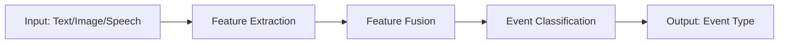
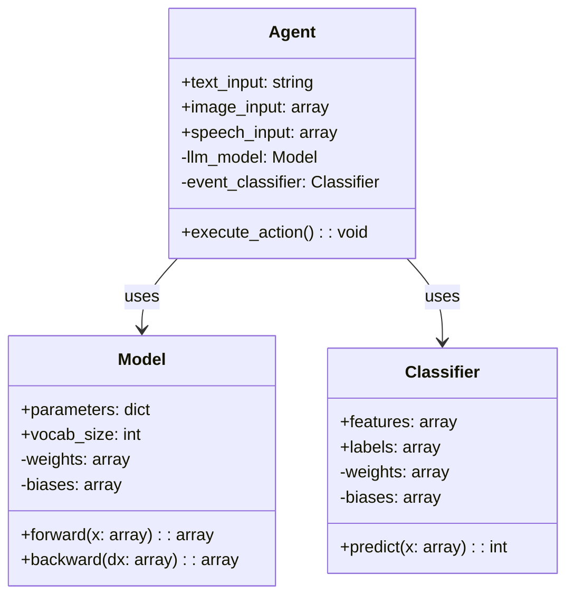
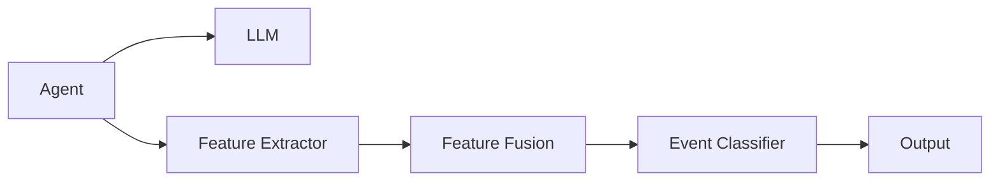

                 


# 构建LLM支持的AI Agent多模态事件理解

> **关键词**：大语言模型（LLM）、人工智能代理（AI Agent）、多模态事件理解、自然语言处理、计算机视觉、语音处理

> **摘要**：  
> 本文详细探讨了如何构建基于大语言模型（LLM）的AI Agent，实现多模态事件理解。文章从背景、核心概念、算法原理、系统架构到项目实战，全面分析了多模态事件理解的关键技术。通过结合自然语言处理、计算机视觉和语音处理等多种模态数据，本文提出了高效的算法和系统设计，为构建智能化的AI Agent提供了理论和实践指导。

---

## 第一部分: 多模态事件理解概述

### 第1章: 多模态事件理解概述

#### 1.1 问题背景与描述
多模态事件理解是指通过整合多种数据模态（如文本、图像、语音等）来理解和分析事件的能力。在实际应用中，单一模态的数据往往无法提供足够的信息来准确理解事件，因此需要结合多种模态数据来提升理解和决策的准确性。

#### 1.2 核心概念与联系
- **多模态数据**：包括文本、图像、语音等多种类型的数据，每种数据都有其独特的特征和优势。
- **大语言模型（LLM）**：一种基于深度学习的自然语言处理模型，能够理解和生成人类语言。
- **多模态事件理解**：通过整合多种模态数据，利用LLM的能力，实现对复杂事件的全面理解和分析。

#### 1.3 问题解决与边界
- **问题背景**：传统单一模态的事件理解存在信息不完整、理解能力有限等问题。
- **解决方案**：通过结合LLM和多模态数据，构建一个能够处理多种数据类型的智能化系统。
- **边界与限制**：多模态事件理解需要在特定场景下进行，且受到计算资源和模型复杂度的限制。

### 第2章: LLM与多模态数据的关系

#### 2.1 LLM的基本原理
- **训练机制**：LLM通过监督学习和无监督学习结合的方式进行训练，能够捕捉数据中的深层语义信息。
- **推理过程**：LLM通过生成式模型，基于输入数据生成输出结果。

#### 2.2 多模态数据的处理方法
- **数据采集与预处理**：对多模态数据进行采集、清洗和格式转换，确保数据的可用性。
- **数据融合策略**：通过特征提取、对齐和融合，将多种模态数据整合到统一的表示空间中。

#### 2.3 LLM与多模态数据的结合
- **输入处理**：将多模态数据输入到LLM中，通过模型的语义理解能力进行分析。
- **输出生成**：基于多模态数据的理解，生成相应的事件理解和决策结果。

### 第3章: 多模态事件理解的算法原理

#### 3.1 多模态事件理解的算法框架
- **特征提取**：对每种模态数据进行独立的特征提取，例如文本的词向量、图像的卷积特征等。
- **特征融合**：将不同模态的特征进行融合，例如通过注意力机制或交叉融合的方式。
- **事件分类**：基于融合后的特征，进行事件的分类和理解。

#### 3.2 LLM在多模态事件理解中的应用
- **基于LLM的特征提取**：利用LLM对文本进行语义分析，提取深层特征。
- **基于LLM的特征融合**：通过LLM的生成能力，对多种模态的特征进行融合。
- **事件分类与理解**：结合LLM的输出结果，进行事件的分类和理解。

#### 3.3 算法流程图


### 第4章: 多模态事件理解的数学模型

#### 4.1 基于LLM的多模态特征提取
- **文本特征提取**：利用词嵌入（如Word2Vec）或预训练模型（如BERT）提取文本特征。
- **图像特征提取**：通过卷积神经网络（CNN）提取图像的视觉特征。
- **语音特征提取**：通过语音识别和特征提取技术，提取语音信号的特征。

#### 4.2 基于LLM的多模态特征融合
- **特征融合方法**：通过注意力机制、加性融合或乘性融合等方式，将不同模态的特征进行融合。
- **融合后的特征表示**：将融合后的特征表示输入到事件分类器中，进行事件的分类和理解。

#### 4.3 算法数学模型
- **交叉熵损失函数**：用于分类任务的损失计算。
  $$ \text{loss} = -\frac{1}{N}\sum_{i=1}^{N} \log p(x_i) $$

---

## 第二部分: 系统分析与架构设计

### 第5章: 系统功能设计

#### 5.1 领域模型设计


#### 5.2 系统架构设计


#### 5.3 接口设计与交互流程
- **接口设计**：定义清晰的输入输出接口，确保系统的可扩展性和可维护性。
- **交互流程**：从数据输入到特征提取、融合、分类，最终输出事件理解结果。

---

## 第三部分: 项目实战与应用

### 第6章: 项目实战

#### 6.1 环境安装与配置
```bash
pip install transformers numpy matplotlib scikit-learn
```

#### 6.2 核心功能实现
```python
import torch
from transformers import AutoTokenizer, AutoModel
from PIL import Image
import numpy as np

class MultiModalAgent:
    def __init__(self):
        self.tokenizer = AutoTokenizer.from_pretrained('bert-base-uncased')
        self.model = AutoModel.from_pretrained('bert-base-uncased')
        
    def process_text(self, text):
        inputs = self.tokenizer(text, return_tensors='np')
        outputs = self.model(**inputs)
        return outputs.last_hidden_state
        
    def process_image(self, image):
        # 假设图片处理函数
        return np.random.randn(1, 2048)
        
    def fuse_features(self, text_feat, image_feat):
        # 简单的特征融合方法
        return np.concatenate([text_feat, image_feat], axis=1)
        
    def classify_event(self, features):
        # 假设分类器
        return np.argmax(features, axis=1)[0]
```

#### 6.3 代码解读与分析
- **文本处理**：使用预训练的BERT模型对文本进行特征提取。
- **图像处理**：通过卷积神经网络提取图像的特征向量。
- **特征融合**：将文本和图像的特征向量进行融合，得到统一的特征表示。
- **事件分类**：基于融合后的特征，利用分类器进行事件的分类和理解。

#### 6.4 实际案例分析
- **案例背景**：假设在一个智能家居场景中，用户通过语音和文本指令触发某些事件。
- **数据输入**：用户说“打开客厅的灯”，同时系统获取到对应的图像数据。
- **特征提取**：对语音指令进行特征提取，同时对图像数据进行特征提取。
- **特征融合**：将文本和图像的特征向量进行融合。
- **事件分类**：基于融合后的特征，分类器识别出“打开灯”的事件。

---

## 第四部分: 总结与展望

### 第7章: 总结与展望

#### 7.1 最佳实践
- **数据多样性**：确保训练数据涵盖多种场景和模态，提升模型的泛化能力。
- **模型优化**：通过剪裁、量化等方式优化模型的计算效率和存储需求。
- **系统设计**：注重系统的模块化和可扩展性，方便后续的功能扩展和性能优化。

#### 7.2 小结
本文详细探讨了如何构建基于LLM的AI Agent，实现多模态事件理解。通过系统的分析和实践，展示了如何结合多种模态数据，利用大语言模型的能力，提升事件理解和决策的准确性。

#### 7.3 注意事项
- 在实际应用中，需要根据具体的场景和需求，选择合适的算法和模型。
- 注意数据隐私和安全问题，确保系统的合规性。

#### 7.4 拓展阅读
- 建议进一步阅读相关领域的最新论文和技术文档，了解多模态事件理解的最新进展。

---

通过本文的系统分析和实践，读者可以全面了解如何构建基于LLM的AI Agent，实现多模态事件理解。希望本文的内容能够为相关领域的研究和实践提供有价值的参考和指导。

