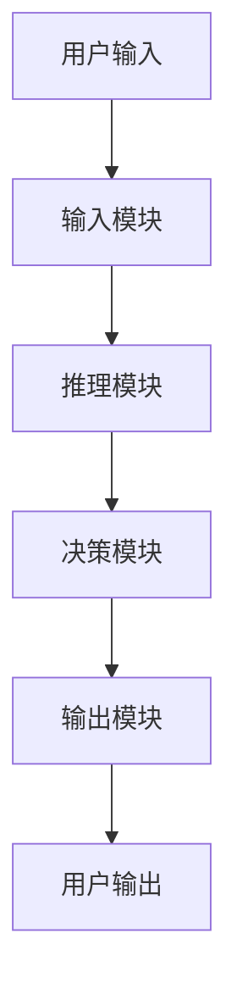
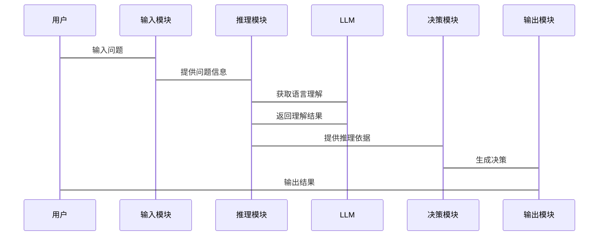

                 


# 构建LLM支持的AI Agent道德推理系统

## 关键词：LLM, AI Agent, 道德推理, 人工智能, 系统架构

## 摘要：  
本文详细探讨了如何利用大语言模型（LLM）构建一个支持道德推理的AI Agent系统。通过分析LLM与AI Agent的核心概念、算法原理、系统架构，结合实际项目案例，展示了如何实现一个具备道德推理能力的AI系统，并解决了实际应用场景中的关键问题。

---

# 正文

## 第一部分: 构建LLM支持的AI Agent道德推理系统概述

### 第1章: 背景与问题背景

#### 1.1 问题背景

##### 1.1.1 LLM与AI Agent的基本概念
- **大语言模型（LLM）**：指基于深度学习的大型神经网络模型，能够理解和生成人类语言。例如，GPT系列模型。
- **AI Agent（智能体）**：指能够感知环境、自主决策并执行任务的智能系统。例如，智能助手（Siri、Alexa）。

##### 1.1.2 道德推理在AI系统中的重要性
- 道德推理是AI Agent在复杂场景中做出符合伦理决策的关键能力。
- 例如，在自动驾驶中，AI Agent需要在紧急情况下做出道德选择（如“电车难题”）。

##### 1.1.3 当前AI Agent道德推理的挑战
- **道德标准的多样性**：不同文化、法律体系下的道德规范差异显著。
- **决策的透明性与可解释性**：用户需要理解AI的决策过程。
- **数据偏见**：训练数据中的偏见可能影响道德推理的准确性。

#### 1.2 问题描述

##### 1.2.1 LLM支持的AI Agent的定义
- LLM为AI Agent提供语言理解和生成能力，AI Agent则为LLM提供上下文和目标导向的任务。

##### 1.2.2 道德推理系统的核心目标
- 嵌入道德规范到AI Agent的决策过程中。
- 实现决策的透明性与可解释性。

##### 1.2.3 系统构建的关键问题
- **如何将道德规范融入LLM的输出**。
- **如何确保AI Agent的决策符合伦理要求**。
- **如何处理道德推理中的模糊性和不确定性**。

#### 1.3 问题解决与边界

##### 1.3.1 LLM在道德推理中的优势
- **强大的语言理解能力**：LLM能够处理复杂的情感和语义信息。
- **可扩展性**：LLM可以通过微调适应不同道德框架。

##### 1.3.2 系统构建的边界与限制
- **数据范围**：系统仅基于训练数据中的道德规范。
- **决策范围**：仅限于系统设计的特定任务场景。

##### 1.3.3 道德推理的适用场景
- 医疗伦理、司法辅助决策、自动驾驶等领域。

#### 1.4 系统核心要素与概念结构

##### 1.4.1 LLM与AI Agent的协同关系
- **协同关系**：AI Agent通过LLM获取语言理解和生成能力，LLM通过AI Agent实现目标导向的任务执行。

##### 1.4.2 道德推理系统的功能模块
- **输入模块**：接收用户输入或环境信号。
- **推理模块**：基于道德框架进行推理。
- **决策模块**：生成符合道德规范的决策。
- **输出模块**：将决策结果返回给用户或系统。

##### 1.4.3 系统的核心属性与特征
- **可解释性**：决策过程清晰可追溯。
- **适应性**：能够根据场景调整道德推理策略。

---

## 第二部分: 核心概念与联系

### 第2章: LLM与AI Agent的核心概念

#### 2.1 LLM的基本原理

##### 2.1.1 大语言模型的定义与特点
- **定义**：基于Transformer架构的深度学习模型，通过大量数据训练，能够生成连贯的文本。
- **特点**：
  - 自然语言处理能力强大。
  - 基于概率分布生成文本。
  - 需要大量计算资源。

##### 2.1.2 LLM的训练机制与模型结构
- **训练机制**：基于监督学习，通过最小化预测错误来优化模型参数。
- **模型结构**：由编码器和解码器组成，编码器处理输入，解码器生成输出。

##### 2.1.3 LLM的应用场景与优势
- **应用场景**：文本生成、对话系统、机器翻译。
- **优势**：强大的语言理解和生成能力，可扩展性强。

#### 2.2 AI Agent的基本原理

##### 2.2.1 AI Agent的定义与分类
- **定义**：智能系统，能够感知环境、自主决策并执行任务。
- **分类**：
  - 按智能水平：简单反射型、基于模型的反应型、目标驱动型、实用驱动型。
  - 按应用场景：软件Agent、物理Agent（如自动驾驶汽车）。

##### 2.2.2 AI Agent的核心功能与模块
- **感知模块**：接收环境输入。
- **推理模块**：分析输入并做出决策。
- **执行模块**：执行决策并输出结果。

##### 2.2.3 AI Agent与人类交互的特点
- **实时性**：快速响应用户请求。
- **目标导向性**：根据目标调整行为。

#### 2.3 道德推理的基本原理

##### 2.3.1 道德推理的定义与特点
- **定义**：基于道德规范和伦理原则，对复杂问题进行推理和决策。
- **特点**：
  - 涉及主观判断。
  - 需要考虑情境因素。
  - 可能存在模糊性和不确定性。

##### 2.3.2 道德推理的关键要素与模型
- **关键要素**：
  - 道德框架：如义务论、功利主义。
  - 情境因素：如紧急程度、可能的结果。
- **模型**：基于规则的推理模型、基于案例的推理模型。

##### 2.3.3 道德推理在AI系统中的应用
- **医疗伦理**：辅助医生做出治疗决策。
- **司法辅助**：帮助法官分析案件中的道德问题。
- **自动驾驶**：在紧急情况下做出道德选择。

#### 2.4 LLM与AI Agent的协同关系

##### 2.4.1 LLM在AI Agent中的作用
- **语言理解与生成**：LLM为AI Agent提供自然语言处理能力。
- **知识库支持**：LLM可以作为知识库，帮助AI Agent理解背景信息。

##### 2.4.2 AI Agent对LLM的扩展与增强
- **目标导向性**：AI Agent为LLM提供明确的任务目标。
- **情境感知**：AI Agent帮助LLM理解具体场景中的信息。

##### 2.4.3 LLM与AI Agent的协同机制
- **信息交互**：AI Agent向LLM提供上下文信息，LLM为AI Agent生成自然语言输出。
- **反馈机制**：AI Agent根据用户反馈调整LLM的输出。

---

## 第三部分: 算法原理与数学模型

### 第3章: 大语言模型的算法原理

#### 3.1 大语言模型的训练与推理

##### 3.1.1 变压器（Transformer）模型
- **定义**：由编码器和解码器组成的深度学习模型，广泛应用于自然语言处理任务。
- **核心组件**：
  - 自注意力机制（Self-Attention）。
  - 前馈神经网络。

##### 3.1.2 注意力机制（Attention）
- **公式**：
  $$
  \text{Attention}(Q,K,V) = \text{softmax}(\frac{QK^T}{\sqrt{d_k}})V
  $$
- **作用**：计算查询（Q）与键（K）之间的相似性，并根据相似性加权值计算最终的输出。

##### 3.1.3 梯度下降与优化算法
- **常用优化算法**：Adam、SGD。
- **作用**：优化模型参数，降低预测误差。

#### 3.2 道德推理的算法实现

##### 3.2.1 道德推理的规则表示
- **基于规则的推理**：将道德规范表示为规则集，如“在紧急情况下，优先保护更多人”。
- **基于案例的推理**：根据类似案例的决策结果进行推理。

##### 3.2.2 道德推理的逻辑推理
- **逻辑推理**：通过逻辑规则对输入进行分析，生成符合道德规范的决策。
- **概率推理**：根据概率模型计算不同决策的可能性。

##### 3.2.3 道德推理的案例分析
- **案例**：自动驾驶在紧急情况下刹车，可能撞毁自身或保护行人。
- **推理过程**：基于道德框架（如功利主义）进行权衡。

#### 3.3 数学模型与公式

##### 3.3.1 变压器模型的数学公式
$$
\text{Attention}(Q,K,V) = \text{softmax}(\frac{QK^T}{\sqrt{d_k}})V
$$

##### 3.3.2 道德推理的数学模型
- **基于规则的数学模型**：例如，如果A和B是道德规则，则决策D满足$D = f(A, B)$。
- **基于案例的数学模型**：例如，根据案例相似性$s_i$，决策$D = \sum_{i=1}^n s_i D_i$，其中$D_i$是案例i的决策。

---

## 第四部分: 系统架构与设计

### 第4章: 系统架构与设计

#### 4.1 问题场景介绍

##### 4.1.1 应用场景
- **医疗伦理**：辅助医生在治疗方案中进行道德决策。
- **司法辅助**：帮助法官分析案件中的道德问题。

##### 4.1.2 系统目标
- 实现一个支持道德推理的AI Agent系统，能够根据输入场景生成符合道德规范的决策。

#### 4.2 系统功能设计

##### 4.2.1 功能模块
- **输入模块**：接收用户输入或环境信号。
- **推理模块**：基于道德框架进行推理。
- **决策模块**：生成符合道德规范的决策。
- **输出模块**：将决策结果返回给用户或系统。

##### 4.2.2 功能流程
1. 用户输入问题。
2. 系统解析问题并提取关键信息。
3. 系统调用LLM进行语言理解和生成。
4. 系统基于道德框架进行推理。
5. 系统生成决策并输出结果。

#### 4.3 系统架构设计

##### 4.3.1 系统架构图


##### 4.3.2 数据流
- 用户输入 -> 输入模块 -> 推理模块 -> 决策模块 -> 输出模块 -> 用户输出。

#### 4.4 系统接口设计

##### 4.4.1 接口描述
- **输入接口**：接收用户输入的文本或数据。
- **输出接口**：返回决策结果或生成文本。

##### 4.4.2 接口规范
- **输入格式**：JSON格式。
- **输出格式**：JSON或文本。

#### 4.5 系统交互设计

##### 4.5.1 交互流程
1. 用户输入问题。
2. 系统解析问题并提取关键信息。
3. 系统调用LLM进行语言理解和生成。
4. 系统基于道德框架进行推理。
5. 系统生成决策并输出结果。

##### 4.5.2 交互序列图


---

## 第五部分: 项目实战

### 第5章: 项目实战

#### 5.1 环境配置

##### 5.1.1 环境要求
- **Python**：3.8+
- **深度学习框架**：TensorFlow/PyTorch
- **LLM模型**：如GPT-3、GPT-4

##### 5.1.2 安装依赖
```bash
pip install transformers torch
```

#### 5.2 系统核心实现

##### 5.2.1 输入模块实现
```python
class InputModule:
    def __init__(self):
        self.prompt = ""
    
    def receive_input(self, input_text):
        self.prompt = input_text
```

##### 5.2.2 推理模块实现
```python
class ReasoningModule:
    def __init__(self, llm_model):
        self.llm = llm_model
    
    def generate_response(self, prompt):
        response = self.llm.generate(prompt)
        return response
```

##### 5.2.3 决策模块实现
```python
class DecisionModule:
    def __init__(self, reasoning_module):
        self.reasoning = reasoning_module
    
    def make_decision(self, prompt):
        response = self.reasoning.generate_response(prompt)
        return response
```

##### 5.2.4 输出模块实现
```python
class OutputModule:
    def __init__(self):
        pass
    
    def output_decision(self, decision):
        print(f"系统决策：{decision}")
```

#### 5.3 代码应用解读与分析

##### 5.3.1 输入模块
- **功能**：接收用户输入。
- **代码实现**：定义`InputModule`类，包含接收输入的方法。

##### 5.3.2 推理模块
- **功能**：调用LLM进行语言理解和生成。
- **代码实现**：定义`ReasoningModule`类，包含调用LLM生成响应的方法。

##### 5.3.3 决策模块
- **功能**：根据推理结果生成决策。
- **代码实现**：定义`DecisionModule`类，包含生成决策的方法。

##### 5.3.4 输出模块
- **功能**：将决策结果输出给用户。
- **代码实现**：定义`OutputModule`类，包含输出决策的方法。

#### 5.4 实际案例分析

##### 5.4.1 案例描述
- **场景**：自动驾驶遇到紧急情况，前方有行人。
- **任务**：AI Agent需要做出决策，是否刹车以避免撞车。

##### 5.4.2 系统推理过程
1. 输入模块接收用户输入：前方出现行人，紧急刹车可能撞毁自身，但保护行人。
2. 推理模块调用LLM进行语言理解。
3. 决策模块基于道德框架（如功利主义）进行推理。
4. 输出模块生成决策并输出结果。

##### 5.4.3 系统实现步骤
1. 安装必要的库和依赖。
2. 编写各功能模块的代码。
3. 调用LLM进行推理。
4. 根据推理结果生成决策。

#### 5.5 项目小结

##### 5.5.1 项目总结
- 成功构建了一个支持道德推理的AI Agent系统。
- 系统能够根据输入场景生成符合道德规范的决策。

##### 5.5.2 经验与教训
- **经验**：合理设计系统的模块和接口，确保各模块协同工作。
- **教训**：道德推理的复杂性可能超出预期，需要进一步优化算法。

---

## 第六部分: 总结与展望

### 第6章: 总结与展望

#### 6.1 系统总结

##### 6.1.1 系统核心成果
- 成功构建了一个支持道德推理的AI Agent系统。
- 系统能够根据输入场景生成符合道德规范的决策。

##### 6.1.2 系统主要优势
- **强大的语言处理能力**：基于LLM的自然语言处理能力。
- **可扩展性**：支持多种道德框架和场景。

#### 6.2 未来展望

##### 6.2.1 系统优化方向
- **优化道德推理算法**：改进逻辑推理和概率推理方法。
- **增强系统的可解释性**：让用户更清楚地理解AI的决策过程。

##### 6.2.2 拓展应用场景
- **医疗伦理**：辅助医生在治疗方案中进行道德决策。
- **司法辅助**：帮助法官分析案件中的道德问题。
- **其他领域**：如伦理教育、道德培训等。

#### 6.3 最佳实践 Tips

##### 6.3.1 开发建议
- **模块化设计**：确保系统的可维护性和可扩展性。
- **数据多样性**：使用多样化的训练数据，减少偏见。

##### 6.3.2 使用建议
- **明确使用场景**：确保系统适用于特定场景。
- **监控决策过程**：及时发现和纠正错误决策。

##### 6.3.3 伦理注意事项
- **确保透明性**：让用户了解AI的决策过程。
- **避免偏见**：确保系统的决策不受训练数据的偏见影响。

#### 6.4 小结
本文详细介绍了如何构建一个支持道德推理的AI Agent系统，通过理论分析和实际案例展示了系统的构建过程和应用场景。未来的工作将致力于优化系统的道德推理能力，拓展更多实际应用。

---

## 结语

构建LLM支持的AI Agent道德推理系统是一项复杂的任务，需要结合大语言模型的强大能力与AI Agent的目标导向性。通过本文的探讨，我们展示了如何将道德推理融入AI系统，并在实际场景中实现伦理决策。未来，随着技术的进步，道德推理系统将在更多领域发挥重要作用，为人类社会带来积极的影响。

