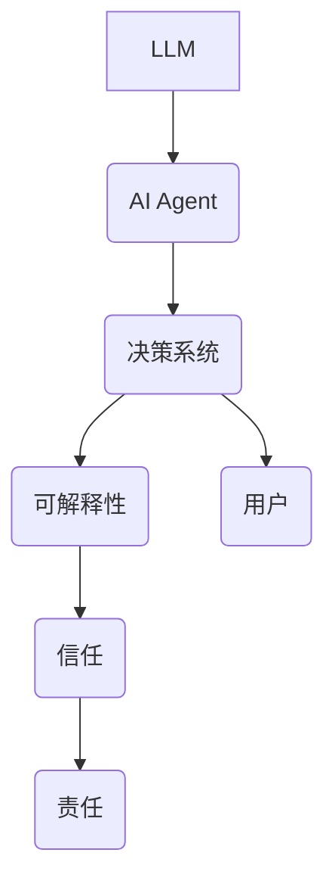
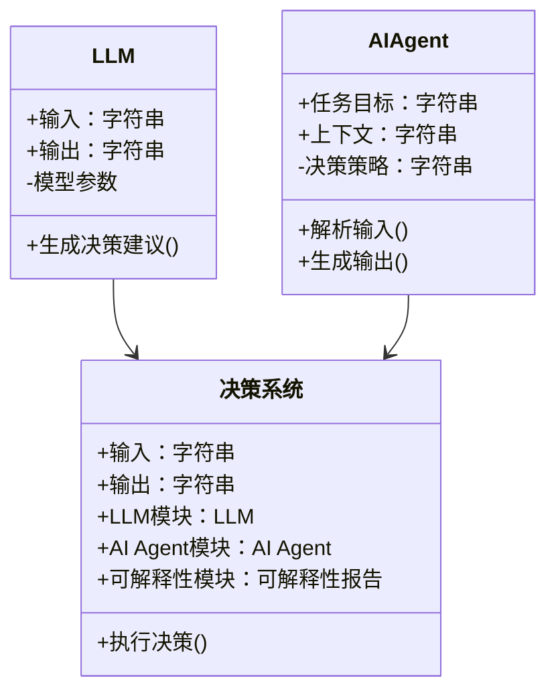
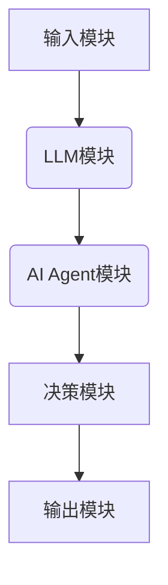
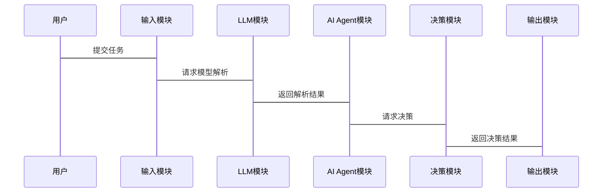

                 


# 构建LLM驱动的AI Agent可解释决策系统

> **关键词**：LLM，AI Agent，可解释性，决策系统，算法原理，系统架构，项目实战

> **摘要**：本文详细探讨了如何利用大语言模型（LLM）构建一个可解释的AI Agent决策系统。文章从问题背景、核心概念、算法原理、系统架构设计、项目实战等多个维度展开，结合具体案例分析和代码实现，帮助读者全面理解LLM驱动的AI Agent决策系统的构建过程。文章还提供了最佳实践和注意事项，为实际应用提供指导。

---

# 第1章: 背景与核心概念

## 1.1 问题背景

### 1.1.1 LLM驱动的AI Agent的定义
大语言模型（LLM）是一种基于深度学习的自然语言处理模型，能够理解和生成人类语言。AI Agent（智能体）是一种能够感知环境、执行任务并做出决策的智能系统。将LLM与AI Agent结合，可以构建出一种能够理解上下文、生成决策策略并执行任务的智能系统。

### 1.1.2 可解释决策系统的重要性
在AI决策系统中，可解释性是信任和责任的重要基础。用户需要了解系统是如何做出决策的，以便在出现问题时进行追溯和优化。LLM驱动的决策系统需要在保证性能的同时，提供清晰的决策逻辑和依据。

### 1.1.3 当前LLM在决策系统中的应用现状
当前，LLM已经在多个领域得到广泛应用，例如自然语言处理、机器翻译、问答系统等。然而，如何将LLM应用于决策系统，尤其是如何保证其可解释性，仍然是一个挑战。

## 1.2 核心概念与联系

### 1.2.1 LLM与AI Agent的关系
LLM为AI Agent提供了强大的语言理解和生成能力，而AI Agent则为LLM提供了上下文和任务目标，使其能够在特定场景下做出决策。

### 1.2.2 可解释性与决策系统的关联
可解释性是决策系统的核心要求之一。一个不可解释的决策系统难以被用户信任，也无法在出现问题时进行有效的调试和优化。

### 1.2.3 实体关系图


---

# 第2章: 算法原理

## 2.1 LLM驱动的决策算法

### 2.1.1 概率推理过程
LLM驱动的决策系统通常基于概率推理，通过计算不同决策路径的概率来选择最优动作。

### 2.1.2 决策树构建
决策树是一种常见的决策模型，通过将问题分解为多个子问题，构建树状结构来表示决策过程。

### 2.1.3 贝叶斯网络
贝叶斯网络是一种基于概率论的图形化模型，能够表示变量之间的依赖关系，并用于推理和决策。

## 2.2 数学模型与公式

### 2.2.1 贝叶斯公式
贝叶斯公式用于计算条件概率，是概率推理的基础。

$$ P(A|B) = \frac{P(B|A)P(A)}{P(B)} $$

### 2.2.2 决策树模型
决策树的熵公式用于衡量数据的不确定性：

$$ \text{Entropy} = -\sum p \log p $$

---

# 第3章: 系统分析与架构设计

## 3.1 系统架构设计

### 3.1.1 功能模块划分
- **输入模块**：接收用户输入并解析任务目标。
- **LLM模块**：调用大语言模型进行语言理解和生成。
- **决策模块**：基于LLM的输出进行推理和决策。
- **输出模块**：将决策结果返回给用户。

### 3.1.2 系统类图


### 3.1.3 系统架构图


## 3.2 接口与交互设计

### 3.2.1 接口定义
- **输入接口**：接收用户输入的自然语言描述。
- **输出接口**：返回决策结果和可解释性报告。
- **LLM接口**：与大语言模型进行交互。

### 3.2.2 交互流程


---

# 第4章: 项目实战

## 4.1 环境安装与配置

### 4.1.1 开发环境搭建
- 安装Python 3.8及以上版本。
- 安装必要的库：`transformers`, `numpy`, `scipy`。

### 4.1.2 依赖管理
使用`pip`安装依赖：

```bash
pip install transformers numpy scipy
```

## 4.2 核心代码实现

### 4.2.1 模型训练代码
```python
from transformers import AutoModelForSeq2Seq, AutoTokenizer
import torch

model_name = "facebook/bart-large"
tokenizer = AutoTokenizer.from_pretrained(model_name)
model = AutoModelForSeq2Seq.from_pretrained(model_name)
```

### 4.2.2 推理代码
```python
def generate_decision(input_text):
    inputs = tokenizer(input_text, return_tensors="pt")
    outputs = model.generate(inputs.input_ids, max_length=50)
    return tokenizer.decode(outputs[0], skip_special_tokens=True)
```

## 4.3 案例分析与解读

### 4.3.1 实际案例
假设用户输入任务目标为“安排会议”，系统通过LLM生成多个决策建议，并选择最优方案。

### 4.3.2 代码解读
代码实现了一个简单的决策生成过程，其中LLM负责生成可能的决策方案，AI Agent选择最优方案并输出结果。

---

# 第5章: 最佳实践与总结

## 5.1 实践中的注意事项

### 5.1.1 模型调优
- 定期对模型进行微调，以适应新的数据和任务需求。
- 监控模型的性能和可解释性。

### 5.1.2 可解释性优化
- 提供详细的决策日志，便于追溯和分析。
- 使用可视化工具展示决策过程。

## 5.2 小结
本文详细探讨了构建LLM驱动的AI Agent可解释决策系统的各个方面，从理论到实践，为读者提供了全面的指导。

## 5.3 注意事项
- 在实际应用中，需注意数据隐私和模型安全。
- 确保系统的可解释性，避免黑箱操作。

## 5.4 拓展阅读
- 推荐阅读相关领域的最新论文和书籍，例如《Deep Learning》和《Probabilistic Graphical Models》。

---

通过本文的讲解和实践，读者可以掌握构建LLM驱动的AI Agent可解释决策系统的相关知识，并能够将其应用于实际场景中。

