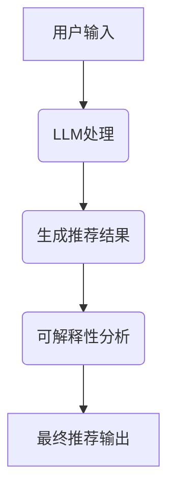
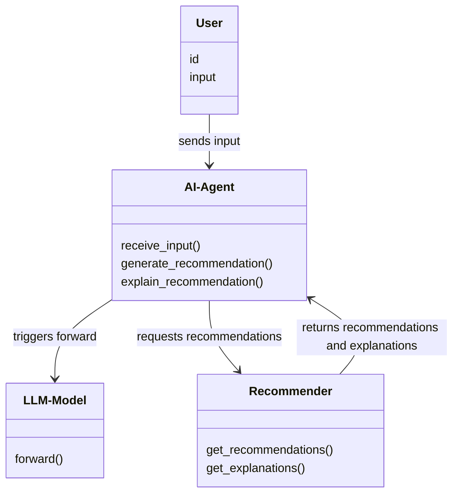
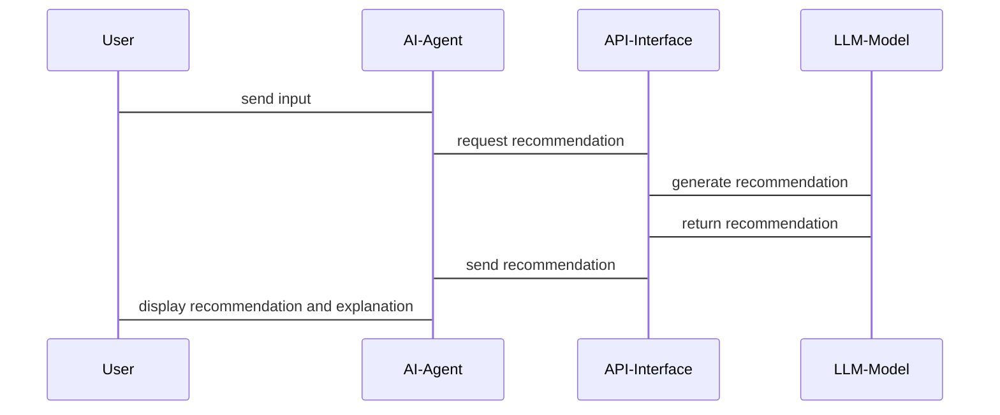

                 


# 构建LLM驱动的AI Agent可解释推荐系统

> 关键词：LLM、AI Agent、可解释推荐系统、算法原理、系统架构设计

> 摘要：本文详细探讨了如何构建一个基于大语言模型（LLM）的AI Agent可解释推荐系统，从问题背景、核心概念到算法原理、系统架构设计，再到项目实战，层层递进地分析和实现这一系统。通过理论与实践相结合的方式，为读者提供一个全面而深入的技术指南。

---

## 第1章: 问题背景与描述

### 1.1 问题背景

#### 1.1.1 当前推荐系统面临的挑战
推荐系统是现代人工智能技术的重要应用之一，广泛应用于电商、社交媒体、视频平台等领域。然而，随着用户需求的多样化和数据规模的不断扩大，传统推荐系统面临以下挑战：
- **不可解释性**：传统基于协同过滤或基于内容的推荐系统，往往无法向用户解释推荐的原因，导致用户信任度不足。
- **实时性不足**：在实时交互场景中，传统推荐系统难以快速响应用户需求。
- **复杂性增加**：随着数据的复杂化，推荐系统需要处理多模态数据（文本、图像、视频等），传统算法难以胜任。

#### 1.1.2 LLM驱动的AI Agent在推荐系统中的作用
大语言模型（LLM）如GPT-3、PaLM等，具备强大的理解和生成能力，可以为推荐系统提供以下优势：
- **上下文理解**：LLM能够理解用户输入的上下文，提供更精准的推荐。
- **动态交互**：AI Agent可以通过LLM与用户进行动态对话，实时调整推荐策略。
- **可解释性增强**：通过LLM生成的解释性文本，可以向用户清晰地说明推荐的原因。

#### 1.1.3 可解释性推荐系统的必要性
可解释性推荐系统是指推荐系统能够向用户解释推荐的原因，这在医疗、金融等领域尤为重要。LLM驱动的AI Agent可以通过生成自然语言解释，帮助用户理解推荐的依据，增强用户信任。

### 1.2 问题描述

#### 1.2.1 LLM驱动的AI Agent推荐系统的核心问题
- 如何利用LLM生成可解释的推荐结果。
- 如何设计AI Agent与推荐系统的交互流程。
- 如何保证推荐系统的实时性和准确性。

#### 1.2.2 可解释性推荐的定义与目标
可解释性推荐是指推荐系统能够提供推荐结果的解释，目标是：
- 提高用户对推荐结果的信任度。
- 帮助用户理解推荐结果的依据。
- 提供反馈机制，优化推荐系统。

#### 1.2.3 系统边界与外延
- **系统边界**：本系统仅关注基于LLM的推荐过程，不涉及后端数据存储和推荐策略优化。
- **系统外延**：可扩展至多模态数据处理和跨平台推荐。

---

## 第2章: 核心概念与联系

### 2.1 核心概念原理

#### 2.1.1 LLM的基本原理
LLM通过预训练掌握了大规模的语言数据，能够生成与输入相关的文本输出。其基本原理包括：
- **预训练**：通过大量无监督数据学习语言模型。
- **微调**：针对特定任务进行有监督微调。
- **生成机制**：基于概率模型生成文本。

#### 2.1.2 AI Agent的定义与功能
AI Agent是一个智能体，能够感知环境并采取行动以实现目标。其功能包括：
- **感知环境**：通过传感器获取信息。
- **决策与行动**：基于感知信息做出决策并执行行动。

#### 2.1.3 可解释推荐系统的实现机制
通过LLM生成自然语言解释，帮助用户理解推荐结果。

### 2.2 概念属性对比

#### 2.2.1 LLM与传统推荐算法的对比

| 特性          | LLM                     | 传统推荐算法         |
|---------------|--------------------------|----------------------|
| 数据需求      | 需要大量文本数据         | 需要结构化数据       |
| 实时性         | 支持实时生成             | 通常需要离线处理     |
| 可解释性       | 可生成自然语言解释       | 难以解释推荐原因     |

#### 2.2.2 AI Agent与传统推荐系统的对比

| 特性          | AI Agent                  | 传统推荐系统         |
|---------------|---------------------------|----------------------|
| 交互方式      | 支持动态交互               | 通常为静态推荐       |
| 智能性         | 具备自主决策能力           | 依赖预设规则         |
| 可扩展性       | 支持多任务处理             | 通常专注于单一任务   |

#### 2.2.3 可解释性推荐与不可解释推荐的对比

| 特性          | 可解释性推荐               | 不可解释性推荐        |
|---------------|---------------------------|----------------------|
| 用户信任度     | 高                        | 低                   |
| 用户满意度     | 高                        | 中或低               |
| 系统复杂度     | 较高                      | 较低                 |

### 2.3 ER实体关系图

```mermaid
er
actor: 用户
agent: AI Agent
model: LLM模型
item: 推荐项
interaction: 用户与推荐项的交互
```

---

## 第3章: 算法原理与数学模型

### 3.1 LLM驱动的推荐算法流程



### 3.2 推荐系统算法实现

#### 3.2.1 基于LLM的推荐算法

```python
def llm_based_recommendation(user_input, model, tokenizer):
    inputs = tokenizer(user_input, return_tensors='np')
    outputs = model.generate(**inputs, max_length=50, num_return_sequences=5)
    recommendations = [tokenizer.decode(output, skip_special_tokens=True) for output in outputs]
    return recommendations
```

#### 3.2.2 解释性生成算法

```python
def generate_explanation(recommendation, model, tokenizer):
    inputs = tokenizer(f"Explain why {recommendation} is recommended.", return_tensors='np')
    outputs = model.generate(**inputs, max_length=100, num_return_sequences=1)
    explanation = tokenizer.decode(outputs[0], skip_special_tokens=True)
    return explanation
```

#### 3.2.3 数学模型

推荐结果的概率计算公式：
$$ P(r|u) = \frac{\exp(\theta \cdot f(r,u))}{\sum_{r'} \exp(\theta \cdot f(r',u))} $$
其中，$\theta$ 是模型参数，$f(r,u)$ 是用户 $u$ 和推荐项 $r$ 的特征向量。

解释性生成的损失函数：
$$ L = -\sum_{i=1}^{n} y_i \log(p_i) + \lambda ||\theta||^2 $$
其中，$y_i$ 是真实标签，$p_i$ 是预测概率，$\lambda$ 是正则化系数。

---

## 第4章: 系统分析与架构设计

### 4.1 问题场景介绍

#### 4.1.1 用户需求
- 用户希望获得个性化推荐。
- 用户希望理解推荐的原因。

#### 4.1.2 数据来源
- 用户输入文本。
- 历史推荐记录。

### 4.2 系统功能设计

#### 4.2.1 领域模型



#### 4.2.2 系统架构设计


#### 4.2.3 接口设计



---

## 第5章: 项目实战

### 5.1 环境安装

```bash
pip install torch transformers mermaid4jupyter
```

### 5.2 系统核心实现

#### 5.2.1 数据预处理

```python
def preprocess_data(data):
    # 数据清洗和特征提取
    processed_data = []
    for item in data:
        processed_item = {
            'id': item['id'],
            'content': item['content']
        }
        processed_data.append(processed_item)
    return processed_data
```

#### 5.2.2 模型训练

```python
def train_model(train_loader, model, optimizer, criterion):
    for epoch in range(num_epochs):
        for inputs, labels in train_loader:
            outputs = model(inputs)
            loss = criterion(outputs, labels)
            loss.backward()
            optimizer.step()
            optimizer.zero_grad()
```

#### 5.2.3 推荐生成

```python
def generate_recommendations(user_input, model, tokenizer):
    inputs = tokenizer(user_input, return_tensors='pt')
    outputs = model.generate(**inputs, max_length=50, num_return_sequences=5)
    return outputs
```

#### 5.2.4 解释生成

```python
def generate_explanation(recommendation, model, tokenizer):
    inputs = tokenizer(f"Why is {recommendation} recommended?", return_tensors='pt')
    outputs = model.generate(**inputs, max_length=100, num_return_sequences=1)
    return outputs
```

### 5.3 实际案例分析

#### 5.3.1 案例介绍
假设我们正在为一个新闻推荐系统构建LLM驱动的AI Agent推荐系统。

#### 5.3.2 系统实现

```python
# 示例代码：新闻推荐系统实现
class NewsRecommender:
    def __init__(self, model, tokenizer):
        self.model = model
        self.tokenizer = tokenizer

    def get_recommendations(self, user_input):
        inputs = self.tokenizer(user_input, return_tensors='pt')
        outputs = self.model.generate(**inputs, max_length=50, num_return_sequences=5)
        return [self.tokenizer.decode(output, skip_special_tokens=True) for output in outputs]

    def get_explanations(self, recommendation):
        inputs = self.tokenizer(f"Explain why {recommendation} is recommended.", return_tensors='pt')
        outputs = self.model.generate(**inputs, max_length=100, num_return_sequences=1)
        return [self.tokenizer.decode(output, skip_special_tokens=True) for output in outputs]
```

#### 5.3.3 系统优化

- **优化点1**：使用更高效的分词器。
- **优化点2**：增加缓存机制，减少重复计算。
- **优化点3**：引入用户反馈机制，动态调整推荐策略。

---

## 第6章: 总结

### 6.1 最佳实践

- **及时验证**：在开发过程中，及时验证每一步的功能是否正确。
- **持续优化**：根据用户反馈，持续优化推荐算法和解释生成机制。
- **注意性能**：确保系统的实时性和响应速度。

### 6.2 小结

通过本文的详细讲解，我们了解了如何构建一个基于LLM的AI Agent可解释推荐系统，从理论到实践，层层深入地分析了系统的实现过程。通过实际案例的分析，我们掌握了系统的实现技巧和优化方法。

### 6.3 注意事项

- 在实际项目中，需要注意数据隐私和模型安全。
- 在部署系统时，要充分考虑系统的可扩展性和可维护性。

### 6.4 拓展阅读

- [书籍推荐]《Deep Learning for NLP》
- [在线资源] Hugging Face的Transformers库文档

---

通过本文的详细讲解，我们掌握了构建LLM驱动的AI Agent可解释推荐系统的核心技术和实现方法，为后续的研究和实践打下了坚实的基础。

