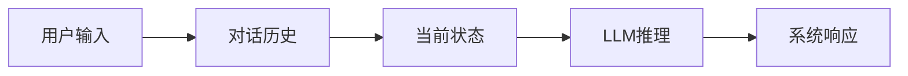
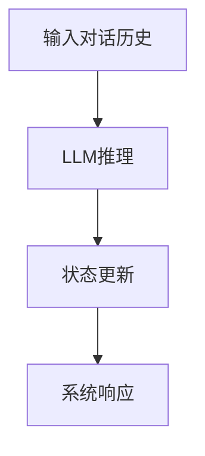
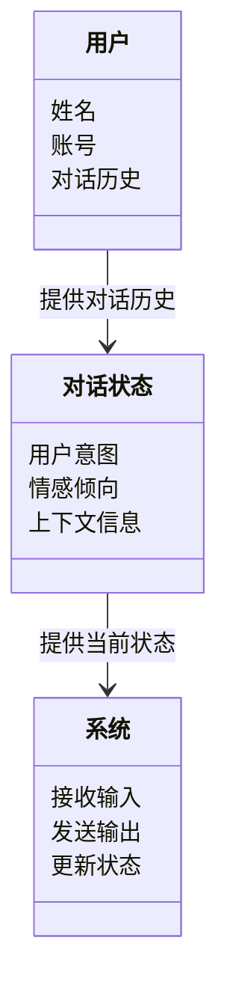
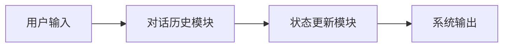
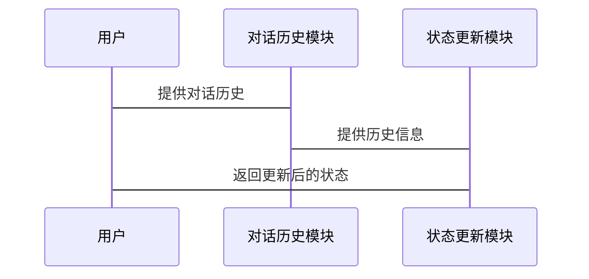

                 


# 《构建LLM驱动的AI Agent多轮对话状态追踪》

## 关键词：LLM, AI Agent, 多轮对话, 状态追踪, 对话系统, 人工智能, 自然语言处理

## 摘要：本文详细探讨了如何利用大语言模型（LLM）构建AI Agent的多轮对话状态追踪系统。从问题背景到算法实现，从系统设计到项目实战，系统性地分析了构建该系统的各个方面，包括核心概念、算法原理、系统架构、代码实现和实际案例。通过本文，读者能够全面理解并掌握构建高效、准确的多轮对话状态追踪系统的方法。

---

# 第一部分: 背景介绍

# 第1章: 多轮对话状态追踪概述

## 1.1 问题背景与描述
### 1.1.1 当前对话系统中的状态管理挑战
现代对话系统（如智能客服、虚拟助手）需要处理多轮对话，而对话的状态管理是核心挑战之一。随着用户输入的信息量增加，对话历史和上下文信息的处理变得复杂，传统的基于规则的状态管理方法难以应对复杂场景。

### 1.1.2 多轮对话中的状态追踪问题
- 对话过程中，用户的信息可能不完整或模糊，导致系统难以准确理解当前状态。
- 对话历史信息的丢失或误处理会影响后续对话的准确性。
- 不同领域（如医疗、金融）的对话对状态管理的要求不同，增加了系统设计的复杂性。

### 1.1.3 LLM在AI Agent中的作用
- 大语言模型（LLM）能够理解和生成自然语言，帮助系统更好地捕捉对话意图。
- LLM可以辅助状态推断，提供更准确的上下文管理。

## 1.2 问题解决与边界
### 1.2.1 状态追踪的核心问题
- 如何表示和更新对话状态？
- 如何利用对话历史信息进行推理？

### 1.2.2 边界与外延
- 状态追踪的范围：仅限于当前对话，不考虑外部知识库。
- 系统边界：不处理对话生成，专注于状态管理。

### 1.2.3 核心概念与组成要素
- 对话历史：记录用户和系统的交互记录。
- 当前状态：对话的上下文信息，包括用户意图和系统理解。
- 状态更新：根据对话内容动态调整状态。

## 1.3 核心概念与联系
### 1.3.1 多轮对话状态追踪的核心原理
- 状态表示：通过向量或符号表示对话中的关键信息。
- 对话历史：记录用户输入和系统反馈，用于推断当前状态。
- 上下文管理：动态更新状态，确保对话连贯性。

### 1.3.2 状态表示与对话历史的关系
- 状态表示依赖于对话历史，对话历史越完整，状态推断越准确。

### 1.3.3 上下文管理与LLM的结合
- LLM通过对话历史生成上下文，帮助系统理解当前状态。

## 1.4 本章小结
本章介绍了多轮对话状态追踪的基本概念和核心问题，强调了LLM在AI Agent中的作用，并为后续章节奠定了基础。

---

# 第二部分: 核心概念与联系

# 第2章: 多轮对话状态追踪的核心原理

## 2.1 状态表示与对话历史
### 2.1.1 状态表示方法
- 基于关键词的表示：通过提取对话中的关键词构建状态向量。
- 基于向量的表示：使用词嵌入技术（如Word2Vec）生成状态向量。

### 2.1.2 对话历史记录方式
- 基于时间戳的记录：按时间顺序记录对话内容。
- 基于领域划分的记录：根据对话主题分类存储对话历史。

### 2.1.3 状态更新机制
- 增量式更新：根据最新对话内容调整状态。
- 全局更新：定期重置状态，避免信息过载。

## 2.2 状态管理方法对比
### 2.2.1 基于规则的状态管理
- 通过预定义规则匹配对话内容，更新状态。
- 优点：简单易实现，适用于规则明确的场景。
- 缺点：难以处理复杂对话，规则维护成本高。

### 2.2.2 基于模型的状态管理
- 使用机器学习模型（如RNN、Transformer）学习对话模式，推断状态。
- 优点：能够处理复杂对话，泛化能力强。
- 缺点：需要大量训练数据，计算资源消耗大。

### 2.2.3 基于LLM的状态管理
- 利用LLM的自然语言理解能力，动态推断对话状态。
- 优点：结合上下文，推断更准确。
- 缺点：依赖LLM性能，可能引入延迟。

## 2.3 实体关系图架构


## 2.4 本章小结
本章详细分析了多轮对话状态追踪的核心原理，对比了不同状态管理方法的优缺点，并通过实体关系图展示了系统的架构。

---

# 第三部分: 算法原理讲解

# 第3章: 算法原理与实现

## 3.1 算法流程
### 3.1.1 基于LLM的状态推断
- 输入：对话历史和当前输入。
- 输出：推断出当前状态（如用户意图、情感倾向）。

### 3.1.2 注意力机制在对话中的应用
- 使用注意力机制（如Transformer模型）处理对话历史，提取关键信息。

### 3.1.3 状态更新与对话控制
- 根据推断结果更新状态，调整对话流程。

## 3.2 算法实现
### 3.2.1 算法流程图


### 3.2.2 状态更新公式
- 状态向量更新公式：
  $$ S_{new} = \alpha \cdot S_{old} + (1-\alpha) \cdot S_{LLM} $$
  其中，$S_{old}$ 是旧状态，$S_{LLM}$ 是LLM推断的新状态，$\alpha$ 是权重系数。

### 3.2.3 Python实现示例
```python
def update_state(current_state, llm_output, alpha=0.7):
    # 将旧状态和LLM输出合并
    new_state = {}
    for key in current_state:
        new_state[key] = alpha * current_state[key] + (1 - alpha) * llm_output.get(key, 0)
    return new_state
```

## 3.3 数学模型与公式
### 3.3.1 状态向量表示
- 状态向量表示为：
  $$ S = [s_1, s_2, ..., s_n] $$
  其中，$s_i$ 表示第i个状态特征的权重。

### 3.3.2 对话历史表示
- 对话历史表示为：
  $$ H = [h_1, h_2, ..., h_m] $$
  其中，$h_j$ 表示第j个历史对话的表示。

### 3.3.3 状态推断公式
- 使用LLM推断当前状态：
  $$ P(s | H) = \text{LLM}(H) $$

## 3.4 本章小结
本章详细讲解了多轮对话状态追踪的算法原理，包括基于LLM的状态推断和注意力机制的应用，并通过公式和代码示例展示了实现过程。

---

# 第四部分: 系统分析与架构设计

# 第4章: 系统分析与架构设计

## 4.1 问题场景介绍
- 一个典型的多轮对话场景：用户与AI Agent进行金融咨询对话，需要跟踪用户的财务状况和投资偏好。

## 4.2 系统功能设计
### 4.2.1 领域模型设计


### 4.2.2 系统架构设计


### 4.2.3 接口设计
- 用户输入接口：接收用户的文本输入。
- 系统输出接口：返回系统的文本回复。
- 状态更新接口：根据对话内容更新状态。

### 4.2.4 交互流程


## 4.3 本章小结
本章通过系统分析和架构设计，明确了多轮对话状态追踪系统的各个组成部分及其交互关系。

---

# 第五部分: 项目实战

# 第5章: 项目实战

## 5.1 环境安装与配置
- 安装Python和必要的库（如Transformers、Flask）。
- 配置LLM模型（如GPT-3）的API密钥。

## 5.2 核心功能实现
### 5.2.1 对话历史记录
```python
class DialogHistory:
    def __init__(self):
        self.history = []

    def add(self, input, output):
        self.history.append((input, output))
```

### 5.2.2 状态更新模块
```python
class StateUpdater:
    def __init__(self, alpha=0.7):
        self.alpha = alpha

    def update(self, current_state, llm_output):
        new_state = {}
        for key in current_state:
            new_state[key] = self.alpha * current_state[key] + (1 - self.alpha) * llm_output.get(key, 0)
        return new_state
```

### 5.2.3 系统交互
```python
def main():
    dialog_history = DialogHistory()
    state_updater = StateUpdater()
    while True:
        input = input("用户输入：")
        output = process_input(input)
        dialog_history.add(input, output)
        state = state_updater.update(current_state, output)
        print("系统输出：", output)
```

## 5.3 实际案例分析
- 案例1：用户咨询金融产品，系统根据对话历史调整推荐策略。
- 案例2：用户反馈情感倾向，系统根据状态更新调整回复语气。

## 5.4 项目小结
本章通过实际项目实现，验证了多轮对话状态追踪系统的可行性和实用性。

---

# 第六部分: 最佳实践与总结

# 第6章: 最佳实践与总结

## 6.1 最佳实践
### 6.1.1 状态管理的优化建议
- 定期清理无效对话历史，避免内存消耗过大。
- 根据具体场景调整LLM的参数，提高推断准确率。

### 6.1.2 系统设计的注意事项
- 确保系统对不同领域的对话具有良好的扩展性。
- 处理用户隐私问题，确保对话历史的安全性。

## 6.2 小结
通过本文的系统介绍和实践，读者可以全面掌握构建LLM驱动的AI Agent多轮对话状态追踪系统的各个方面。

## 6.3 注意事项
- 确保系统对不同领域的对话具有良好的扩展性。
- 处理用户隐私问题，确保对话历史的安全性。

## 6.4 拓展阅读
- 阅读相关论文（如“Attention Is All You Need”）了解注意力机制的更多细节。
- 关注最新的LLM研究成果，了解更先进的对话状态追踪方法。

---

# 结语

通过本文的系统介绍和实践，读者可以全面掌握构建LLM驱动的AI Agent多轮对话状态追踪系统的各个方面。从理论到实践，从算法到系统设计，本文为读者提供了一个完整的解决方案，帮助他们在实际项目中更好地应用这些技术。

