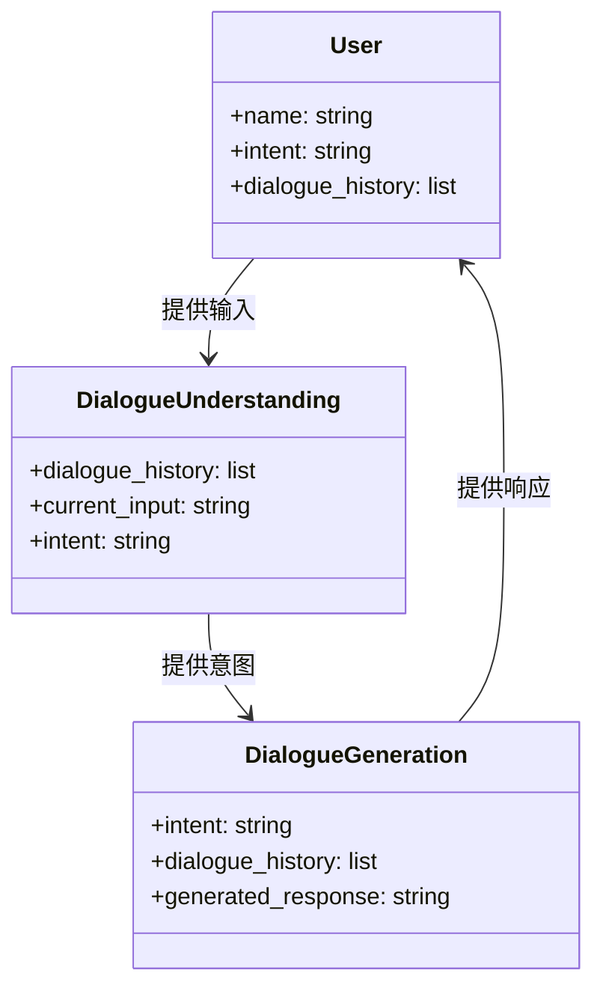
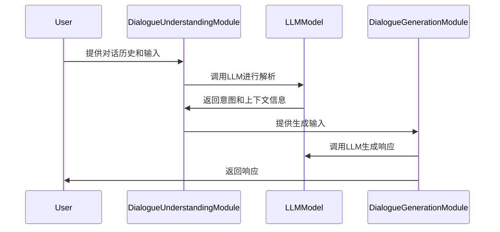

                 


# 构建LLM驱动的AI Agent多轮对话理解

**关键词**：大语言模型（LLM）、AI Agent、多轮对话理解、人机交互、自然语言处理、序列到序列模型

**摘要**：  
本文系统地探讨了如何利用大语言模型（LLM）构建一个多轮对话理解系统，以实现AI Agent与用户的高效交互。文章从问题背景、核心概念、算法原理、系统架构到项目实战，全面解析了LLM驱动的多轮对话理解的关键技术与实现细节。通过结合理论与实践，本文为读者提供了从基础到应用的完整指南。

---

# 第一部分: 构建LLM驱动的AI Agent多轮对话理解背景介绍

## 第1章: 问题背景与技术现状

### 1.1 问题背景

#### 1.1.1 当前人机交互的挑战
- 传统单轮对话模型的局限性：无法处理上下文依赖的对话。
- 用户需求的多样性：用户在多轮对话中可能会表达复杂意图。
- 对话历史的有效利用：如何将历史信息融入模型的推理过程。

#### 1.1.2 多轮对话理解的重要性
- 提升用户体验：通过连续对话提供更精准的服务。
- 实现复杂任务：支持需要上下文记忆的任务。
- 扩展应用场景：从简单问答扩展到复杂任务执行。

#### 1.1.3 LLM在对话理解中的作用
- LLM的强大生成能力：通过大规模预训练提升对话质量。
- 对上下文的处理能力：利用序列建模捕捉对话的动态关系。
- 实时推理能力：支持快速响应和动态调整对话策略。

### 1.2 技术现状

#### 1.2.1 LLM的发展历程
- 从规则驱动到数据驱动：从基于规则的对话系统到基于深度学习的模型。
- 从单任务到多任务：LLM的多任务学习能力。
- 从单轮对话到多轮对话：模型的对话能力逐步增强。

#### 1.2.2 多轮对话理解的技术挑战
- 对话历史的有效利用：如何处理冗长的对话历史。
- 上下文的语义关联：如何理解对话中隐含的关系。
- 动态对话目标的设定：如何根据对话进展调整目标。

#### 1.2.3 当前主流技术解决方案
- 基于Transformer的模型：如BERT、GPT系列。
- 基于注意力机制的多轮对话模型：如对话生成中的Transformer架构。
- 增量式对话处理：逐轮生成响应并更新状态。

### 1.3 本章小结
本章从问题背景和技术现状两个方面介绍了构建LLM驱动的AI Agent多轮对话理解的重要性和必要性，为后续内容奠定了基础。

---

# 第二部分: 核心概念与联系

## 第2章: LLM与多轮对话理解的核心概念

### 2.1 LLM的基本原理

#### 2.1.1 大语言模型的定义与特点
- 定义：基于深度学习的预训练模型，通过大量文本数据学习语言规律。
- 特点：强大的生成能力、上下文理解能力、可扩展性。

#### 2.1.2 LLM的训练机制
- 预训练目标：通过自监督学习目标（如Masked Language Model）学习语言表示。
- 微调策略：针对特定任务进行Fine-tuning。

#### 2.1.3 LLM的推理机制
- 解码策略：如贪心搜索和采样。
- 动态调整：根据对话上下文动态调整生成策略。

### 2.2 多轮对话理解的核心概念

#### 2.2.1 对话上下文的构建
- 对话状态表示：将对话历史编码为向量表示。
- 上下文窗口：选择合适的对话历史片段进行处理。

#### 2.2.2 对话历史的处理
- 时序建模：利用RNN或Transformer捕捉对话的时序关系。
- 上下文注意力机制：在生成时关注相关对话历史信息。

#### 2.2.3 对话目标的设定
- 动态目标调整：根据对话进展更新对话目标。
- 多目标平衡：在复杂任务中平衡多个对话目标。

### 2.3 LLM与多轮对话理解的联系

#### 2.3.1 LLM在对话理解中的优势
- 强大的上下文理解能力：通过Transformer的自注意力机制捕捉对话关联。
- 实时推理能力：快速生成响应并更新对话状态。

#### 2.3.2 多轮对话理解对LLM的需求
- 对话历史的有效利用：需要模型能够处理长序列。
- 动态目标调整：需要模型具有灵活性和适应性。

#### 2.3.3 两者结合的系统架构
- 系统架构：输入对话历史和当前输入，输出下一步动作或生成响应。
- 模块划分：对话理解模块、生成模块、状态管理模块。

### 2.4 本章小结
本章通过分析LLM的基本原理和多轮对话理解的核心概念，揭示了两者结合的系统架构和实现思路。

---

# 第三部分: 算法原理讲解

## 第3章: 多轮对话理解的算法原理

### 3.1 序列到序列模型

#### 3.1.1 基本原理
- 输入：对话历史和当前输入。
- 输出：生成的响应或动作。
- 模型结构：编码器-解码器架构。

#### 3.1.2 注意力机制
- 自注意力机制：捕捉对话历史中的关键信息。
- 位置编码：处理时序信息。

#### 3.1.3 解码器结构
- 解码器的自注意力：生成上下文相关的输出。
- 解码器与编码器的交互：通过交叉注意力捕捉输入与输出的关系。

### 3.2 基于LLM的对话生成

#### 3.2.1 解码策略
- 贪心搜索：逐词生成，选择概率最高的词。
- 采样：通过随机采样生成多样化响应。

#### 3.2.2 动态调整机制
- 温度参数：控制生成的多样性和确定性。
- 重复抑制：避免生成重复内容。

#### 3.2.3 模型训练技巧
- 预训练与微调：利用大规模数据预训练，针对特定任务微调。
- 监督信号设计：使用对话数据增强模型的对话能力。

### 3.3 对话评价与优化

#### 3.3.1 对话质量评估指标
- BLEU：基于生成文本与参考文本的相似性。
- ROUGE：基于文本摘要的评估指标。
- 人工评价：结合主观因素评估对话质量。

#### 3.3.2 基于反馈的优化
- 在线反馈：根据用户反馈调整生成策略。
- 离线优化：利用日志数据进行离线训练优化。

#### 3.3.3 模型的持续学习
- 微调：持续优化模型参数。
- 知识更新：动态更新模型的知识库。

### 3.4 本章小结
本章详细介绍了多轮对话理解的算法原理，包括序列到序列模型、注意力机制、解码策略以及对话评价与优化方法。

---

# 第四部分: 系统分析与架构设计方案

## 第4章: 多轮对话理解系统分析

### 4.1 问题场景介绍

#### 4.1.1 用户需求分析
- 用户期望与AI Agent进行自然的多轮对话。
- 用户可能表达复杂意图，需要系统准确理解。

#### 4.1.2 系统功能目标
- 实时对话理解：准确解析用户意图。
- 上下文记忆：保持对话的连续性。
- 动态响应生成：根据对话进展生成合适响应。

#### 4.1.3 约束条件与边界
- 对话历史的长度限制。
- 响应生成的时延要求。
- 模型资源消耗限制。

### 4.2 系统功能设计

#### 4.2.1 领域模型设计（Mermaid类图）


#### 4.2.2 系统架构设计（Mermaid架构图）


#### 4.2.3 系统接口设计
- 输入接口：接收用户的对话输入和对话历史。
- 输出接口：生成响应并更新对话历史。

#### 4.2.4 系统交互流程（Mermaid序列图）


### 4.3 本章小结
本章通过系统分析与架构设计，明确了多轮对话理解系统的实现方案，为后续的项目实战奠定了基础。

---

# 第五部分: 项目实战

## 第5章: 项目实战与应用案例

### 5.1 环境安装

#### 5.1.1 安装Python与相关库
- Python 3.8及以上版本。
- 安装库：transformers、torch、numpy。

#### 5.1.2 安装LLM模型
- 使用Hugging Face的预训练模型，如GPT-2或GPT-3。

### 5.2 系统核心实现

#### 5.2.1 对话理解模块实现
```python
from transformers import AutoTokenizer, AutoModelForCausalLM

class DialogueUnderstanding:
    def __init__(self, model_name="gpt2"):
        self.tokenizer = AutoTokenizer.from_pretrained(model_name)
        self.model = AutoModelForCausalLM.from_pretrained(model_name)

    def generate_response(self, dialogue_history, current_input):
        full_dialogue = dialogue_history + [current_input]
        inputs = self.tokenizer(full_dialogue, return_tensors="pt").input_ids
        outputs = self.model.generate(inputs, max_length=50)
        response = self.tokenizer.decode(outputs[0], skip_special_tokens=True)
        return response
```

#### 5.2.2 对话生成模块实现
```python
class DialogueGeneration:
    def __init__(self, model_name="gpt2"):
        self.tokenizer = AutoTokenizer.from_pretrained(model_name)
        self.model = AutoModelForCausalLM.from_pretrained(model_name)

    def generate_response(self, dialogue_history, current_input):
        full_dialogue = dialogue_history + [current_input]
        inputs = self.tokenizer(full_dialogue, return_tensors="pt").input_ids
        outputs = self.model.generate(inputs, max_length=50)
        response = self.tokenizer.decode(outputs[0], skip_special_tokens=True)
        return response
```

#### 5.2.3 系统交互流程实现
```python
def main():
    dialogue_history = []
    while True:
        current_input = input("User: ")
        response = generate_response(dialogue_history, current_input)
        print("AI Agent:", response)
        dialogue_history.append(current_input)
```

### 5.3 案例分析与详细解读

#### 5.3.1 对话历史的处理
- 示例对话历史：["今天天气怎么样？", "北京", "请告诉我北京的天气情况。"]
- 对话理解模块：解析用户的真实需求是查询天气。
- 对话生成模块：生成符合上下文的响应。

#### 5.3.2 对话生成的优化
- 基于反馈的优化：用户对生成的响应进行评分，调整生成策略。
- 动态温度参数：根据对话的复杂性调整生成的多样性。

### 5.4 本章小结
本章通过项目实战，详细讲解了如何利用LLM构建一个多轮对话理解系统，通过代码示例和案例分析，帮助读者理解实现细节。

---

# 第六部分: 最佳实践与总结

## 第6章: 最佳实践与总结

### 6.1 最佳实践

#### 6.1.1 环境配置
- 使用最新的Python版本和库。
- 确保硬件资源充足。

#### 6.1.2 模型选择
- 根据任务需求选择合适的模型。
- 考虑模型的推理速度和生成质量。

#### 6.1.3 对话优化
- 定期收集用户反馈，优化生成策略。
- 动态调整温度参数和采样策略。

### 6.2 小结
本文从背景、核心概念、算法原理到系统架构和项目实战，全面解析了构建LLM驱动的AI Agent多轮对话理解的关键技术。通过理论与实践的结合，为读者提供了从基础到应用的完整指南。

### 6.3 注意事项

#### 6.3.1 模型资源消耗
- 预训练模型的内存需求较高，需确保硬件配置。
- 对话历史的长度会影响模型的推理速度。

#### 6.3.2 数据隐私
- 对话数据可能包含敏感信息，需注意数据隐私保护。

#### 6.3.3 模型可解释性
- 生成的响应需具备可解释性，避免黑箱模型带来的问题。

### 6.4 拓展阅读

#### 6.4.1 相关论文
- "Attention Is All You Need"（Transformer论文）。
- "Generating Longer High-Quality Dialogues with a Large-Scale Dataset"（多轮对话生成论文）。

#### 6.4.2 技术博客
- Hugging Face的官方文档。
- 开源社区的对话系统实现案例。

### 6.5 本章小结
本章总结了构建LLM驱动的AI Agent多轮对话理解的关键点，并提供了最佳实践和拓展阅读建议。

---

**关键词**：大语言模型（LLM）、AI Agent、多轮对话理解、人机交互、自然语言处理、序列到序列模型

**摘要**：  
本文系统地探讨了如何利用大语言模型（LLM）构建一个多轮对话理解系统，以实现AI Agent与用户的高效交互。文章从问题背景、核心概念、算法原理、系统架构到项目实战，全面解析了LLM驱动的多轮对话理解的关键技术与实现细节。通过结合理论与实践，本文为读者提供了从基础到应用的完整指南。

