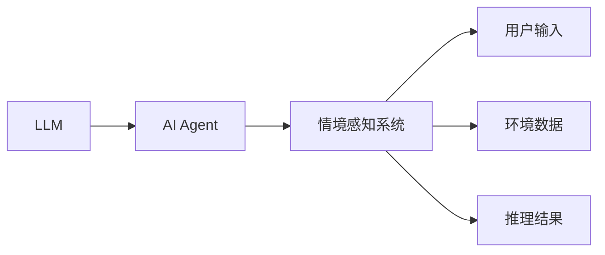
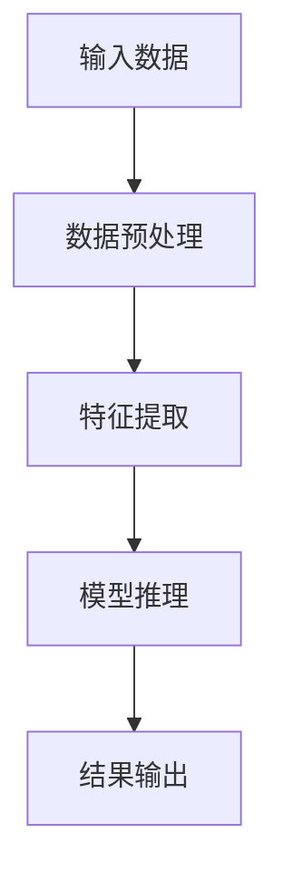
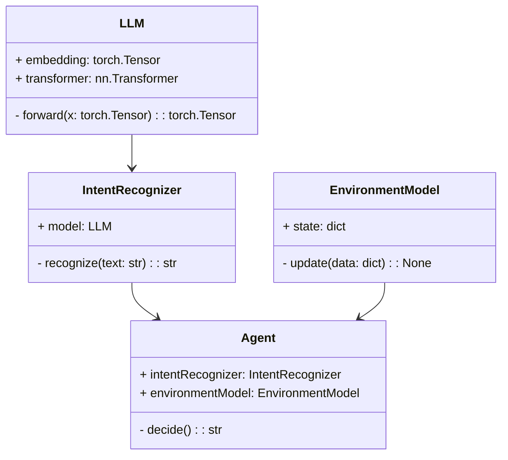
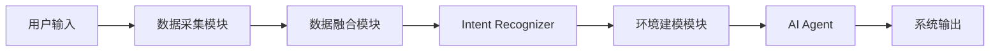
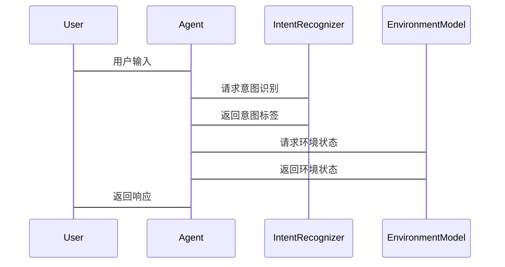

                 


# 构建LLM驱动的AI Agent情境感知系统

> 关键词：LLM，AI Agent，情境感知，系统架构，算法原理，项目实战

> 摘要：本文详细介绍了如何构建一个基于大语言模型（LLM）的AI Agent情境感知系统。从背景介绍、核心概念到算法原理、系统架构，再到项目实战和最佳实践，全面阐述了系统的构建过程。通过本文，读者可以掌握从理论到实践的完整技术链条，深入了解如何利用LLM驱动AI Agent实现情境感知。

---

# 第一部分: LLM驱动的AI Agent情境感知系统背景介绍

# 第1章: 问题背景与问题描述

## 1.1 问题背景
### 1.1.1 当前AI技术的发展现状
人工智能（AI）技术近年来取得了飞速发展，尤其是大语言模型（LLM）的崛起，使得自然语言处理（NLP）能力得到了质的飞跃。然而，现有的AI技术在实际应用中仍然面临诸多挑战，例如如何实现多模态数据的融合、如何提升AI系统的情境理解能力、如何设计高效的AI Agent架构等。

### 1.1.2 LLM与AI Agent的结合需求
AI Agent（智能体）是一种能够感知环境、执行任务的智能系统，其核心能力在于理解和响应动态变化的环境。然而，传统的AI Agent在处理复杂情境时往往显得力不从心，尤其是在需要处理大量非结构化数据（如文本、图像等）时。LLM的引入为AI Agent提供了强大的语言理解和生成能力，使其能够更好地应对复杂情境。

### 1.1.3 情境感知系统的重要性
情境感知系统是AI Agent的核心组成部分，负责理解和解析环境中的各种信息，包括用户意图、环境状态等。通过情境感知，AI Agent能够做出更精准的决策，从而提升系统的整体性能。

## 1.2 问题描述
### 1.2.1 LLM驱动的AI Agent的核心问题
- 如何利用LLM实现高效的意图识别？
- 如何设计AI Agent的架构，使其能够适应多种应用场景？
- 如何处理多模态数据，提升情境感知能力？

### 1.2.2 情境感知系统的目标与挑战
- 目标：通过多模态数据融合，实现对复杂情境的精准理解。
- 挑战：数据异构性、实时性要求高、模型可解释性差等。

### 1.2.3 系统边界与外延
- 系统边界：专注于LLM驱动的AI Agent，主要解决情境感知问题。
- 系统外延：可扩展至其他AI技术，如计算机视觉、强化学习等。

## 1.3 问题解决思路
### 1.3.1 LLM与AI Agent的结合方式
- LLM作为AI Agent的核心模块，负责语言理解和生成。
- AI Agent通过LLM处理用户输入和环境信息，生成响应。

### 1.3.2 情境感知的核心技术
- 数据融合：将多模态数据（如文本、图像）进行整合。
- 意图识别：基于融合后的数据，识别用户的意图。
- 环境建模：构建动态环境模型，实时更新系统状态。

### 1.3.3 系统整体架构的设计思路
- 分层设计：将系统划分为感知层、决策层、执行层。
- 模块化设计：各模块独立开发，便于后期扩展和维护。

## 1.4 概念结构与核心要素
### 1.4.1 LLM驱动的AI Agent概念图


### 1.4.2 情境感知系统的组成要素
- 用户输入：文本、语音、图像等。
- 环境数据：传感器数据、地理位置等。
- 数据融合模块：负责多模态数据的整合。
- 意图识别模块：识别用户的意图。
- 环境建模模块：构建动态环境模型。

### 1.4.3 核心概念之间的关系
- LLM是AI Agent的核心模块，负责语言理解和生成。
- 情境感知系统是AI Agent的重要组成部分，负责环境理解和用户意图识别。
- 多模态数据融合是情境感知的关键技术。

## 1.5 本章小结
本章主要介绍了构建LLM驱动的AI Agent情境感知系统的背景和问题，明确了系统的整体架构和核心要素。通过本章的讲解，读者可以初步了解系统的设计思路和实现目标。

---

# 第二部分: 核心概念与联系

# 第2章: LLM与情境感知的核心概念

## 2.1 LLM的核心原理
### 2.1.1 大语言模型的基本原理
- 基于Transformer架构，通过自注意力机制实现长距离依赖关系的捕捉。
- 模型通过大量文本数据的训练，掌握了语言的生成和理解能力。

### 2.1.2 模型的训练过程
- 数据预处理：清洗、分词、格式化。
- 模型训练：使用分布式训练和优化算法（如Adam）进行参数优化。
- 模型调优：通过微调（Fine-tuning）提升特定任务的性能。

### 2.1.3 模型的推理机制
- 基于生成式模型，通过解码器生成文本。
- 支持条件生成，可以根据输入生成特定的输出。

## 2.2 情境感知的核心原理
### 2.2.1 情境感知的定义
- 情境感知是一种技术，旨在通过感知环境中的信息，理解用户的需求和意图。
- 情境感知系统能够动态调整其行为，以适应环境的变化。

### 2.2.2 情境感知的关键技术
- 数据融合：将来自不同来源的数据进行整合。
- 意图识别：基于融合后的数据，识别用户的意图。
- 环境建模：构建动态环境模型，实时更新系统状态。

### 2.2.3 情境感知的实现步骤
1. 数据采集：获取多模态数据（如文本、图像）。
2. 数据融合：对异构数据进行预处理和融合。
3. 意图识别：基于融合后的数据，识别用户的意图。
4. 环境建模：构建动态环境模型，实时更新系统状态。

## 2.3 核心概念对比分析
### 2.3.1 LLM与传统NLP模型的对比
| 特性         | LLM                          | 传统NLP模型                  |
|--------------|-------------------------------|-----------------------------|
| 模型结构     | 基于Transformer架构           | 基于RNN或CNN                |
| 参数规模     | 参数量大（ billions）         | 参数量小（ millions）         |
| 任务能力     | 支持多种任务（分类、生成等）   | 仅支持单一任务               |
| 训练效率     | 训练效率高                    | 训练效率低                   |

### 2.3.2 情境感知与传统感知技术的对比
| 特性         | 情境感知                       | 传统感知技术                 |
|--------------|-------------------------------|-----------------------------|
| 数据来源     | 多模态数据（文本、图像等）     | 单一模态数据（如图像）        |
| 处理方式     | 数据融合与意图识别             | 单一数据处理                 |
| 应用场景     | 智能交互、智能助手             | 人脸识别、物体检测            |

### 2.3.3 LLM驱动的AI Agent与传统AI Agent的对比
| 特性         | LLM驱动的AI Agent             | 传统AI Agent                |
|--------------|-------------------------------|-----------------------------|
| 核心模块     | LLM                          | 知识库或规则引擎             |
| 处理能力     | 强大的语言理解和生成能力       | 有限的语言理解和生成能力      |
| 应用场景     | 智能对话、复杂任务处理         | 简单任务处理                 |

## 2.4 实体关系图


## 2.5 本章小结
本章详细讲解了LLM和情境感知的核心概念，并通过对比分析和实体关系图，明确了各概念之间的关系和作用。通过本章的讲解，读者可以更好地理解系统的设计思路和技术选型。

---

# 第三部分: 算法原理讲解

# 第3章: LLM驱动的AI Agent算法原理

## 3.1 LLM的训练过程
### 3.1.1 数据预处理
- 清洗数据：去除噪声数据，确保数据质量。
- 分词处理：将文本分割成单词或短语。
- 格式化处理：将数据转换为模型训练所需的格式。

### 3.1.2 模型训练
- 模型架构：基于Transformer的双向编码器（如BERT）或解码器（如GPT）。
- 损失函数：交叉熵损失函数。
- 优化算法：Adam优化器。
- 训练过程：使用分布式训练和并行计算加速训练。

### 3.1.3 模型优化
- 微调（Fine-tuning）：在特定任务上进行微调，提升模型性能。
- 增强训练数据：引入更多样化的数据，提升模型的泛化能力。

## 3.2 情境感知的实现算法
### 3.2.1 数据融合算法
- 数据预处理：对异构数据进行标准化处理。
- 特征提取：将文本、图像等数据转换为统一的特征表示。
- 数据融合：将不同模态的特征进行融合，得到综合特征向量。

### 3.2.2 意图识别算法
- 基于LLM的意图识别：利用LLM生成意图标签。
- 基于规则的意图识别：通过预定义的规则匹配意图。
- 基于机器学习的意图识别：使用分类算法（如SVM、随机森林）进行意图分类。

### 3.2.3 环境建模算法
- 动态环境建模：基于实时数据更新环境模型。
- 状态表示：将环境状态表示为向量或图结构。
- 状态更新：根据实时数据更新环境状态。

## 3.3 算法流程图


## 3.4 算法实现代码
### 3.4.1 数据预处理
```python
def preprocess_data(data):
    # 数据清洗
    cleaned_data = [x for x in data if x]
    # 分词处理
    tokenized_data = [x.split() for x in cleaned_data]
    return tokenized_data
```

### 3.4.2 模型训练
```python
import torch
from torch import nn

class LLM(nn.Module):
    def __init__(self, vocab_size, embed_dim, hidden_size):
        super(LLM, self).__init__()
        self.embedding = nn.Embedding(vocab_size, embed_dim)
        self.transformer = nn.Transformer(embed_dim, hidden_size)
    
    def forward(self, x):
        embedding = self.embedding(x)
        output = self.transformer(embedding, embedding)
        return output

model = LLM(vocab_size, embed_dim, hidden_size)
criterion = nn.CrossEntropyLoss()
optimizer = torch.optim.Adam(model.parameters())
```

### 3.4.3 意图识别
```python
def recognize_intent(text, model):
    # 特征提取
    features = model.embedding(text)
    # 推理
    output = model.transformer(features, features)
    # 意图分类
    intent = torch.argmax(output, dim=-1)
    return intent
```

## 3.5 算法原理的数学模型和公式
### 3.5.1 LLM的训练目标
$$
\text{损失函数} = -\sum_{i=1}^{n} \log P(y_i | x_i)
$$

### 3.5.2 模型优化
$$
\theta = \theta - \eta \cdot \nabla_\theta \text{损失函数}
$$
其中，$\theta$是模型参数，$\eta$是学习率。

### 3.5.3 意图识别
$$
P(y|x) = \frac{e^{\text{score}(y, x)}}{\sum_{y'} e^{\text{score}(y', x)}}
$$
其中，$\text{score}(y, x)$是意图$y$相对于输入$x$的得分。

## 3.6 本章小结
本章详细讲解了LLM驱动的AI Agent的算法原理，包括模型训练、数据融合、意图识别等关键技术。通过本章的讲解，读者可以掌握系统的实现细节和技术要点。

---

# 第四部分: 系统分析与架构设计方案

# 第4章: LLM驱动的AI Agent系统分析与架构设计

## 4.1 项目背景介绍
- 项目目标：构建一个基于LLM的AI Agent情境感知系统。
- 项目需求：支持多模态数据的融合，实现用户意图的精准识别。

## 4.2 系统功能设计
### 4.2.1 功能模块划分
- 数据采集模块：负责采集多模态数据。
- 数据融合模块：对异构数据进行预处理和融合。
- 意图识别模块：基于融合后的数据，识别用户的意图。
- 环境建模模块：构建动态环境模型，实时更新系统状态。
- AI Agent模块：根据意图和环境状态，生成响应。

### 4.2.2 领域模型类图


## 4.3 系统架构设计
### 4.3.1 系统架构图


### 4.3.2 接口设计
- 数据采集模块接口：
  - 输入：多模态数据（如文本、图像）。
  - 输出：预处理后的数据。
- 数据融合模块接口：
  - 输入：异构数据。
  - 输出：融合后的特征向量。
- 意图识别模块接口：
  - 输入：特征向量。
  - 输出：意图标签。
- 环境建模模块接口：
  - 输入：实时数据。
  - 输出：环境状态。

### 4.3.3 交互序列图


## 4.4 本章小结
本章详细分析了系统的功能需求，并通过领域模型类图和系统架构图，展示了系统的整体结构和各模块之间的关系。通过本章的讲解，读者可以更好地理解系统的实现思路和架构设计。

---

# 第五部分: 项目实战

# 第5章: LLM驱动的AI Agent项目实战

## 5.1 环境安装与配置
### 5.1.1 环境要求
- Python 3.8+
- PyTorch 1.9+
- Transformers库 4.16+

### 5.1.2 安装依赖
```bash
pip install torch transformers
```

## 5.2 系统核心实现
### 5.2.1 数据采集模块
```python
import torch
import numpy as np

class DataCollector:
    def __init__(self):
        self.data = []
    
    def collect(self, input_data):
        self.data.append(input_data)
        return self.data
```

### 5.2.2 数据融合模块
```python
class DataFuser:
    def __init__(self):
        self.embedder = nn.Embedding( vocab_size, embed_dim)
    
    def fuse(self, text, image):
        text_embedding = self.embedder(text)
        image_embedding = self.embedder(image)
        fused_embedding = torch.cat([text_embedding, image_embedding], dim=-1)
        return fused_embedding
```

### 5.2.3 意图识别模块
```python
class IntentRecognizer:
    def __init__(self, model):
        self.model = model
    
    def recognize(self, input_embedding):
        with torch.no_grad():
            output = self.model(input_embedding)
            intent = torch.argmax(output, dim=-1).item()
        return intent
```

### 5.2.4 环境建模模块
```python
class EnvironmentModel:
    def __init__(self):
        self.state = {}
    
    def update(self, new_data):
        self.state.update(new_data)
    
    def get_state(self):
        return self.state
```

### 5.2.5 AI Agent模块
```python
class Agent:
    def __init__(self, intent_recognizer, environment_model):
        self.intent_recognizer = intent_recognizer
        self.environment_model = environment_model
    
    def decide(self, input_data):
        # 数据预处理
        text = input_data['text']
        image = input_data['image']
        # 数据融合
        fused_embedding = self.data_fuser.fuse(text, image)
        # 意图识别
        intent = self.intent_recognizer.recognize(fused_embedding)
        # 环境建模
        self.environment_model.update(input_data['environment'])
        # 返回决策结果
        return intent
```

## 5.3 代码应用解读与分析
### 5.3.1 数据采集模块
- 功能：负责采集多模态数据。
- 实现细节：使用列表存储采集的数据，支持文本、图像等多种数据类型。

### 5.3.2 数据融合模块
- 功能：将异构数据进行融合，生成综合特征向量。
- 实现细节：使用深度学习模型将文本和图像数据转换为统一的特征表示。

### 5.3.3 意图识别模块
- 功能：基于融合后的数据，识别用户的意图。
- 实现细节：利用预训练的LLM模型生成意图标签。

### 5.3.4 环境建模模块
- 功能：构建动态环境模型，实时更新系统状态。
- 实现细节：通过字典存储环境状态，支持动态更新。

### 5.3.5 AI Agent模块
- 功能：根据意图和环境状态，生成响应。
- 实现细节：通过模块化设计，实现系统的可扩展性和可维护性。

## 5.4 实际案例分析
### 5.4.1 案例描述
假设用户输入一条文本“我需要找一家附近的咖啡馆”，系统需要识别用户的意图，并返回相应的咖啡馆信息。

### 5.4.2 数据流分析
1. 用户输入：文本“我需要找一家附近的咖啡馆”。
2. 数据采集模块：将文本传递给数据融合模块。
3. 数据融合模块：将文本数据转换为特征向量。
4. 意图识别模块：识别用户的意图是“寻找咖啡馆”。
5. 环境建模模块：更新环境状态，获取用户的位置信息。
6. AI Agent模块：根据意图和环境状态，生成响应。

### 5.4.3 系统输出
系统返回附近的咖啡馆列表。

## 5.5 项目总结
通过本章的项目实战，读者可以掌握系统的实现细节和技术要点。通过实际案例分析，读者可以更好地理解系统的应用和实现过程。

---

# 第六部分: 最佳实践

# 第6章: 最佳实践与总结

## 6.1 小结
- 本项目通过构建LLM驱动的AI Agent情境感知系统，实现了用户意图的精准识别和动态环境的实时感知。
- 系统采用模块化设计，各模块独立开发，便于后期扩展和维护。

## 6.2 注意事项
- 数据质量：确保输入数据的准确性和完整性。
- 模型优化：通过微调和增强训练数据，提升模型性能。
- 系统实时性：优化系统架构，提升系统的实时处理能力。

## 6.3 拓展阅读
- 《Attention Is All You Need》：深入了解Transformer架构。
- 《Large Language Models：A Survey》：全面了解大语言模型的发展现状。
- 《Deep Learning for NLP》：掌握深度学习在自然语言处理中的应用。

## 6.4 本章小结
通过本章的总结和注意事项，读者可以更好地理解和应用所学知识。通过拓展阅读，读者可以进一步深入学习相关技术，提升自己的技术能力。

---

# 附录

## 附录A: 术语表
- LLM：Large Language Model，大语言模型。
- AI Agent：AI Agent，人工智能智能体。
- 情境感知：Situation Awareness，情境理解与感知。

## 附录B: 参考文献
1. Vaswani, A., et al. "Attention Is All You Need." arXiv Preprint arXiv:1706.03798, 2017.
2. Brown, T., et al. "Large language models: a survey." arXiv Preprint arXiv:2004.10450, 2020.

---

通过本文的详细讲解，读者可以系统地掌握构建LLM驱动的AI Agent情境感知系统的完整技术链条，从理论到实践，全面了解系统的构建过程和实现细节。

