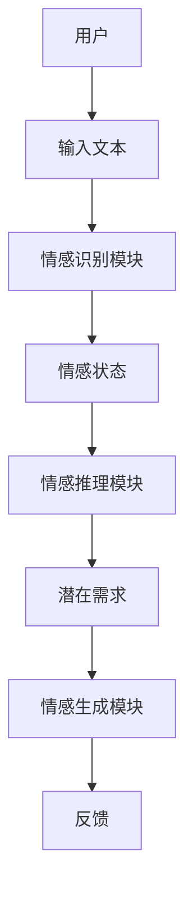
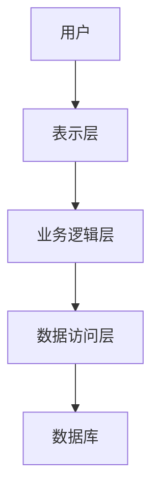
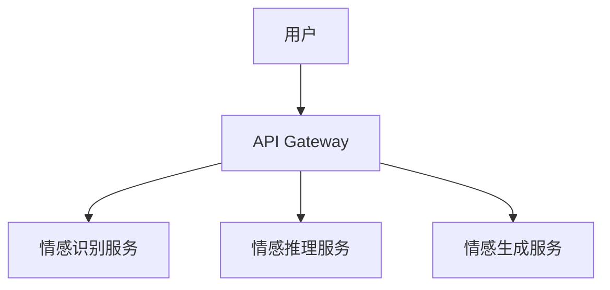
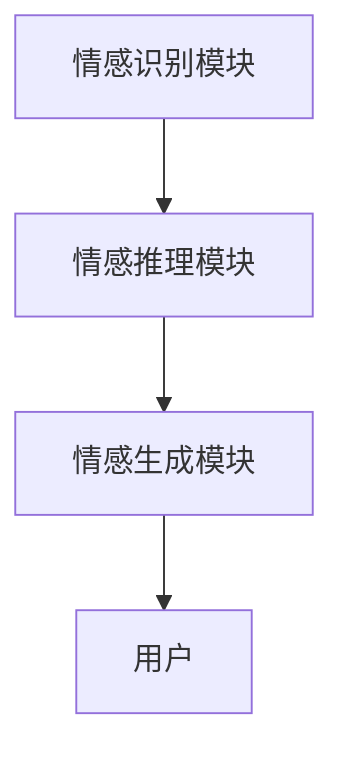

                 


# 构建LLM驱动的AI Agent情感智能交互

> 关键词：LLM, AI Agent, 情感智能交互, 深度学习, 人机交互

> 摘要：本文详细探讨了如何利用大语言模型（LLM）构建具备情感智能的AI代理（AI Agent），实现高效的情感智能交互。文章从情感智能交互的基本概念、核心算法原理、系统架构设计到实际项目实战，全面解析了构建LLM驱动的AI Agent的各个方面，为读者提供了从理论到实践的完整指南。

---

# 第一部分：构建LLM驱动的AI Agent情感智能交互概述

## 第1章：情感智能交互与AI Agent概述

### 1.1 情感智能交互的定义与重要性

情感智能交互是指通过技术手段识别、理解、推理和生成情感信息的过程，旨在让计算机能够像人类一样具备情感认知能力。情感智能交互的核心在于理解用户的情感状态，并根据这些状态提供相应的反馈或服务。

#### 1.1.1 情感智能交互的核心概念

- **情感识别**：通过文本、语音或图像等输入，识别用户的情感状态（如高兴、愤怒、悲伤）。
- **情感推理**：根据上下文和情感信息，推断用户的潜在需求或意图。
- **情感生成**：根据用户的情感状态，生成合适的语言或行为反馈。

#### 1.1.2 情感智能交互在人机交互中的作用

情感智能交互能够提升用户体验，使AI系统更加智能化和人性化。例如，在客服系统中，情感智能交互可以帮助识别用户的情绪，提供更贴心的服务。

#### 1.1.3 情感智能交互的典型应用场景

- 智能客服
- 情感聊天机器人
- 情感辅助治疗

### 1.2 AI Agent的基本概念与分类

AI Agent是一种能够感知环境、执行任务并做出决策的智能体。基于LLM的AI Agent利用大语言模型的强大能力，能够处理复杂的自然语言任务。

#### 1.2.1 AI Agent的定义与特点

- **定义**：AI Agent是一种具备感知、推理、学习和执行能力的智能体。
- **特点**：
  - 智能性：能够理解并处理自然语言。
  - 自适应性：能够根据环境变化调整行为。
  - 实时性：能够快速响应用户需求。

#### 1.2.2 基于LLM的AI Agent的优势

- **强大的语言处理能力**：LLM能够理解复杂的情感信息。
- **可扩展性**：LLM可以轻松集成到各种应用场景中。
- **高准确性**：通过大量数据训练，LLM在情感识别和生成方面表现出色。

#### 1.2.3 AI Agent的分类与功能

- **任务型AI Agent**：专注于完成特定任务，如智能助手。
- **情感型AI Agent**：专注于情感交互，如情感聊天机器人。
- **混合型AI Agent**：结合任务和情感交互能力。

### 1.3 LLM驱动的AI Agent情感智能交互的背景

随着大语言模型的快速发展，情感智能交互的需求日益增长。通过将LLM与AI Agent结合，可以实现更自然、更智能的人机交互。

#### 1.3.1 LLM的崛起与应用

- **LLM的崛起**：大语言模型在自然语言处理领域的突破，如GPT系列模型。
- **LLM的应用**：文本生成、情感分析、对话系统等。

#### 1.3.2 情感智能交互的需求驱动

- **用户需求**：用户希望与AI系统进行更自然的交互。
- **技术驱动**：AI技术的进步使得情感智能交互成为可能。

#### 1.3.3 本章小结

本章介绍了情感智能交互和AI Agent的基本概念，并讨论了LLM在情感智能交互中的重要作用。

---

## 第2章：情感智能交互的核心概念与联系

### 2.1 情感智能交互的核心要素

情感智能交互涉及多个核心要素，包括情感识别、情感推理和情感生成。

#### 2.1.1 情感识别

- **定义**：通过分析文本或语音，识别用户的情感状态。
- **方法**：
  - 基于规则的方法：利用预定义的规则匹配情感特征。
  - 基于统计的方法：利用机器学习模型训练情感分类器。
  - 基于深度学习的方法：利用神经网络模型进行情感识别。

#### 2.1.2 情感推理

- **定义**：根据上下文和情感信息，推断用户的潜在需求或意图。
- **方法**：
  - 基于规则的推理：利用预定义的逻辑规则进行推理。
  - 基于统计的推理：利用概率模型进行推理。
  - 基于深度学习的推理：利用神经网络模型进行推理。

#### 2.1.3 情感生成

- **定义**：根据用户的情感状态，生成合适的语言或行为反馈。
- **方法**：
  - 基于模板的生成：利用预定义的模板生成回复。
  - 基于规则的生成：利用预定义的规则生成回复。
  - 基于生成模型的生成：利用生成模型（如GPT）生成回复。

### 2.2 LLM与情感智能交互的关系

LLM在情感智能交互中扮演着重要角色，能够提供强大的语言处理能力和情感理解能力。

#### 2.2.1 LLM在情感识别中的应用

- **情感分类**：利用LLM进行情感分类，如二分类或多分类任务。
- **情感强度分析**：利用LLM分析情感的强度。

#### 2.2.2 LLM在情感推理中的应用

- **上下文理解**：利用LLM理解对话的上下文。
- **意图识别**：利用LLM识别用户的潜在意图。

#### 2.2.3 LLM在情感生成中的应用

- **情感对话生成**：利用LLM生成符合情感需求的对话回复。
- **情感文本生成**：利用LLM生成带有特定情感倾向的文本。

### 2.3 情感智能交互的核心原理

情感智能交互的核心原理包括情感识别、情感推理和情感生成的流程。

#### 2.3.1 情感智能交互的流程

1. 情感识别：识别用户的当前情感状态。
2. 情感推理：根据情感状态和上下文，推断用户的潜在需求。
3. 情感生成：根据推理结果，生成合适的语言或行为反馈。

#### 2.3.2 情感智能交互的数学模型

情感智能交互的数学模型可以表示为：

$$
P(\text{intent} | \text{ utterance}, \text{ context}) = \text{模型预测的概率}
$$

其中，intent表示用户的意图，utterance表示用户的输入文本，context表示对话上下文。

#### 2.3.3 情感智能交互的实体关系图



---

## 第3章：情感智能交互的算法原理

### 3.1 情感识别算法

情感识别算法可以通过多种方法实现，包括基于规则的方法、基于统计的方法和基于深度学习的方法。

#### 3.1.1 基于词袋模型的情感识别

词袋模型是一种简单的情感识别方法，通过统计文本中的情感词来判断情感倾向。

```python
def bag_of_words(text,情感词表):
    word_counts = {}
    for word in text.split():
        if word in 情感词表:
            word_counts[word] = word_counts.get(word, 0) + 1
    return word_counts
```

#### 3.1.2 基于词嵌入的情感识别

词嵌入是一种将词表示为向量的方法，常用于情感识别。

```python
from gensim.models import Word2Vec

model = Word2Vec(sentences, vector_size=100, window=5, min_count=1, workers=4)
vector = model.wv.get_vector('positive')
```

#### 3.1.3 基于深度学习的情感识别

深度学习方法（如卷积神经网络CNN）常用于情感识别。

```python
import tensorflow as tf
from tensorflow.keras import layers

model = tf.keras.Sequential()
model.add(layers.Embedding(input_dim= vocabulary_size, output_dim= embedding_dim))
model.add(layers.Conv1D(filters= filters, kernel_size= kernel_size, activation='relu'))
model.add(layers.MaxPooling1D(pool_size= pool_size))
model.add(layers.Dense(128, activation='relu'))
model.add(layers.Dense(2, activation='sigmoid'))
```

### 3.2 情感推理算法

情感推理算法可以通过规则、统计模型或深度学习模型实现。

#### 3.2.1 基于规则的情感推理

基于规则的情感推理方法简单易实现。

```python
规则1：如果用户的输入中包含“很高兴”，则推断用户的情感为积极。
规则2：如果用户的输入中包含“很生气”，则推断用户的情感为消极。
```

#### 3.2.2 基于统计模型的情感推理

统计模型（如朴素贝叶斯）常用于情感推理。

```python
from sklearn.naive_bayes import MultinomialNB

model = MultinomialNB()
model.fit(X_train, y_train)
y_pred = model.predict(X_test)
```

#### 3.2.3 基于深度学习的情感推理

深度学习模型（如循环神经网络RNN）常用于情感推理。

```python
import tensorflow as tf
from tensorflow.keras import layers

model = tf.keras.Sequential()
model.add(layers.Embedding(input_dim= vocabulary_size, output_dim= embedding_dim))
model.add(layers.LSTM(128, activation='relu'))
model.add(layers.Dense(2, activation='sigmoid'))
```

### 3.3 情感生成算法

情感生成算法可以通过模板、规则或生成模型实现。

#### 3.3.1 基于模板的情感生成

基于模板的情感生成方法简单易实现。

```python
def generate_response(template,情感词):
    response = template.replace("{}",情感词)
    return response
```

#### 3.3.2 基于规则的情感生成

基于规则的情感生成方法可以根据情感词生成回复。

```python
if 情感为积极:
    回复积极相关的文本
elif 情感为消极:
    回复消极相关的文本
```

#### 3.3.3 基于生成模型的情感生成

生成模型（如GPT）可以生成自然语言文本。

```python
import openai

response = openai.ChatCompletion.create(
    model="gpt-3.5-turbo",
    messages=[{"role": "user", "content": "请生成一段积极的文本。"}]
)
print(response.choices[0].message.content)
```

---

## 第4章：情感智能交互的系统架构设计

### 4.1 系统功能设计

情感智能交互系统的功能设计包括情感识别模块、情感推理模块和情感生成模块。

#### 4.1.1 情感识别模块

情感识别模块负责识别用户的当前情感状态。

#### 4.1.2 情感推理模块

情感推理模块负责根据情感状态和上下文，推断用户的潜在需求。

#### 4.1.3 情感生成模块

情感生成模块负责根据推理结果，生成合适的语言或行为反馈。

### 4.2 系统架构设计

情感智能交互系统的架构设计可以采用分层架构或微服务架构。

#### 4.2.1 分层架构设计

分层架构将系统划分为表示层、业务逻辑层和数据访问层。



#### 4.2.2 微服务架构设计

微服务架构将系统划分为多个独立的服务。



### 4.3 系统接口设计

情感智能交互系统的接口设计需要考虑API接口和模块之间的交互。

#### 4.3.1 API接口设计

API接口设计需要定义输入和输出格式。

```json
{
    "input": "用户输入的文本",
    "context": "对话上下文",
    "output": "系统的反馈"
}
```

#### 4.3.2 模块交互设计

模块之间的交互需要通过定义良好的接口实现。



---

## 第5章：项目实战

### 5.1 环境配置

项目实战需要先配置开发环境。

#### 5.1.1 安装Python和相关库

安装Python和必要的库，如TensorFlow、Keras、OpenAI API等。

```bash
pip install numpy pandas tensorflow keras openai
```

#### 5.1.2 安装LLM模型

安装大语言模型，如GPT-3.5-turbo。

```bash
pip install openai
```

### 5.2 代码实现

代码实现包括情感识别、情感推理和情感生成的实现。

#### 5.2.1 情感识别模块

实现情感识别模块的代码。

```python
import openai

def identify_emotion(text):
    response = openai.ChatCompletion.create(
        model="gpt-3.5-turbo",
        messages=[{"role": "user", "content": f"请判断以下文本的情感倾向：{text}"}]
    )
    return response.choices[0].message.content
```

#### 5.2.2 情感推理模块

实现情感推理模块的代码。

```python
def infer_intent(emotion, context):
    # 根据情感和上下文推断意图
    pass
```

#### 5.2.3 情感生成模块

实现情感生成模块的代码。

```python
def generate_response(emotion, intent):
    response = openai.ChatCompletion.create(
        model="gpt-3.5-turbo",
        messages=[{"role": "user", "content": f"根据情感{emotion}和意图{intent}，生成合适的回复"}]
    )
    return response.choices[0].message.content
```

### 5.3 案例分析

通过具体案例分析情感智能交互的实际应用。

#### 5.3.1 案例1：智能客服

用户输入：“我最近遇到了很多问题，感到非常沮丧。”

系统处理：
1. 情感识别：情感为消极。
2. 情感推理：用户可能需要帮助解决问题。
3. 情感生成：生成积极的反馈，提供解决方案。

#### 5.3.2 案例2：情感聊天机器人

用户输入：“我今天很高兴。”

系统处理：
1. 情感识别：情感为积极。
2. 情感推理：用户可能想分享好消息。
3. 情感生成：生成积极的回复，如“我也为你感到高兴。”

### 5.4 项目总结

总结项目实现的关键点和经验教训。

---

## 第6章：最佳实践与未来发展

### 6.1 最佳实践

#### 6.1.1 数据质量的重要性

高质量的数据是情感智能交互系统的基础。

#### 6.1.2 模型调优的技巧

通过数据增强、超参数调整等方法提升模型性能。

#### 6.1.3 系统优化的建议

优化系统性能，提升用户体验。

### 6.2 小结

总结全文的核心内容和主要观点。

### 6.3 注意事项

注意事项包括数据隐私、模型鲁棒性等。

### 6.4 拓展阅读

推荐相关的书籍和论文，供读者深入学习。

---

# 结语

构建LLM驱动的AI Agent情感智能交互是一项复杂而有趣的任务，需要结合情感智能交互的核心概念、算法原理和系统架构设计。通过本文的详细讲解，读者可以掌握从理论到实践的完整流程，为实际应用打下坚实基础。未来，随着技术的不断发展，情感智能交互将更加智能化和人性化，为人类带来更多便利。

--- 

以上是文章的完整内容，涵盖从基础概念到实际应用的各个方面，希望对您有所帮助！

