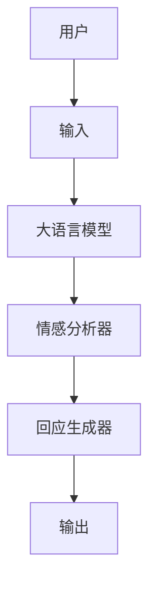

                 

# 构建LLM驱动的AI Agent情感智能对话

## 关键词：LLM，AI Agent，情感智能对话，自然语言处理，深度学习

## 摘要：本文详细探讨了如何构建基于大语言模型（LLM）的AI Agent，实现情感智能对话。文章从背景、核心概念、算法原理、系统架构到项目实战，全面解析了情感智能对话的实现过程，结合具体案例和代码，提供了深入的技术分析。

---

## 第一部分: 构建LLM驱动的AI Agent情感智能对话概述

### 第1章: 情感智能对话与AI Agent的背景介绍

#### 1.1 情感智能对话的定义与重要性

##### 1.1.1 情感智能对话的核心概念
情感智能对话是指通过自然语言处理技术，使计算机能够理解、识别和生成带有情感色彩的对话内容。这种对话不仅关注语义的理解，还注重情感的表达和回应，能够更好地满足用户的情感需求。

##### 1.1.2 情感智能对话在人机交互中的作用
在人机交互中，情感智能对话能够提升用户体验，使对话更加自然、亲切。例如，在智能客服、虚拟助手等领域，情感智能对话能够让用户感受到被理解和支持，从而提高用户满意度。

##### 1.1.3 情感智能对话的应用场景
情感智能对话广泛应用于智能客服、教育辅助、心理健康咨询等领域。例如，在智能客服中，情感智能对话能够识别用户的不满情绪，并提供相应的解决方案；在心理健康咨询中，情感智能对话能够帮助用户缓解压力，提供情感支持。

#### 1.2 AI Agent的基本概念与功能

##### 1.2.1 AI Agent的定义
AI Agent（人工智能代理）是指能够感知环境、自主决策并执行任务的智能体。AI Agent可以通过传感器获取信息，通过推理和学习做出决策，并通过执行器与环境交互。

##### 1.2.2 AI Agent的核心功能
AI Agent的核心功能包括感知、推理、学习和执行。感知是指通过传感器获取环境信息；推理是指基于感知信息进行逻辑推理；学习是指通过机器学习算法不断优化自身模型；执行是指通过执行器对外界产生影响。

##### 1.2.3 AI Agent与传统对话系统的区别
传统对话系统通常基于规则或关键词匹配，无法理解上下文和情感信息。而AI Agent结合了自然语言处理和机器学习技术，能够理解上下文、推理意图，并根据情感信息生成合适的回应。

#### 1.3 LLM驱动的AI Agent的优势

##### 1.3.1 LLM的基本原理
LLM（Large Language Model）是基于深度学习的预训练模型，通过大量数据训练，能够生成与上下文相关且符合语法规则的文本。LLM的核心技术包括自注意力机制和前馈神经网络。

##### 1.3.2 LLM在AI Agent中的应用
在AI Agent中，LLM主要用于对话生成和情感分析。通过LLM的强大生成能力，AI Agent可以生成自然流畅的对话回应；通过情感分析模块，AI Agent能够识别用户的当前情感状态，从而调整对话策略。

##### 1.3.3 LLM驱动的对话优势
相比传统对话系统，LLM驱动的对话系统具有更高的灵活性和适应性。它能够根据上下文生成多样化的回应，理解用户的情感倾向，并根据情感信息调整对话策略。

#### 1.4 情感智能对话的挑战与机遇

##### 1.4.1 情感智能对话的主要挑战
情感智能对话的主要挑战包括情感分析的准确性、上下文理解的深度、多模态信息的整合以及用户隐私保护等问题。由于情感信息具有主观性和模糊性，如何准确识别和生成情感信息是一个难点。

##### 1.4.2 机遇与未来发展方向
随着深度学习和自然语言处理技术的不断进步，情感智能对话将朝着更加智能化、个性化和多模态方向发展。未来的AI Agent将能够更准确地理解用户情感，并根据情感信息生成更加自然的对话回应。

##### 1.4.3 技术与伦理的平衡
在情感智能对话的开发过程中，需要在技术能力与伦理规范之间找到平衡。例如，如何在保护用户隐私的前提下，最大化地利用用户数据进行模型训练，是一个需要认真考虑的问题。

#### 1.5 本章小结
本章从背景和概述的角度，介绍了情感智能对话和AI Agent的基本概念、核心功能以及两者结合的优势。同时，分析了情感智能对话面临的挑战和未来的发展方向。

---

### 第2章: 情感智能对话的核心概念与联系

#### 2.1 情感智能对话的核心原理

##### 2.1.1 情感分析的基本原理
情感分析是自然语言处理中的一个经典任务，旨在判断一段文本的情感倾向（如正面、负面或中性）。情感分析通常分为文本预处理、特征提取和分类器训练三个阶段。

##### 2.1.2 情感记忆与上下文理解
情感记忆是指在对话过程中，AI Agent需要记住用户之前的情感状态，以便在后续对话中进行情感的延续和调整。上下文理解则需要AI Agent能够理解当前对话的上下文信息，包括对话历史和语境。

##### 2.1.3 情感推理与预测
情感推理是指基于对话历史和当前输入，推断用户的潜在情感状态。情感预测则是在推理的基础上，预测用户在后续对话中的情感倾向。

#### 2.2 LLM与情感智能对话的关系

##### 2.2.1 LLM在情感分析中的应用
LLM可以通过预训练模型生成情感相关的文本，并通过微调任务（如情感分类）进行优化。例如，可以使用LLM来判断一段文本的情感倾向，或者生成带有特定情感色彩的回应。

##### 2.2.2 情感智能对话中的LLM角色
在情感智能对话中，LLM主要作为生成模块，负责生成符合情感需求的对话回应。同时，LLM也可以用于情感分析，帮助AI Agent理解用户的当前情感状态。

##### 2.2.3 LLM与情感智能对话的结合
通过结合LLM的强大生成能力和情感分析模块，情感智能对话能够实现情感理解和生成的统一。这种结合使得AI Agent能够根据用户的情感状态，生成更加自然和合适的对话回应。

#### 2.3 情感智能对话的实体关系图

#### 2.4 情感智能对话的核心要素对比表

| 要素 | 描述 |
|------|------|
| 输入 | 用户的自然语言输入 |
| 情感分析 | 确定输入的情感倾向 |
| 对话生成 | 基于情感分析生成回复 |
| 上下文记忆 | 维护对话的历史记录 |

#### 2.5 本章小结
本章从核心概念和联系的角度，详细介绍了情感智能对话的基本原理和LLM在其中的作用。通过实体关系图和对比表，清晰地展示了情感智能对话的各个组成部分及其关系。

---

### 第3章: 情感智能对话的算法原理

#### 3.1 情感分析的算法原理

##### 3.1.1 基于传统机器学习的情感分析
传统的

