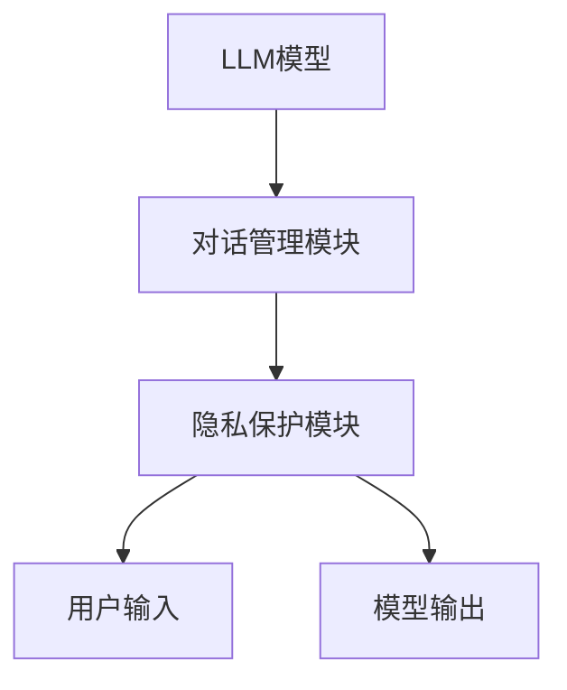

                 

# 构建LLM驱动的AI Agent隐私保护对话系统

> 关键词：LLM, AI Agent, 隐私保护, 对话系统, 转换器

> 摘要：本文系统地探讨了如何构建一个基于大语言模型（LLM）的AI Agent隐私保护对话系统。文章首先介绍了构建该系统的基本背景、核心概念和问题描述。接着，详细分析了LLM和AI Agent的核心原理，以及隐私保护的关键技术。然后，从系统架构设计、算法实现和项目实战三个方面深入探讨了如何将这些理论应用到实际系统中。最后，总结了构建此类系统的最佳实践和未来研究方向。

---

# 第1章: 构建LLM驱动的AI Agent隐私保护对话系统概述

## 1.1 问题背景

### 1.1.1 当前AI对话系统的挑战
随着大语言模型（LLM）的快速发展，AI对话系统在各种应用场景中展现出强大的能力。然而，这些系统在实际应用中面临以下挑战：
- **数据隐私风险**：用户在与AI对话系统交互时，可能会泄露敏感信息。
- **模型滥用风险**：恶意用户可能利用模型进行非法操作。
- **模型透明度不足**：用户无法理解模型的决策过程，导致信任缺失。

### 1.1.2 LLM驱动的AI Agent的核心问题
AI Agent需要具备以下能力：
- **多轮对话能力**：能够理解和生成连贯的对话。
- **上下文记忆能力**：能够记住之前的对话内容。
- **任务执行能力**：能够在对话中执行具体任务。

### 1.1.3 隐私保护的重要性
隐私保护是构建AI对话系统的基石，主要包括：
- **数据隐私**：保护用户输入数据的安全。
- **模型隐私**：防止模型被逆向工程或滥用。
- **对话隐私**：确保对话内容不被未经授权的第三方获取。

---

## 1.2 问题描述

### 1.2.1 对话系统中的数据隐私风险
AI对话系统可能面临以下数据隐私风险：
- **数据泄露**：用户输入的数据可能被恶意攻击者窃取。
- **数据滥用**：数据可能被用于未经授权的目的。

### 1.2.2 LLM模型的潜在隐私泄露问题
LLM模型可能存在的隐私泄露问题包括：
- **模型侧信道攻击**：攻击者可以通过模型的输出推断出训练数据中的敏感信息。
- **模型滥用**：恶意用户可能利用模型进行非法活动。

### 1.2.3 隐私保护与对话性能的平衡
在构建AI对话系统时，需要在隐私保护和对话性能之间找到平衡点：
- **隐私保护过强**：可能导致对话系统响应速度变慢或对话质量下降。
- **隐私保护不足**：可能无法有效保护用户隐私。

---

## 1.3 问题解决

### 1.3.1 隐私保护的技术路径
隐私保护技术路径包括：
1. **数据加密**：在传输和存储过程中对数据进行加密。
2. **联邦学习**：在多个数据源上进行联合训练，而不共享原始数据。
3. **同态加密**：允许在加密数据上进行计算，同时保持数据的隐私性。

### 1.3.2 对话系统优化策略
对话系统优化策略包括：
1. **上下文记忆优化**：通过引入记忆机制，提高对话的连贯性。
2. **多轮对话管理**：通过引入对话管理模块，提高对话的效率。
3. **实时反馈机制**：通过实时反馈机制，优化对话体验。

### 1.3.3 LLM与AI Agent的结合方法
LLM与AI Agent的结合方法包括：
1. **模型集成**：将LLM与AI Agent的其他模块进行集成。
2. **任务协同**：通过任务协同，提高系统的整体性能。
3. **动态调整**：根据对话过程中的实时反馈，动态调整系统的行为。

---

## 1.4 边界与外延

### 1.4.1 系统的适用范围
AI对话系统的适用范围包括：
- **客户服务**：为用户提供技术支持、咨询等服务。
- **教育领域**：为学生提供学习指导、答疑等服务。
- **医疗领域**：为患者提供健康咨询、疾病诊断等服务。

### 1.4.2 系统的限制条件
系统的限制条件包括：
- **数据隐私限制**：系统需要遵守相关数据隐私法律法规。
- **模型能力限制**：系统的性能受到LLM模型能力的限制。
- **计算资源限制**：系统的性能受到计算资源的限制。

### 1.4.3 系统的扩展性分析
系统的扩展性分析包括：
- **数据扩展**：可以不断引入新的数据进行模型优化。
- **功能扩展**：可以不断增加新的功能模块，如多语言支持、跨平台支持等。
- **性能扩展**：可以通过优化算法和增加计算资源，不断提高系统的性能。

---

## 1.5 概念结构与核心要素

### 1.5.1 LLM驱动的AI Agent组成
LLM驱动的AI Agent主要由以下部分组成：
1. **LLM模型**：负责生成对话内容。
2. **对话管理模块**：负责管理对话流程。
3. **隐私保护模块**：负责保护用户数据和模型安全。

### 1.5.2 隐私保护机制的核心要素
隐私保护机制的核心要素包括：
1. **数据加密技术**：确保数据在传输和存储过程中的安全性。
2. **隐私保护算法**：确保模型训练和推理过程中的隐私性。
3. **隐私保护策略**：确保系统在运行过程中的隐私性。

### 1.5.3 系统功能模块的交互关系
系统功能模块的交互关系如下图所示：

---

## 1.6 本章小结

---

通过以上分析，我们明确了构建LLM驱动的AI Agent隐私保护对话系统的基本背景、核心问题和解决思路。接下来，我们将从核心概念、算法原理、系统设计等多方面深入探讨这一系统的构建过程。

