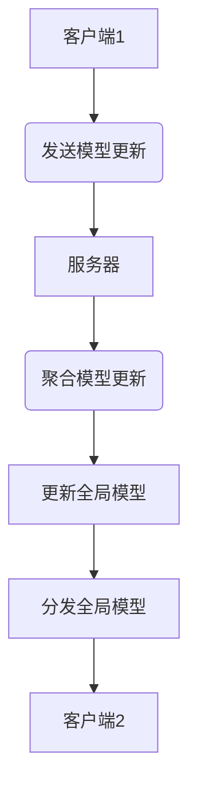
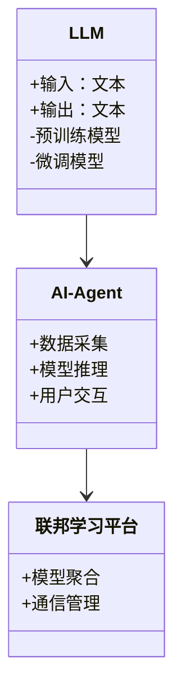

                 


# 构建LLM驱动的AI Agent隐私保护联邦学习

---

## 关键词：
- 大语言模型（LLM）
- AI Agent
- 联邦学习
- 隐私保护
- 分布式系统
- 人工智能

---

## 摘要：
本文探讨如何利用大语言模型（LLM）驱动AI Agent，并通过联邦学习实现隐私保护。文章从背景介绍、核心概念、算法原理、系统架构到项目实战，全面分析LLM与联邦学习的结合，提出构建隐私保护联邦学习系统的方法和实现方案。通过详细的技术分析和案例解读，为读者提供从理论到实践的完整指导。

---

## 第一部分：背景与概述

### 第1章：LLM与AI Agent的基本概念

#### 1.1 LLM的定义与特点
- **大语言模型（LLM）**：基于Transformer架构的大规模预训练模型，具有强大的自然语言处理能力。
- **特点**：
  - 参数规模大（如GPT-3的175B参数）。
  - 能够理解上下文，生成连贯文本。
  - 支持多种任务（如文本生成、问答、翻译）。

#### 1.2 AI Agent的定义与功能
- **AI Agent**：智能体，能够感知环境、执行任务的实体。
- **功能**：
  - 数据采集与处理。
  - 模型推理与决策。
  - 与用户或系统交互。

#### 1.3 LLM驱动AI Agent的优势
- **自然语言处理能力**：LLM使AI Agent能够理解和生成人类语言。
- **任务灵活性**：支持多种任务，适应不同场景。
- **实时性**：通过LLM快速响应用户请求。

---

### 第2章：联邦学习与隐私保护

#### 2.1 联邦学习的定义与特点
- **联邦学习**：分布式学习框架，允许多个参与方在不共享原始数据的情况下共同训练模型。
- **特点**：
  - 数据隐私保护。
  - 联合建模，提升模型性能。
  - 支持异构数据源。

#### 2.2 隐私保护的重要性
- **数据泄露风险**：原始数据可能被恶意利用。
- **合规性要求**：符合GDPR等数据保护法规。
- **用户信任**：隐私保护是用户信任的基础。

#### 2.3 联邦学习在隐私保护中的作用
- **数据不出域**：数据不离开原始存储位置。
- **模型聚合**：通过加密通信聚合模型更新。
- **隐私计算技术**：如同态加密、秘密分享。

---

## 第二部分：核心概念与联系

### 第3章：LLM与联邦学习的核心原理

#### 3.1 LLM的原理与实现
- **Transformer架构**：
  - 由编码器和解码器组成。
  - 注意力机制：计算输入序列中每个词的重要性。
- **预训练与微调**：
  - 预训练：在大规模数据上无监督训练。
  - 微调：针对特定任务调整模型。

#### 3.2 联邦学习的算法流程
- **初始化**：各参与方本地初始化模型参数。
- **本地训练**：参与方在本地数据上训练模型。
- **参数聚合**：通过通信协议聚合模型更新。
- **模型更新**：全局模型参数更新，分发给各参与方。

---

### 第4章：LLM与联邦学习的结合

#### 4.1 LLM在联邦学习中的角色
- **模型训练**：LLM作为基础模型，通过联邦学习进行微调。
- **任务执行**：AI Agent利用LLM进行自然语言任务，如问答、翻译。

#### 4.2 联邦学习在隐私保护中的作用
- **数据保护**：确保数据不被集中处理。
- **模型安全**：通过加密技术保护模型更新。

---

## 第三部分：算法原理

### 第5章：LLM的算法原理

#### 5.1 Transformer模型的数学公式
- **注意力机制**：
  $$\text{Attention}(Q, K, V) = \text{softmax}\left(\frac{QK^T}{\sqrt{d_k}}\right)V$$
- **前馈网络**：
  $$f(x) = \text{ReLU}(Wx + b)$$

#### 5.2 LLM的训练流程
- **预训练**：无监督学习，目标是预测下一个词。
- **微调**：监督学习，针对特定任务调整模型。

---

### 第6章：联邦学习的算法实现

#### 6.1 联邦学习流程图


#### 6.2 联邦学习的数学模型
- **参数聚合**：
  $$\theta_{\text{global}} = \sum_{i=1}^n w_i \theta_i$$
  其中，$w_i$是参与方$i$的权重，$\theta_i$是其模型参数。
- **模型更新**：
  $$\theta_{\text{new}} = \theta_{\text{global}} + \eta \nabla L$$
  其中，$\eta$是学习率，$\nabla L$是损失函数的梯度。

---

## 第四部分：系统分析与架构设计

### 第7章：系统功能设计

#### 7.1 领域模型


#### 7.2 系统架构


---

## 第五部分：项目实战

### 第8章：环境安装与代码实现

#### 8.1 环境安装
- **Python 3.8+**
- **TensorFlow 2.5+**
- **Flask 2.0+**

#### 8.2 核心代码实现
```python
import tensorflow as tf
from tensorflow.keras import layers

# 初始化模型
def create_model(input_shape, output_shape):
    model = tf.keras.Sequential()
    model.add(layers.Dense(64, activation='relu', input_shape=input_shape))
    model.add(layers.Dense(output_shape, activation='softmax'))
    return model

# 联邦学习聚合
def aggregate_models(models):
    return sum(models) / len(models)

# 示例使用
input_shape = (10,)
output_shape = 5
model = create_model(input_shape, output_shape)
```

---

## 第六部分：总结与展望

### 第9章：总结与展望

#### 9.1 总结
- **核心内容**：构建LLM驱动的AI Agent，并通过联邦学习实现隐私保护。
- **关键点**：
  - LLM的强大能力。
  - 联邦学习的隐私保护优势。
  - 系统架构的设计与实现。

#### 9.2 展望
- **技术趋势**：模型压缩与轻量化。
- **应用领域**：医疗、金融、教育等。
- **未来挑战**：处理异构数据源，提升模型性能。

---

通过本文的详细分析与指导，读者可以全面理解构建LLM驱动的AI Agent隐私保护联邦学习的技术细节，并能够实际应用到相关项目中。

