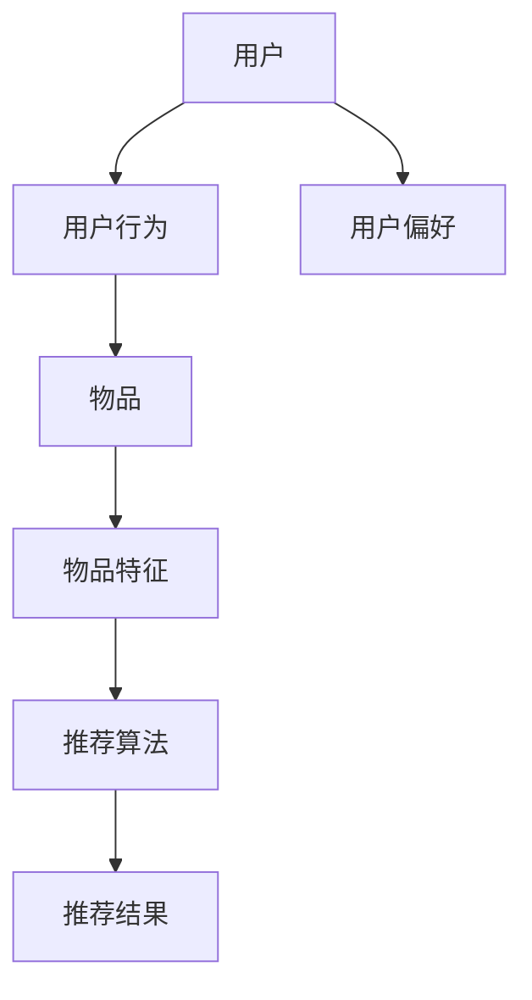

                 


```markdown
# 构建个性化推荐AI Agent

> 关键词：个性化推荐，AI Agent，推荐系统，协同过滤，矩阵分解，深度学习

> 摘要：本文将详细介绍如何构建一个基于AI Agent的个性化推荐系统，涵盖从理论到实践的各个方面。首先介绍个性化推荐的基本概念和AI Agent的特点，接着深入讲解推荐算法的原理和实现，包括协同过滤和矩阵分解等经典方法，以及基于深度学习的推荐模型。然后分析系统的架构设计，包括领域模型、系统架构和接口设计。最后通过一个具体的项目实战，展示如何从环境搭建到代码实现，完成一个个性化的推荐系统。本文还提供了最佳实践和小结，帮助读者更好地理解和应用相关技术。

---

# 第五部分: 个性化推荐AI Agent的系统架构与接口设计

# 第5章: 系统架构设计

## 5.1 系统架构概述
### 5.1.1 系统架构的目标
### 5.1.2 系统架构的特点

## 5.2 系统功能模块划分
### 5.2.1 用户模块
### 5.2.2 物品模块
### 5.2.3 推荐模块
### 5.2.4 交互模块

## 5.3 系统架构图


## 5.4 系统架构的实现细节
### 5.4.1 用户模块的实现
### 5.4.2 物品模块的实现
### 5.4.3 推荐模块的实现
### 5.4.4 交互模块的实现

## 5.5 系统接口设计
### 5.5.1 接口定义
### 5.5.2 接口实现
### 5.5.3 接口测试

## 5.6 本章小结
### 5.6.1 系统架构总结
### 5.6.2 下一章内容概览

---

# 第六部分: 个性化推荐AI Agent的项目实战

# 第6章: 项目实战

## 6.1 环境搭建
### 6.1.1 安装Python
### 6.1.2 安装必要的库
### 6.1.3 环境配置

## 6.2 系统核心实现
### 6.2.1 用户画像构建
### 6.2.2 物品特征提取
### 6.2.3 推荐算法实现

## 6.3 代码实现与解读
### 6.3.1 数据预处理
### 6.3.2 模型训练
### 6.3.3 结果展示

## 6.4 案例分析
### 6.4.1 数据集选择
### 6.4.2 实验结果
### 6.4.3 结果分析

## 6.5 本章小结
### 6.5.1 项目实战总结
### 6.5.2 下一章内容概览

---

# 第七部分: 个性化推荐AI Agent的最佳实践与总结

# 第7章: 最佳实践

## 7.1 系统优化建议
### 7.1.1 算法优化
### 7.1.2 系统性能优化
### 7.1.3 可扩展性优化

## 7.2 项目管理经验
### 7.2.1 开发流程
### 7.2.2 团队协作
### 7.2.3 项目文档管理

## 7.3 读者注意事项
### 7.3.1 常见问题解答
### 7.3.2 问题解决方法
### 7.3.3 未来发展趋势

## 7.4 拓展阅读
### 7.4.1 推荐领域最新研究
### 7.4.2 AI Agent的其他应用场景
### 7.4.3 进一步学习资源

## 7.5 本章小结
### 7.5.1 最佳实践总结
### 7.5.2 全文总结
### 7.5.3 未来展望

---

以上是《构建个性化推荐AI Agent》的完整目录大纲，涵盖从理论到实践的各个方面，内容详实且结构清晰，适合技术读者深入学习和应用。
```

