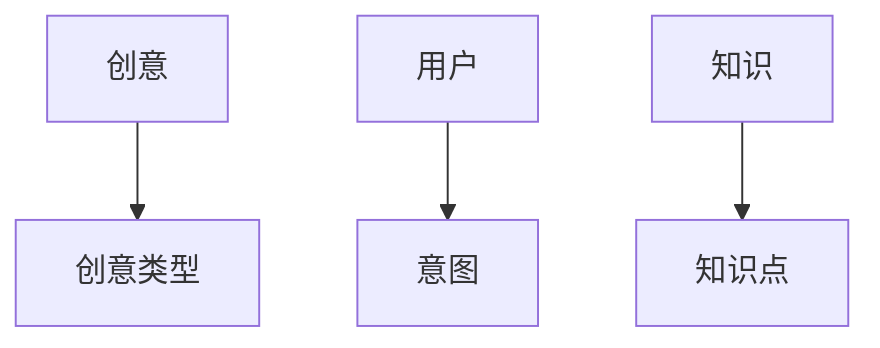
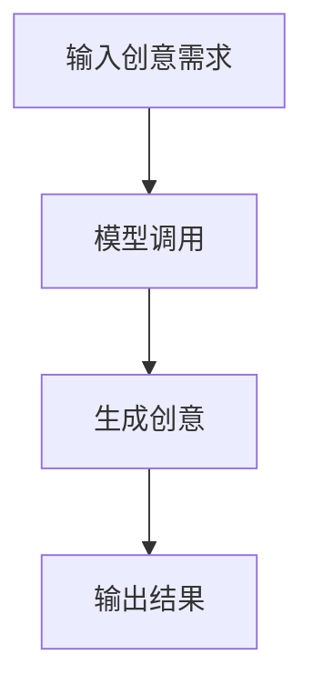
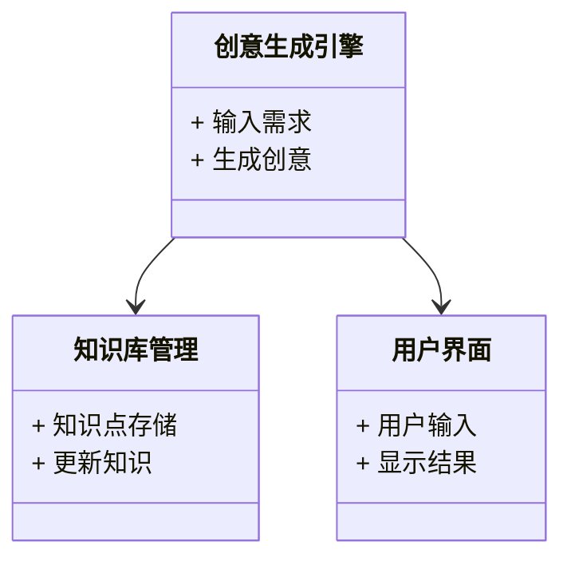
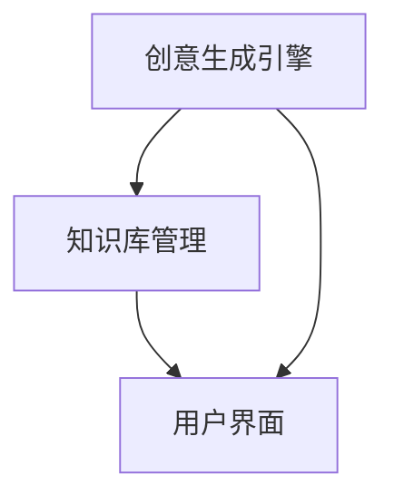

                 


# 构建企业AI创意助手：促进创新与产品开发

## 关键词：企业AI、创意助手、创新、产品开发、AI技术、知识图谱、生成式AI

## 摘要：  
随着AI技术的飞速发展，企业AI创意助手正在成为推动创新和产品开发的重要工具。本文将从背景、核心概念、算法原理、系统架构到项目实战，全面解析如何构建一个高效的AI创意助手，为企业创新提供强有力的支持。

---

## 第一部分：企业AI创意助手的背景与概述

### 第1章：企业AI创意助手的背景与问题描述

#### 1.1 问题背景
在企业创新和产品开发的过程中，创意生成是一个关键环节，但传统方法存在效率低、资源消耗大、灵感难以捕捉等问题。AI技术的引入为解决这些挑战提供了新的可能性。

#### 1.2 问题描述
企业创新的核心在于创意的生成和应用。传统方法依赖于人类的经验和灵感，存在主观性强、效率低下的缺点。AI创意助手通过自动化和智能化的方式，能够更高效地辅助创意生成，缩短开发周期，降低成本。

#### 1.3 问题解决与边界
AI创意助手通过整合知识图谱和生成式AI技术，能够快速生成创意并提供多维度的优化建议。其边界包括创意生成的范围、数据来源的限制以及用户需求的多样性。

---

### 第2章：企业AI创意助手的核心概念与联系

#### 2.1 核心概念原理
创意生成机制是AI创意助手的核心，通过结合知识图谱和用户意图识别，能够精准捕捉用户需求，生成高质量的创意。

#### 2.2 概念属性特征对比
以下是创意生成与传统生成方法的对比：

| 对比维度        | 创意生成            | 传统生成方法          |
|-----------------|--------------------|-----------------------|
| 数据依赖        | 高度依赖AI模型      | 依赖人工经验          |
| 效率            | 高效                | 较低                  |
| 灵活性          | 高                  | 低                    |

#### 2.3 ER实体关系图


---

## 第二部分：算法原理与数学模型

### 第3章：算法原理

#### 3.1 算法原理
生成式AI通过深度学习模型（如GPT）生成创意内容。模型通过大量数据训练，能够理解用户需求并生成相关创意。

#### 3.2 算法流程图


#### 3.3 数学模型与公式
创意生成的概率模型：
$$P(y|x) = \frac{P(x,y)}{P(x)}$$

模型训练的损失函数：
$$L = -\sum_{i=1}^{n} \log P(y_i|x_i)$$

---

## 第三部分：系统分析与架构设计

### 第4章：系统架构设计

#### 4.1 系统架构概述
系统主要包括创意生成引擎、知识库管理和用户界面三个模块。

#### 4.2 系统功能设计


#### 4.3 系统架构图


---

## 第四部分：项目实战

### 第5章：项目实战

#### 5.1 环境搭建
安装Python、TensorFlow和Hugging Face库。

#### 5.2 核心代码实现
```python
import tensorflow as tf
from transformers import GPT2LMHeadModel, GPT2Tokenizer

tokenizer = GPT2Tokenizer.from_pretrained('gpt2')
model = GPT2LMHeadModel.from_pretrained('gpt2')

def generate_creative(input_text):
    inputs = tokenizer.encode(input_text, return_tensors='tf')
    outputs = model.generate(inputs, max_length=50, do_sample=True)
    return tokenizer.decode(outputs[0], skip_special_tokens=True)

print(generate_creative("设计一个智能家居系统"))
```

#### 5.3 案例分析
通过实际案例分析，展示AI创意助手在产品开发中的应用，如智能家居系统的创意生成。

---

## 第五部分：最佳实践与小结

### 第6章：最佳实践与小结

#### 6.1 总结
AI创意助手通过整合先进技术，能够显著提升企业的创新效率和产品开发能力。

#### 6.2 注意事项
确保数据质量和模型训练的充分性，同时注意用户隐私和数据安全。

#### 6.3 未来展望
未来，AI创意助手将更加智能化和个性化，为企业创新提供更多可能性。

---

### 小结
构建企业AI创意助手是一个复杂但极具价值的工程。通过深入理解其核心概念、算法原理和系统架构，结合实际项目实战，企业能够有效利用AI技术推动创新和产品开发。

---

**参考文献**：  
1. 《深度学习入门：基于Python的理论与实践》  
2. 《生成式AI：从原理到应用》  
3. Hugging Face官方文档

