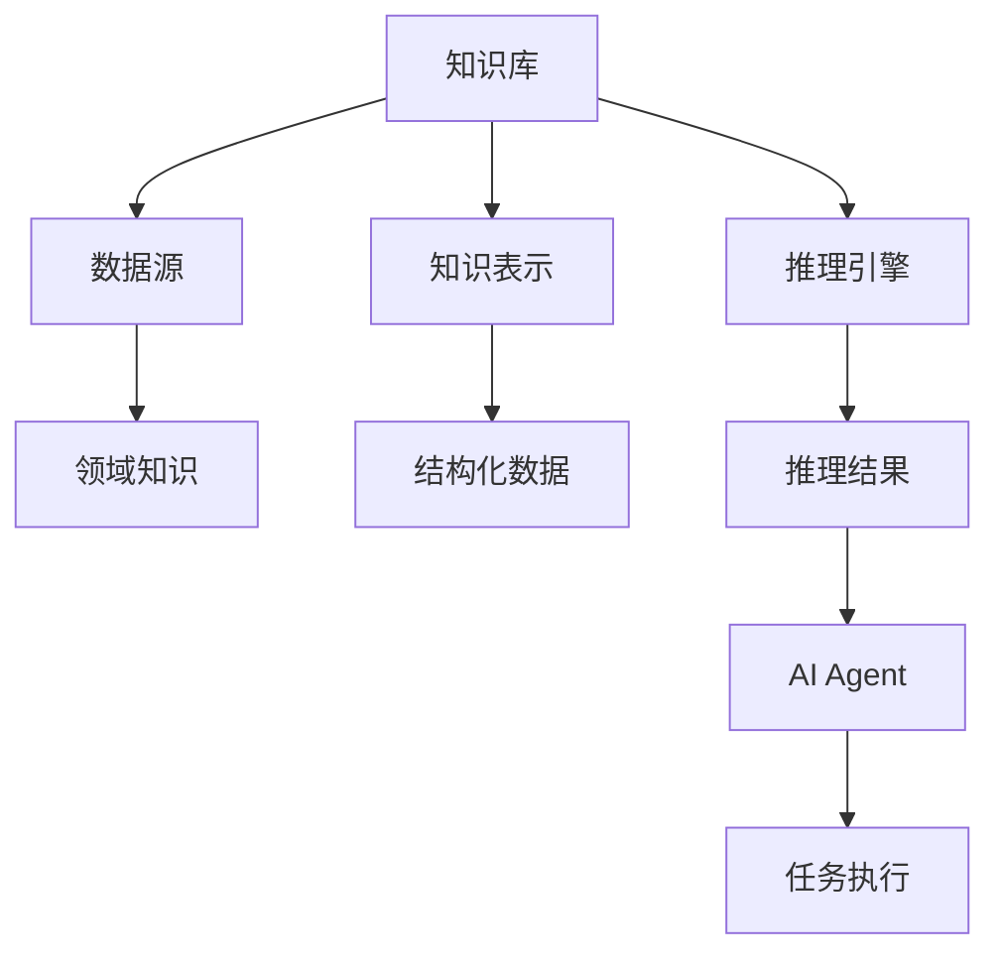
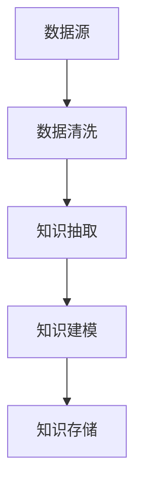
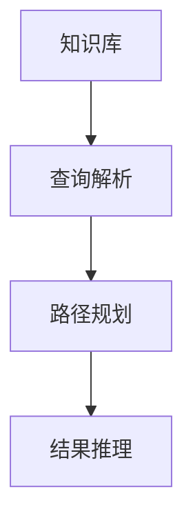
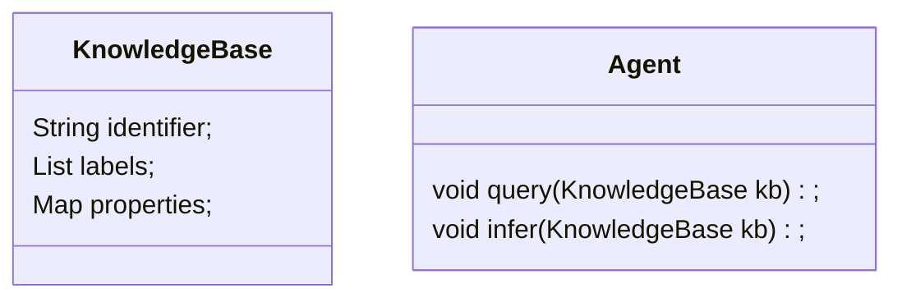
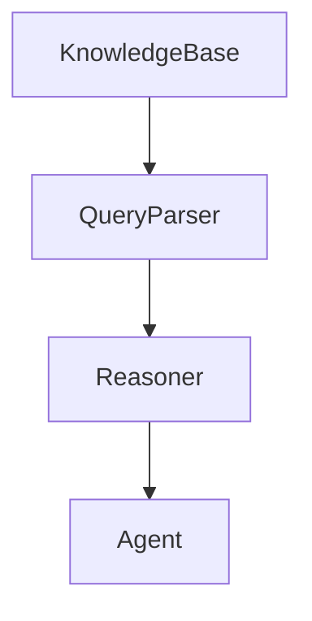

                 


# 《构建企业知识库：为AI Agent提供专业领域支持》

## 关键词：企业知识库、AI Agent、知识表示、推理算法、系统架构

## 摘要：
构建企业知识库是为AI Agent提供专业领域支持的关键。本文系统地介绍了企业知识库的构建方法，分析了AI Agent的核心机制，并探讨了如何通过知识库提升AI Agent的性能。文章从背景、核心概念、算法原理到系统架构，逐步深入，提供了丰富的案例和代码示例，为读者提供全面的指导。

---

## 第一部分：企业知识库与AI Agent概述

## 第1章：企业知识库与AI Agent的背景介绍

### 1.1 问题背景

#### 1.1.1 企业知识管理的现状与挑战
企业在信息爆炸的时代面临知识管理的挑战，知识孤岛和信息碎片化问题突出。传统的知识管理方式难以满足AI Agent对结构化知识的需求，导致AI Agent在处理专业领域问题时效率低下。

#### 1.1.2 AI Agent在企业中的应用需求
AI Agent需要实时获取准确的知识支持，以便在复杂场景中做出决策。企业知识库作为AI Agent的知识基础，必须具备高效的数据检索和推理能力。

### 1.2 问题描述

#### 1.2.1 知识孤岛问题
企业内部数据分散在不同的系统中，缺乏统一的知识表示和共享机制，导致知识无法有效利用。

#### 1.2.2 AI Agent对知识的需求
AI Agent需要快速获取领域知识，支持其决策过程。知识孤岛限制了AI Agent的能力，影响企业智能化水平。

### 1.3 问题解决

#### 1.3.1 知识库构建的目标
构建统一的知识库，整合企业分散的知识资源，提供结构化数据支持。

#### 1.3.2 AI Agent的知识支持方式
通过知识库为AI Agent提供实时的知识查询和推理支持，提升其处理复杂任务的能力。

### 1.4 边界与外延

#### 1.4.1 知识库的边界
知识库仅包含企业内部知识，不涉及外部数据。数据范围和访问权限是关键边界条件。

#### 1.4.2 AI Agent的应用范围
AI Agent主要在企业内部系统中应用，处理特定领域的任务，不涉及外部服务。

### 1.5 概念结构与核心要素

#### 1.5.1 知识库的核心要素
- **数据源**：企业内部文档、数据库等。
- **知识表示**：结构化的数据表示方法。
- **推理引擎**：基于知识库进行推理的算法。

#### 1.5.2 AI Agent的关键组件
- **知识检索模块**：从知识库获取所需信息。
- **推理模块**：基于知识进行推理，得出结论。
- **交互模块**：与用户或系统进行交互。

---

## 第2章：核心概念与联系

### 2.1 知识库的核心概念

#### 2.1.1 知识表示
知识表示是将知识以计算机可处理的形式表示。常用方法包括本体论（Ontology）和知识图谱。

#### 2.1.2 知识组织
知识组织涉及数据的分类、存储和索引，便于快速检索和推理。

### 2.2 AI Agent的核心概念

#### 2.2.1 AI Agent的定义
AI Agent是具有感知和自主决策能力的智能体，能够执行特定任务。

#### 2.2.2 AI Agent的知识需求
AI Agent需要结构化的知识支持，包括领域知识、规则和推理逻辑。

### 2.3 知识库与AI Agent的联系

#### 2.3.1 知识库为AI Agent提供支持的方式
- 提供结构化的知识，支持推理和决策。
- 实现高效的查询机制，满足实时需求。

#### 2.3.2 知识库与AI Agent的属性对比

| 属性       | 知识库                   | AI Agent                |
|------------|--------------------------|--------------------------|
| 目标       | 存储和组织知识            | 执行任务和决策           |
| 输入       | 结构化数据               | 用户请求或触发条件      |
| 输出       | 知识查询结果             | 任务执行结果             |
| 依赖       | 知识表示和推理算法       | 知识库和推理引擎         |

#### 2.3.3 实体关系图



---

## 第三章：知识表示与推理算法

### 3.1 知识表示的算法实现

#### 3.1.1 知识表示的实现步骤



#### 3.1.2 知识表示的Python代码实现

```python
class KnowledgeNode:
    def __init__(self, identifier, labels, properties):
        self.identifier = identifier
        self.labels = labels
        self.properties = properties

    def get_property(self, key):
        return self.properties.get(key, None)
```

#### 3.1.3 算法数学模型

知识表示可视为图结构，节点表示为$N_i$，边表示为$E_j$，权重为$w_j$。知识图谱构建的公式为：

$$
G = (V, E) = \{N_i, E_j\}
$$

---

## 第四章：推理算法的数学模型与公式

### 4.1 推理算法的实现步骤



#### 4.1.1 推理算法的Python代码实现

```python
from typing import List

def infer(query: str, knowledge_base: dict) -> List[str]:
    # 解析查询
    parsed_query = parse_query(query)
    # 规划路径
    path = plan_path(parsed_query, knowledge_base)
    # 执行推理
    results = execute_inference(path)
    return results
```

#### 4.1.2 推理算法的数学公式

基于规则的推理公式：

$$
\text{结论} = \text{规则} \times \text{事实}
$$

基于概率的推理公式：

$$
P(\text{结论}|E) = \frac{P(E|\text{结论})P(\text{结论})}{P(E)}
$$

---

## 第五章：系统分析与架构设计方案

### 5.1 系统功能设计

#### 5.1.1 领域模型



#### 5.1.2 系统架构设计



#### 5.1.3 接口与交互设计

AI Agent通过REST API与知识库交互：

$$
\text{API} = \text{GET} /knowledge/\{id\}
$$

---

## 第六章：项目实战

### 6.1 环境安装

安装必要的库：

```bash
pip install python-mermaid
pip install numpy
pip install networkx
```

### 6.2 核心实现

#### 6.2.1 知识库构建

```python
from mermaid import knowledge_graph
knowledge_graph("knowledge.md")
```

#### 6.2.2 推理实现

```python
from networkx import DiGraph
from networkx import shortest_path

def infer_path(start, end, graph):
    return shortest_path(graph, start, end)
```

### 6.3 案例分析

通过实际案例展示知识库构建和AI Agent的应用，详细分析代码实现和推理过程。

### 6.4 项目总结

总结项目实现的关键点和经验教训，强调知识库构建和AI Agent协作的重要性。

---

## 第七章：最佳实践与小结

### 7.1 最佳实践

- 知识库设计要模块化，便于扩展和维护。
- 使用高效的存储和查询技术，提升性能。
- 定期更新知识库，保持知识的准确性和及时性。

### 7.2 小结

本文详细探讨了企业知识库的构建方法，分析了AI Agent的核心机制，并通过案例展示了知识库在提升AI Agent能力中的作用。构建企业知识库是实现智能化转型的关键步骤。

### 7.3 注意事项

- 确保知识库的安全性和访问权限控制。
- 定期评估和优化知识库的结构和内容。
- 在实际应用中，结合具体业务需求进行调整。

### 7.4 拓展阅读

推荐相关书籍和论文，帮助读者深入了解知识库和AI Agent的前沿技术。

---

# 结语

构建企业知识库是为AI Agent提供专业支持的核心任务。通过系统的知识表示和高效的推理算法，AI Agent能够更好地服务于企业，推动智能化转型。希望本文为读者提供有价值的指导和启发。

