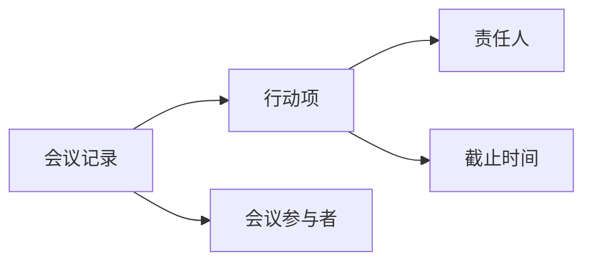

                 

# 第2章: 企业级AI会议助手的核心概念与联系

## 2.1 核心概念原理

### 2.1.1 自然语言处理（NLP）在会议记录中的应用

自然语言处理技术是AI会议助手的核心，它负责将语音信号转换为文本，并理解文本中的含义。以下是一些关键的NLP技术：

1. **分词（Tokenization）**：将连续的文本分割成有意义的词汇或短语。例如，将“今天天气很好”分割成“今天”、“天气”、“很好”。

2. **关键词提取（Keyword Extraction）**：从文本中提取最重要的关键词，帮助识别会议的主要讨论点。例如，在会议记录中提取“项目进度”、“客户反馈”等关键词。

3. **主题识别（Topic Identification）**：识别会议的主要主题，如“项目计划”或“市场分析”。这通常使用主题模型（如TF-IDF或LDA）来实现。

4. **意图识别（Intention Recognition）**：识别会议参与者的意图，如“请求批准”或“提出问题”。这需要结合上下文进行分析。

### 2.1.2 语音识别技术的实现原理

语音识别技术将语音信号转换为文本，主要步骤包括：

1. **语音信号预处理**：包括降噪、分割和特征提取。特征提取通常使用梅尔频率倒谱系数（MFCCs）。

2. **声学建模**：使用隐马尔可夫模型（HMM）或深度神经网络（DNN）来建模语音特征。

3. **语言模型**：使用n-gram模型或循环神经网络（RNN）来提高识别的准确性。

4. **解码与后处理**：将声学模型的输出转换为最终的文字，并进行拼写纠正和语法修正。

### 2.1.3 AI在行动项跟踪中的逻辑推理机制

AI通过以下步骤跟踪行动项：

1. **识别行动项**：从会议记录中提取动词短语，如“完成任务”、“提交报告”。

2. **提取元数据**：包括责任人、截止日期和优先级。例如，从“张三负责完成任务，截止日期为周五”中提取责任人“张三”，截止日期“周五”。

3. **动态优先级调整**：根据项目进度和紧急程度，动态调整行动项的优先级。例如，使用模糊逻辑模型或基于规则的系统。

4. **提醒与反馈**：通过邮件或消息通知相关人员，并跟踪执行情况，生成进度报告。

## 2.2 核心概念属性对比

下表对比了会议记录与行动项跟踪的核心属性：

| **属性**       | **会议记录**                     | **行动项跟踪**                  |
|----------------|----------------------------------|---------------------------------|
| **目标**       | 记录会议内容                     | 跟踪任务执行情况                |
| **输入**       | 语音信号或文本                   | 文本记录                       |
| **输出**       | 文本形式的会议记录               | 结构化的行动项列表             |
| **关键技术**   | NLP、语音识别                   | 任务管理、提醒机制             |
| **数据格式**   | 自然语言文本                   | 结构化数据                     |
| **复杂度**     | 中等                           | 高                            |

## 2.3 实体关系图（ER图）架构

下图展示了会议记录与行动项之间的关系：

### 关系解释

- **会议记录（A）**：包含会议的时间、地点、参与者和主要内容。
- **行动项（B）**：从会议记录中提取的任务，每个行动项关联一个责任人（C）和一个截止时间（D）。
- **会议参与者（E）**：参与会议的所有人员，他们可能被分配多个行动项。

## 2.4 本章小结

本章详细讲解了企业级AI会议助手的核心概念，包括自然语言处理和语音识别技术在会议记录中的应用，以及AI在行动项跟踪中的逻辑推理机制。通过对比会议记录与行动项跟踪的核心属性，我们明确了两者的区别与联系。最后，通过ER图展示了会议记录与行动项之间的实体关系，为后续的系统设计奠定了基础。

