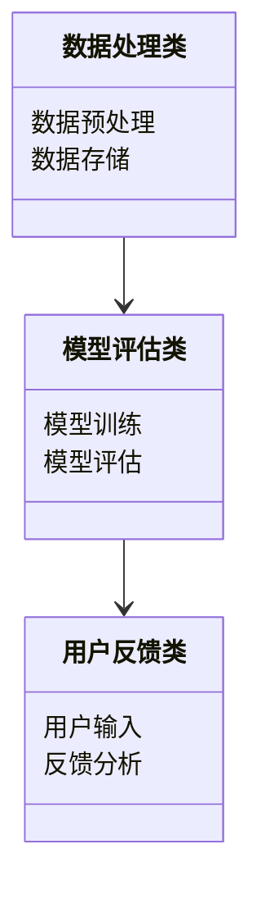
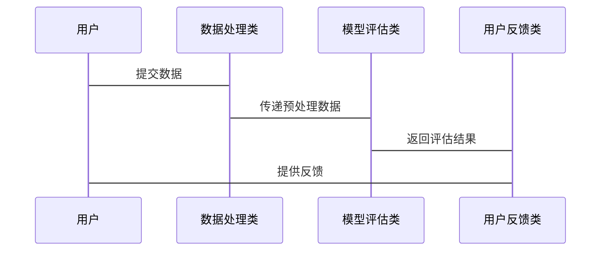

                 


# 构建企业级AI伦理审核框架：确保AI应用的公平性与透明度

> 关键词：AI伦理审核框架，公平性，透明度，企业级AI应用，算法伦理，系统架构设计，AI伦理规范

> 摘要：本文详细探讨了构建企业级AI伦理审核框架的必要性、核心概念、算法原理、系统架构设计以及实际应用案例。通过逐步分析和推理，本文提出了一个全面的框架，旨在确保AI应用的公平性和透明度，同时为读者提供了丰富的技术细节和实践指导。

---

# 目录

## 第一部分: AI伦理审核框架的背景与核心概念

### 第1章: AI伦理审核框架的背景介绍

#### 1.1 问题背景
##### 1.1.1 AI技术的快速发展与伦理挑战
##### 1.1.2 企业级AI应用的特殊性
##### 1.1.3 伦理审核框架的必要性

#### 1.2 问题描述
##### 1.2.1 AI应用中的公平性问题
##### 1.2.2 透明度不足的问题
##### 1.2.3 伦理审核框架的目标

#### 1.3 问题解决
##### 1.3.1 构建伦理审核框架的思路
##### 1.3.2 框架的核心功能与作用
##### 1.3.3 与其他技术的协同

#### 1.4 边界与外延
##### 1.4.1 框架的适用范围
##### 1.4.2 与其他伦理规范的关系
##### 1.4.3 框架的局限性

#### 1.5 概念结构与核心要素
##### 1.5.1 核心要素组成
##### 1.5.2 要素之间的关系
##### 1.5.3 框架的整体结构

### 第2章: AI伦理审核框架的核心概念与联系

#### 2.1 核心概念原理
##### 2.1.1 数据的公平性评估
##### 2.1.2 模型的透明度分析
##### 2.1.3 用户反馈机制

#### 2.2 概念属性特征对比
##### 2.2.1 数据、模型、用户的核心属性对比
##### 2.2.2 公平性与透明度的特征差异

#### 2.3 ER实体关系图架构
##### 2.3.1 数据、模型、用户之间的关系
##### 2.3.2 框架的实体关系图

```mermaid
erd
    entity 数据 {
        <属性> ID
        <属性> 特征
        <属性> 标签
    }
    entity 模型 {
        <属性> 模型ID
        <属性> 参数
        <属性> 性能指标
    }
    entity 用户 {
        <属性> 用户ID
        <属性> 用户反馈
        <属性> 使用场景
    }
    数据 --< 模型 : 输入
    模型 --< 用户 : 输出
```

---

## 第二部分: 算法原理讲解

### 第3章: AI伦理审核的核心算法

#### 3.1 公平性评估算法
##### 3.1.1 对抗训练算法
##### 3.1.2 基于概率的公平性评估
##### 3.1.3 基于损失函数的公平性优化

#### 3.2 透明度分析算法
##### 3.2.1 可解释性模型的构建
##### 3.2.2 基于特征重要性的透明度分析
##### 3.2.3 模型决策路径的可视化

#### 3.3 算法实现步骤
##### 3.3.1 数据预处理
##### 3.3.2 模型训练
##### 3.3.3 公平性与透明度评估

#### 3.4 Python代码实现
##### 3.4.1 公平性评估代码
##### 3.4.2 透明度分析代码

```python
def fairness_assessment(data, model):
    # 数据预处理
    preprocessed_data = preprocess(data)
    # 模型预测
    predictions = model.predict(preprocessed_data)
    # 公平性评估
    fairness_score = calculate_fairness(preprocessed_data, predictions)
    return fairness_score

def transparency_analysis(model):
    # 特征重要性分析
    feature_importance = model.feature_importance
    # 可解释性分析
    explanation = interpret_model.predictions(model, data)
    return feature_importance, explanation
```

#### 3.5 数学模型与公式
##### 3.5.1 公平性评估的数学模型
##### 3.5.2 透明度分析的数学模型

$$ \text{公平性得分} = \frac{\sum_{i=1}^{n} (p_i - \hat{p}_i)}{n} $$

$$ \text{透明度得分} = \sum_{j=1}^{m} \frac{f_j}{m} $$

---

## 第三部分: 系统分析与架构设计方案

### 第4章: 问题场景与系统设计

#### 4.1 问题场景介绍
##### 4.1.1 典型场景分析
##### 4.1.2 业务需求分析
##### 4.1.3 系统目标设定

#### 4.2 系统功能设计
##### 4.2.1 功能模块划分
##### 4.2.2 功能流程设计
##### 4.2.3 功能交互设计

#### 4.3 领域模型类图
##### 4.3.1 数据处理类
##### 4.3.2 模型评估类
##### 4.3.3 用户反馈类



#### 4.4 系统架构设计
##### 4.4.1 模块化架构
##### 4.4.2 分层架构设计
##### 4.4.3 微服务架构

#### 4.5 系统接口设计
##### 4.5.1 数据接口
##### 4.5.2 模型接口
##### 4.5.3 用户接口

#### 4.6 系统交互流程
##### 4.6.1 数据处理流程
##### 4.6.2 模型评估流程
##### 4.6.3 用户反馈流程



---

## 第四部分: 项目实战

### 第5章: 项目实施与案例分析

#### 5.1 项目环境安装
##### 5.1.1 系统要求
##### 5.1.2 工具安装
##### 5.1.3 环境配置

#### 5.2 核心代码实现
##### 5.2.1 数据预处理代码
##### 5.2.2 模型训练代码
##### 5.2.3 伦理审核代码

#### 5.3 代码应用解读
##### 5.3.1 代码功能分析
##### 5.3.2 代码实现细节
##### 5.3.3 代码优化建议

#### 5.4 案例分析与总结
##### 5.4.1 案例背景介绍
##### 5.4.2 案例实施过程
##### 5.4.3 案例结果分析
##### 5.4.4 经验总结

---

## 第五部分: 总结与展望

### 第6章: 总结与未来研究方向

#### 6.1 全文总结
##### 6.1.1 核心内容回顾
##### 6.1.2 主要结论总结
##### 6.1.3 本文的创新点

#### 6.2 未来研究方向
##### 6.2.1 更多算法的探索
##### 6.2.2 系统优化的方向
##### 6.2.3 应用场景的扩展

#### 6.3 最佳实践 Tips
##### 6.3.1 实践建议
##### 6.3.2 注意事项
##### 6.3.3 拓展阅读

---

## 第六部分: 附录

### 附录A: 工具安装与配置

#### A.1 Python环境安装
#### A.2 依赖库安装
#### A.3 环境配置示例

### 附录B: 参考文献

#### B.1 主要参考文献
#### B.2 进一步阅读资料

---

通过以上目录结构，我们可以逐步构建一个完整的企业级AI伦理审核框架，确保AI应用的公平性和透明度。每个部分都将深入探讨相关概念、算法、系统设计和实际应用，帮助读者全面理解和掌握这一领域的核心内容。

