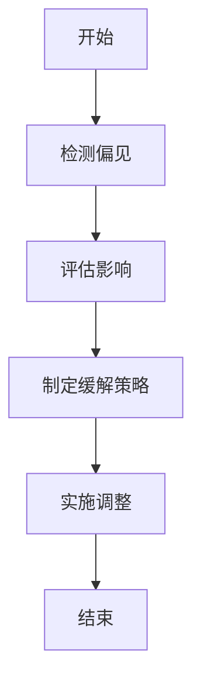
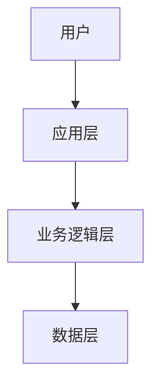
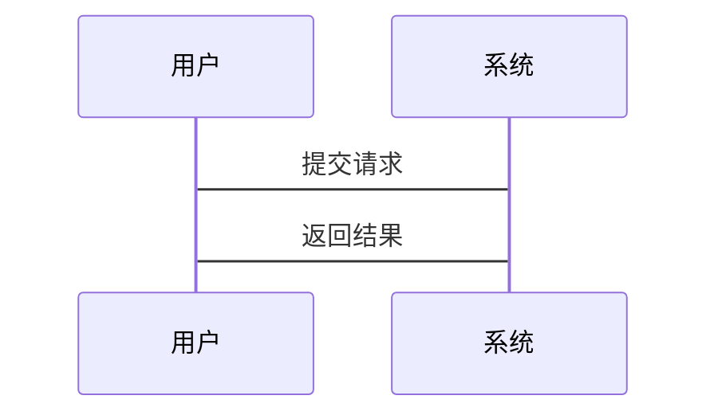

                 


# 构建企业级AI伦理框架：确保负责任的AI应用

## 关键词：企业级AI，AI伦理框架，负责任的AI，AI伦理，AI系统，AI责任分配

## 摘要：  
随着人工智能技术的迅速发展，企业级AI应用在各个行业中的应用越来越广泛。然而，AI系统的决策过程可能带来的伦理问题也日益凸显，如偏见、透明度不足、隐私问题等。本文旨在探讨如何构建企业级AI伦理框架，确保AI应用的责任性。文章从AI伦理框架的背景、核心概念、算法原理、系统设计、项目实战等方面进行详细阐述，旨在为企业提供一套系统化的伦理框架，帮助企业在AI应用中实现负责任的决策。

---

## 第一部分：AI伦理框架的背景与核心概念

### 第1章：AI伦理框架的背景介绍

#### 1.1 问题背景与问题描述

人工智能技术的快速发展为企业带来了巨大的机遇，同时也带来了诸多挑战。AI系统的决策可能对个人、组织或社会产生重大影响，因此确保AI应用的伦理性和责任性至关重要。企业级AI应用涉及数据收集、算法设计、决策过程等多个环节，每个环节都可能引发伦理问题。

**1.1.1 AI技术的快速发展与伦理挑战**  
AI技术的进步使得其在医疗、金融、教育、交通等领域的应用越来越广泛。然而，AI系统的决策过程可能存在偏见、不透明等问题，导致伦理争议。例如，招聘系统可能因为历史数据中的性别偏见而影响 hiring决策。

**1.1.2 企业级AI应用中的伦理问题**  
企业在使用AI系统时，需要考虑数据隐私、算法偏见、透明度等问题。例如，在金融领域，AI算法可能因为训练数据中的历史偏见而导致贷款审批的不公平。

**1.1.3 责任型AI的必要性与重要性**  
责任型AI是确保AI系统在决策过程中可追溯、可解释、可问责的基础。企业在构建AI系统时，需要明确责任主体、制定伦理准则，并确保系统在出现问题时能够及时响应和纠正。

#### 1.2 问题解决与边界定义

**1.2.1 AI伦理框架的目标与范围**  
AI伦理框架的目标是为企业的AI应用提供一套伦理准则和责任分配的指导原则。其范围包括数据收集、算法设计、决策过程、结果解释等环节。

**1.2.2 责任型AI的核心问题**  
责任型AI的核心问题是如何在AI系统的决策过程中明确责任主体，并确保系统在出现问题时能够被追责和改进。

**1.2.3 AI伦理框架的边界与外延**  
AI伦理框架的边界在于其仅关注AI系统的伦理性和责任性，不涉及技术实现的具体细节。其外延则包括与AI伦理相关的政策、法规、社会影响等方面。

#### 1.3 核心概念结构与组成

**1.3.1 AI伦理框架的组成要素**  
AI伦理框架的核心要素包括责任主体、AI系统属性、伦理原则、责任分配逻辑等。

**1.3.2 各要素之间的关系**  
责任主体是AI系统的主要决策者，AI系统的属性（如公平性、透明度）决定了其是否符合伦理原则。责任分配逻辑则是根据系统属性和伦理原则来确定责任主体的分配方式。

**1.3.3 框架的核心属性与特征**  
AI伦理框架的核心属性包括可解释性、可追溯性、可问责性。其特征则包括透明性、公平性、隐私保护等。

### 第2章：AI伦理框架的核心概念与联系

#### 2.1 核心概念原理

**2.1.1 责任主体的定义与分类**  
责任主体包括开发者、企业、监管机构等。在AI系统中，责任主体的分类需要根据系统的决策过程和问题的性质来确定。

**2.1.2 AI系统的伦理属性**  
AI系统的伦理属性包括公平性、透明度、隐私保护等。这些属性是构建AI伦理框架的基础。

**2.1.3 责任分配的逻辑与原则**  
责任分配的逻辑基于AI系统的伦理属性和责任主体的分类。责任分配的原则包括公平性、可追溯性、可问责性等。

#### 2.2 核心概念对比分析

**2.2.1 不同AI伦理框架的对比**  
不同的AI伦理框架在责任主体、伦理属性等方面的侧重点不同。例如，某些框架更注重隐私保护，而另一些则更关注算法公平性。

**2.2.2 各种责任模型的优缺点**  
责任模型的优缺点需要根据具体的场景和需求来评估。例如，集中式责任模型易于管理，但可能导致权力过于集中。

**2.2.3 案例分析与对比**  
通过具体案例分析不同AI伦理框架在实际应用中的表现，进一步理解其优缺点。

#### 2.3 ER实体关系图

```mermaid
er
actor: 用户
actor: 开发者
actor: 企业
actor: 监管机构
```

---

## 第二部分：AI伦理框架的算法原理

### 第3章：AI伦理框架的算法原理

#### 3.1 算法原理概述

**3.1.1 责任分配的算法逻辑**  
责任分配的算法逻辑需要根据AI系统的伦理属性和责任主体的分类来确定。例如，可以通过权重分配的方式将责任分配给不同的主体。

**3.1.2 伦理决策的计算模型**  
伦理决策的计算模型需要考虑多个因素，如系统属性、责任主体的权重等。可以通过构建一个综合评估模型来实现。

**3.1.3 偏见检测与缓解算法**  
偏见检测算法可以通过分析训练数据中的偏差来检测系统中的偏见。缓解算法则可以通过重新调整数据分布或修改模型参数来消除偏见。

#### 3.2 算法流程图



#### 3.3 算法实现代码

```python
def detect_bias(data):
    # 偏见检测算法
    pass

def mitigate_bias(data):
    # 偏见缓解算法
    pass
```

#### 3.4 数学模型与公式

**3.4.1 偏见检测公式**  
$$P(y|x) = \frac{P(x|y)P(y)}{P(x)}$$

**3.4.2 责任分配模型**  
$$R = \sum_{i=1}^{n} w_i \cdot r_i$$

#### 3.5 实际案例分析

**3.5.1 偏见检测案例**  
例如，在招聘系统中，检测训练数据中的性别偏见。

**3.5.2 责任分配案例**  
例如，在金融领域的贷款审批系统中，明确责任主体并制定责任分配逻辑。

**3.5.3 伦理决策案例**  
例如，在医疗领域的诊断系统中，通过综合评估模型实现伦理决策。

---

## 第三部分：AI伦理框架的系统分析与架构设计

### 第4章：系统分析与架构设计

#### 4.1 问题场景介绍

**4.1.1 问题场景描述**  
例如，在医疗领域，构建一个AI诊断系统，需要考虑数据隐私、算法公平性、责任主体等问题。

**4.1.2 系统目标与功能需求**  
系统目标是实现负责任的AI应用，功能需求包括偏见检测、责任分配、伦理决策等。

#### 4.2 系统功能设计

**4.2.1 领域模型**  
通过Mermaid类图展示系统中的各个角色及其关系。


**4.2.2 系统架构设计**  
通过Mermaid架构图展示系统的整体架构。



**4.2.3 系统交互设计**  
通过Mermaid序列图展示系统的交互流程。



#### 4.3 项目实战

**4.3.1 环境安装与配置**  
例如，安装Python、Jupyter Notebook、TensorFlow等工具。

**4.3.2 核心代码实现**  
实现偏见检测和责任分配的代码。

**4.3.3 案例分析与解读**  
通过具体案例分析AI伦理框架的实际应用效果。

---

## 结语

构建企业级AI伦理框架是确保负责任的AI应用的关键。本文从背景、核心概念、算法原理、系统设计、项目实战等多个方面进行了详细阐述，为企业提供了系统的指导。未来，随着AI技术的不断发展，AI伦理框架也将不断优化和完善，为企业的AI应用提供更强大的支持。

---

## 注意事项

1. **数据隐私**：在构建AI系统时，必须严格遵守数据隐私保护法规，确保用户数据的安全。
2. **模型透明度**：AI系统的决策过程需要具备透明性，确保用户能够理解系统的决策逻辑。
3. **持续优化**：AI伦理框架需要根据实际应用中的反馈不断优化，以应对新的挑战。

---

## 拓展阅读

1. **《AI伦理与社会影响》**：深入探讨AI技术对社会的影响及其伦理问题。
2. **《负责任的AI设计》**：详细讲解如何在AI系统中实现负责任的设计。
3. **《AI算法与伦理》**：分析AI算法中的伦理问题及其解决方案。

--- 

希望这篇文章能够为您提供构建企业级AI伦理框架的系统化思路，并在实际应用中有所帮助！

