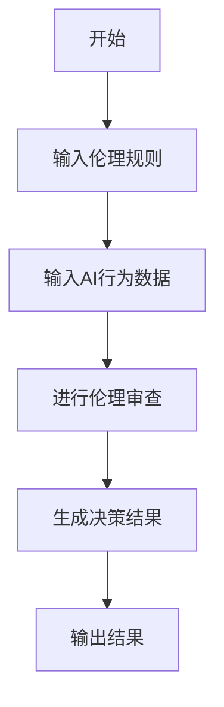
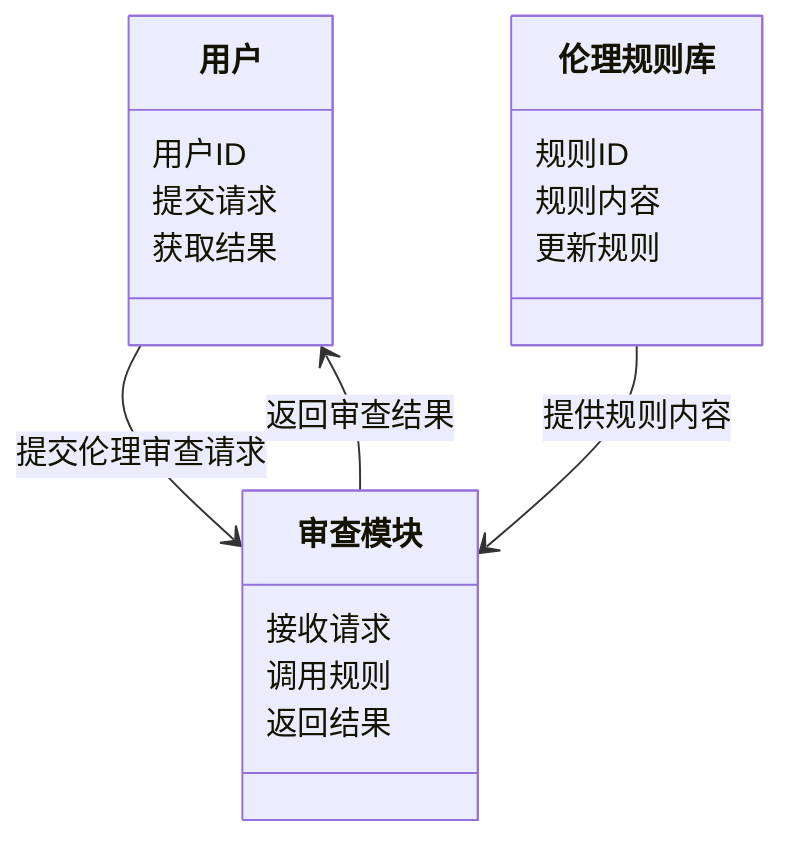
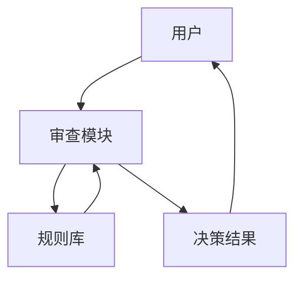
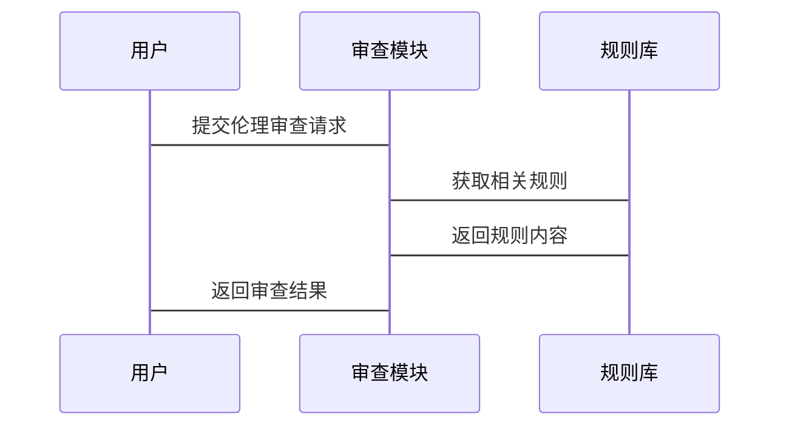

                 


# 构建企业级AI伦理顾问：确保AI应用的道德合规

## 关键词：AI伦理，企业合规，技术实现，伦理审查，算法原理

## 摘要：  
随着人工智能技术的快速发展，企业级AI应用日益普及，AI伦理问题也随之凸显。本文旨在探讨如何构建一个企业级AI伦理顾问系统，确保AI应用的道德合规。我们将从AI伦理的基本概念出发，深入分析其核心原则与挑战，结合具体的技术实现路径，包括算法设计、系统架构和项目实战，为企业提供一套完整的解决方案。通过本文，读者将能够理解AI伦理的核心概念，并掌握如何在实际项目中实现道德合规的AI系统。

---

## 第一部分: 企业级AI伦理顾问的背景与核心概念

### 第1章: AI伦理的基本概念与问题背景

#### 1.1 AI伦理的定义与核心原则
- **1.1.1 什么是AI伦理**  
  AI伦理是指在人工智能系统设计、开发和应用过程中，确保系统行为符合人类社会的道德规范和价值观。  
- **1.1.2 AI伦理的核心原则**  
  包括透明性、公平性、责任性、隐私保护和安全可控性。  
- **1.1.3 企业级AI应用中的伦理挑战**  
  企业AI应用可能涉及数据偏见、隐私泄露、算法歧视等问题。

#### 1.2 问题背景与问题描述
- **1.2.1 当前AI技术的快速发展**  
  AI技术的普及使得企业级应用需求激增，但也带来了伦理问题。  
- **1.2.2 AI应用中的伦理问题**  
  如算法偏见、数据滥用、隐私侵犯等。  
- **1.2.3 企业级AI应用的独特挑战**  
  企业需要在商业利益与道德合规之间找到平衡。

#### 1.3 问题解决与边界外延
- **1.3.1 AI伦理顾问的目标**  
  提供AI应用的伦理审查、风险评估和合规建议。  
- **1.3.2 问题解决的边界**  
  专注于AI系统的伦理合规，不涉及技术实现细节。  
- **1.3.3 AI伦理的外延与扩展**  
  包括数据伦理、算法伦理和人机交互伦理。

#### 1.4 概念结构与核心要素
- **1.4.1 AI伦理顾问的构成要素**  
  包括伦理规则库、伦理审查模块、风险评估模块和决策建议模块。  
- **1.4.2 核心概念的关联关系**  
  通过图示展示伦理规则、审查流程和决策建议之间的关系。  
- **1.4.3 概念结构的可视化**  
  使用Mermaid图展示概念结构。

---

## 第二部分: AI伦理顾问的核心概念与联系

### 第2章: AI伦理的核心原则与属性特征

#### 2.1 核心原则的对比分析
- **2.1.1 透明性**  
  系统行为可解释，用户能够理解AI决策过程。  
- **2.1.2 公平性**  
  避免算法偏见，确保AI决策对所有用户公平。  
- **2.1.3 责任归属**  
  明确AI系统在出现问题时的责任主体。

#### 2.2 属性特征对比表格
- **2.2.1 表格设计与对比**  
  列出透明性、公平性、责任归属等原则的特征对比。

#### 2.3 ER实体关系图
- **2.3.1 实体关系图的构建**  
  使用Mermaid图展示伦理规则、用户、系统和决策结果之间的关系。

```mermaid
er
    actor: 用户
    system: AI伦理顾问系统
    rule: 伦理规则
    case: 典型案例
    decision: 决策结果
    actor --> rule: 提交伦理审查请求
    rule --> system: 系统处理伦理规则
    system --> decision: 生成决策结果
    decision --> actor: 返回伦理审查结果
```

---

## 第三部分: AI伦理顾问的算法原理与数学模型

### 第3章: 基于伦理规则的AI行为决策算法

#### 3.1 算法原理概述
- **3.1.1 算法的基本原理**  
  基于伦理规则对AI行为进行审查和决策。  
- **3.1.2 算法的输入输出**  
  输入：AI行为数据和伦理规则；输出：伦理审查结果。  
- **3.1.3 算法的核心逻辑**  
  通过规则匹配和逻辑推理生成决策结果。

#### 3.2 算法流程图
- **3.2.1 流程图的绘制**  
  使用Mermaid图展示算法流程。



#### 3.3 算法实现代码
- **3.3.1 Python源代码实现**  
  示例代码实现伦理审查模块。

```python
def ethical_review(rules, behavior):
    # rules: 列表，包含伦理规则
    # behavior: 列表，包含AI行为数据
    for rule in rules:
        if rule.match(behavior):
            return rule.apply()
    return "无伦理问题"
```

#### 3.4 数学模型与公式
- **3.4.1 逻辑回归模型**  
  用于判断AI行为是否符合伦理规则。

  $$ P(y=1|x) = \frac{1}{1 + e^{-\beta x}} $$

- **3.4.2 决策树模型**  
  用于分类伦理问题类型。

---

## 第四部分: AI伦理顾问的系统分析与架构设计

### 第4章: 企业级AI伦理顾问系统架构

#### 4.1 问题场景与项目介绍
- **4.1.1 问题场景**  
  企业AI应用中的伦理审查需求。  
- **4.1.2 项目目标**  
  构建一个可扩展的企业级AI伦理顾问系统。

#### 4.2 系统功能设计
- **4.2.1 领域模型设计**  
  使用Mermaid图展示系统功能模块。



#### 4.3 系统架构设计
- **4.3.1 系统架构图**  
  使用Mermaid图展示系统架构。



#### 4.4 系统接口设计
- **4.4.1 接口描述**  
  包括用户接口、规则库接口和审查模块接口。

#### 4.5 系统交互设计
- **4.5.1 交互序列图**  
  使用Mermaid图展示系统交互流程。



---

## 第五部分: 项目实战与案例分析

### 第5章: 企业级AI伦理顾问系统实现

#### 5.1 环境安装与配置
- **5.1.1 环境要求**  
  Python 3.8以上版本，安装相关依赖库。  
- **5.1.2 工具安装**  
  安装Mermaid、PlantUML等工具。

#### 5.2 系统核心实现
- **5.2.1 核心代码实现**  
  实现伦理审查模块和规则匹配模块。

```python
class EthicalRule:
    def __init__(self, name, condition, action):
        self.name = name
        self.condition = condition
        self.action = action

    def match(self, behavior):
        return self.condition(behavior)

    def apply(self):
        return self.action(behavior)
```

#### 5.3 代码应用解读与分析
- **5.3.1 代码功能解读**  
  解释每个模块的功能和作用。  
- **5.3.2 代码实现细节**  
  详细分析代码实现的逻辑和流程。

#### 5.4 实际案例分析
- **5.4.1 案例背景**  
  某企业AI招聘系统存在性别歧视问题。  
- **5.4.2 系统审查过程**  
  系统发现招聘广告中性别相关关键词的使用不符合公平性原则。  
- **5.4.3 审查结果**  
  系统建议修改招聘广告，确保公平性。

#### 5.5 小结
- **5.5.1 项目总结**  
  通过实际案例展示系统功能。  
- **5.5.2 经验总结**  
  强调伦理审查的重要性。

---

## 第六部分: 最佳实践与拓展阅读

### 第6章: AI伦理顾问的最佳实践

#### 6.1 小结
- **6.1.1 核心内容回顾**  
  总结全文的核心内容。  
- **6.1.2 重要观点重申**  
  强调AI伦理的重要性。

#### 6.2 注意事项
- **6.2.1 系统维护**  
  定期更新伦理规则库。  
- **6.2.2 用户教育**  
  提高用户对AI伦理的认识。

#### 6.3 拓展阅读
- **6.3.1 相关书籍推荐**  
  推荐几本AI伦理相关的书籍。  
- **6.3.2 研究论文推荐**  
  推荐几篇AI伦理领域的研究论文。

---

## 附录: 代码与资源链接

### 附录A: 核心代码实现
- 提供完整的Python代码实现，包括伦理规则库、审查模块和交互界面。

### 附录B: 工具与资源链接
- 提供Mermaid、PlantUML等工具的下载和使用链接。

---

## 参考文献

---

以上是完整的目录大纲，涵盖了从理论到实践的各个方面，结合了技术实现和伦理分析，确保读者能够全面理解并掌握如何构建企业级AI伦理顾问系统。

